<!--
author:   Anika Miller

email:    LiaScript@web.de

version:  0.0.1

language: en

narrator: US English Female

comment:  ...

logo:     ../cover.jpg

tags:      anatomy, physiology, medicine, human health

-->

# Anatomy & Physiology

> This document was automatically translated to LiaScript from
>
> https://flexbooks.ck12.org/user:6228e75a9dee/cbook/anatomy-physiology/r108/section/1.1/primary/lesson/cells-of-the-human-body/

## 1.1 Cells of the Human Body

<article>

**How is the [human body](https://flexbooks.ck12.org/cbook/ck-12-middle-school-life-science-2.0/section/11.1/primary/lesson/organization-of-the-human-body-ms-ls?referrer=crossref "human body") similar to a well-tuned machine?**

Over and over, the human body is compared to a complex piece of machinery. Like any common machine, the human body is composed of a variety of parts, each working separately, but also working together.

### Cells

**Cells** are the most basic units of life in your body, and each cell is specialized, with a specific function. Nerve cells transmit electrical messages around the body, and white blood cells attack invading bacteria throughout the body. Other cells include specialized cells in the kidney (such as kidney glomerulus parietal cells), brain (such as astrocytes), stomach (such as parietal cells), and [muscles](https://flexbooks.ck12.org/cbook/ck-12-middle-school-life-science-2.0/section/11.9/primary/lesson/smooth-skeletal-and-cardiac-muscles-ms-ls?referrer=crossref "muscles") (such as red and white skeletal muscle fibers). Cells group together to form tissues; different tissues work together to form organs. This grouping of cells and tissues is referred to as levels of organization. Complex multicellular organisms, which include flatworms and humans, have different levels of organization. The human body's levels begin with cells and conclude with the entire organism. Flatworms, though they lack specialized circulatory and respiratory systems, also have levels of organization ranging from cells to the entire organism.

#### Differentiation

Every cell in the body originates from a single fertilized egg called a zygote. The zygote divides repeatedly to produce an embryo. These embryonic cells continue to divide, differentiating into all the cell types present in the body of all humans (and other mammals), from a new-born baby to an elderly adult. **Differentiation** is the process by which an unspecialized cell, such as a fertilized egg cell, divides many times to produce specialized cells. During differentiation, certain genes are turned on, or become activated, while other genes are switched off, becoming inactivated. This process is regulated by the cell. A differentiated cell will develop specific structures and perform certain functions.

A cell that is able to differentiate into all cell types within a body is called **totipotent.** They have “total potential” to differentiate into any cell type. In mammals, only the zygote and early embryonic cells are totipotent. A cell that is able to differentiate into many, but not all, cell types is called **pluripotent.** Such cells have “plural potential” (but not “total potential”) to differentiate into _most_ cell types. **Figure** [below](#x-ck12-QmlvMzVhLTEtMQ..) gives a visual representation of cell differentiation.

#### Stem Cells

An unspecialized cell that can divide and give rise to different specialized cells is called a **stem cell** (**Figure** [above](#x-ck12-QmlvMzVhLTEtMQ..)). Zygotes and embryonic cells are both types of stem cells. These stem cells, called **embryonic stem cells,** can divide indefinitely and can specialize into any cell type. They are totipotent. In contrast, **adult stem cells,** also known as somatic stem cells, are undifferentiated cells found within the body that divide to replace dying cells and damaged tissues. Adult stem cells can divide indefinitely and generate all the cell types of the organ from which they originate. They can potentially re-grow the entire organ from just a few cells. A third type of stem cell is found in both the blood from the umbilical cord of a new-born baby and the placenta. These "cord blood stem cells" are considered to be adult stem cells because they cannot generate all body cell types, just different types of blood cells. Adult stem cells and cord blood stem cells are pluripotent.

#### Stem Cells in Medicine

Stem cells are of great interest to researchers because of their ability to both divide indefinitely and differentiate into many cell types. Stem cells have many existing and even more potential therapeutic applications. Such therapies include treatments for cancer, blood disorders, brain or spinal cord injuries, and blindness.

Embryonic stem cells, shown in **Figure** [above](#x-ck12-QmlvMzVhLTAxLTAy), are taken from eggs that were donated to research and fertilized in the [laboratory](https://www.ck12.org/c/biology/laboratory?referrer=crossref "laboratory"). These stem cells may have the greatest potential because they are totipotent and thus have the most potential medical applications. However, embryonic stem cells are relatively controversial. Some individuals and groups have objections to the harvesting of embryonic stem cells because harvesting the stem cells involves the destruction of the embryo. Some researchers are looking into methods of extracting embryonic stem cells without destroying the actual embryo. Other researchers have claimed success in harvesting embryonic stem cells from the embryonic fluid that surrounds a growing fetus. Additionally, stem cells harvested from a donated embryo differ from a potential patient’s tissue type. Therefore, just as in organ transplantation, there is a risk that the patient’s body may reject the transplanted embryonic stem cells.

Adult stem cells, including cord blood stem cells, have already been used to treat diseases of the blood such as sickle-cell anemia and certain types of cancer. Unlike embryonic stem cells, the use of adult stem cells in research and therapy is not controversial because the production of adult stem cells does not require the destruction of an embryo. Adult stem cells can be isolated from tissue samples, such as bone marrow, of a patient. Scientists have recently discovered more sources of adult stem cells in the body including in body fat, the inside lining of the nose, and the brain. Some researchers are investigating ways to revert adult stem cells back to a totipotent stage.

### Summary

* Cells are the most basic units of life found in the human body and any living organism.
* Stem cells undergo the process of differentiation to become specialized cells.

### Review

1.  What are totipotent and pluripotent cells?
2.  What are stem cells? Where do they come from?

### Explore More

!?[0](https://www.youtube.com/watch?v=RLfB5YfwGeg)

Use the video above to answer thefollowing questions:

1.  When did scientists first understand the idea of differentiation?
2.  What changes in a totipotent cell to make it specialize?
3.  Can a blood stem cell become a muscle, brain, and/or liver cell?

</article>

## 1.2 Tissues of the Human Body

<article>

### Tissues

A **tissue** is a group of connected cells that have a similar function within an organism. The simplest living, multicellular organisms, [sponges](https://flexbooks.ck12.org/cbook/ck-12-middle-school-life-science-2.0/section/9.2/primary/lesson/sponges-ms-ls?referrer=crossref "sponges"), are made of many specialized types of cells that work together for a common goal. Such cell types include digestive cells, tubular pore cells, and epidermal cells. Though the different cell types create a large organized, multicellular structure—the visible sponge—they are not organized into true tissues. If a sponge is broken up by passing it through a sieve, the sponge will reform on the other side.

More complex organisms, such as jellyfish, coral, and sea anemones, have a tissue level of organization. For example, jellyfish have tissues that have separate protective, digestive, and sensory functions. There are four basic types of tissues in the bodies of all animals including the [human body](https://flexbooks.ck12.org/cbook/ck-12-middle-school-life-science-2.0/section/11.1/primary/lesson/organization-of-the-human-body-ms-ls?referrer=crossref "human body"). These make up all the organs, structures, and other contents of the body. **Figure** [below](#x-ck12-QmlvMzVhLTEtbjE.) shows an example of each tissue type. The four basic types of tissues are epithelial, muscle, nervous, and connective.

 A scanning electron micrograph (SEM) image of lung trachea epithelial tissue. (b) A transmission electron micrograph (TEM) image of skeletal muscle tissue. (c) A light microscope image of neurons of nervous tissue. (d) Red blood cells, a connective tissue.")

**Epithelial tissue** is made up of a layer or layers of tightly packed cells that line the surfaces of the body. The largest example of epithelial tissue (also the largest organ in the human body) is the skin. Mammalian skin consists of stratified epithelium, which has several layers of cells. The outermost layers of cells, called squamous cells, are flat plate-like cells, while the deeper layers are roughly cube shaped and called cuboidal cells. Epithelial tissue has multiple functions, but it serves primarily to protect, absorb, and secrete. As you probably already know, our skin organ covers our entire body and protects underlying tissues from bacteria, chemicals, and other injury. Epithelial cells also line the small intestine where they absorb nutrients, and similar cells in the glands secrete enzymes and hormones.

**Muscle tissue** encompasses not only the [muscles](https://flexbooks.ck12.org/cbook/ck-12-middle-school-life-science-2.0/section/11.9/primary/lesson/smooth-skeletal-and-cardiac-muscles-ms-ls?referrer=crossref "muscles"), such as those in our legs or fingers, that we actively control, but also the tissue that forms most of our internal organs. There are three types of muscle tissue: skeletal, cardiac, and smooth. Skeletal muscle tissue forms what we think of as our muscles; it is attached to our bones by our tendons and can be relaxed or contracted voluntarily. Similar in structure to skeletal muscle, cardiac muscle is found exclusively in the walls of the heart. The major difference, however, is that cardiac muscle is involuntary and cannot be actively controlled. Similarly, smooth muscle, which forms the muscle layers in internal organs such as the digestive tract and bladder, is an involuntary tissue. Smooth muscle tissue controls slow involuntary movements such as stomach wall contractions and the contractions of arteries to regulate blood flow.

**Nervous tissue** is made up of the nerve cells (neurons) that form the nervous system, including the brain and spinal cord. These cells are especially responsive to stimuli, allowing nervous tissue to transmit stimuli from the brain to the body extremely rapidly.

**Connective tissue** connects, supports, or separates other tissues and organs. Connective tissue proper, a form of connective tissue, can be either loose or dense. Adipose tissue, or fat, is loose connective tissue, while tendons and ligaments, composed of collagen, are examples of dense connective tissue. Other forms of connective tissue include blood (fluid connective tissue) and cartilage and bone (both forms of supporting connective tissue).

### Summary

* Tissues are composed of cells, and multiple tissues together constitute an organ.
* The human body has four types of tissues: nervous, muscle, connective, and epithelial

### Review

1.  What are the four types of tissues? Give an example of each.
2.  What is the difference between tissue and cellular level organization?
3.  Are there any organisms that do not have tissue structures? If yes, what organism(s)?

### Explore More

!?[0](https://www.youtube.com/watch?v=tKWTJ3_-1E8)

Use the video above to answer the following questions:

1.  What are some different types of connective tissue?
2.  What is the extracellular matrix?
3.  What are the differences between skeletal, cardiac, and smooth muscle tissue?

</article>

## 1.3 Human Organs and Organ Systems

<article>

### Organs and Organ Systems

Organs are the next level of organization in the body. An **organ** is a structure made of two or more tissues that work together for a common purpose. Skin, the largest organ in the body, is shown in **Figure** [below](#x-ck12-QmlvMzVhLTAxLTA0YQ..). Organs can be as primitive as the brain of a flatworm (a group of nerve cells), as large as the stem of a sequoia (up to 90 meters (300 feet) in height), or as complex as a human liver. The [human body](https://flexbooks.ck12.org/cbook/ck-12-middle-school-life-science-2.0/section/11.1/primary/lesson/organization-of-the-human-body-ms-ls?referrer=crossref "human body") has many different organs including the heart, the kidneys, the pancreas, and the skin. Two or all of the tissue types can be found in each organ. Organs inside the body are called internal organs. The internal organs collectively are often called **viscera.**

 can be seen working together.")

The most complex organisms have organ systems. An **organ system** is a group of organs that act together to carry out complex, interrelated functions, with each organ focusing on a subset of the task. For example, the human digestive system is an organ system in which the mouth and esophagus ingest food, the stomach crushes and liquefies it, the pancreas and gall bladder make and release digestive enzymes, and the intestines absorb nutrients into the blood. An organ can be part of more than one organ system. For example, the ovaries produce hormones, which makes them a part of the endocrine system; the ovaries also make eggs, which makes them a part of the reproductive system as well. One of the most important functions of organ systems is to provide cells with oxygen and nutrients and to remove toxic waste products such as carbon dioxide. A number of organ systems, including the cardiovascular and respiratory systems, work together to do this.

The different organ systems of the body are shown in**Table** [below](#x-ck12-dGFibGU6T3JnYW5TeXN0ZW1z). Sometimes the [cardiovascular system](https://flexbooks.ck12.org/cbook/ck-12-middle-school-life-science-2.0/section/11.21/primary/lesson/cardiovascular-system-ms-ls?referrer=crossref "cardiovascular system") and the lymphatic system are grouped together into one single system called the circulatory system.

|     |     |     |
| --- | --- | --- |Major Organ Systems of the Human Body
| Organ System | Function | Organs, Tissues, and Structures Involved |
| --- | --- | --- |
| Cardiovascular | Transports oxygen, nutrients, and other substances to the cells, and transports wastes, carbon dioxide, and other substances away from the cells; it can also help stabilize body temperature and pH. | Heart, blood, and blood vessels. |
| Lymphatic | Defends against infection and disease. Transfers lymph between tissues and the blood stream. | Lymph, lymph nodes, and lymph vessels. |
| Digestive | Processes foods and absorbs nutrients, minerals, vitamins, and [water](https://www.ck12.org/c/biology/water?referrer=crossref "water"). | Salivary glands, esophagus, stomach, liver, gallbladder, pancreas, small intestine, and large intestine. |
| Endocrine | Provides [communication](https://flexbooks.ck12.org/cbook/ck-12-middle-school-life-science-2.0/section/8.7/primary/lesson/animal-communication-ms-ls?referrer=crossref "communication") within the body via hormones. Directs long-term change over other organ systems to maintain homeostasis. | Pituitary gland, pineal gland, thyroid, parathyroid gland, adrenal glands, testes, and ovaries. |
| Integumentary | Provides protection from both injury and fluid loss and provides physical defense against infection by microorganisms. Controls temperature. | Skin, hair, and nails. |
| Muscular | Provides movement, support, and heat production. | Tendons, skeletal, cardiac, and smooth muscles. |
| Nervous | Collects, transfers, and processes information. Directs short-term change over other organ systems in order to maintain homeostasis. | Brain, spinal cord, nerves, and sensory organs ([eyes](https://flexbooks.ck12.org/cbook/ck-12-middle-school-life-science-2.0/section/11.48/primary/lesson/how-the-eye-works-ms-ls?referrer=crossref "eyes"), ears, tongue, skin, and nose). |
| Reproductive | Produces gametes (sex cells) and sex hormones; ultimately produces offspring. | Fallopian tubes, uterus, vagina, ovaries, mammary glands, testes, vas deferens, seminal vesicles, prostate, and penis. |
| Respiratory | Delivers air to sites where gas exchange can occur between the blood and cells (around body) or blood and air (lungs). | Mouth, nose, pharynx, larynx, trachea, bronchi, lungs, and diaphragm. |
| Skeletal | Supports and protects soft tissues of the body. Provides movement at [joints](https://flexbooks.ck12.org/cbook/ck-12-middle-school-life-science-2.0/section/11.8/primary/lesson/skeletal-system-joints-ms-ls?referrer=crossref "joints"), produces blood cells, and stores minerals. | Bones, cartilage, and ligaments. |
| Urinary | Removes excess water, salts, and waste products from the blood and body. Controls pH. | Kidneys, ureters, urinary bladder, and urethra. |
| Immune | Defends against microbial pathogens (disease-causing agents) and other diseases. | Leukocytes, tonsils, adenoids, thymus, and spleen. |

!?[0](https://www.youtube.com/watch?v=dRWTB8QGixA)

### Summary

* Organs are structures composed of two or more tissues; organ systems are systems composed of two or more organs.
* Organ systems carry out complex tasks, with each organ completing one aspect of the task.

### Review

1.  What is the difference between an organ and an organ system?
2.  How many major organ systems are there? What are they?

</article>

## 1.4 System Interactions in the Human Body

<article>

You get an organism. Here we easily recognize parts of the respiratory, circulatory, digestive, and skeletal systems. Though these can function alone, they need to work together to make a living organism. They also need to work with the the endocrine and nervous systems, as well as the other systems.

### System Interactions

Each body system contributes to the **homeostasis** of other systems and of the entire organism. No system of the body works in isolation, and the well-being of the person depends upon the well-being of all the interacting body systems. A disruption within one system generally has consequences for several other body systems. Most of these organ systems are controlled by **hormones** secreted from the pituitary gland, a part of the endocrine system. **Table** [below](#x-ck12-dGFibGU6SG9tZW9zdGF0aWNSZWd1bGF0aW9u) summarizes how various body systems work together to maintain homeostasis.

Main examples of homeostasis in mammals are as follows:

* The regulation of the amounts of [water](https://www.ck12.org/c/biology/water?referrer=crossref "water") and minerals in the body. This is known as **osmoregulation.** This happens primarily in the kidneys.
* The removal of metabolic waste. This is known as **excretion.** This is done by the excretory organs such as the kidneys and lungs.
* The regulation of body temperature. This is mainly done by the skin.
* The regulation of blood glucose levels. This is mainly done by the liver and the insulin and glucagon secreted by the pancreas.

|     |     |     |     |
| --- | --- | --- | --- |Types of Homeostatic Regulation in the Body
|     | Homeostatic Processes | Hormones and Other Messengers | Tissues, Organs, and Organ Systems Involved |
| --- | --- | --- | --- |
| **Osmoregulation (also called excretion)** | Excess water, salts, and urea expelled from the body. | Antidiuretic hormone (ADH), aldosterone, angiotensin II, and carbon dioxide. | Kidneys, urinary bladder, ureters, urethra (urinary system), pituitary gland (endocrine system), and lungs (respiratory system). |
| **Thermoregulation** | Sweating, shivering, dilation/constriction of blood vessels at the skin surface, insulation by adipose tissue, and breakdown of adipose tissue to produce heat. | Nerve impulses. | Skeletal muscle (muscular system), nerves (nervous system), blood vessels (cardiovascular system), skin and adipose tissue (integumentary system), and hypothalamus (endocrine system). |
| **Chemical Regulation (including glucoregulation)** | Release of insulin and glucagon into the blood in response to rising and falling blood glucose levels respectively. Increase in [breathing](https://flexbooks.ck12.org/cbook/ck-12-middle-school-life-science-2.0/section/11.35/primary/lesson/processes-of-breathing-ms-ls?referrer=crossref "breathing") rate in response to increased carbon dioxide levels in the blood, release of carbon dioxide into exhaled air from the lungs, and secretion of erythropoietin by kidneys to stimulate formation of red blood cells. | Insulin, glucagon, cortisol, carbon dioxide, nerve impulses, and erythropoietin (EPO). | Pancreas (endocrine system), liver (digestive system), adrenal glands (endocrine system), lungs (respiratory system), brain (nervous system), and kidneys (urinary system). |

#### Endocrine System

The endocrine system, shown in**Figure** [below](#x-ck12-QmlvMzVhLTAyLTAy), includes glands that secrete hormones into the bloodstream. Hormones are chemical messenger molecules that are made by cells in one part of the body and cause changes in cells in another part of the body. The endocrine system regulates the metabolism and [development](https://www.ck12.org/c/biology/development?referrer=crossref "development") of most [body cells](https://www.ck12.org/c/biology/body-cells?referrer=crossref "body cells") and body systems through feedback mechanisms. For example, Thyrotropin-Releasing Hormone (TRH) and Thyroid Stimulating Hormone (TSH) are controlled by a number of negative feedback mechanisms. The [endocrine glands](https://flexbooks.ck12.org/cbook/ck-12-biology-flexbook-2.0/section/13.20/primary/lesson/glands-bio?referrer=crossref "endocrine glands") also release hormones that affect skin and hair color, appetite, and secondary sex characteristics of both males and females.

The endocrine system has a regulatory effect on other organ systems in the [human body](https://flexbooks.ck12.org/cbook/ck-12-middle-school-life-science-2.0/section/11.1/primary/lesson/organization-of-the-human-body-ms-ls?referrer=crossref "human body"). In the muscular system, hormones adjust muscle metabolism, energy production, and growth. In the nervous system, hormones affect neural metabolism, regulate fluid and ion concentrations, and help with reproductive hormones that influence brain development.

#### Urinary System

Toxic wastes build up in the blood as proteins and nucleic acids are broken down and used by the body. The urinary system rids the body of these wastes. The urinary system is also directly involved in maintaining proper blood volume. The kidneys also play an important role in maintaining the correct salt and water contents of the body. External changes, such as warm weather, that lead to excess fluid loss trigger feedback mechanisms that act to maintain the body's fluid content by inhibiting fluid loss. The kidneys also produce a hormone called erythropoietin, also known as EPO, which stimulates red blood cell production.

#### Reproductive System

The reproductive system does little for the homeostasis of the organism. The reproductive system relates instead to the maintenance of the species. However, sex hormones do have an effect on other body systems, and an imbalance in sex hormones can lead to various disorders. For example, a woman whose ovaries are removed early in life is at higher risk of developing osteoporosis, a disorder in which bones are thin and break easily. The hormone estrogen, produced by the ovaries, is important for [bone growth](https://flexbooks.ck12.org/cbook/ck-12-biology-flexbook-2.0/section/13.5/primary/lesson/growth-and-development-of-bones-bio?referrer=crossref "bone growth"). Therefore, a woman who does not produce estrogen will have impaired bone development.

### Summary

* The body systems constantly interact with each other to maintain homeostasis.

### Review

1.  Define homeostasis.
2.  What is meant by body system interactions?
3.  Give an example of a body system interaction.

</article>

## 1.5 Homeostasis and the Human Body

<article>

Remove one stone and the whole arch collapses. The same is true for the [human body](https://flexbooks.ck12.org/cbook/ck-12-middle-school-life-science-2.0/section/11.1/primary/lesson/organization-of-the-human-body-ms-ls?referrer=crossref "human body"). All the systems work together to maintain stability or homeostasis. Disrupt one system, and the whole body may be affected.

### Homeostasis

The human body is made up of trillions of cells that all work together for the maintenance of the entire organism. While cells, tissues, and organs may perform very different functions, all the cells in the body are similar in their metabolic needs. Maintaining a constant internal environment by providing the cells with what they need to survive (oxygen, nutrients, and removal of waste) is necessary for the well-being of both individual cells and the entire body. The many processes by which the body controls its internal environment are collectively called **homeostasis.** The complementary activity of major body systems maintains homeostasis.

Homeostasis refers to stability, balance, or equilibrium within a cell or the body. It is an organism’s ability to keep a constant internal environment. Homeostasis is an important characteristic of living things. Keeping a stable internal environment requires constant adjustments as conditions change inside and outside the cell. The adjusting of systems within a cell is called homeostatic regulation. Because the internal and external environments of a cell are constantly changing, adjustments must be made continuously to stay at or near the set point (the normal level or range). Homeostasis should be thought of as a dynamic equilibrium rather than a constant, unchanging state.

#### Feedback Regulation Loops

The endocrine system plays an important role in homeostasis because hormones regulate the activity of [body cells](https://www.ck12.org/c/biology/body-cells?referrer=crossref "body cells"). The release of hormones into the blood is controlled by a stimulus. The stimulus either causes an increase or a decrease in the amount of hormone secreted. The response to a stimulus changes the internal conditions and may itself become a new stimulus. This self-adjusting mechanism is called **feedback regulation.**

Feedback regulation occurs when the response to a stimulus has some kind of effect on the original stimulus. The type of response determines what the feedback is called. **Negative feedback** occurs when the response to a stimulus reduces the original stimulus. **Positive feedback** occurs when the response to a stimulus increases the original stimulus.

Positive feedback speeds up the direction of change, leading to increasing hormone concentrations, usually causing a state that moves further away from homeostasis. Positive feedback is therefore rare in biological systems. Nonetheless, it is present. A mammalian example of positive feedback is lactation (milk production). As the baby suckles, nerve messages from the mammary glands cause the hormone prolactin to be secreted by the pituitary gland. The more the baby suckles, the more prolactin is released, which stimulates further milk production.

#### Thermoregulation: A Negative Feedback Loop

Negative feedback loops are the most common feedback loops in biological systems. The system acts to reverse the direction of change. Since this tends to keep things constant, it allows the maintenance of homeostatic balance. One negative feedback loop is thermoregulation, the process by which an ideal body temperature is maintained. When body temperature rises, receptors in the skin sense the temperature change, and the hypothalamus triggers a command within the brain. This command causes a physical response - the skin secretes sweat, and blood vessels near the skin surface dilate, which helps decrease body temperature. Other negative feedback loops include the regulation of the amount of carbon dioxide and glucose in the blood stream. **Figure** [below](#x-ck12-QmlvMzVhLTItbjE.) shows the process by which the body regulates blood glucose. Carbon dioxide is regulated by our [breathing](https://flexbooks.ck12.org/cbook/ck-12-middle-school-life-science-2.0/section/11.35/primary/lesson/processes-of-breathing-ms-ls?referrer=crossref "breathing") rate; as the breathing rate increases, the amounts of oxygen inhaled and carbon dioxide exhaled also increase.

. The hormone insulin is released by the pancreas, and it speeds up the transport of glucose from the blood into selected tissues (the response). Blood glucose concentrations then decrease, which then decreases the original stimulus. The secretion of insulin into the blood is then decreased.")

!?[0](https://www.youtube.com/watch?v=62e8IV-WT8c)

### Summary

* Homeostasis, in the form of feedback loops, is the manner in which the human body maintains consistency in temperature, chemical levels, etc. It is a changing, non-stagnant process.
* Positive feedback loops, which are rare, continually increase a change, while negative feedback loops reverse changes.

### Review

1.  In your own words, describe the process of homeostasis.
2.  For each of the following feedback loops, determine if it is positive or negative:
    1.  Clotting: An enzyme is produced that forms the matrix of the blood clot, but also speeds up the production of that same enzyme.
    2.  Oxygen levels: When the kidneys sense low oxygen levels in the blood, they send hormonal signals to bone marrow to make more red blood cells.
    3.  Childbirth: Stretching of the uterus triggers secretions of a contraction-stimulating hormone to speed up labor.
    4.  Temperature regulation: When blood temperature drops, signals are sent to contract the arteries near the skin and to begin shivering. These serve to keep blood in the core and to release heat energy.
    5.  Glucose levels: When blood glucose levels fall, insulin secretion is inhibited and glucose synthesis is stimulated.

</article>

## 1.6 Disruption of Homeostasis

<article>

If homeostasis is disrupted, it must be controlled or a disease/disorder may result. Your body systems work together to maintain balance. If that balance is shifted or disrupted and homeostasis is not maintained, the results may not allow normal functioning of the organism.

### Disruption of Homeostasis

Many homeostatic mechanisms keep the internal environment within certain limits (or set points). When the cells in your body do not work correctly, homeostatic balance is disrupted. **Homeostatic imbalance** may lead to a state of disease. Disease and cellular malfunction can be caused in two basic ways: by deficiency or toxicity. **Deficiency** occurs when beneficial pathways are blocked and cells lack adequate quantities of vitamins or minerals. **Toxicity** occurs when cells have an excess of a toxin that poisons the cell. Cells are delicate and require concise levels of every necessary substance; levels that are too high _and_ levels that are too low can be extremely dangerous. Cells undergo homeostasis to maintain the ideal levels, but, when homeostasis is interrupted, your body may correct or worsen the problem based on certain influences. In addition to inherited (genetic) influences, there are external influences that are based on lifestyle choices and environmental exposure. These factors together influence the body's ability to maintain homeostatic balance.

A commonly seen example of homeostatic imbalance is **diabetes.** In a diabetic, the endocrine system has difficulty maintaining the correct blood glucose levels, so diabetics must closely monitor their blood glucose levels, as shown in **Figure** [below](#x-ck12-QmlvMzVhMi0wMw..). They must monitor their daily sugar intake and regulate their blood glucose levels with insulin injections. Like most homeostatic imbalances, diabetes is dependent on both genetics and lifestyle.

#### Internal Influences: Heredity

##### **Genetics**

Genes are sometimes turned off or on due to external factors, which we have some control over. Other times, little can be done to prevent the [development](https://www.ck12.org/c/biology/development?referrer=crossref "development") of certain genetic diseases and disorders. In such cases, medicines can help a person’s body regain homeostasis. An example is the metabolic disorder called Type 1 diabetes, which is a disorder where the pancreas is no longer producing adequate amounts of insulin to respond to changes in a person's blood glucose levels. Insulin replacement therapy, in conjunction with carbohydrate counting and careful monitoring of blood glucose concentrations, is a way to bring the body's handling of glucose back into balance. Cancer can be genetically inherited or can result from a mutation caused by exposure to toxins such as radiation or harmful drugs. A person may also inherit a predisposition to develop a disease such as heart disease. Such diseases can be delayed or prevented if the person maintains a healthy lifestyle.

#### External Influences: Lifestyle

##### **Nutrition**

For proper cell function, it is imperative that cells get the [vitamins and minerals](https://flexbooks.ck12.org/cbook/ck-12-middle-school-life-science-2.0/section/11.14/primary/lesson/vitamins-and-minerals-ms-ls?referrer=crossref "vitamins and minerals") they need. These vitamins are obtained through our diet, and an imbalanced diet may increase one's risk of disease. For example, a menstruating woman with an inadequate dietary intake of iron will become anemic. Hemoglobin, the molecule that enables red blood cells to transport oxygen, requires iron. Therefore, the blood of an anemic woman will have reduced oxygen-carrying capacity. In mild cases, symptoms may be vague (e.g. fatigue), but, if the anemia is severe, the body will try to compensate by increasing cardiac output, leading to weakness, irregular heartbeats, and sometimes heart failure.

##### **Physical Activity**

Physical activity is essential for proper functioning of our cells and bodies. Levels of rest and physical activity both influence homeostasis. Inadequate sleep is related to a number of health problems such as irregular heartbeat, fatigue, anxiety, and headaches. Poor nutrition and a lack of physical [exercise](https://flexbooks.ck12.org/cbook/ck-12-middle-school-life-science-2.0/section/11.11/primary/lesson/muscles-and-exercise-ms-ls?referrer=crossref "exercise") can lead to being overweight or obese; these conditions increase a person’s risk of developing heart disease, Type 2 diabetes, and certain forms of cancer. Staying fit by regularly taking part in aerobic activities, such as walking (shown in **Figure** [below](#x-ck12-QmlvMzVhMi0wNA..)), has been shown to help prevent many of these diseases.

##### **Mental Health**

Your physical and mental health are inseparable. Our emotions cause chemical changes in our bodies that have various effects on our thoughts and feelings. Negative stress (also called distress) can negatively affect mental health. Regular physical activity helps people cope with distress and has been shown to improve both physical and mental well-being. Among other things, regular physical activity increases the ability of the [cardiovascular system](https://flexbooks.ck12.org/cbook/ck-12-middle-school-life-science-2.0/section/11.21/primary/lesson/cardiovascular-system-ms-ls?referrer=crossref "cardiovascular system") to deliver oxygen to [body cells](https://www.ck12.org/c/biology/body-cells?referrer=crossref "body cells") including brain cells. For people who have more serious mental and mood disorders, medications that may help balance the amount of certain mood-altering chemicals within the brain are often prescribed. Medication is an external influence that can help stabilize homeostatic disruptions.

#### Environmental Exposure

Any substance that interferes with cellular function and causes cellular malfunction is a cellular toxin. There are many different sources of toxins including natural and synthetic drugs, plants, and animal bites. Air pollution, another form of environmental exposure to toxins, is shown in **Figure** [below](#x-ck12-QmlvMzVhMi0wNQ..). Unfortunately, a commonly seen example of an exposure to cellular toxins is drug overdose. When a person takes too much of a drug that affects the central nervous system, basic life functions, such as [breathing](https://flexbooks.ck12.org/cbook/ck-12-middle-school-life-science-2.0/section/11.35/primary/lesson/processes-of-breathing-ms-ls?referrer=crossref "breathing") and heartbeat, are disrupted. Such disruptions can result in a coma, brain damage, and even death.

These factors have their effects at the cellular level. A deficiency will almost always result in a harmful change in homeostasis, whether caused by internal or external influences. Too much toxicity also causes homeostatic imbalance, resulting in cellular malfunction. By removing negative health influences and providing adequate positive health influences, your body is better able to self-regulate and self-repair, maintaining homeostasis.

!?[0](https://www.youtube.com/watch?v=zrme9a_GMD8)

### Summary

* Homeostatic imbalances can be caused by genetic, lifestyle, or environmental factors, or some combination of all three.

### Review

1.  What is the difference between deficiency and toxicity?
2.  What are the six factors that contribute to homeostatic imbalance?

</article>

## 1.7 Carcinogens and Cancer

<article>

**What's the worst thing you can do to hurt your health?**

Besides pathogens, many other dangers in the environment may negatively affect human health. For example, air pollution can cause lung cancer. It can also make asthma and other diseases worse. Bioterrorism is another potential threat in the environment. It may poison large numbers of people or cause epidemics of deadly diseases. But the worst thing you can do to yourself is smoke cigarettes.

### Carcinogens and Cancer

Cancer is one of many human diseases that can be caused by the environment. Air pollution may increase the risk of lung cancer and can also cause or worsen asthma, cardiovascular diseases, and other health problems. Bioterrorism is another potential threat to human health and may lead to severe environmental problems that have the potential to poison large numbers of people or cause epidemics of deadly diseases.

#### Carcinogens

**Carcinogens** may be pathogens, chemical substances, or radiation, and they often occur in nature. Some viruses are important carcinogens; different viruses cause as many as 15 percent of all human cancers. The human papilloma virus (HPV) is the main cause of cervical cancer in females, the hepatitis B virus can cause liver cancer, and the Epstein-Barr virus can cause cancer of the lymph nodes.

The most common natural carcinogen is ultraviolet (UV) radiation from the sun and is the leading cause of skin cancer. Exposure to radon, a natural, radioactive gas that seeps out of the ground, can cause lung cancer. Asbestos can also cause lung cancer. A mineral previously used for insulation and many other purposes, asbestos has been banned because of its link to cancer.

In addition to naturally occurring carcinogens, humans are exposed to many artificial carcinogens including those in tobacco smoke. Tobacco smoke contains dozens of carcinogens including nicotine and formaldehyde, which is used to preserve dead bodies. This smoke may be the primary source of human exposure to carcinogens. Other artificial carcinogens are or were found in foods. Some food additives, such as food dyes, have proven to be carcinogens. Cooking foods at very high temperatures also causes carcinogens to form. A carcinogen called acrylamide forms when carbohydrates are cooked at very high temperatures. It is found in foods such as french fries and potato chips. Barbecued or broiled meats also contain several carcinogens.

#### How Cancer Occurs

Carcinogens generally cause cancer by inducing mutations in genes that control cell division or other aspects of the cell cycle. The mutations typically occur in two types of genes: tumor-suppressor genes and proto-oncogenes. These two types of genes are briefly discussed below:

* **Tumor-suppressor genes** are genes that normally repair damaged DNA or prevent cells with badly damaged DNA from dividing (**Figure**[below](#x-ck12-QmlvMzk0LTAx)). If mutations occur in these genes, they may no longer be able to prevent cells with damaged DNA from dividing (**Figure**[below](#x-ck12-QmlvMzk0LTAx)).
* **Proto-oncogenes** are genes that normally help regulate cell division. Mutations can turn them into oncogenes. **Oncogenes** are abnormal genes that stimulate the division of cells with damaged DNA.

!?[0](https://www.youtube.com/watch?v=eoWRZbtqB_s)

Cells that divide uncontrollably form a **tumor,** which is an abnormal mass of tissue that can be benign or malignant. Benign tumors remain localized and generally do not harm health. Malignant tumors are cancerous, have no limits on their growth, and invade and damage neighboring tissues. Cells from malignant tumors can also break away from the tumor, enter the circulatory system, and start growing in another part of the body. This is called **metastasis.**

#### Types of Cancer

Cancer is usually classified according to the type of tissue where the cancer begins. Common types of cancer include the following:

* **Carcinoma**: Tumor of epithelial tissues such as lung tissue.
* **Sarcoma**: Tumor of connective tissues such as bone.
* **Lymphoma**: Tumor of lymphatic cells such as T cells.

Specific cancers are generally named after the organs where the cancers begin. Relatively common cancers include lung, prostate, bladder, and breast cancers. These and several other cancers are listed in **Table** [below](#x-ck12-dGFibGU6Q29tbW9uQ2FuY2Vycw..).

|     |     |     |     |
| --- | --- | --- | --- |Common Cancers among Adult Males and Females in the United States
| Adult Males |     | Adult Females |     |
| --- | --- | --- | --- |
| Most Common Cancers (percent of all cancers) | Most Common Causes of Cancer Deaths (percent of all cancer deaths) | Most Common Cancers (percent of all cancers) | Most Common Causes of Cancer Deaths (percent of all cancer deaths) |
| Prostate cancer (33%) | Lung cancer (31%) | Breast cancer (32%) | Lung cancer (27%) |
| Lung cancer (13%) | Prostate cancer (10%) | Lung cancer (12%) | Breast cancer (15%) |
| Colorectal cancer (10%) | Colorectal cancer (10%) | Colorectal cancer (11%) | Colorectal cancer (10%) |
| Bladder cancer (7%) | Pancreatic cancer (5%) | Endometrial cancer (6%) | Ovarian cancer (6%) |

Cancer can also occur in children and teens, but it is rare. Most childhood cancers occur during the first year of life. The most common type of infant cancer is leukemia, which accounts for about 30 percent of cancers at this age. With prompt treatment, there is a good chance that an infant with cancer will survive.

#### Cancer Treatment and Prevention

Most cancers can be treated, and some can be cured. Cancer may be treated with a combination of surgery, chemotherapy, and/or radiation, with the goal of removing the tumor without damaging the body. In the past, chemotherapy drugs caused serious side effects, but many of today’s chemotherapy drugs target specific molecules in tumors, therefore reducing damage to normal [body cells](https://www.ck12.org/c/biology/body-cells?referrer=crossref "body cells") and causing fewer side effects.

The outcome of cancer treatment depends on factors such as the type of cancer and its stage. The **stage of cancer** refers to the extent to which the cancer has developed. Stage 1 cancers are localized and can be relatively easily removed with surgery, while stage 4 cancers have metastasized and are much more difficult to remove completely. Generally, early diagnosis and treatment lead to the best chances of survival. Typical warning signs of cancer include the following:

* A change in bowel or bladder habits.
* A sore that does not heal.
* Unusual bleeding or discharge.
* A lump in the breast or other parts of the body.
* Chronic indigestion or difficulty in swallowing.
* Obvious changes in a wart or mole.
* Persistent coughing or hoarseness.

Having warning signs of cancer does not mean that you have cancer, but you should see a doctor to be sure. Getting recommended tests for particular cancers, such as colonoscopies for colon cancer, can also help detect cancers early, when chances of a cure are greatest.

Many cancers can be prevented, or at least their risks can be reduced. You can help reduce your risk of cancer by avoiding specific carcinogens and maintaining a healthy lifestyle. Carcinogens you can avoid or limit your exposure to include tobacco smoke, sexually transmitted viruses, improperly cooked foods, and UV radiation. Other lifestyle choices you can make to reduce your risk of cancer include being physically active, eating a low-fat diet, and maintaining a normal weight.

### Summary

* Cancerous tumors are caused by two types of genetic mutations.
* These mutations are primarily a result of environmental carcinogens.
* Cancers are most easily treated when the cancer is caught in the early stages, so early detection is important.

### Review

1.  What is the difference between proto-oncogenes and tumor-suppressor genes?
2.  What environmental carcinogens are the most common?
3.  What cancers are the most common? The most deadly?

</article>

## 1.8 Air Pollution and Illness

<article>

**Is some air actually bad for you?**

This question shouldn't even need an answer. Yes, some air can be harmful.

### Air Pollution and Illness

An estimated 4.6 million people die each year because of air pollution, significantly more than the 1.2 million that die each year in traffic accidents. Air pollution is not limited to outdoor air pollution; indoor air can also be polluted and can contribute to respiratory and cardiovascular illness.

In January 2013, the air quality in China made international news as satellite images showed brown clouds hovering over Beijing (see**Figure** [below](#x-ck12-QmlvNjYxMw..)).

#### Outdoor Air Pollution

The concentration of pollutants in outdoor air is indicated by the Air Quality Index. The Air Quality Index (AQI) is a measure of certain pollutants in the air in a given location. The health risks associated with different values of the AQI are shown in **Table** [below](#x-ck12-dGFibGU6QWlyUXVhbGl0eQ..). When the AQI is high, you should limit the time you spend outdoors, especially the time you spend exercising. Avoiding exposure to air pollution can help limit its impact on your health. As you can see from **Table** [below](#x-ck12-dGFibGU6QWlyUXVhbGl0eQ..), people with certain health problems, including asthma, need to be even more careful about limiting their exposure to air pollution.

|     |     |
| --- | --- |Air Quality and Health Risk
| Air Quality Index (AQI) | Quality of Air in Terms of Human Health |
| --- | --- |
| 0–50 | Good |
| 51–100 | Moderate |
| 101–150 | Unhealthy for sensitive groups |
| 151–200 | Unhealthy for everyone |
| 201–300 | Very unhealthy |
| 301–500 | Hazardous |

Consider again the image of pollution in Beijing on January 14th shown in **Figure** [above](#x-ck12-QmlvNjYxMw..). The AQI on this date was 341, and the Chinese government recommended that everyone remain indoors for their own protection. AQI reports to the public generally refer to levels of ground-level ozone and particulates.

**Ozone,** or O3, forms through a chemical reaction between ultraviolet light and diatomic oxygen, O2. O2 is commonly found in air pollutants, including NO2, a common output of vehicular combustion engines. When found near ground level, ozone's chemical characteristics are incredibly dangerous, damaging mucus and respiratory systems in mammals. Ozone exposure can cause asthma, decrease lung function, and convert cholesterol in arteries to plaque, causing cardiovascular disease. Additionally, ozone may increase inflammation, a symptom of many diseases. Nonetheless, ozone isn't all bad. 10 to 50 km (6 to 31 miles) above the surface, the same chemical reactions with ultraviolet light that make ozone harmful at the surface prevent the strongest UV rays from penetrating through the atmosphere.

**Particulates** are particles of solids or liquids less than 10 µm across that are suspended in the air. Particulates are dangerous because they are small enough to pass through the lungs and into the bloodstream, where they can travel throughout the body. There is also evidence that particulates under 100nm across are small enough to pass through the cell membrane into the cell, where they cause further damage. The most concentrated particulate pollution tends to be in the air over densely populated metropolitan areas in developing countries. Some naturally occurring particulates exist including sea spray, volcanic eruptions, and fires. However, the primary cause of atmospheric particulates is the burning of fossil fuels by motor vehicles and factories. Larger particulates settle in airways and lungs and damage the respiratory tract, causing asthma and lung cancer. Smaller particulates often accumulate in the bloodstream, contributing to plaque buildup in arteries.

#### Indoor Air Pollution

Indoor air quality refers to pollutants in the air inside buildings. Indoor air may be more polluted than outdoor air, although with different pollutants. Typical pollutants in indoor air include allergens, [mold](https://flexbooks.ck12.org/cbook/ck-12-middle-school-life-science-2.0/section/6.5/primary/lesson/fungus-like-protists-ms-ls?referrer=crossref "mold"), bacteria, carbon monoxide, and radon.

Mold and bacteria can be allergens and also cause respiratory system infections. For example, a type of pneumonia, known as Legionnaire’s disease, is caused by bacteria that can spread through air conditioning systems. The disease is not common, but it kills many of the people who contract it.

**Carbon monoxide,** CO, is a gas produced by cars, furnaces, and other devices that burn fuel. It replaces oxygen in the blood and quickly leads to death. Initial symptoms of carbon monoxide poisoning include headache, listlessness, and other flu-like symptoms. Loss of consciousness and death can occur within hours. An estimated 40,000 Americans annually seek medical attention for carbon monoxide poisoning. It is the most common type of fatal poisoning in the US. Carbon monoxide is colorless and odorless, but it can be detected with carbon monoxide detectors like the one in **Figure** [below](#x-ck12-QmlvMzk0LTAy).

Sick building syndrome (SBS) is a combination of symptoms associated with working in a particular building, typically an office building. It is most common in new and remodeled buildings and is usually caused by inadequate ventilation. Chemicals released by new building materials may also contribute to the poor air quality. Symptoms of SBS vary widely and may include headaches, eye irritation, dry coughing, dizziness, and asthma.

 

!?[0](https://www.youtube.com/watch?v=_dTtvtlct9k)

### Summary

* Air pollution is a problem both indoors and outdoors.
* Outdoor air pollution is primarily caused by particulates and ozone.

### Review

1.  What are the common air pollutants?
2.  Describe the Air Quality Index.
3.  What is SBS?

</article>

## 1.9 Bioterrorism

<article>

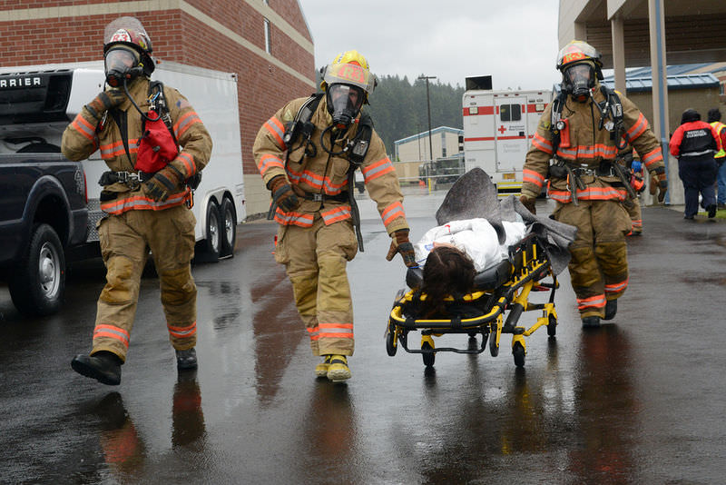

**"The world has definitely changed." This statement is common at times. What might it refer to?**

Bioterrorism is a threat against civilized people worldwide. To be prepared, all levels of government have developed and conducted terrorism drills. These include protecting responders from harmful biological substances.

### Bioterrorism

Bioterrorism is terrorism by the intentional release or spread of pathogens. Bioterrorism agents are classified into three categories. These categories are shown in the [Category A Agents](#x-ck12-dGFibGU6QmlvdGVycm9yaXNtQQ..), [Category B Agents](#x-ck12-dGFibGU6QmlvdGVycm9yaXNtQg..), and [Category C Agents](#x-ck12-dGFibGU6QmlvdGVycm9yaXNtQw..) **Tables.** Pathogens used in bioterrorism may include bacteria, viruses, or toxins. Bioterrorism agents may be naturally occurring pathogens or pathogens that have been modified by humans to make them more dangerous. They can spread in a variety of ways, including through air, food, [water](https://www.ck12.org/c/biology/water?referrer=crossref "water"), direct contact, or cuts in the skin, and have the potential to cause epidemics of deadly human diseases.

|     |     |     |
| --- | --- | --- |[Classification](https://flexbooks.ck12.org/cbook/ck-12-middle-school-life-science-2.0/section/1.9/primary/lesson/organization-of-living-things-ms-ls?referrer=crossref "Classification") of Category A Bioterrorism Agents
| Agent | Type of Pathogen | Mode of Transmission |
| --- | --- | --- |
| Anthrax | Bacteria | Air, food, cuts in skin |
| Smallpox | Virus | Air, direct contact |
| Botulinum | Toxin | Food, cuts in skin |

|     |     |     |
| --- | --- | --- |Classification of Category B Bioterrorism Agents
| Agent | Type of Pathogen | Mode of Transmission |
| --- | --- | --- |
| Brucellosis | Bacteria | Milk, direct contact |
| Ricin | Toxin | Air, food, water |
| Cholera | Bacteria | Food, water |

|     |     |     |
| --- | --- | --- |Classification of Category C Bioterrorism Agents
| Agent | Type of Pathogen | Mode of Transmission |
| --- | --- | --- |
| Hantavirus | Virus | Air |
| Tuberculosis | Bacteria | Air |

#### Agents of Bioterrorism

Bioterrorism agents are classified on the basis of their threat to public health, as shown in the tables above. Category A agents (**Table** [above](#x-ck12-dGFibGU6QmlvdGVycm9yaXNtQQ..)) include anthrax and smallpox. Agents in this category pose the greatest threat. They spread easily and cause serious illness or death. Category B agents (**Table** [above](#x-ck12-dGFibGU6QmlvdGVycm9yaXNtQg..)) are considered less of a threat. They do not spread as easily and are less likely to cause death. Category C agents (**Table** [above](#x-ck12-dGFibGU6QmlvdGVycm9yaXNtQw..)) are pathogens that are likely to be engineered for bioterrorism in the future. They are easy to produce and have the potential to cause serious illness or death.

#### Recent Bioterrorism Incidents

Two recent bioterrorism incidents in the U.S. received a great deal of media attention. They heightened public awareness of the threat of bioterrorism.

1.  In 2001, letters containing **anthrax** spores were mailed to several news offices and two U.S. Senate offices. A total of 22 people were infected, and 5 of them died of anthrax.
2.  In 2003, a deadly toxin called **ricin** was detected in a letter addressed to the White House. The letter was intercepted at a mail-handling facility off White House grounds. Fortunately, the ricin toxin did not cause any illnesses or deaths.
3.  More recently, a man was charged in April 2013 for sending letters with ricin to President Obama, a US senator, and a judge. Like in 2003, the letters were intercepted and no one was injured.

#### Bioterrorism Responses

Bioterrorism is a threat against civilized people worldwide. To be prepared, all levels of government have developed and conducted terrorism drills. These include protecting responders from harmful biological substances. Government agencies maintain research laboratories focused on finding vaccines for viral pathogens as well as anti-bacterials for bacterial pathogens. Additionally, they monitor for pathogens and often undergo simulations to ensure police agencies are prepared for an epidemic.

The United States Center for Disease Control and Prevention provides detailed information for planning in case of bioterrorism attacks.

!?[0](https://www.youtube.com/watch?v=rIgXQpR8Ig8)

### Summary

* Bioterrorism is a form of terrorism characterized by spreading deadly toxins, bacteria, or viruses.
* Governments have reaction plans for bioterrorist attacks.

### Review

1.  Give the three types of bioterrorism pathogens and an example of each.
2.  How does the government prepare for a bioterrorist attack?

</article>

## 2.1 Skin Overview

<article>

**What is the integumentary system?**

Because the organs of the integumentary system are external to the body, you may think of them as little more than “accessories” like clothing or jewelry. But the organs of the integumentary system serve important biological functions. They provide a protective covering for the body and help the body maintain homeostasis.

### Structure and Function

Your **integumentary system** is the external covering of your body. It is made up of your skin, hair, and nails. The integumentary systems of other animals such as birds and reptiles include their feathers and scales. The name comes from the Latin term _integumentum,_ which means “a covering.”

The integumentary system has multiple roles in homeostasis including protection, temperature regulation, sensory reception, biochemical synthesis, and absorption. Keeping [water](https://www.ck12.org/c/biology/water?referrer=crossref "water") out of the body is an important role of the integumentary system, as is shown by the **Figure** [above](#x-ck12-QmlvMzYzLTAx). Your body systems all work together to maintain relatively stable internal conditions. Each of the parts that make up your integumentary system has a special role in maintaining homeostasis, which we will explore a little later.

!?[0](https://www.youtube.com/watch?v=lGLKpR76Nc8)

### Summary

* The integumentary system consists of skin (the cutaneous membrane) and accessory structures including hair, nails, sweat glands (sudoriferous glands), and oil glands (sebaceous glands).
* The integumentary system is integral in homeostasis. It offers protection, temperature regulation, sensory reception, biochemical synthesis, and absorption.

### Review

1.  How does the integumentary system play a role in homeostasis?

</article>

## 2.2 Skin Form and Function

<article>

Your skin. The skin is a living (though the outermost layer is made of dead cells), constantly regenerating organ that has numerous functions.

### Skin

The skin is a vital organ that covers the entire outside of the body, forming a protective barrier against pathogens and injuries from the environment. The skin is the body's largest organ, and it is only about 2 mm thick. It shields the body against heat, light, injury, and infection. The skin also helps regulate body temperature, gathers sensory information from the environment, stores [water](https://www.ck12.org/c/biology/water?referrer=crossref "water"), fat, and vitamin D, and acts as a physical barrier in protecting us from diseases.

Your skin is constantly in contact with your external environment, so it gets cut, scratched, and exposed to radiation such as ultraviolet (UV) light. You also naturally shed many skin cells every day. Your body replaces damaged or missing skin cells by growing more of them through the process of mitosis. Two distinct layers make up the skin: the epidermis and the dermis. A fatty layer, called subcutaneous tissue or hypodermis (below skin), lies under the dermis, but it is not considered to be part of your skin. The layers that make up your skin are shown in the **Figure** [below](#x-ck12-QmlvLTIxLTE5LUxheWVycy1vZi1odW1hbi1za2lu).

The color, thickness, and texture of skin vary over the body. There are two general types of skin: thin and hairy, which is the most common type on the body, and thick and hairless, which is found on parts of the body that are used heavily and experience a lot of friction such as the palms of the hands or the soles of the feet.

#### Epidermis

**Epidermis** is the outermost layer of the skin. It forms the waterproof, protective wrap over the body's surface and is made up of many layers of epithelial cells, as shown in the **Figure** [below](#x-ck12-QmlvMzYzLTAz).

The epidermis is divided into several layers, and epithelial cells are formed through mitosis in the lowest layer. The epithelial cells move up through the layers of the epidermis, changing shape and composition as they differentiate and become filled with a tough, fibrous protein called keratin. At this point, the cells are called keratinocytes. Keratinocytes at the surface of the epidermis form a thin layer of flattened, dead cells (the stratum corneum in the **Figure** [above](#x-ck12-QmlvMzYzLTAz)). Although the top layer of epidermis is only about as thick as a sheet of paper, it is made up of 25 to 30 layers of keratinocytes. Keratinocytes get scraped off through everyday activities and are usually shed about a month after they reach the surface of the epidermis.

The epidermis also contains cells called melanocytes that produce the pigment melanin. **Melanin** is the brownish pigment that gives skin and hair their color. **Melanocytes** are located in the bottom layer of the epidermis: the stratum basale, shown in the **Figure** [above](#x-ck12-QmlvMzYzLTAz). The difference in skin color between light-skinned people and dark-skinned people is not due to the number of melanocytes in their skin, but to the melanocytes' level of activity. The amount of melanin produced in a person’s skin is dependent on his or her genetics and the amount of ultraviolet (UV) light exposure. Melanin absorbs UV rays from the sun or other sources of UV light such as a tanning bed. When UV light penetrates the skin and damages DNA, the damaged DNA triggers the synthesis of more melanin. The skin also makes vitamin D by absorbing energy from UV light. Melanin acts like a UV filter, so the more melanin there is in a person’s skin, the more time the person has to spend in sunlight to produce the same amount of vitamin D as a person with less melanin in their skin.

The epidermis also contains cells that take up and process certain marker proteins (called antigens) from microbes that enter through the skin. This helps the immune system recognize the microbe as an intruder and mount an attack on it. The epidermis contains no blood vessels, so the lower portion of the epidermis is nourished by diffusion from the blood vessels of the dermis.

#### Structure and Function of Dermis

The **dermis** is the layer of skin directly under the epidermis that is made of tough, elastic connective tissue. The dermis is tightly connected to the epidermis by a membrane made of collagen fibers. The dermis contains the hair follicles, sweat glands, sebaceous glands, and blood vessels. It also holds many nerve endings that provide the sense of touch, pressure, heat, and pain. Tiny [muscles](https://flexbooks.ck12.org/cbook/ck-12-middle-school-life-science-2.0/section/11.9/primary/lesson/smooth-skeletal-and-cardiac-muscles-ms-ls?referrer=crossref "muscles"), called arrector pili, contract and pull on hair follicles, which cause hair to stand up. This can happen when you are cold or afraid, and the resulting little “bumps” in the skin are commonly called goose bumps.

The dermis has two layers, each of which contains different structures:

**The papillary region (upper layer)** is made up of loose connective tissue and contains touch receptors, which communicate with the central nervous system. It is named for its finger-like projections called papillae, which extend toward the epidermis and help secure the dermis to the epidermis. The papillae can be seen in the **Figure** [above](#x-ck12-QmlvLTIxLTE5LUxheWVycy1vZi1odW1hbi1za2lu). The papillae provide the dermis with a "bumpy" surface that causes distinctive friction ridges. They are called friction ridges because they help the hand or foot to grasp things by increasing friction. Friction ridges, as shown in the **Figure** [below](#x-ck12-QmlvMzYzLTA0), occur in patterns that are unique to the individual, making it possible to use fingerprints or footprints as a means of identification.

**The reticular region (lower layer)** is made of dense, elastic fibers (collagen), which contain the hair follicles and [roots](https://flexbooks.ck12.org/cbook/ck-12-biology-flexbook-2.0/section/9.14/primary/lesson/roots-bio?referrer=crossref "roots"), nerves, and glands. It gets its name from the dense concentration of protein fibers that weave throughout it. These protein fibers give the dermis its properties of strength, extensibility, and elasticity. Heat, cold, and pressure receptors, nails, and blood vessels are also located in this region. Tattoo ink is injected into the dermis. Stretch marks are also located in the dermis.

#### Glands and Follicles

Glands and follicles open out into the epidermis, but they originate within the dermis. A **sebaceous gland,** also known as an oil gland, secretes an oily substance, called sebum, into the hair follicle. **Sebum** is made of lipids and the debris of dead lipid-producing cells. The word sebum comes from the Latin word for fat, or tallow. It “waterproofs” hair and the skin surface to prevent them from drying out. It can also inhibit the growth of microorganisms on the skin. Sebum is the cause of the oily appearance of skin and hair. It is odorless, but the breakdown of sebum by bacteria can cause odors. A sebaceous gland is shown in the **Figure** [below](#x-ck12-QmlvMzYtMDMtMDU.). If a sebaceous gland becomes plugged and infected, it develops into a pimple (also called acne).

**Sweat glands** open to the epidermal surface through the skin pores. They occur all over the body and are controlled by the sympathetic nervous system. Evaporation of sweat from the skin surface helps lower the skin temperature, which in turn helps to control body temperature. The skin also functions as an excretory organ because it releases excess water, salts, and other wastes in sweat. A sweat gland is shown in the **Figure** [below](#x-ck12-QmlvMzYzLTA2Yg..). There are two types of sweat glands: eccrine glands and apocrine glands. Eccrine glands are the “regular” sweat glands that release sweat to cool the body. Apocrine glands are larger than eccrine glands and are located in the armpits and groin areas. They effectively act as scent glands because they produce a solution that bacteria break down to produce "body odor."

**Mammary glands** are the organs that, in female mammals, produce milk to feed their young. Mammary glands are enlarged and modified sweat glands and are a major characteristic of mammals.

#### Subcutaneous Tissue

The **subcutaneous tissue** (also called the hypodermis) lies below the dermis and contains fat and loose connective tissue that holds larger blood vessels and nerves. Its purpose is to attach the skin to underlying bone and muscle as well as to supply the skin with blood vessels and nerves. This layer is important to the regulation of body temperature. It is mostly made up of adipose tissue (which is made up of fat cells or adipocytes); the subcutaneous tissue contains about 50 percent of the body’s fat. The functions of subcutaneous tissue include insulation and the storage of nutrients. The size of this layer varies throughout the body and from person to person.

#### Skin and Homeostasis

The skin has multiple roles in homeostasis including protection, control of body temperature, sensory reception, water balance, synthesis of vitamins and hormones, and absorption of materials. The skin's main functions are to serve as a barrier to the entry of microbes and viruses and to prevent water and extracellular fluid loss. Acidic secretions from skin glands also stop the growth of fungi on the skin. Melanocytes form a second barrier: protection from the damaging effects of UV radiation. When a microbe gets into the skin (or when the skin is cut) an immune system reaction occurs.

Heat and cold receptors are located in the skin. When the body temperature rises, the hypothalamus sends a nerve signal to the sweat-producing skin glands, causing them to release sweat onto the skin surface. The evaporation of sweat helps reduce the temperature of the skin surface, which cools the body. The hypothalamus also causes dilation of the blood vessels of the skin, allowing more blood to flow into those areas, causing heat to be released from the skin surface. When body temperature falls, the sweat glands constrict, and sweat production decreases. If the body temperature continues to fall, the body will start to generate heat by raising the body's metabolic rate and by causing the muscles to shiver.

The homeostatic functions of the skin include the following:

* Protection of the body’s internal tissues and organs.
* Protection against invasion by infectious organisms.
* Protection of the body from dehydration.
* Protection of the body against large changes in temperature.
* Excretion of wastes through sweat.
* Acts as a receptor for the [senses](https://flexbooks.ck12.org/cbook/ck-12-biology-flexbook-2.0/section/13.17/primary/lesson/senses-bio?referrer=crossref "senses") of touch, pressure, pain, heat, and cold.
* Makes vitamin D through exposure to UV radiation.
* Stores water, fat, and vitamin D.

!?[0](https://www.youtube.com/watch?v=Orumw-PyNjw)

### Summary

* The epidermis provides an outer layer of protection and also contains melanocytes, which protect the body against UV rays.
* The dermis contains hair follicles, sweat glands, sebaceous glands, and blood vessels.
* The hypodermis is not considered part of your skin, but its main purpose is to attach the skin to underlying bone and muscle as well as to supply the skin with blood vessels and nerves.

### Review

1.  How do epithelial cells change as they move up through the epidermis?
2.  What are the two types of sweat glands?
3.  What kind of glands are mammary glands?
4.  Why are there differences in skin color between humans?
5.  How does the epidermisaid the immune system?

</article>

## 2.3 Nails and Hair

<article>

Well, maybe not yours. But some other person's. Hair is an integral part of the integumentary system. And although many people may lose some or all of the hair on top of their heads, they still have hair on their arms and legs that perform important functions.

### Nails and Hair

Nails are made up of specialized epidermal cells. Fingernails and toenails contain a tough protein called keratin and are actually a type of modified hair. The nail grows from the nail bed, which is thickened to form a lunula (or little moon), as shown in**Figure** [below](#x-ck12-QmlvMzYzLTEx). Cells forming the nail bed are linked together to form the nail. There are no nerve endings in the nail.

The fingernail generally serves two purposes. It serves as a protective plate and enhances sensation of the fingertip. The protection function of the fingernail is commonly known, but the sensation function is equally important. The fingertip has many nerve endings in it, allowing us to receive volumes of information about objects we touch. The nail acts as a counterforce to the fingertip, providing even more sensory input when an object is touched. When your fingertip presses down on an object, the pressure exerted by the solid fingernail provides additional input.

Nails are made up of many different parts, as shown in **Figure** [above](#x-ck12-QmlvMzYzLTEx):

* The free edge is the part of the nail that extends past the finger, beyond the nail plate.
* The nail plate is what we think of when we say “nail:” the hard and translucent portion that is composed of keratin.
* The lunula is the crescent-shaped, whitish area of the nail bed (when visible).
* The eponychium, or cuticle, is the fold of skin at the end of the nail.

Nails grow at a rate of about 1 cm every 100 days. Fingernails require 4 to 6 months to regrow completely, and toenails require 12 to 18 months. Actual growth rate is dependent upon age, season, [exercise](https://flexbooks.ck12.org/cbook/ck-12-middle-school-life-science-2.0/section/11.11/primary/lesson/muscles-and-exercise-ms-ls?referrer=crossref "exercise") level, and hereditary factors. This growth record can show the history of recent health and physiological imbalances and has been used as a diagnostic tool since ancient times.

Major illness will cause a deep horizontal groove to form in the nails. Discoloration, thinning, thickening, brittleness, splitting, grooves, spots, lines, receded lunula, or changes in the shape of the nail can indicate illness in other areas of the body, nutrient deficiencies, drug reaction or poisoning, or a physical injury to the nail or nail bed.

#### Hair

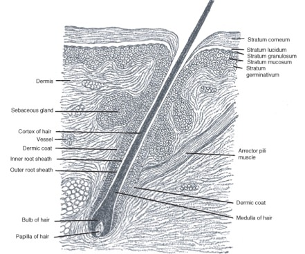

Hair is a filamentous fiber that is found only on mammals. The main component of hair is the tough protein keratin. Hair emerges from the epidermis, although it grows from hair follicles deep in the dermis, as shown in**Figure** [above](#x-ck12-QmlvMzYtMDMtMTI.). The hair of non-human mammal species is commonly called fur.

Humans have three different types of hair:

* **Lanugo** is the fine hair that covers nearly the entire body of fetuses.
* **Vellus hair** is the short, fine "peach fuzz" body hair that grows in most places on the [human body](https://flexbooks.ck12.org/cbook/ck-12-middle-school-life-science-2.0/section/11.1/primary/lesson/organization-of-the-human-body-ms-ls?referrer=crossref "human body") except for the palms of the hands and the soles of the feet.
* **Terminal hair** is the fully developed hair that is generally longer, coarser, thicker, and darker than vellus hair.

Different parts of the human body have different types of hair. From childhood onward, vellus hair covers the entire human body except on the lips, the palms of hands, the soles of feet, the navel, and scar tissue. The density of the hairs (in hair follicles per square centimeter) varies from one person to another.

 skin cells that overlap each other like the shingles or tiles on a roof. You can see the overlapping cells in this image.")

What is the function of hair? In people, hair serves to insulate, protect, and sense the immediate surroundings. Insulation serves to conserve heat. The hair on your head insulates your body from heat loss. Eyelashes and eyebrows protect the [eyes](https://flexbooks.ck12.org/cbook/ck-12-middle-school-life-science-2.0/section/11.48/primary/lesson/how-the-eye-works-ms-ls?referrer=crossref "eyes") from [water](https://www.ck12.org/c/biology/water?referrer=crossref "water"), dirt, and other irritants. Nose hairs act as a physical barrier to any particles or microorganisms that might be in the air we breathe.

Curly hair has a different biological structure than straight hair, which is shown in**Figure** [above](#x-ck12-QmlvMzYzLTEz). It tends to be much drier than straight hair because the oils secreted into the hair shaft by the sebaceous glands can more easily travel down the shaft of straight hair. People with very curly hair may find that this hair type can be dry, hard to manage, and often frizzy.

Individual hairs have periods of growth and dormancy. During the growth portion of the cycle, hair follicles are long and bulbous, and the hair grows out at about a third of a millimeter per day. After three to six months, body hair growth stops (the pubic and armpit areas have the longest growth period). The follicle shrinks, and the root of the hair grows rigid. Following a period of dormancy, another growth cycle starts, and a new hair eventually pushes the old one out of the follicle from beneath. Head hair, by comparison, grows for a long duration and to a great length before being shed. Terminal hair is genetically programmed to be straight, curly, or wavy, and it tends to change over time.

Hair color is the result of pigmentation due to the presence of different forms of melanin. In general, the more melanin present, the darker the hair color; the less melanin present, the lighter the hair color. A person's hair color may also change over time and may be more than one color at a time.

!?[0](https://www.youtube.com/watch?v=m-dQGI10aSU)

### Summary

* Nails are made up of specialized epidermal cells. They serve as protective plates and enhance sensation of the fingertips.
* Hair is a filamentous fiber that is found only on mammals. In people, hair serves to insulate, protect, and sense the immediate surroundings.

### Review

1.  What affects the rate of growth for nails?
2.  What are the three types of hair found on humans?
3.  What is the main component of hair and nails?
4.  Describe the growth cycle of hair.

</article>

## 2.4 Skin Diseases and Disorders

<article>

Normally, skin cells grow gradually and flake off about every four weeks. New skin cells grow to replace the outer layers of the skin as they shed. But in psoriasis, new skin cells move rapidly to the surface of the skin in days rather than weeks, resulting in thick, red skin with flaky, silver-white patches called scales.

### Homeostatic Imbalances of the Skin

Many wavelengths of electromagnetic radiation are emitted by the sun: some we can see, and others we cannot. The range of wavelengths of radiation we can see is called visible light. However, visible light makes up only a small portion of the total radiation that comes from the sun. Two other types of radiation that you have probably heard about before include infrared and ultraviolet radiation. Infrared light is the thermal energy, or the “heat rays,” that you feel when the sun shines on you. The other, ultraviolet (UV), which we have discussed a little already, helps the body produce vitamin D, but it can also damage DNA in skin cells. Our main source of UV radiation, the sun, is shown in **Figure** [below](#x-ck12-QmlvMzYzLTA3).

#### Beneficial Effects of UV Radiation

A positive effect of ultraviolet radiation (UV) exposure is that it causes the production of vitamin D in the skin. It has been estimated that tens of thousands of premature deaths occur in the United States annually from a range of cancers due to vitamin D deficiency.

Ultraviolet radiation has other medical applications in the treatment of skin conditions such as psoriasis, a disorder in which red, scaly patches form due to an overproduction of epithelial cells, and vitiligo, a condition that causes loss of pigment, which results in irregular, pale patches of skin, as shown in**Figure** [below](#x-ck12-QmlvMzYzLTA4).

 light from the sun or from UVA lamps, used together with certain medicines can help in many cases.")

#### Harmful Effects of UV Radiation

In humans, prolonged exposure to solar UV radiation may result in acute and chronic health effects on the skin, [eyes](https://flexbooks.ck12.org/cbook/ck-12-middle-school-life-science-2.0/section/11.48/primary/lesson/how-the-eye-works-ms-ls?referrer=crossref "eyes"), and immune system. While some sunlight is good for health, skin cancer caused by excessive exposure to sunlight is not among the sun's benefits. Because some types of skin cancer are easy to cure, the danger posed by too much sunlight is perhaps not taken seriously enough. It is important to remember that a more serious form of skin cancer called melanoma is also associated with excessive sun exposure. Melanomas are potentially lethal tumors.

The UV radiation excites DNA molecules in skin cells, causing bonds to form between neighboring thymine bases, producing a thymine dimer that changes the shape of the DNA helix. These dimers can lead to mutations. **Mutations** are changes to the base pair sequence of DNA or RNA. Mutations can result in cancerous growths.

Skin cancer is an increasingly common condition. This is due in part to peoples’ increased exposure to UV radiation, because of the increased popularity of sun bathing. Because melanin protects the skin from the effects of UV radiation, lighter-skinned people are at more risk of developing skin cancer than darker-skinned people are. However, the risk of developing skin cancer is related to the amount of sunburn and the overall length of time a person has been exposed to UV light. The three most common types of skin cancers are shown in**Figure** [below](#x-ck12-QmlvMzYtMDMtMDk.).

, squamous cell carcinoma (center), and melanoma (right). All three types arise from cells in the epithelium.")

As a defense against UV radiation, the body tans when exposed to moderate levels of radiation by releasing the brown pigment melanin. This helps to block UV penetration and prevent damage to the vulnerable skin tissues deeper down. Suntan lotion, often referred to as "sun block" or "sunscreen," partly blocks UV and is widely available. Most of these products contain a sun protection factor (SPF) rating that describes the amount of protection given. This protection, however, applies only to a type of UV radiation called UVB rays—the type of radiation that is responsible for sunburn. UVA rays, another type of UV radiation, penetrate more deeply into the skin and may be responsible for causing cancer and wrinkles. Some sunscreens now include compounds, such as titanium dioxide, which help protect against UVA rays. Other UVA blocking compounds found in sunscreen include zinc oxide and avobenzone. Another means to block UV radiation is sun protective clothing, as shown in**Figure** [below](#x-ck12-QmlvMzYzLTEw). This is clothing that has an ultraviolet protection factor (UPF) rating that describes the protection given against both UVA and UVB radiation.

#### Acne

The most common form of acne is known as acne vulgaris, which means "common acne." Many teenagers get this type of acne. Acne is a highly complicated and variable form of skin infection. It affects more than 85% of teenagers, but frequently also continues into adulthood. For most people, acne tends to decrease or disappear after one reaches his or her early twenties. Excessive secretion of sebum from the sebaceous glands leads to the plugging of the hair follicle with dead skin cells (corneocytes). This blockage is caused by a failure of the normal process in which skin cells that line the pores are usually shed. Within these blocked pores, bacteria and yeast begin to multiply. In response to the bacterial and yeast populations, the skin inflames, which produces a red bump.

### Summary

* Positive effects of UV exposure include the production of vitamin D and medical applications such as the treatment of skin conditions like psoriasis and vitiligo.
* Prolonged exposure to solar UV radiation may result in acute and chronic health effects on the skin, eyes, and immune system. Melanoma is an example.
* Acne is a highly complicated and variable form of skin infection.

### Review

1.  How can UV rays lead to cancer?
2.  What causes acne?
3.  The SPF rating on sunscreen protects against which types of UV rays?

</article>

## 3.1 The Heart

<article>

The heart. An absolutely remarkable organ. Obviously, its main function is to pump blood throughout the body. And it does this extremely well. On average, this muscular organ will beat about 100,000 times in one day and about 35 million times in a year. During an average lifetime, the human heart will beat more than 2.5 billion times.

### The Heart

The **[cardiovascular system](https://flexbooks.ck12.org/cbook/ck-12-middle-school-life-science-2.0/section/11.21/primary/lesson/cardiovascular-system-ms-ls?referrer=crossref "cardiovascular system"),** shown in**Figure** [below](#x-ck12-QmlvLTIzLTAxLWNpcmN1bGF0b3J5LWZ1bmN0aW9u), is an organ system that moves nutrients, hormones, gases, and wastes to and from body cells and distributes heat to maintain homeostasis. The main components of the cardiovascular system are the heart, the blood vessels, and the blood.

 roads.")

The **heart** is the muscular organ that pumps blood through the blood vessels by repeated, rhythmic contractions. The term cardiac means "related to the heart" and comes from the Greek word _kardia,_ meaning "heart." The heart is made up mostly of cardiac muscle tissue (shown in**Figure** [below](#x-ck12-QmlvMzctMDEtMDI.)), which contracts to pump blood around the body. In adults, the normal mass of the heart is 250-350 grams (9-12 oz), or about three quarters the size of a clenched fist, but badly diseased hearts can be up to 1000 g (2 lb) in mass due to enlargement of the cardiac muscle.

.")

The heart is usually found in the left to middle of the chest, with the largest part of the heart slightly to the left. The heart is usually felt to be on the left side because the left ventricle is stronger (it pumps to all the body parts). The heart is surrounded by the lungs. The left lung is smaller than the right lung because the heart takes up more room in the left side of the chest. The position of the heart within the chest is shown in**Figure** [below](#x-ck12-QmlvMzcxLTAz).

#### Blood Flow Through the Heart

Blood flows through the heart in two separate loops; you could think of them as a “left side loop” and a “right side loop.” The right side and left side of the heart refer to your heart as it sits within your chest. Its left side is your left side, and its right side is your right side.

The right side of the heart collects deoxygenated blood from the body and pumps it into the lungs, where it releases carbon dioxide and picks up oxygen. The left-side carries the oxygenated blood back from the lungs and into the left side of the heart, which then pumps the oxygenated blood throughout the rest of the body.

The heart has four chambers: the two upper atria and the two lower ventricles. **Atria** (singular atrium) are the thin-walled blood collection chambers of the heart. Atria pump the blood into the ventricles. **Ventricles** are the heart chambers that collect blood from the atria and pump it out of the heart. On the right side of the heart, deoxygenated blood from the body enters the right atrium from the superior vena cava and the inferior vena cava, as shown in**Figure** [below](#x-ck12-QmlvMzctMDEtMDQ.). Blood enters the right ventricle, which then pumps the blood through the pulmonary arteries and into the lungs. In the lungs, carbon dioxide is released from the blood, and oxygen is picked up.

Pulmonary veins bring the oxygenated blood back toward the heart and into the left atrium. From the left atrium, the blood moves to the left ventricle, which pumps it out to the body through the aorta. On both sides, the lower ventricles are thicker and stronger than the upper atria. The muscle wall surrounding the left ventricle is thicker and stronger than the wall surrounding the right ventricle because the left ventricle needs to exert enough force to pump the blood through the body. The right ventricle only needs to pump the blood as far as the lungs, which does not require as much contractile force.

**Valves** in the heart maintain the flow of blood by opening and closing in one direction only. Blood can move only forward through the heart and is prevented from flowing backward by the valves. Such movement of the blood is called unidirectional flow. There are four valves of the heart:

* The two **atrioventricular (AV) valves** ensure blood flows from the atria to the ventricles and not the other way. The AV valve on the right side of the heart is called the tricuspid valve, and the one on the left side of the heart is called the mitral, or bicuspid, valve.

* The two **semilunar (SL)** **valves** are present in the arteries leaving the heart, and they prevent blood from flowing back from the arteries into the ventricles. The SL valve on the right side of the heart is called the pulmonary valve because it leads to the pulmonary arteries, and the SL valve on the left side of the heart is called the aortic valve because it leads to the aorta. The valves of the heart are shown in **Figure** [below](#x-ck12-QmlvMzctMDEtMDQ.).

#### The Heartbeat

The heart is a meshwork of cardiac muscle cells that are interconnected by little channels called gap junctions. This interconnection allows the electrical stimulation of one cell to spread quickly to its neighboring cells. Cardiac muscle is self-exciting. This contrasts skeletal muscle, which needs nervous stimulation to contract. The heart's rhythmic contractions occur spontaneously, although the frequency of the contractions, called the **heart rate,** can be changed by nervous or hormonal signals, such as during [exercise](https://flexbooks.ck12.org/cbook/ck-12-middle-school-life-science-2.0/section/11.11/primary/lesson/muscles-and-exercise-ms-ls?referrer=crossref "exercise") or when perceiving danger.

#### Control of the Heartbeat

The rhythmic sequence of contractions of the heart is coordinated by two small groups of cardiac muscle cells called the sinoatrial (SA) and atrioventricular (AV) nodes. The **sinoatrial node (SA node),** often known as the "cardiac pacemaker," is found in the upper wall of the right atrium and is responsible for creating an action potential to start the wave of electrical stimulation that starts atrial contraction. The action potential causes the cardiac cells to contract. This wave of contraction then spreads across the cells of the atrium, reaching the **atrioventricular node (AV node),** which is found in the lower right atrium, as shown in**Figure** [below](#x-ck12-QmlvMzcxLTA1). The AV node conducts the electrical impulses that come from the SA node through the atria to the ventricles. The impulse is delayed there before being conducted through special bundles of heart muscle cells called the bundle of His and the Purkinje fibers, which leads to a contraction of the ventricles. This delay allows for the ventricles to fill with blood before the ventricles contract. Heartbeat is also controlled by nerve messages originating from the autonomic nervous system.

There are important physiological differences between cardiac cells found in the nodes and cardiac cells found in the ventricles. Differences in ion channels and mechanisms of polarization give rise to unique properties of SA node cells—the most important being the spontaneous depolarizations necessary for the SA node's pacemaker activity.

The **Bundle of His** is a collection of heart muscle cells (fibers) specialized for electrical conduction that transmits the electrical impulses from the AV node. The bundle of His branches into the Purkinje fibers. **Purkinje fibers,** shown in**Figure** [below](#x-ck12-QmlvMzcxLTA2), are specialized cardiac muscle cells that conduct action potentials into the ventricles, causing the cardiac muscle of the ventricles to contract in a controlled way.

, Purkinje fibers take up stain differently than the surrounding muscles cells, and, on a slide, they often appear lighter and larger than their neighbors.")

The heartbeat is made up of two parts: [muscle contraction](https://flexbooks.ck12.org/cbook/ck-12-biology-flexbook-2.0/section/13.10/primary/lesson/muscle-contraction-bio?referrer=crossref "muscle contraction") and relaxation. **Systole** is the contraction of the heart chambers, which drives blood out of the chambers. **Diastole** is the period of time when the heart relaxes after contraction. All four chambers of the heart undergo systole and diastole in a timed fashion so that blood is moved forward through the cardiovascular system. For example, ventricular systole is the point at which the ventricles are contracting, and atrial systole is the point at which the atria are contracting. Likewise, ventricular diastole is the period during which the ventricles are relaxing, while atrial diastole is the period during which the atria are relaxing. In general, when referring to systole and diastole, the chambers being referred to are the ventricles, which are shown in**Figure** [below](#x-ck12-QmlvMzcxLTA3).

, the blood gets pushed out of the heart.")

#### Heart Sounds

In healthy adults, there are two normal heart sounds, often described as a "lub" and a "dub," that occur with each heart beat (lub-dub, lub-dub). In addition to these normal sounds, a variety of other sounds may be heard including heart murmurs or clicks. A medical practitioner uses a stethoscope to listen for these sounds, which gives him or her important information about the condition of the heart.

The sound of the heart valves shutting causes the heart sounds, or a heartbeat. The closing of the mitral and tricuspid valves (known together as the atrioventricular valves) at the beginning of ventricular systole causes the first part of the "lub-dub" sound made by the heart as it beats. The second part of the "lub-dub" sound is caused by the closure of the aortic and pulmonic valves at the end of ventricular systole. As the left ventricle empties, its pressure falls below the pressure in the aorta, and the aortic valve closes. Similarly, as the pressure in the right ventricle falls below the pressure in the pulmonary artery, the pulmonic valve closes.

### Summary

* The heart, blood vessels, and blood are the main components of the cardiovascular system, which moves nutrients, hormones, gases, and wastes to and from body cells and distributes heat to maintain homeostasis.
* Blood flows into the heart through the superior and inferior vena cava, enters the right atrium, and is pumped into the lungs by the right ventricle. Blood returns through the pulmonary vein, flows into the left atrium, and is pumped through the aorta to the rest of the body by the left ventricle.
* The rhythmic sequence of contractions of the heart is coordinated by two small groups of cardiac muscle cells called the sinoatrial (SA) and atrioventricular (AV) nodes, although the heart rate can be changed by nervous or hormonal signals, such as during exercise or when perceiving danger.
* The heartbeat is made up of two parts: muscle contraction (known as systole) and relaxation (known as diastole).

### Review

1.  Which ventricle wall is thicker, the left or the right?
2.  Why are electrical pulses delayed slightly at the AV node before causing a contraction of the ventricles?
3.  What is responsible for the "lub-dub" sound of a normal heartbeat?
4.  Why is the heart felt to be usually on the left?
5.  What affects heart rate?

### Explore More

</article>

## 3.2 Blood Vessels

<article>

**How does blood travel around the body?**

This color-enhanced image was made with an electron [microscope](https://flexbooks.ck12.org/cbook/ck-12-middle-school-life-science-2.0/section/1.6/primary/lesson/microscopes-ms-ls?referrer=crossref "microscope"), so the objects it depicts are extremely small. This incredible photo shows red blood cells leaking out of a ruptured blood vessel. Blood vessels are part of the circulatory system; they are the “highway” system of the [human body](https://flexbooks.ck12.org/cbook/ck-12-middle-school-life-science-2.0/section/11.1/primary/lesson/organization-of-the-human-body-ms-ls?referrer=crossref "human body") that transports materials to all of its cells. And the red blood cells that carry some of these materials are a little like trucks on the highway.

### Blood Vessels

The blood vessels are part of the [cardiovascular system](https://flexbooks.ck12.org/cbook/ck-12-middle-school-life-science-2.0/section/11.21/primary/lesson/cardiovascular-system-ms-ls?referrer=crossref "cardiovascular system") and function to transport blood throughout the body. The two most important types are arteries and veins. Arteries carry blood away from the heart, while veins return blood to the heart.

#### Arteries, Veins and Capillaries

There are various kinds of blood vessels. The main types are listed below:

* **Arteries** are the large, muscular vessels that carry blood away from the heart.
* An **arteriole** is a small-diameter blood vessel that extends and branches out from an artery and leads to capillaries.
* **Veins** are vessels that carry blood toward the heart. The majority of veins in the body carry deoxygenated blood from the tissues back to the heart.
* A **venule** is a small vessel that allows deoxygenated blood to return from the capillaries to veins.
* **Capillaries** are the smallest of the body's blood vessels. They connect arterioles and venules and are important for the interchange of gases and other substances between blood and [body cells](https://www.ck12.org/c/biology/body-cells?referrer=crossref "body cells").

The blood vessels all have a similar basic structure. The **endothelium** is a thin layer of cells that creates a smooth lining on the inside surface of blood vessels. Endothelial tissue is a specialized type of epithelium, one of the four types of tissue found in the body. Endothelial cells have an important structural role in blood vessels; they line the entire circulatory system, from the heart to the smallest capillary. Around the endothelium there is a layer of smooth muscle, which is well developed in arteries. Finally, there is a further layer of connective tissue that surrounds the smooth muscle. This connective tissue, which is mostly made up of collagen, contains nerves that innervate the smooth muscule layer. The connective tissue surrounding larger vessels also contains capillaries to bring nutrients to the tissue. Capillaries, the smallest blood vessels, are made up of a single layer of endothelium and a small amount of connective tissue.

##### **Arteries and Arterioles**

The arteries carry blood away from the heart. As shown in **Figure** [above](#x-ck12-QmlvMzctMDEtMDg.), arteries have thick walls that have three major layers: an inner endothelial layer, a middle layer of smooth muscle, and an outer layer of stretchy connective tissue (mostly collagen). The elastic qualities of artery walls allow them to carry pressurized blood from the heart while maintaining blood pressure.

The aorta is the largest artery in the body. It receives blood directly from the left ventricle of the heart through the aortic valve. The aorta branches into smaller arteries, and these arteries branch in turn, becoming smaller in diameter, down to arterioles. The arterioles supply the capillaries that carry nutrients to the body’s cells and tissues. The aorta is an elastic artery. When the left ventricle contracts to force blood into the aorta, it expands. This stretching gives the potential energy that will help maintain blood pressure during diastole, when the aorta contracts passively.

An arteriole is a small-diameter blood vessel that branches out from an artery and leads to capillaries. Arterioles have thin, muscular walls, composed of one or two layers of smooth muscle, and are the primary site of vascular resistance. **Vascular resistance** is the resistance to flow that blood must overcome to be pumped through the circulatory system. Increasing vascular resistance is one way your body can increase blood pressure.

##### **Veins and Venuoles**

Most veins return deoxygenated blood to the heart. The thick, outer layer of a vein is made up of collagen-containing connective tissue, as shown in**Figure** [above](#x-ck12-QmlvMzctMDEtMDk.). The connective tissue is wrapped around bands of smooth muscle, while the interior is lined with endothelium. Most veins have one-way flaps called valves, shown in**Figure** [below](#x-ck12-QmlvMzcxLTEw), that prevent blood from flowing backward and pooling in the legs, feet, arms, or hands due to the pull of gravity. The location of veins can vary from person to person.

A venule is a small blood vessel that allows deoxygenated blood to return from the capillary beds to the larger blood vessels called veins. Venules have three layers: an inner endothelium composed of squamous epithelial cells that act as a membrane, a middle layer of muscle and elastic tissue, and an outer layer of fibrous connective tissue. The middle layer is poorly developed so that venules have thinner walls than arterioles.

##### **Capillaries**

Capillaries are the smallest of a body's blood vessels, measuring 5-10 μm in diameter. Their size is shown in relation to body cells in**Figure** [below](#x-ck12-QmlvMzcxLTEx). Capillaries connect arterioles and venules, and they are important for the exchange of oxygen, carbon dioxide, and other substances between blood and body cells.

The walls of capillaries are made of only a single layer of endothelial cells. This layer is so thin that molecules such as oxygen, [water](https://www.ck12.org/c/biology/water?referrer=crossref "water"), and lipids can pass through them by diffusion and enter the [body tissues](https://www.ck12.org/c/biology/body-tissues?referrer=crossref "body tissues"). Waste products, such as carbon dioxide and urea, can diffuse back into the blood to be carried away for removal from the body. Capillaries are so small that the blood cells need to pass through them in a single file line. A capillary bed is the network of capillaries supplying an organ. The more metabolically active a tissue or organ is, the more capillaries it needs to get nutrients and oxygen.

Blood vessels are roughly grouped as arterial or venous. This grouping is determined by whether the blood in the vessel is flowing away from (arterial) or toward (venous) the heart. In general, the term arterial blood is used to describe blood high in oxygen, although the pulmonary arteries carry deoxygenated blood, and blood flowing in the pulmonary vein is rich in oxygen.

#### Roles of Blood Vessels

Blood vessels are not involved in regulating the transport of blood; the endocrine and nervous systems do that. However, arteries and veins can regulate their inner diameters by contractions of the smooth muscle layer. This widening or narrowing of the blood vessels changes the blood flow to the organs of the body. This process is controlled by the autonomic nervous system; it is not controlled consciously.

**Vasodilation** is a process by which blood vessels in the body become wider due to the relaxation of the smooth muscle in the vessel wall. This reduces blood pressure since there is more room for the blood to move through the vessel. Endothelium of blood vessels uses nitric oxide to signal the surrounding smooth muscle to relax, which dilates the artery and increases blood flow. Nitric oxide is a vasodilator.

**Vasoconstriction** is the constriction of blood vessels (narrowing or becoming smaller in cross-sectional area) by contracting the vascular smooth muscle in the vessel walls. Vasoconstriction is controlled by substances such as some hormones and neurotransmitters, which are called vasoconstrictors. For example, the “fight or flight” hormone epinephrine is a vasoconstrictor that is released by the adrenal glands.

**Permeability** of the endothelium is important for the release of nutrients to the tissue. Permeability is the ability of a membrane to allow certain molecules and ions to pass through it by diffusion. Permeability of the endothelium increases during an immune response, which allows white blood cells and other substances to get to the site of injury or irritation.

Oxygen, which is bound to hemoglobin in red blood cells for transport through the body, is the most critical nutrient carried by the blood. In all arteries apart from the pulmonary artery, hemoglobin is highly saturated (95-100%) with oxygen. In all veins apart from the pulmonary vein, the hemoglobin is desaturated at about 70%. (The values are reversed in the pulmonary circulation.)

#### Blood Vessels and Blood Pressure

**Blood pressure** refers to the force exerted by circulating blood on the walls of blood vessels. The pressure of the circulating blood gradually decreases as blood moves from the arteries, to the arterioles, to the capillaries, and to the veins. The term "blood pressure" generally refers to **arterial pressure,** which is the pressure in the larger arteries that take blood away from the heart. Arterial pressure results from the force that is applied to the blood by the contracting heart. When the heart contracts, the blood “presses” against the walls of the arteries.

The systolic arterial pressure is defined as the peak pressure in the arteries, which occurs near the beginning of the cardiac cycle; the diastolic arterial pressure is the lowest pressure (at the resting phase of the cardiac cycle).

Arterial pressure is most commonly measured by a **sphygmomanometer,** which is shown in**Figure** [below](#x-ck12-QmlvMzctMDEtMTI.). The height of a column of mercury indicates the pressure of the circulating blood. Although many modern blood pressure devices no longer use mercury, values are still universally reported in millimeters of mercury (mmHg).

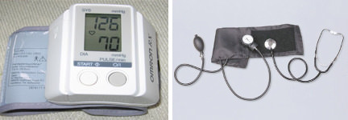

##### **Blood Pressure Ranges**

In the U.S., the healthy ranges for arterial pressure are the following:

* Systolic: less than 120 mm Hg.
* Diastolic: less than 80 mm Hg.

Blood pressure is usually written as systolic/diastolic mm Hg; for example, a reading of 120/80 mm Hg is said as "one hundred and twenty over eighty." These measures of arterial pressure are not static, but go through natural variations from one heartbeat to another and throughout the day (in a circadian rhythm). Factors such as age, gender, and race influence blood pressure values. Pressure also varies with [exercise](https://flexbooks.ck12.org/cbook/ck-12-middle-school-life-science-2.0/section/11.11/primary/lesson/muscles-and-exercise-ms-ls?referrer=crossref "exercise"), emotional reactions, sleep, stress, nutritional factors, drugs, and disease.

Studies have shown that people whose systolic pressure is around 115 mm Hg rather than 120 mm Hg have fewer health problems. Clinical trials have shown that people who have arterial pressures at the low end of these ranges have much better long term [cardiovascular health](https://flexbooks.ck12.org/cbook/ck-12-middle-school-life-science-2.0/section/11.30/primary/lesson/cardiovascular-system-health-ms-ls?referrer=crossref "cardiovascular health"). For this reason, some researchers say that 115/75 mm Hg should be the ideal measurement.

**Hypertension** is a condition in which a person’s blood pressure is chronically high. Hypertension is said to be present when a person's systolic blood pressure is always 140 mm Hg or higher and/or their diastolic blood pressure is always 90 mm Hg or higher. Blood pressure readings between 120/80 mm Hg and 139/89 mm Hg are called prehypertension. Prehypertension is not a disease category; rather, it is a way to identify people who are at high risk of developing hypertension.

##### **Arterioles and Blood Pressure**

Arterioles have the greatest collective influence on both local blood flow and overall blood pressure. They are the primary "adjustable nozzles" in the blood system, across which the greatest pressure drop occurs. Heart output (cardiac output) and systemic vascular resistance, which refers to the collective resistance of all of the body's arterioles, are the principal determinants of arterial blood pressure at any given moment.

!?[0](https://www.youtube.com/watch?v=v43ej5lCeBo)

### Summary

* Arteries are blood vessels that carry blood away from the heart, while veins are blood vessels that return blood to the heart.
* Blood vessels all have a similar basic structure: the endothelium forms the innermost layer, then a layer of smooth muscle, and finally a layer of connective tissue that surrounds the smooth muscle.
* The walls of capillaries are made of only a single layer of endothelial cells, so molecules such as oxygen, water, and lipids can pass through them by diffusion and enter the body tissues.
* In all arteries apart from the pulmonary artery, hemoglobin is highly saturated (95-100%) with oxygen. In all veins apart from the pulmonary vein, the hemoglobin is desaturated at about 70%. (The values are reversed in the pulmonary circulation.)
* Hypertension is said to be present when a person's systolic blood pressure is always 140 mm Hg or higher and/or their diastolic blood pressure is always 90 mm Hg or higher.

### Review

1.  What small blood vessels allows deoxygenated blood to return from the capillaries to the veins?
2.  What kind of specialized tissue make up the endothelium?
3.  How do veins ensure that blood does not flow backwards?
4.  How thin are capillaries?
5.  Give an example of a hormone that causes blood vessels to narrow.

</article>

## 3.3 Pulmonary and Systemic Circulations

<article>

**How does oxygen get into the blood?**

The main function of the circulatory system is to pump blood carrying oxygen around the body. But how does that oxygen get into the blood in the first place? You may already know that this occurs in the lungs. So the blood must also be pumped to the lungs, and this happens separately from the circulation to the rest of the body.

### Pulmonary and Systemic Circulations

The double circulatory system of blood flow refers to the separate systems of pulmonary circulation and systemic circulation in amphibians, birds, and mammals (including humans). The adult human heart consists of two separated pumps: the right side, which pumps deoxygenated blood into the pulmonary circulation, and the left side, which pumps oxygenated blood into the systemic circulation. Blood in one circuit has to go through the heart to enter the other circuit, as shown in**Figure** [below](#x-ck12-QmlvMzcxLTEz).

#### Pulmonary Circulation

The **pulmonary circulation** is the portion of the [cardiovascular system](https://flexbooks.ck12.org/cbook/ck-12-middle-school-life-science-2.0/section/11.21/primary/lesson/cardiovascular-system-ms-ls?referrer=crossref "cardiovascular system") that carries oxygen-poor (deoxygenated) blood from the heart to the lungs and returns oxygenated blood back to the heart. As shown in**Figure** [below](#x-ck12-QmlvLTIzLTA1LVB1bG1vbmFyeS1DaXJjdWl0), deoxygenated blood from the body leaves the right ventricle through the pulmonary arteries, which carry the blood to each lung. The pulmonary arteries are the only arteries that carry deoxygenated blood. In the lungs, red blood cells release carbon dioxide and pick up oxygen during respiration. The oxygenated blood then leaves the lungs through the pulmonary veins, which return it to the left side of the heart and complete the pulmonary cycle. The oxygenated blood is then distributed to the body through the systemic circulation before returning again to the pulmonary circulation.

The pulmonary circulation was first discovered by a Syrian physician, Ibn al-Nafis, in 1242. However, credit for the first description of blood circulation is given to an English medical doctor, William Harvey, who described in detail the pulmonary and systemic circulation systems in 1616.

#### Systemic Circulation

The **systemic circulation** is the portion of the cardiovascular system that carries oxygenated blood from the heart to the body and returns deoxygenated blood back to the heart. Oxygenated blood from the lungs leaves the left ventricle through the aorta. From here it is distributed to the body's organs and tissues, which absorb the oxygen through a complex network of arteries, arterioles, and capillaries. The deoxygenated blood is then collected by venules and flows into veins before reaching the inferior and superior venae cavae, which return it to the right heart, completing the systemic cycle (see**Figure** [below](#x-ck12-QmlvLTIzLTA2LXN5c3RlbWljLWNpcmN1bGF0aW9u)). The blood is then re-oxygenated through the pulmonary circulation before returning again to the systemic circulation.

Just like every other organ in the body, the heart needs its own blood supply, which it gets through the **coronary circulation.** Although blood fills the chambers of the heart, the heart muscle tissue is so thick that it needs blood vessels to deliver oxygen and nutrients deep within it. The vessels that deliver oxygen-rich blood to the heart muscle are called coronary arteries; they branch directly from the aorta, just above the heart, as shown in**Figure** [below](#x-ck12-QmlvMzcxLTE2). The vessels that remove the deoxygenated blood from the heart muscle are known as cardiac veins.

 of the heart shows how the coronary arteries (in red) branch directly from the aorta to bring oxygen and nutrients into the heart muscle.")

#### Portal Venous System

A **portal venous system** occurs when a capillary bed drains into another capillary bed through veins. They are relatively uncommon, as the majority of capillary beds drain into the heart, not into another capillary bed. Portal venous systems are considered venous because the blood vessels that join the two capillary beds are either veins or venules.

An example of a portal venous system is the blood vessel network between the digestive tract and the liver. The hepatic portal system is responsible for directing blood from parts of the gastrointestinal tract to the liver. Nutrients that have been absorbed into the blood from the small intestine are taken to the liver for processing before being sent to the heart. The term "portal venous system" often refers to the hepatic portal system.

 

### Summary

* The pulmonary circulation is the portion that brings blood to the lungs and back.
* The systemic circulation is the portion that brings oxygenated blood to the rest of the body.
* The heart gets its own supply of blood through the coronary circulation. Coronary arteries deliver oxygenated blood from the aorta to the heart. Cardiac veins remove deoxygenated blood from the heart.
* Portal venous systems involve a system where capillary beds are connected to other capillary beds through veins.

### Review

1.  What does the double circulatory system refer to?
2.  What is the difference between pulmonary circulation and systemic circulation?
3.  Why does the heart need its own blood supply if it is filled with blood?
4.  Give an example of a portal venous system in the human body.

</article>

## 3.4 The Lymphatic System

<article>

Lymph nodes often swell in one location when a problem, such as an injury, infection, or tumor, develops in or near the lymph node. Common sites for swollen lymph nodes include the neck, groin, and underarms.

### Lymphatic System

If pathogens manage to get through the body’s first two lines of defense, a third line of defense takes over. This third line of defense is often referred to as the immune response. This defense is specific to a particular pathogen, and it allows the immune system to “remember” the pathogen after the infection is over. If the pathogen tries to invade the body again, the immune system can launch a much faster, stronger attack. This lets the immune system destroy the pathogen before it can cause harm. The immune response mainly involves the **lymphatic system.**

The lymphatic system is a major component of the immune system. Because of its important role in the immune system, the terms "immune system" and "lymphatic system" are sometimes used interchangeably. However, nonspecific defenses of the body include organs such as the skin, which is not part of the lymphatic system. In addition, the lymphatic system has another function not directly related to defense.

#### Functions of the Lymphatic System

The lymphatic system has three basic functions. The first function is related to digestion. The other functions are involved in the immune response.

1.  The lymphatic system absorbs fatty acids after the digestion of lipids in the small intestine. It then transports the fatty acids to the bloodstream, where they circulate throughout the body.
2.  The lymphatic system removes excess fluid from body tissues and returns the fluid to the blood. The fluid is filtered as it passes through the lymphatic system, and any pathogens it contains are destroyed before the fluid enters the bloodstream.
3.  The lymphatic system produces lymphocytes. **Lymphocytes** are the type of white blood cells, or leukocytes, primarily involved in the immune response. They recognize and help destroy specific foreign invaders in body fluids and cells.

#### Parts of the Lymphatic System

The lymphatic system, which is shown in**Figure** [below](#x-ck12-QmlvLTI0LTA1LUx5bXBoYXRpYy1TeXN0ZW0.), consists of lymphatic organs, **lymphatic vessels,** **lymph,** and **lymph nodes.** Organs of the lymphatic system include the red bone marrow, thymus, spleen, and tonsils.

* **Red bone marrow** is found inside many bones including the hip, breast, and skull bones. It produces leukocytes.
* The **thymus** is a gland located in the upper chest behind the breast bone. It stores and matures lymphocytes.
* The **spleen** is a gland in the upper abdomen. It filters blood and destroys worn-out red blood cells. Lymphocytes in the spleen destroy any pathogens filtered out of the blood.
* **Tonsils** are glands on either side of the pharynx in the throat. They trap pathogens, which are then destroyed by lymphocytes in the tonsils.

Lymphatic vessels make up a body-wide circulatory system, similar to the arteries and veins of the [cardiovascular system](https://flexbooks.ck12.org/cbook/ck-12-middle-school-life-science-2.0/section/11.21/primary/lesson/cardiovascular-system-ms-ls?referrer=crossref "cardiovascular system"). However, lymphatic vessels circulate lymph instead of blood. Lymph is fluid that leaks out of tiny blood vessels, called capillaries, into spaces between cells in tissues. At sites of inflammation, there is usually more lymph around cells, and it is likely to contain many pathogens.

Unlike the cardiovascular system, the lymphatic system does not have a pump to force lymph through its vessels. Lymph circulates due to peristalsis of lymphatic vessels and rhythmic contractions of the skeletal muscles that surround the vessels. Valves in the lymphatic vessels prevent lymph from flowing backwards through the system.

As lymph accumulates between cells, it diffuses into tiny lymphatic vessels. The lymph then moves through the lymphatic system, from smaller to larger vessels, until it reaches the main lymphatic ducts in the chest. Here, the lymph drains into the bloodstream.

Before lymph reaches the bloodstream, pathogens are filtered out of it at lymph nodes. Lymph nodes are small oval structures located along the lymphatic vessels that act like filters. Any pathogens filtered out of the lymph at lymph nodes are destroyed by lymphocytes in the nodes.

#### Lymphocytes

Lymphocytes are the key cells involved in the immune response. There are an estimated two trillion lymphocytes in the [human body](https://flexbooks.ck12.org/cbook/ck-12-middle-school-life-science-2.0/section/11.1/primary/lesson/organization-of-the-human-body-ms-ls?referrer=crossref "human body"), and they make up about 25 percent of all leukocytes. Usually, fewer than half of the body’s lymphocytes are found in the blood. The rest are found in the lymphatic system, where they are most likely to encounter pathogens.

The immune response depends on two types of lymphocytes: **B lymphocytes** (or B cells) and **T lymphocytes** (or T cells). Both types of lymphocytes are produced in the red bone marrow. The two types are named for the sites where they mature. B cells mature in the red bone marrow, and T cells mature in the thymus. Both B and T cells can recognize and respond to specific pathogens. B or T cells that respond to the body’s own molecules as though they were foreign, or “non-self,” receive a signal that causes them to die. Only those B and T cells that have shown they are unlikely to react to “self” molecules are released into circulation.

!?[0](https://www.youtube.com/watch?v=EEP0PYEWcwU)

### Summary

* The lymphatic system is responsible for the removal of excess fluid from tissues, the absorption of fats, and the production of certain white blood cells.
* Lymph originates as blood plasma that leaks from the capillaries and becomes part of the interstitial fluid.
* The lymphatic system has many lymph nodes that filter or trap foreign particles.
* The movement of lymph depends on the movement of skeletal muscles to squeeze the lymph through them. Valves in lymph vessels make sure that lymph only moves in one direction.
* The immune response depends on two types of lymphocytes: B lymphocytes (or B cells) and T lymphocytes (or T cells).

### Review

1.  What are the three functions of the lymphatic system?
2.  What is the thymus, and what is its role in the lymphatic system?
3.  How does lymphatic circulation work?
4.  Where do B cells and T cells mature?

</article>

## 3.5 Circulatory System Diseases and Disorders

<article>

. Why?**")

Normally, blood needs to flow freely through our arteries. Plaque in an artery can restrict the flow of blood. As you can probably imagine, this is not an ideal situation. And eating right, exercising, and not smoking can help keep your arteries healthy.

### Homeostatic Imbalances of the Cardiovascular System

**Cardiovascular disease (CVD)** refers to any disease that affects the [cardiovascular system](https://flexbooks.ck12.org/cbook/ck-12-middle-school-life-science-2.0/section/11.21/primary/lesson/cardiovascular-system-ms-ls?referrer=crossref "cardiovascular system"), but it is usually used to refer to diseases related to **atherosclerosis,** which is a chronic inflammatory response in the walls of arteries that causes a swelling and buildup of materials called **plaque.** Plaque is made of cell debris, cholesterol, fatty acids, calcium, and fibrous connective tissue that build up around an area of inflammation. As a plaque grows, it stiffens and narrows the artery, which reduces the flow of blood through the artery, as shown in **Figure** [below](#x-ck12-QmlvMzcxLTIw).

#### Atherosclerosis

Atherosclerosis normally begins in later childhood and is usually found in most major arteries. It does not usually have any early symptoms. Causes of atherosclerosis include a high-fat diet, high cholesterol, smoking, obesity, and diabetes. Atherosclerosis becomes a threat to health when the plaque buildup interferes with the blood circulation in the heart (coronary circulation) or the brain (cerebral circulation). A blockage in the coronary circulation can lead to a heart attack, and blockage of the cerebral circulation (leading to or within the brain) can lead to a stroke. According to the American Heart Association, atherosclerosis is a leading cause of CVD.

, which is completely blocked by many plaques.")

#### Coronary Heart Disease

Cardiac muscle cells are fed by the coronary arteries. Blocked flow in a coronary artery can result in oxygen starvation and death of heart muscle tissue. **Coronary heart disease** is the end result of the buildup of plaques within the walls of the coronary arteries (see**Figure** [above](#x-ck12-QmlvMzcxLTIx)). Most individuals with coronary heart disease have no symptoms for many years until the first sign, often a heart attack, happens.

A symptom of coronary heart disease is chest pain. Occasional chest pain, called angina pectoralis (or angina), can happen during times of stress or physical exertion. The pain of angina means the heart muscle fibers need more oxygen than they are getting.

A **heart attack,** also called a **myocardial infarction (MI),** occurs when the blood supply to a part of the heart is blocked, as shown in**Figure** [below](#x-ck12-QmlvMzctMDEtMjI.). A heart attack can occur from the buildup and blockage of a coronary artery by plaque, or it can be caused by a small piece of plaque that breaks away when a larger plaque breaks apart. This piece of free-floating plaque, called an embolus, can get stuck in a coronary blood vessel, causing a blockage or **embolism.** Cardiac muscle fibers that are starved of oxygen for more than five minutes will die, and, because they do not divide, dead cardiac muscle cells cannot be replaced. Coronary heart disease is the leading causes of death among adults in the United States.

. The blood supply to the lower part of the heart is stopped after a blockage of the lower portion of the left coronary artery (LCA).")

#### Stroke

Since atherosclerosis is a body wide process, similar events can also occur in the arteries of other parts of the body including the brain. A **stroke** is a loss of brain function due to a stoppage of the blood supply to the brain. It can be caused by a blood clot (thrombosis), a free-floating object that gets caught in a blood vessel (embolism), or bleeding (hemorrhage).

Risk factors for stroke include advanced age, high blood pressure, previous stroke, diabetes, high cholesterol, and cigarette smoking. Reduction of blood pressure is the most important modifiable risk factor of stroke; however, many other risk factors, such as quitting tobacco smoking, are also important.

!?[0](https://www.youtube.com/watch?v=ryIGnzodxDs)

#### Preventing Cardiovascular Diseases

There are many risk factors that are associated with various forms of cardiovascular disease; some of these you cannot control, but many you can control.

**Non-controllable risk factors include the following:**

* Age: The older a person is, the greater their chance of developing a cardiovascular disease.
* Gender: Men under the age of 64 are much more likely to die of coronary heart disease than women are, although the gender difference declines with age.
* Genetics: Family history of cardiovascular disease affects a person’s chance of developing heart disease.

**Controllable risk factors include the following:**

* Tobacco smoking: Giving up smoking is the single most effective way of reducing risk of heart disease.
* Diabetes: Having diabetes can cause metabolic changes (such as high cholesterol levels), which in themselves are risk factors.
* High cholesterol levels: High amounts of low density lipids (LDLs) in the blood, also called "bad cholesterol," are a significant risk factor.
* Obesity: Being obese, especially if the fat is deposited mostly in the torso rather than the hips and thighs, increases risk significantly.
* High blood pressure: Hypertension can cause atherosclerosis.
* Lack of physical activity: Aerobic activities, including walking and vacuuming, that are done for 60 minutes a day, five days a week, help keep the heart stay healthy.
* Poor eating habits: Eating mostly foods that are nutrient poor (do not have many nutrients other than fat or carbohydrate) leads to high cholesterol levels and weight gain, among other things.

Although there are uncontrollable risk factors involved in CVD, a person whose family has a history of CVD is not destined to develop heart disease. There are many things such a person can do to help prevent CVD, even when predisposed to a disease. A person who is physically active every day, eats healthfully, and avoids tobacco can lower their chances of developing the disease.

Although men have a higher rate of cardiovascular disease than women, it is also the number one health problem for women in industrialized countries. After menopause, the risk for women is almost equal to that of men.

#### Cardiovascular Disease Awareness

Cardiovascular diseases are called "lifestyle diseases" because they are caused mostly by everyday choices that people make such as what to eat for dinner or what to do during their free time. For example, watching TV with your dog does not involve much moving around, so it does not exercise the body, whereas bringing the dog for a walk outside exercises both of you (**Figure** [below](#x-ck12-QmlvMzctMDEtMjM.)). Decisions that you make today and everyday will affect your [cardiovascular health](https://flexbooks.ck12.org/cbook/ck-12-middle-school-life-science-2.0/section/11.30/primary/lesson/cardiovascular-system-health-ms-ls?referrer=crossref "cardiovascular health") many years from now.

Many studies have shown that plaque buildup starts in early adolescence. However, teens are more concerned about risks such as [HIV](https://flexbooks.ck12.org/cbook/ck-12-biology-flexbook-2.0/section/7.15/primary/lesson/hiv-bio?referrer=crossref "HIV"), accidents, and cancer than cardiovascular disease. One in three people will die from complications due to atherosclerosis. For this reason, there is an emphasis on the prevention of CVD through risk reduction. For example, healthy eating, regular physical activity, and avoidance of smoking can greatly decrease a person’s chance of developing a CVD.

#### Congenital Heart Defects

A **congenital heart defect** is a problem with the structure of the heart that is present at birth. Most heart defects either obstruct blood flow in the heart or vessels near it or cause blood to flow through the heart in an abnormal pattern, although other defects affecting heart rhythm can also occur. Congenital heart defects are the most common type of birth defect. They affect 8 out of every 1,000 newborns. Each year, more than 35,000 babies in the United States are born with congenital heart defects.

Treatment for a defect can include medicines, surgery, and other medical procedures and heart transplants. The treatment depends on the type and severity of the defect as well as the child's age, size, and general health. Also, certain mild defects that some children are born with are repaired over time by the body.

### Summary

* Atherosclerosis is a chronic inflammatory response that causes swelling and buildup of plaque. As plaque grows, it stiffens and narrows the artery, which reduces the flow of blood through the artery.
* Atherosclerosis can lead to heart attacks or strokes.
* Controllable factors for cardiovascular disease include smoking, diabetes, high cholesterol levels, obesity, high blood pressure, lack of physical activity, and poor eating habits.
* Most congenital heart defects either obstruct blood flow in the heart or vessels near it or cause blood to flow through the heart in an abnormal pattern, although other defects affecting heart rhythm can also occur.

### Review

1.  What is an embolus?
2.  What are three non-controllable risk factors for cardiovascular diseases?
3.  When does plaque build-up start?
4.  How long does it take for cardiac muscle fibers to die when starved of oxygen?

</article>

## 3.6 Composition of Blood

<article>

All your cells need oxygen, as oxygen is the final electron acceptor during cellular respiration. How do they get this oxygen? From blood. Blood cells flow through the vessels of the human circulatory system. But what exactly is blood? It does transport oxygen, but it also has other functions.

### The Composition of Blood

Blood is a fluid connective tissue. It circulates around the body through the blood vessels due to the pumping action of the heart. Arterial blood carries oxygen and nutrients to all the body’s cells, and venous blood carries carbon dioxide and other metabolic wastes away from the cells.

In addition to the transport of gases, nutrients, and wastes, blood has many other functions:

* The removal of waste, such as carbon dioxide, urea, and lactic acid, from the body tissues.
* Defending the body against infections by microorganisms or parasites.
* The repair of damaged body tissues.
* The transport of chemical messages such as hormones and hormone-like substances.
* The control of body pH (the normal pH of blood is in the range of 7.35 - 7.45).
* The control of body temperature.

**Blood** is a colloid, a mixture of tiny particles dispersed evenly in a fluid and it accounts for about 7% of the [human body](https://flexbooks.ck12.org/cbook/ck-12-middle-school-life-science-2.0/section/11.1/primary/lesson/organization-of-the-human-body-ms-ls?referrer=crossref "human body") weight. The average adult has a blood volume of roughly 5 liters, which is composed of a fluid called plasma and several kinds of cells. Within the blood plasma are erythrocytes (red blood cells), leukocytes (white blood cells), thrombocytes (platelets), and other substances. The cells that make up the blood can be seen in**Figure** [below](#x-ck12-QmlvMzcyLTAx).

 image of normal circulating human blood. One can see red blood cells, several white blood cells, including knobby lymphocytes, a monocyte, a neutrophil, and many small disc-shaped platelets.")

#### Plasma

**Plasma** is the golden-yellow liquid part of the blood. Plasma is 90% [water](https://www.ck12.org/c/biology/water?referrer=crossref "water") and 10% dissolved materials including proteins, glucose, ions, hormones, and gases. It acts as a buffer, maintaining pH near 7.4. Plasma is about 54% the volume of blood; cells and fragments make up about 46% of the volume.

#### Red Blood Cells

**Red blood cells,** also known as **erythrocytes,** are flattened, doubly concave cells that carry oxygen. There are about 4 to 6 million cells per cubic millimeter of blood. Red blood cells make up about 45% of blood volume, as shown in**Figure** [below](#x-ck12-QmlvMzcyLTAy). Each red blood cell has 200 million hemoglobin molecules. Humans have a total of 25 trillion red blood cells (about 1/3 of all the cells in the body). Red blood cells are continuously made in the red marrow of long bones, ribs, the skull, and vertebrae. Each red blood cell lives for only 120 days, after which they are destroyed in the liver and spleen.

Mature red blood cells do not have nuclei or other organelles. They contain the protein hemoglobin, which gives blood its red color. The iron-containing heme portion of hemoglobin enables the protein to carry oxygen to cells. Heme binds to molecules of oxygen, which increases the ability of the blood to carry the gas.

Iron from hemoglobin is recovered and reused by red marrow. The liver degrades the heme units and secretes them as pigment in the bile, which is responsible for the color of feces. Each second, two million red blood cells are produced to replace those taken out of circulation.

#### White Blood Cells

**White blood cells,** also known as **leukocytes,** are generally larger than red blood cells, as shown in**Figure** [below](#x-ck12-QmlvMzcyLTAz). They have a nucleus but do not have hemoglobin. White blood cells make up less than one percent of the blood's volume. They are made from stem cells in bone marrow. They function in the cellular immune response system. There are five types of white blood cells. Neutrophils enter the tissue fluid by squeezing through capillary walls and phagocytize (swallow) foreign bodies. Macrophages also swallow and destroy cell debris and bacteria or viruses. In**Figure** [below](#x-ck12-QmlvMzcyLTA0), a white blood cell is shown phagocytizing two bacteria. Macrophages also release substances that cause the numbers of white blood cells to increase. Antigen-antibody complexes are swallowed by macrophages. Lymphocytes fight infection. T-cells attack cells containing viruses. B-cells produce antibodies. To learn more about the role of white blood cells in fighting infection, refer to the _Immune System_ concepts.

#### Platelets

**Platelets,** also known as **thrombocytes,** are important in blood clotting. Platelets are cell fragments that bud off bone marrow cells called megakaryocytes. A platelet is shown in**Figure** [below](#x-ck12-QmlvMzcyLTA1). They make up less than one percent of blood volume. Platelets carry chemicals essential to blood clotting. They change fibrinogen into fibrin, a protein that creates a mesh onto which red blood cells collect, forming a clot. This clot stops more blood from leaving the body and also helps prevent bacteria from entering the body. Platelets survive for 10 days before being removed by the liver and spleen. There are 150,000 to 300,000 platelets in each milliliter of blood. Platelets stick to tears in blood vessels, and they release clotting factors.

#### Other Blood Components

Blood plasma also contains substances other than water. Some important components of blood include the following:

* Serum albumin: a plasma protein that acts as a transporter of hormones and other molecules.
* Antibodies: proteins that are used by the immune system to identify and destroy foreign objects such as bacteria and viruses.
* Hormones: chemical messengers that are produced by one cell and carried to another.
* Electrolytes such as sodium (Na_+_) and chloride (Cl_\-_) ions.

#### Production and Breakdown of Blood Cells

Blood cells are produced in the red and yellow bone marrow in a process called **hematopoiesis.** The currently accepted theory of hematopoiesis is called the monophyletic theory. It simply postulates that a single type of stem cell gives rise to all the mature blood cells in the body. This stem cell is an example of a pluripotent stem cell.

Blood cells are broken down by the spleen and certain cells in the liver. The liver also clears some proteins, lipids, and amino acids from the blood. The kidney actively secretes waste products of the blood into the urine.

### Summary

* Functions of blood include transport of nutrients, removal of waste, defense of the body, repair of damaged tissue, transport of chemical messages, control of pH, and control of temperature.
* Blood is composed of 54% plasma and 46% cells/fragments. Red blood cells make up about 45% of the volume.
* White blood cells are made from stem cells in bone marrow and function in the cellular immune response system.
* Platelets are cell fragments that bud off bone marrow cells called megakaryocytes; platelets carry chemicals essential to blood clotting.

### Review

1.  What type of solution is blood an example of?
2.  How many liters of blood does an average adult have?
3.  Where are red blood cells made?
4.  What distinguishes mature red blood cells?
5.  How do platelets begin the blood clotting process?

</article>

## 3.7 Functions of Blood

<article>

Obviously, to transport oxygen to each cell in your body. Each cell needs that oxygen to survive. But blood does much more than just transport oxygen.

### Functions of Blood

#### Transport of Oxygen

The hemoglobin molecule is the major transporter of oxygen in mammals including humans and many other species. About 98.5 percent of the oxygen in a sample of arterial blood in a healthy human is bonded with hemoglobin. Only 1.5 percent of the oxygen in blood is not carried by hemoglobin; instead, it is dissolved in the plasma.

Under normal conditions in humans at rest, the hemoglobin in the red blood cells that are leaving the lungs are about 98 to 99 percent saturated with oxygen, and the blood is referred to as oxygenated. In a healthy adult at rest, deoxygenated blood returning to the lungs is still 75 percent saturated with oxygen. Oxygen saturation of arterial blood at or below 95 percent is considered dangerous to an individual at rest (for instance, during surgery under anesthesia).

Substances other than oxygen can bind to the hemoglobin; in some cases, this can cause irreversible damage to the body. The gas carbon monoxide, for example, is very dangerous when absorbed into the blood. It bonds irreversibly with hemoglobin, which reduces the volume of oxygen that can be carried in the blood. Carbon monoxide poisoning can very quickly cause suffocation and death. Carbon monoxide is released during combustion (fire). It is released by cigarettes, barbeque grills, combustion of petrol products in cars and trucks, or anything else that can be burned.

Hemoglobin is allosterically inhibited by CO2 and H_+_. This means that if carbon dioxide or protons attach to hemaglobin, it affects the ability of the molecule to remain attached to O2. That is how hemaglobin deposits oxygen throughout the body.

#### Transport of Carbon Dioxide

When systemic arterial blood flows through capillaries, carbon dioxide diffuses from the tissues into the blood. Since carbon dioxide is 20 times more soluble than oxygen, around 5% of carbon dioxide is dissolved in the blood. The majority of carbon dioxide (85%) is converted to bicarbonate and hydrogen ions, which are then carried in the blood to the lungs where they are converted back to carbon dioxide and released by the lungs. The remaining carbon dioxide (roughly 10%) becomes bound to proteins, especially hemoglobin, and is transported in that manner.

#### Thermoregulation

In order to function properly, the [human body](https://flexbooks.ck12.org/cbook/ck-12-middle-school-life-science-2.0/section/11.1/primary/lesson/organization-of-the-human-body-ms-ls?referrer=crossref "human body") needs to maintain a constant temperature around 98.6°F (37°C). When the human body is above normal body temperature, it suffers from hyperthermia, and, when it is below normal temperature, it suffers from hypothermia. Blood circulation transports heat through the body, and adjustments to this flow are important parts of **thermoregulation.** Thermoregulation is the process through which an organism maintains a stable internal body temperature. Increasing blood flow to the surface (e.g. during warm weather or strenuous exercise) causes warmer skin, resulting in greater heat loss. Decreasing surface blood flow conserves heat.

#### Blood Clotting

**Coagulation,** or **blood clotting,** is a complex process by which blood forms solid clots. Coagulation is important in order to stop bleeding and begin repair of damaged blood vessels. Blood clotting disorders can lead to an increased risk of bleeding or clotting inside a blood vessel. Platelets are important for the proper coagulation of blood.

Clotting is started almost immediately when an injury damages the endothelium of a blood vessel. Platelets clump together, forming a plug at the site of injury. Then, proteins in the plasma called **coagulation factors** (see the [Coagulation Factors](#x-ck12-dGFibGU6Q29hZ3VsYXRpb24gRmFjdG9ycw..) table) respond in a series of chemical reactions that form a tough protein called **fibrin.** The fibrin strands form a web across the platelet plug, trapping red blood cells before they can leave through the wound site. This mass of platelets, fibrin, and red blood cells forms a clot that hardens into a scab.

Certain nutrients are needed for the proper functioning of the clotting mechanism. Two of these are calcium and vitamin K. Luckily for you, bacteria that live in your intestines make enough vitamin K, so you do not need to have extra in your food.

| Factor Number | Descriptive Name | Active Form |
| --- | --- | --- |
| I   | Fibrinogen | Fibrin subunit |
| II  | Prothrombin | Serine protease |
| III | Tissue factor | Receptor/cofactor |
| V   | Labile factor | Cofactor |
| VII | Proconvertin | Serine protease |
| VIII | Antihaemophilic factor | Cofactor |
| IX  | Christmas factor | Serine protease |
| X   | Stuart–Prower factor | Serine protease |
| XI  | Plasma thromboplastin antecedent | Serine protease |
| XII | Hageman (contact) factor | Serine protease |
| XIII | Fibrin-stabilizing factor | Transglutaminase |

!?[0](https://www.youtube.com/watch?v=Ab9OZsDECZw)

### Summary

* About 98.5 percent of the oxygen in a sample of arterial blood in a healthy human is bonded with hemoglobin.
* Carbon dioxide is transported in the blood in three different ways: dissolved in the blood, as a bicarbonate ion, or bound to proteins such as hemaglobin.
* Coagulation is important in order to stop bleeding and begin repair of damaged blood vessels.

### Review

1.  What is considered a dangerously low oxygen saturation level for arterial blood?
2.  Why is carbon monoxide so dangerous?
3.  What kind of nutrients are essential for coagulation?
4.  How does hemoglobin release oxygen?

</article>

## 3.8 Blood Types

<article>

It sure does. These represent blood type, which is determined by markers on the outside of red blood cells. Just like any other cell, if your body detects a blood cell with something on its outside that it does not recognize, then your body will decide it does not belong.

### Blood Types

**Blood type** (also called a **blood group**) is determined by the presence or absence of certain molecules, called antigens, on the surface of red blood cells. An **antigen** is a molecule or substance that causes an immune response. Blood type antigens may be proteins or carbohydrates, depending on the blood group system. The antigens on a person’s own [body cells](https://www.ck12.org/c/biology/body-cells?referrer=crossref "body cells") are recognized by their immune system as “self” antigens, and their immune system does not attack them. However, if a person is exposed to a blood group antigen that is different from their own blood group, the person’s immune system will produce antibodies against the donor blood antigens. These antibodies can bind to antigens on the surfaces of transfused red blood cells (or other tissue cells), often leading to destruction of the cells by the immune system.

The erythrocyte surface antigens that have one allele, or a group of very closely linked genes, are collectively called a "blood group system." There are approximately 30 known blood group systems in humans, but the ABO blood group system and the Rhesus (Rh) blood group system are the most important for blood transfusions.

#### ABO Blood Group System

In 1875, a German physiologist, Leonard Landois, reported that the blood cells of a human and an animal would clump together when mixed. In the early 1900s, Austrian biologist and physician Karl Landsteiner pointed out that a similar clumping reaction occurred when the blood of one person was transfused with another. He determined that this might be the cause of shock, jaundice, and the release of hemoglobin that had followed some earlier attempts at person-to-person blood transfusions.

In 1909, Landsteiner classified blood into the A, B, AB, and O groups. He also showed that transfusions between two people of the same blood group did not result in the destruction of blood cells and that clumping occurred only when a person was transfused with the blood of a person belonging to a different blood group.

The "A" and "B" of the ABO blood group refer to two carbohydrate antigens found on the surfaces of red blood cells. There is not an O antigen. Type O red blood cells have neither type A nor type B antigens on their surfaces, as listed in**Table** [below](#x-ck12-dGFibGU6Ymxvb2RfYW50aWdlbl9hbnRpYm9keV90eXBlcw..). Antibodies are found in the blood plasma. The blood type of a person can be determined by using antibodies that bind to the A or B antigens of red blood cells.

|     |     |     |     |     |
| --- | --- | --- | --- | --- |Blood Types, Antigen Types, and Antibody Types
| Blood Type | Antigen Type | Serum (Plasma) Antibodies | Can Receive Blood from Types | Can Donate Blood to Types |
| --- | --- | --- | --- | --- |
| A   | A   | anti-B | A, O | A, AB |
| B   | B   | anti-A | B, O | B, AB |
| AB  | A and B | none | AB, A, B, O | AB  |
| O   | none | anti-A, anti-B | O   | AB, A, B, O |

**Agglutination** is the clumping of red blood cells that occurs when different blood types are mixed together, as shown in**Figure** [below](#x-ck12-QmlvMzcyLTA2). It involves a reaction between antigens on the surfaces of red blood cells and protein antibodies in the blood plasma. Mixing different blood types together can cause agglutination, a process that has been used as a way of determining a person’s blood type.

#### Rhesus Blood Group System

The **Rhesus system** is the second most significant blood group system for human blood transfusion. The most significant Rhesus antigen is called the **RhD antigen** (also called Rhesus factor). A person either has or does not have the RhD antigen on the surfaces of their red blood cells. This is usually indicated by adding either a "RhD positive" (does have the RhD antigen) or a "RhD negative" (does not have the antigen) suffix to the ABO blood group (see the blood agglutination test in**Figure** [below](#x-ck12-QmlvMzcyLTA3)).

The Rhesus system is named after the Rhesus monkey, in which the antigen was first discovered by Karl Landsteiner and Alexander S. Wiener in 1937. The importance of the Rh factor was realized soon after. Dr. Phillip Levine, a pathologist who worked at a New York hospital, made the connection between the Rh factor and the incidence of a blood disease in newborn babies. The disease, called hemolytic disease of the newborn, is a condition that develops while the fetus is in the womb. If a mother is RhD negative and the father is RhD positive, the fetus may inherit the dominant RhD positive trait from the father. The RhD negative mother can make antibodies against the RhD antigens of her developing baby. This can happen if some of the fetus' blood cells pass into the mother's blood circulation or if the mother has received an RhD positive blood transfusion.

The fetus’ red cells are broken down and the fetus can develop anemia. This disease ranges from mild to very severe, and fetal death from heart failure can occur. Most RhD diseases can be prevented by treating the mother during pregnancy or soon after childbirth. The mother is injected with anti-RhD antibodies, so that the baby’s red blood cells are destroyed before her body can produce antibodies against them. If a pregnant woman is known to have anti-RhD antibodies, the RhD blood type of the fetus can be tested by analysis of fetal DNA in maternal plasma to assess the risk to the fetus of RhD disease.

The presence or absence of the ABO group antigens and the RhD antigens is always determined for all recipient and donor blood.**Figure** [below](#x-ck12-QmlvMzcyLTA3) shows a routine way in which a person’s ABO blood group is determined.

, but not with anti-B. Therefore, the blood group is A positive. This method of blood grouping relies on seeing an agglutination reaction to determine a person’s blood group. The card has dried blood group antibody reagents fixed onto its surface. A drop of the person’s blood is placed on each area on the card. The presence or absence of visual agglutination allows a quick method of determining the ABO and Rhesus groups of the person.")

#### Blood Products

In order to provide maximum benefit from each blood donation and to extend shelf-life, blood banks separate some whole blood into several different products. Some of the most common of these products are packed red blood cells, plasma, platelets, and fresh frozen plasma. Units of packed red blood cells are made by removing as much of the plasma as possible from whole blood units. Clotting factors made by genetic engineering are now routinely used for the treatment of the clotting disorder hemophilia, so the risk of possible infection from donated blood products is avoided.

#### Universal Donors and Universal Recipients

Regarding the donation of packed red blood cells, individuals with type O negative blood are often called **universal donors,** and those with type AB positive blood are called **universal recipients.** Type O red blood cells do not have the A or B antigens and can be given to people with a different ABO blood group. The blood plasma of an AB person does not contain any anti-A or anti-B antibodies, so they can receive any ABO blood type. The possible reactions between anti-A and anti-B antibodies in the donor blood and the recipient’s red blood cells are usually not a problem because only a small volume of plasma that contains antibodies is given to the recipient. Refer to **Table** [above](#x-ck12-dGFibGU6Ymxvb2RfYW50aWdlbl9hbnRpYm9keV90eXBlcw..) for a complete listing of ABO antigens and antibodies that are involved in the ABO system.

In April 2007, researchers discovered a way to convert blood types A, B, and AB to O; the method uses enzymes that remove the antigens on the surfaces of the red blood cells.

#### Other Blood Group Systems

You probably have heard a lot about the ABO and Rhesus (RhD) blood group systems by now, but you have probably not heard much about the other systems. Many other antigens are found on the cell membranes of red blood cells. For example, an individual can be AB RhD positive while being M and N positive (MNS system), K positive (Kell system), Le_a_ or Le_b_ negative (Lewis system), Duffy positive or Duffy negative (Duffy system), and so on, being positive or negative for each blood group system antigen. Many of the blood group systems were named after the patients in whom the antibodies were first found.

Some blood group systems are associated with a disease. For example, the Kell antigen is associated with McLeod syndrome, a genetic disorder in which the red blood cells are spiky shaped. Certain other blood group systems may affect resistance to infections, an example being the resistance to specific malaria species seen in individuals who lack the Duffy antigen. The Duffy antigen is less common in ethnic groups from areas with a high incidence of malaria.

Rare blood types can cause supply problems for blood banks and hospitals. For example, Duffy-negative blood occurs much more frequently in people of African origin, and the rarity of this blood type in the rest of the population can result in a shortage of Duffy-negative blood. Similarly for RhD negative people, there is a risk associated with traveling to parts of the world where supplies of RhD negative blood are rare, particularly East Asia.

!?[0](https://www.youtube.com/watch?v=xfZhb6lmxjk)

### Summary

* Blood type (also called a blood group) is determined by the presence or absence of certain molecules, called antigens, on the surfaces of red blood cells.
* The antigens on a person’s own body cells are recognized by their immune system as “self” antigens, and their immune system does not attack them.
* The "A" and "B" of the ABO blood group refer to two carbohydrate antigens found on the surfaces of red blood cells. Type O red blood cells have neither type A or type B antigens on their surfaces.
* A person either has or does not have the RhD antigen on the surfaces of their red blood cells. This is usually indicated by adding either a "RhD positive" or a "RhD negative" suffix to the ABO blood group.
* Individuals with type O negative blood are often called universal donors, and those with type AB positive blood are called universal recipients.

### Review

1.  How are blood group systems determined?
2.  What blood group systems are most important for blood transfusions?
3.  Give an example of a blood group system that is associated with disease.
4.  What is a possible complication for universal recipients?
5.  What causes agglutination, and what is a possible use for it?

</article>

## 3.9 Blood Diseases and Disorders

<article>

It must clot, as depicted above. The ability to clot is essential for survival, and it occurs through a cascade of processes. But what happens if your blood cannot clot? Hemophilia is a serious disorder in which the clotting cascade is interrupted. So what happens?

### Homeostatic Imbalances of the Blood

Problems can occur with red blood cells, white blood cells, platelets, and other components of the blood. Many blood disorders are genetic or are a result of nutrient deficiency, while others are cancers of the blood.

**Sickle-cell disease** is a group of genetic disorders caused by abnormally shaped hemoglobin called sickle hemoglobin. In many forms of the disease, the red blood cells change shape because the abnormal hemoglobin proteins stick to each other, causing the cell to have a rigid surface and sickle shape, as shown in **Figure** [below](#x-ck12-QmlvMzcyLTA4). This process damages the membrane of the red blood cell and can cause the cells to get stuck in blood vessels. This clotting causes oxygen starvation in tissues, which may cause organ damage such as a stroke or a heart attack. The disease is chronic and lifelong. Individuals are most often well, but their lives are punctuated by periodic painful attacks. Sickle-cell disease occurs more commonly in people (or their descendants) from parts of the world, such as sub-Saharan Africa, where malaria is or was common. It also occurs in people of other ethnicities. As a result, those with sickle cell disease are resistant to malaria since the red blood cells are not favored by the malaria parasites. The mutated hemoglobin allele is recessive, meaning it must be inherited from each parent for the individual to have the disease.

**Iron deficiency anemia** is the most common type of anemia. It occurs when the dietary intake or absorption of iron is less than what is needed by the body. As a result, hemoglobin, which contains iron, cannot be made. In the United States, 20 percent of all women of childbearing age have iron deficiency anemia, compared with only 2 percent of adult men. The principal cause of iron deficiency anemia in premenopausal women is blood lost during menstruation.

**Leukemia** is a cancer that originates in the bone marrow and is characterized by an abnormal production of white blood cells (rarely red blood cells) that are released into the bloodstream. **Lymphoma** is a cancer of the lymphatic system, which helps to filter blood. Lymphoma can be categorized as either Hodgkin's lymphoma or non-Hodgkin's lymphoma.

**Hemophilia** is the name of a group of hereditary genetic diseases that affect the body's ability to control blood clotting. Hemophilia is characterized by a lack of clotting factors in the blood. Clotting factors are needed for a normal clotting process. When a blood vessel is injured, a temporary scab does form, but the missing coagulation factors prevent the formation of fibrin, which is needed to maintain the blood clot. Therefore, a person who has hemophilia is initially able to make a clot to stop the bleeding, but, because fibrin is not produced, the body is unable to maintain the clot for long. The risks of re-bleeding of an injury and internal bleeding are increased in hemophilia, especially into [muscles](https://flexbooks.ck12.org/cbook/ck-12-middle-school-life-science-2.0/section/11.9/primary/lesson/smooth-skeletal-and-cardiac-muscles-ms-ls?referrer=crossref "muscles"), [joints](https://flexbooks.ck12.org/cbook/ck-12-middle-school-life-science-2.0/section/11.8/primary/lesson/skeletal-system-joints-ms-ls?referrer=crossref "joints"), or closed spaces. Hemophilia A is the most common type of hemophilia. It is also known as factor VIII deficiency or classic hemophilia. 5-10% of patients with hemophilia A are affected because they make a dysfunctional version of the factor VIII protein, while the remainder are affected because they produce insufficient amounts of factor VIII. Hemophilia B is the second most common type of hemophilia. It is known as factor IX deficiency or Christmas disease.

**Haemochromatosis** is a hereditary disease that is characterized by a buildup of iron in the body. Iron accumulation can eventually cause organ damage, most importantly in the liver and pancreas (manifesting as liver failure and diabetes mellitus respectively). It is estimated that roughly one in every 300-400 people is affected by the disease. People of Northern European and especially people of Irish, Scottish, Welsh, and English descent are more susceptible.

### Summary

* In many forms of sickle-cell disease, the red blood cells change shape because the abnormal hemoglobin proteins stick to each other, causing the cell to have a rigid surface and sickle shape. This process damages the membrane of the red blood cell and can cause the cells to get stuck in blood vessels.
* Hemophilia is characterized by a lack of clotting factors in the blood that are needed for a normal clotting process.

### Review

1.  What is unique about where sickle-cell disease occurs most commonly?
2.  Why do people with hemophilia have trouble forming blood clots?
3.  Why does iron deficiency cause anemia?

</article>

## 4.1 The Respiratory System

<article>

Red blood cells are like trucks that transport cargo on a highway system. Their cargo is oxygen, and the highways are blood vessels. Where do red blood cells pick up their cargo of oxygen? The answer is the lungs. The lungs are organs of the respiratory system. The respiratory system is the body system that brings air containing oxygen into the body and releases carbon dioxide into the atmosphere.

### The Respiratory System

_Each day, you breathe about 20,000 times, and, by the time you're 70 years old, you'll have taken at least 600 million breaths._

Have you ever wondered what it would be like to have gills? You would breathe and look very different from the rest of us, but they would be great for swimming and diving! Despite such differences, the main functions of **lungs** and gills are the same: to obtain oxygen and to release carbon dioxide.

The primary functions of the human respiratory system are to obtain the oxygen for the cells of the body and to eliminate the carbon dioxide that cells produce. The respiratory system brings oxygen, O2, into the body and releases carbon dioxide, CO2, into the atmosphere. The respiratory system includes the respiratory airways leading into and out of the lungs and the lungs themselves. Oxygen is drawn in through the respiratory tract, which is shown in **Figure** [below](#x-ck12-QmlvMzctMDMtMDE.), and is then delivered to the blood. The exchange of gases (O2 and CO2) between the alveoli in the lungs and the blood occurs by simple diffusion. The process of bringing oxygen into the respiratory tract is called **external respiration,** and it is an active process, requiring the contraction of skeletal muscles. The exchange of gases between the blood and the cells of the body is called **internal respiration.**

 

??[failed](http://schema.org/VideoObject?hash=07c6ad8fff9b77cb4d9c612c34b1e855)

#### Comparing Cellular Respiration and Respiration

**Respiration** is both the transportation of oxygen from the outside air to the cells of the body and the transportation of carbon dioxide in the opposite direction. This is in contrast to the biochemical definition of respiration, which refers to cellular respiration. **Cellular respiration** is the metabolic process by which an organism obtains energy by reacting oxygen with glucose to give [water](https://www.ck12.org/c/biology/water?referrer=crossref "water"), carbon dioxide, and ATP (energy). Although respiration is necessary to sustain cellular respiration and thus life in animals, the processes are very different. Cellular respiration takes place in individual cells of the animal, while respiration involves the transport of metabolites between the organism and the external environment.

### Summary

* The human respiratory system brings oxygen, O2, into the body and releases carbon dioxide, CO2, into the atmosphere.

### Review

1.  What is the difference between external and internal respiration?
2.  What is the difference between respiration and cellular respiration?

</article>

## 4.2 Respiratory System Structures

<article>

**Are all noses alike?**

It all starts with the nose. OK, in humans maybe not the nose pictured above, but one similar to the nose below. Still, the passage of air is probably similar in cows and humans. Air comes in and then where does it go?

### Structures of the Respiratory System

The nose and **nasal cavity** filter, warm, and moisten the inhaled air. The nose hairs and mucus produced by the epithelial cells in the nose catch airborne particles and prevent them from reaching the **lungs.**

Behind the nasal cavity, air next passes through the **pharynx,** a long tube that is shared with the digestive system. Both food and air pass through the pharynx. A flap of connective tissue called the **epiglottis** closes over the trachea when food is swallowed, to prevent choking or inhaling food. In humans the pharynx is important in vocalization. Cilia lining the nose and other parts of the upper respiratory tract move back and forth in waves, pushing foreign matter that comes in with air either toward the nostrils to be expelled or toward the pharynx. The pharynx passes the foreign matter to the stomach to eventually be eliminated by the body.

The **larynx,** also called the voicebox, is found just below the point at which the pharynx splits into the trachea and the esophagus, shown in**Figure** [below](#x-ck12-QmlvLTIzLTA5LXJlc3BpcmF0b3J5LXN5c3RlbQ..). The voice is generated in the larynx. Air from the lungs is needed for the vocal folds to produce speech.

The **trachea,** or wind pipe, is a long tube that leads down to the chest where it divides into the right and left **bronchi** in the lungs. The bronchi branch out into smaller bronchioles, which are the first airway passages that do not contain cartilage. The bronchial tubes lead directly into the lungs where they divide into many smaller tubes that connect to tiny sacs called **alveoli,** which are the multi-lobed sacs in which most of the gas exchange occurs. The average adult's lungs contain about 600 million of these spongy, air-filled sacs that are surrounded by capillaries.

### Summary

* Oxygen is inhaled and first passes through the nasal cavity before entering the pharynx. The pharynx splits off into the larynx and the trachea. Oxygen then goes from the trachea into the bronchi, bronchioles, and eventually the alveoli within the lungs.

### Review

1.  What are the roles of nose hairs and mucus?
2.  What is the role of the epiglottis?
3.  What are the first airway passages that do not contain cartilage?

</article>

## 4.3 A Breath of Air

<article>

**Grapes. Why? What do these have in common with a breath of air?**

Shown below are the parts of the lungs where oxygen moves from the lungs into the blood. If the alveoli below were purple, they could resemble a bunch of grapes. Of course, as the alveoli are in the lungs, they must be very small to provide enough area for the exchange of gases. In fact, there are about 300-600 million alveoli in the adult lung.

### The Journey of a Breath of Air

In air-breathing vertebrates, such as humans, respiration of oxygen includes four stages:

1.  **Ventilation** from the atmosphere into the alveoli of the lungs.
2.  Pulmonary gas exchange from the alveoli into the pulmonary capillaries.
3.  Gas transport from the pulmonary capillaries through the circulation to the peripheral capillaries in the organs.
4.  Peripheral gas exchange from the tissue capillaries into the cells and mitochondria.

#### Ventilation: From the Air to the Alveoli

Air enters the body through the nose where it is warmed, filtered, and passed through the nasal cavity. Air passes the pharynx (which has the epiglottis that prevents food from entering the trachea). The upper part of the trachea contains the larynx. The vocal cords are two bands of tissue that extend across the opening of the larynx. After passing the larynx, the air moves into the trachea. The trachea is a long tube that divides into two smaller tubes called bronchi, which lead into each lung, as shown in**Figure** [below](#x-ck12-QmlvMzczLTAz). Bronchi are reinforced to prevent their collapse and are lined with ciliated epithelium and mucus-producing cells. Bronchi branch into smaller and smaller tubes called bronchioles. Bronchioles end in grape-like clusters called alveoli. Alveoli are surrounded by a network of thin-walled capillaries, as shown in**Figure** [below](#x-ck12-QmlvMzczLTAz).

Breathing in, or inhaling, is usually an active movement. A contraction of the diaphragm [muscles](https://flexbooks.ck12.org/cbook/ck-12-middle-school-life-science-2.0/section/11.9/primary/lesson/smooth-skeletal-and-cardiac-muscles-ms-ls?referrer=crossref "muscles") is necessary, and it uses ATP. The **diaphragm** is a muscle that is found below the lungs. Contraction of the diaphragm causes the volume of the chest cavity to increase, and the air pressure within the lungs decreases. The pressure difference causes air to rush into the lungs. Relaxation of the diaphragm causes the lungs to recoil, and air is pushed out of the lungs. Breathing out, or exhaling, is normally a passive process powered by the elastic recoil of the chest, similar to letting the air out of a balloon.

#### Pulmonary Gas Exchange: From the Alveoli into the Pulmonary Capillaries

Breathing is only part of the process of delivering oxygen to where it is needed in the body. The process of **gas exchange** occurs in the alveoli by diffusion of gases between the alveoli and the blood in the lung capillaries, as shown in**Figure** [below](#x-ck12-QmlvLTIzLTEwLUFsdmVvbGk.). Recall that diffusion is the movement of substances from an area of higher concentration to an area of lower concentration. The difference between the high concentration of O2 in the alveoli and the low O2 concentration of the blood in the capillaries is enough to cause O2 molecules to diffuse across the thin walls of the alveoli and capillaries and into the blood. CO2 moves out of the blood and into the alveoli in a similar way. The greater the concentration difference, the greater the rate of diffusion. Breathing also results in a loss of [water](https://www.ck12.org/c/biology/water?referrer=crossref "water") from the body. Exhaled air has a relative humidity of 100 percent because of the diffusion of water from the moist surfaces of the breathing passages and the alveoli into the warm exhaled air.

In the lungs, oxygen diffuses across the thin membranes of the alveoli and capillary walls and is attracted to the hemoglobin molecules within red blood cells.

After leaving the lungs, the oxygenated blood returns to the heart to be pumped through the aorta and around the body. The oxygenated blood travels through the aorta to the smaller arteries, arterioles, and finally the peripheral capillaries where gas exchange occurs.

#### Peripheral Gas Exchange: From Capillaries into Cells, and from Cells into Capillaries

The oxygen concentrations in [body cells](https://www.ck12.org/c/biology/body-cells?referrer=crossref "body cells") are low, while the blood that leaves the lungs is 97 percent saturated with oxygen. So, oxygen diffuses from the blood into the body cells when it reaches the peripheral capillaries (the capillaries in the systemic circulation).

Carbon dioxide concentrations in metabolically active cells are much greater than in capillaries, so carbon dioxide diffuses from the cells into the capillaries. Most of the carbon dioxide (about 70 percent) in the blood is in the form of bicarbonate (HCO3_\-_). A small amount of carbon dioxide dissolves in the water of the plasma to form carbonic acid (H2CO3). Carbonic acid and bicarbonate play an important role in regulating the pH of the body.

In order to remove CO2 from the body, the bicarbonate is picked up by red blood cells and is again turned into carbonic acid. A water molecule (H2O) is then taken away from the carbonic acid, and the remaining CO2 molecule is expelled from the red blood cells and into the alveoli where it is exhaled. The following equation shows this process:

HCO3_\-_ + H_+_ ⇌ H2CO3 ⇌ CO2 + H2O

Gas exchange between your body and the environment occurs in the alveoli. The alveoli are lined with pulmonary capillaries, the walls of which are thin enough to permit the diffusion of gases. Inhaled oxygen diffuses into the pulmonary capillaries where it binds to hemoglobin in the blood. Carbon dioxide diffuses in the opposite direction—from capillary blood to alveolar air. At this point, the pulmonary blood is oxygen-rich, and the lungs are primarily holding carbon dioxide. Exhalation follows, thereby ridding the body of the carbon dioxide and completing the cycle of respiration.

#### Gas Exchange and Homeostasis

The equilibrium between carbon dioxide and carbonic acid is very important for controlling the acidity of body fluids. As gas exchange occurs, the pH balance of the body is maintained as part of homeostasis. If proper respiration is interrupted, two things can occur:

1.  Respiratory acidosis, in which arterial blood contains too much carbon dioxide, causing a drop in blood pH.
2.  Respiratory alkalosis results from increased respiration (or hyperventilation), which causes a drop in the amount of carbon dioxide in the blood plasma. The drop in carbon dioxide concentration causes the blood pH to rise.

 

!?[0](https://www.youtube.com/watch?v=8NUxvJS-_0k)

### Summary

* Breathing in, or inhaling, is usually an active movement. Contraction of the diaphragm causes the volume of the chest cavity to increase, and the air pressure within the lungs decreases.
* Diffusion is the movement of substances from an area of higher concentration to an area of lower concentration.
* The process of gas exchange occurs in the alveoli by diffusion of gases between the alveoli and the blood in the lung capillaries.
* Carbon dioxide concentrations in metabolically active cells are much greater than in capillaries, so carbon dioxide diffuses from the cells into the capillaries.
* The equilibrium between carbon dioxide and carbonic acid is very important for controlling the acidity of body fluids. As gas exchange occurs, the pH balance of the body is maintained as part of homeostasis.

### Review

1.  What are the four stages of respiration?
2.  Why does breathing result in a loss of water?
3.  What is respiratory acidosis?
4.  What can cause respiratory alkalosis?

</article>

## 4.4 Control of Breathing

<article>

Deep breath in…now blow out those candles. We've all done that. Taking that deep breath in is an active process. You can usually feel your chest move. Why? Obviously, [muscles](https://flexbooks.ck12.org/cbook/ck-12-middle-school-life-science-2.0/section/11.9/primary/lesson/smooth-skeletal-and-cardiac-muscles-ms-ls?referrer=crossref "muscles") in your chest are doing the work.

### Control of Breathing by the Nervous System

[Breathing](https://flexbooks.ck12.org/cbook/ck-12-middle-school-life-science-2.0/section/11.35/primary/lesson/processes-of-breathing-ms-ls?referrer=crossref "Breathing") is one of the few bodily functions that, within limits, can be controlled both consciously and unconsciously. Conscious attention to breathing is common in activities such as yoga, swimming, and karate. In speech or vocal training, a person learns to discipline his or her breathing for purposes other than life support.

Muscular contractions and relaxations control the rate of expansion and constriction of the lungs. These muscles are controlled by the autonomic nervous system coming from the parts of the brainstem that control breathing: the medulla and the pons. This area of the brainstem forms the respiration regulatory center. When carbon dioxide levels increase in the blood (in the form of carbonic acid), such as during [exercise](https://flexbooks.ck12.org/cbook/ck-12-middle-school-life-science-2.0/section/11.11/primary/lesson/muscles-and-exercise-ms-ls?referrer=crossref "exercise"), the pH level of the blood drops. This causes the medulla to send nerve impulses to the diaphragm and the muscles between the ribs, causing them to contract and increase the rate of breathing. This automatic control of respiration can be impaired in premature babies or by drugs or disease.

Without breathing, the body’s oxygen levels drop dangerously low within minutes, leading to permanent brain damage followed by death. It is not possible for a healthy person to voluntarily stop breathing indefinitely. If we do not inhale, the level of carbon dioxide builds up in our blood and we experience great air hunger. Eventually, not breathing leads to a loss of consciousness at which time the autonomic nervous system takes control and initiates breathing.

#### Inhalation

Inhalation is started by the diaphragm and supported by the external **intercostal muscles** (the muscles that are between the ribs). It is an active process that needs ATP. When the diaphragm contracts, the ribcage expands and the contents of the abdomen are moved downward. This results in a larger thoracic (chest) volume, which in turn causes a decrease in air pressure inside the lungs. As the pressure in the chest falls, air from outside the body moves into the respiratory system. Normal resting respiration rates are 10 to 18 breaths per minute. During an average breath, an adult will exchange from 500 mL to 700 mL of air. The average breath capacity of a person is called **lung volume** or tidal volume.

#### Exhalation

Exhalation is generally a passive process; active, or forced, exhalation is carried out, however, by the abdominal and internal intercostal muscles. The lungs have a natural elasticity, and, as they recoil from the stretch of inhalation, air flows out of the lungs until the pressures in the chest and the atmosphere reach equilibrium. During forced exhalation, as when blowing out a candle, expiratory muscles, including the abdominal muscles and internal intercostal muscles, generate pressure in the chest and abdomen, which forces air out of the lungs.

!?[0](https://www.youtube.com/watch?v=hp-gCvW8PRY)

### Summary

* Muscular contractions and relaxations control the rate of expansion and constriction of the lungs. These muscles are controlled by the autonomic nervous system coming from the parts of the brainstem that control breathing: the medulla and the pons.
* Without breathing, the body’s oxygen levels drop dangerously low within minutes, leading to permanent brain damage followed by death.
* The lungs have a natural elasticity, and, as they recoil from the stretch of inhalation, air flows out of the lungs until the pressures in the chest and the atmosphere reach equilibrium.

### Review

1.  What automatically triggers an increase in the rate of breathing?
2.  What muscles are involved in inhalation?
3.  What muscles are involved in forced exhalation?

</article>

## 4.5 Respiratory System Diseases and Disorders

<article>

The importance of a nice pair of healthy lungs is obvious. We all need oxygen to get into our lungs, so the oxygen can be transferred to the blood, so it can be transported around our body, so each cell can receive its fair share of oxygen, allowing oxygen to serve as the final electron acceptor during the electron transport chain of cellular respiration, allowing the cell to produce lots of ATP. And it all starts with the lungs.

### Homeostatic Imbalances of the Respiratory System: Diseases and Disorders

**Respiratory disease** is the term for diseases of the lungs, bronchial tubes, trachea, and throat. These diseases range from mild, such as a cold, to being possibly life-threatening, such as bacterial pneumonia.

Respiratory diseases can be grouped as either obstructive (conditions that lower the rate of airflow into and out of the lungs, such as in asthma) or restrictive (conditions that cause a reduction in the functional volume of the lungs, such as in emphysema.)

#### Emphysema

**Emphysema** is a chronic lung disease caused by a loss of elasticity of the lung tissue. The destruction of elastic structures that support the alveoli and the capillaries that feed the alveoli cause them to become hard and stiff. Eventually, the walls of the alveoli break down, and the alveoli become larger. The amount of oxygen that can enter the blood with each breath is reduced because the large alveoli cannot function efficiently; much of the oxygen that gets into the large alveoli cannot be absorbed into the blood, so the oxygen is unused. Symptoms include shortness of breath on exertion (usually when climbing stairs or a hill and later at rest) and an expanded chest. Damage to the alveoli, which can be seen in **Figure** [below](#x-ck12-QmlvMzczLTA1), is irreversible. Smoking is a leading cause of emphysema.

#### Bronchitis

**Bronchitis** is an inflammation of the bronchi. Acute bronchitis is usually caused by viruses or bacteria and may last several days or weeks. Acute bronchitis is characterized by coughing and phlegm (mucus) production. Symptoms are related to both the inflammation of the airways and phlegm production, and they include shortness of breath and wheezing. Chronic bronchitis is not necessarily caused by infection and is generally part of a syndrome called chronic obstructive pulmonary disease (COPD). Chronic bronchitis is defined clinically as a persistent cough that produces phlegm and mucus for at least three months in two consecutive years.

, which clogs the airways. The airway constriction responds to medicines called bronchodilators, which relax the muscles. The feeling of breathlessness is somewhat like being able to breath only through a straw while walking.")

#### Asthma

**Asthma** is a chronic illness in which the airways narrow and become inflamed, as shown in**Figure** [above](#x-ck12-QmlvMzczLTA2YQ..). Excessive amounts of mucus are also made by the lungs. Asthma often happens in response to one or more triggers. It may be triggered by exposure to an allergen such as [mold](https://flexbooks.ck12.org/cbook/ck-12-middle-school-life-science-2.0/section/6.5/primary/lesson/fungus-like-protists-ms-ls?referrer=crossref "mold"), dust, or pet hair. It can also be caused by cold air, warm air, moist air, [exercise](https://flexbooks.ck12.org/cbook/ck-12-middle-school-life-science-2.0/section/11.11/primary/lesson/muscles-and-exercise-ms-ls?referrer=crossref "exercise"), or emotional stress. In children, the most common triggers are viral illnesses such as those that cause the common cold. This airway narrowing causes symptoms such as wheezing, shortness of breath, chest tightness, and coughing. Some people with asthma, especially children, can become very frightened by the symptoms, which may cause even more [breathing](https://flexbooks.ck12.org/cbook/ck-12-middle-school-life-science-2.0/section/11.35/primary/lesson/processes-of-breathing-ms-ls?referrer=crossref "breathing") distress. Between asthma attacks, most patients feel well, but can have mild symptoms and may remain short of breath after exercise for longer periods of time than a person who does not have asthma. The symptoms of asthma, which can range from mild to life threatening, can usually be controlled with a combination of medicines and environmental changes.

Public attention in the developed world has recently focused on asthma because of the increasing numbers of cases; asthma affects up to one in four children who live in cities.

!?[0](https://www.youtube.com/watch?v=S04dci7NTPk)

#### Pneumonia

**Pneumonia** is an illness in which the alveoli become inflamed and flooded with fluid. Effective gas exchange cannot happen across the alveoli membranes. Pneumonia can result from a variety of causes including infection with bacteria, viruses, fungi, or parasites, and chemical or physical injury to the lungs. Symptoms of pneumonia include coughing, chest pain, fever, and difficulty breathing. Treatment depends on the cause of pneumonia; bacterial pneumonia is treated with antibiotics.

Pneumonia is a common illness that occurs in all age groups, and it is a leading cause of death among the elderly and people who are chronically and terminally ill. Vaccines to prevent certain types of pneumonia are available.

#### Tuberculosis

**Tuberculosis (TB)** is a common and deadly infectious disease caused by a type of bacteria called _Mycobacterium tuberculosis._ TB most commonly attacks the lungs (as pulmonary TB), but can also affect the central nervous system, the lymphatic system, the circulatory system, the genitourinary system, bones, [joints](https://flexbooks.ck12.org/cbook/ck-12-middle-school-life-science-2.0/section/11.8/primary/lesson/skeletal-system-joints-ms-ls?referrer=crossref "joints"), and even the skin.

Over one-third of the world's population has been exposed to the TB bacterium. Not everyone who is infected develops the disease, so TB infection without symptoms (called a latent infection) is most common. However, one in ten latent infections will progress to active TB disease, which, if left untreated, kills more than half of its victims.

The rise in [HIV](https://flexbooks.ck12.org/cbook/ck-12-biology-flexbook-2.0/section/7.15/primary/lesson/hiv-bio?referrer=crossref "HIV") infections and the neglect of TB control programs have led to an increase in cases of tuberculosis. The [development](https://www.ck12.org/c/biology/development?referrer=crossref "development") of drug-resistant strains has also contributed to this new epidemic. For example, between 2000 and 2004, about 20 percent of TB cases were resistant to standard antibiotic treatments. TB incidence varies widely, even in neighboring countries, apparently because of differences in health care system standards. A TB vaccine, called Bacille Calmette-Guérin (BCG), is available to people in some countries. The BCG is prepared from a strain of weakened, living mycobacterium, which has lost its virulence in humans. The effectiveness of the BCG is a matter of debate among researchers, and the governments in some countries, including the United States, do not require people to get the BCG vaccination.

#### Lung Cancer

**Lung cancer** is a disease where epithelial (internal lining) tissue in the lungs grows out of control. This leads to invasion of nearby tissue and growth of the tumor beyond the lungs. Lung cancer, which is the most common cause of cancer-related death in men and the second most common in women, is responsible for 1.3 million deaths worldwide every year. The most common symptoms are shortness of breath, coughing (including coughing up blood), and weight loss.

The most common cause of lung cancer is exposure to tobacco smoke. The occurrence of lung cancer in non-smokers, who account for less than 10 percent of cases, appears to be due to a combination of genetic factors. Radon gas, asbestos, and air pollution may also contribute to lung cancer.

Asbestos is a mineral that was once used as a fire retardant in buildings and electrical wiring. The inhalation of asbestos fibers can cause a variety of lung diseases including lung cancer. Tobacco smoking and exposure to asbestos greatly increase a person’s chance of developing lung cancer.

### Summary

* Respiratory diseases can be grouped as either obstructive (conditions that lower the rate of airflow into and out of the lungs, such as in asthma) or restrictive (conditions that cause a reduction in the functional volume of the lungs, such as in emphysema.)
* Smoking is a leading cause of emphysema and lung cancer.
* Acute bronchitis is characterized by inflammation of the bronchi, coughing, and phlegm (mucus) production.
* Asthma may be triggered by exposure to an allergen such as mold, dust, or pet hair. It can also be caused by cold air, warm air, moist air, exercise, or emotional stress.
* Symptoms of pneumonia include coughing, chest pain, fever, and difficulty breathing.
* The most common cause of lung cancer is exposure to tobacco smoke. The occurrence of lung cancer in non-smokers, who account for less than 10 percent of cases, appears to be due to a combination of genetic factors. Radon gas, asbestos, and air pollution may also contribute to lung cancer.

### Review

1.  What happens to the elastic structures in the alveoli when a patient has emphysema?
2.  What is chronic bronchitis?
3.  Name a few things that may trigger asthma attacks.
4.  How common is lung cancer?
5.  What causes pneumonia?

</article>

## 5.1 Nutrients, Energy, and Building Materials

<article>

**Are these really good for you?**

Fresh fruits and vegetables. Every child's favorite. Especially those vegetables. When your mother tells you to "eat your vegetables," there is a reason for that. Yes, they are actually good for you.

### Nutrients, Energy, and Building Materials

Did you ever hear the saying, “You are what you eat?” It’s not just a saying. It’s actually true. What you eat plays an important role in your health. Eating a variety of healthy foods promotes good physical health and provides energy for growth and activity. Many common diseases and their symptoms can be prevented or helped with healthful eating. Knowing what your body needs can help you choose foods to meet those needs.

Nutrients are chemical elements or compounds that the body needs for normal functioning and good health. There are six main classes of nutrients: carbohydrates, proteins, lipids, [water](https://www.ck12.org/c/biology/water?referrer=crossref "water"), vitamins, and minerals. The body needs these nutrients for three basic purposes: energy, building materials, and control of body processes.

A steady supply of energy is needed by cells for all body functions. Carbohydrates, proteins, and lipids provide this energy. Chemical bonds in molecules of these nutrients contain energy. When the bonds are broken during digestion to form simpler molecules, the energy is released. Energy is measured in units called kilocalories (kcal), commonly referred to as Calories.

Molecules that make up the body are continuously broken down or used up, so they must be replaced. Some nutrients, particularly proteins, provide the building materials for this purpose. Other nutrients—including proteins, vitamins, and minerals—are needed to regulate body processes. One way is by helping to form enzymes. Enzymes are compounds that control the rates of chemical reactions in the body.

Nutrients can be classified into two groups based on how much of them the body needs:

* **Macronutrients** are nutrients that the body needs in relatively large amounts. They include carbohydrates, proteins, lipids, and water.
* **Micronutrients** are nutrients that the body needs in relatively small amounts. They include [vitamins and minerals](https://flexbooks.ck12.org/cbook/ck-12-middle-school-life-science-2.0/section/11.14/primary/lesson/vitamins-and-minerals-ms-ls?referrer=crossref "vitamins and minerals").

The exact amount of a macronutrient that an individual needs depends on many factors including gender and age. Recommended daily intakes of three macronutrients for young people of both genders are shown in**Table** [below](#x-ck12-ZGFpbHlfaW50YWtlcw..).

|     |     |     |     |
| --- | --- | --- | --- |Recommended Daily Intakes of Carbohydrates, Proteins, and Water
| Gender and Age | Carbohydrates(grams/day) | Proteins(grams/day) | Water\*(liters/day) |
| --- | --- | --- | --- |
| Males 9–13 years | 130 | 34  | 2.4 |
| 14–18 years | 130 | 52  | 3.3 |
| Females 9–13 years | 130 | 34  | 2.1 |
| 14–18 years | 130 | 46  | 2.3 |

* Includes water in foods as well as beverages.

#### Carbohydrates

**Carbohydrates** are organic (or carbon-containing) compounds consisting of the elements carbon, hydrogen, and oxygen. The elements are arranged in small molecules called saccharides. Carbohydrates are classified as either simple or complex, based on the number of saccharides they contain.

Simple carbohydrates contain just one or two saccharides. They are all sugars. Examples of sugars in the diet include fructose, which is found in fruit, and lactose, which is found in milk. The main function of simple carbohydrates is to provide the body with energy. One gram of carbohydrate provides four kilocalories of energy. Glucose is the sugar that is used most easily by cells for energy production. It circulates in the blood, providing energy to cells throughout the body. Glucose is the only source of energy used by the brain.

Complex carbohydrates, called polysaccharides, generally contain many saccharides. They include starches and fiber. Starches are found in plant foods such as vegetables and grains. They are broken down during digestion to form sugars that provide energy. Fiber consists of indigestible starches and other materials such as cellulose. It is present in all plant foods.

Fiber may be soluble or insoluble:

* Soluble fiber dissolves in water as it passes through the large intestine. It helps form substances that keep blood levels of glucose stable and blood levels of harmful lipids low.
* Insoluble fiber does not dissolve, but it attracts water as it passes through the large intestine. This helps keep waste moist and moving easily through the intestine.

#### Proteins

**Proteins** are relatively large organic compounds containing carbon, hydrogen, oxygen, and nitrogen. The elements are arranged in small molecules called amino acids. Amino acids are the building blocks of proteins. They bond together to form long chains called polypeptides. Proteins consist of one or more polypeptides.

Proteins play many vital roles in the body including the following:

* Making up the majority of muscle tissue.
* Regulating many body processes.
* Forming antibodies that destroy bacteria and other “foreign invaders.”
* Regulating the salt-water and acid-base balances in body fluids.
* Transporting nutrients and other vital substances in the blood.

Dietary proteins are broken down during digestion to provide the amino acids to cells that need to make proteins for the body. Twenty different amino acids are needed for this purpose. Ten of these amino acids can be synthesized by cells from simple components. The other ten cannot be synthesized and must be obtained from foods. They are called essential amino acids because they are essential in the diet.

Proteins that contain all ten essential amino acids are referred to as complete proteins. They are found in animal foods such as milk and meat. Proteins that are missing one or more essential amino acids are referred to as incomplete proteins. They are found in plant foods such as legumes and rice. By eating a variety of different plant foods containing incomplete proteins, you can include all ten essential amino acids in your diet.

If you eat more protein than is needed for the synthesis of new proteins by cells, the excess is used for energy or stored as fat. One gram of protein provides four kilocalories of energy. This is the same amount of energy that one gram of carbohydrate provides.

#### Lipids

**Lipids,** or fatty acids, are organic compounds that consist of repeating units of carbon, hydrogen, and oxygen. They provide the body with energy. The heart and skeletal muscles rely mainly on lipids for fuel. One gram of lipid provides nine kilocalories of energy, more than twice the amount provided by carbohydrates or proteins. Lipids have several other functions as well. Lipids form an insulating sheath around nerve cells that helps nerve messages travel more quickly. Lipids also help form substances that regulate blood pressure, blood clotting, and blood lipid levels. In addition, lipids make up the membranes that surround cells.

The term fat is often used interchangeably with the term lipid, but fats are actually a particular type of lipid, called **triglycerides,** that have three fatty acids bound to a compound called glycerol. Fats are important in the body. They are the main form in which the body stores energy. Stored body fat is called adipose tissue. Stored fat not only provides an energy reserve, but also cushions and protects internal organs. In addition, stored fat insulates the body and helps prevent heat loss in cold weather.

Although lipids and fats are necessary for life, they may be harmful if they are present in the blood at high levels. Both triglycerides and the lipid called cholesterol are known to damage blood vessels if their concentrations in the blood are too high. By damaging blood vessels, triglycerides and cholesterol also increase the risk of heart disease.

Lipids are classified as either saturated fatty acids or unsaturated fatty acids. This [classification](https://flexbooks.ck12.org/cbook/ck-12-middle-school-life-science-2.0/section/1.9/primary/lesson/organization-of-living-things-ms-ls?referrer=crossref "classification") is based on the number of chemical bonds between carbon atoms in lipid molecules.

* **Saturated fatty acids** have only single bonds between carbon atoms. This gives them properties that make them unhealthy. Their amount in the diet should be kept as low as possible. If consumed in excess, they contribute to high blood levels of cholesterol and triglycerides. Saturated fatty acids are found in animal foods such as meat, whole milk, and eggs.
* **Unsaturated fatty acids** have at least one double bond between carbon atoms. This gives them properties that make them more healthy. Eaten in appropriate amounts, they may help lower blood levels of cholesterol and triglycerides, decreasing the risk of cardiovascular disease. They are found mainly in plant foods.

The [human body](https://flexbooks.ck12.org/cbook/ck-12-middle-school-life-science-2.0/section/11.1/primary/lesson/organization-of-the-human-body-ms-ls?referrer=crossref "human body") can synthesize all but two of the fatty acids it needs: omega-3 fatty acids and omega-6 fatty acids. Both are unsaturated fatty acids. They are called essential fatty acids because they must be present in the diet. They are found in salmon, vegetable oil, flaxseed, eggs, and whole grains. Small amounts of these two fatty acids may help lower blood pressure as well as blood levels of harmful lipids.

Unsaturated fatty acids known as trans fatty acids (or trans fats) are manufactured from plant oils and do not occur naturally. Trans fat is made by adding hydrogen to vegetable oil through a process called hydrogenation, which makes the oil less likely to spoil. They are added to foods to extend their shelf lives. Trans fats have properties like saturated fats and may increase one's risk of developing cardiovascular disease. They should be avoided in balanced eating. Many manufacturers no longer add trans fats to food products, and their use in restaurants has been banned in some cities.

#### Water

You may not think of water as a food, but it is a nutrient. Water is essential to life because it is the substance within which all of the chemical reactions of life take place. An adult can survive only a few days without water. **Table** [above](#x-ck12-ZGFpbHlfaW50YWtlcw..) shows water requirements for young people.

Water is lost from the body in exhaled air, sweat, and urine. Dehydration occurs when a person does not take in enough water to replace the water that is lost. Symptoms of dehydration include headaches, low blood pressure, and dizziness. If dehydration continues, it can quickly lead to unconsciousness and even death. When you are very active, particularly in the heat, you can lose a great deal of water in sweat. To avoid dehydration, you should drink extra fluids before, during, and after [exercise](https://flexbooks.ck12.org/cbook/ck-12-middle-school-life-science-2.0/section/11.11/primary/lesson/muscles-and-exercise-ms-ls?referrer=crossref "exercise").

Taking in too much water—especially without consuming extra salts—can lead to a condition called hyponatremia. In this condition, the brain swells with water, causing symptoms such as nausea, vomiting, headache, and coma. Hyponatremia can be fatal, so it requires emergency medical care.

!?[0](https://www.youtube.com/watch?v=H8WJ2KENlK0)

### Summary

* Nutrients are chemical elements or compounds that the body needs for normal functioning and good health.
* There are six main classes of nutrients: carbohydrates, proteins, lipids, water, vitamins, and minerals.
* Energy is measured in units called kilocalories (kcal), commonly referred to as Calories.
* Some nutrients, particularly proteins, provide the building materials to replace things that are broken down.
* Simple carbohydrates contain just one or two saccharides and are all sugars.
* Complex carbohydrates, called polysaccharides, generally contain many saccharides. They include starches and fiber.
* Roles of proteins include making up muscle, regulating body processes, forming antibodies, regulating salt-water and acid-base balances, and transporting nutrients and other vital substances.
* Proteins that contain all ten essential amino acids (which cannot be synthesized by cells) are referred to as complete proteins.
* Roles of lipids include forming insulating sheets around nerves, forming substances that regulate blood pressure, blood clotting, and lipid levels, and making up membranes that surround cells.
* Unsaturated fatty acids known as trans fatty acids (or trans fats) are manufactured from plant oils and do not occur naturally. Trans fat is made by adding hydrogen to vegetable oil through a process called hydrogenation, which makes the oil less likely to spoil.
* Water is essential to life because it is the substance within which all of the chemical reactions of life take place.

### Review

1.  What are the three main purposes of nutrients?
2.  Which nutrients provide energy for the body?
3.  Which nutrients help regulate body processes? What is one way that they regulate the body?
4.  What sugar is most easily used by cells?
5.  How do soluble fiber and insoluble fiber differ in their purposes?
6.  How many amino acids are needed for the proteins that make up the body? How many amino acids can be synthesized by cells using simple components?
7.  What are the essential fatty acids?

</article>

## 5.2 Balanced Eating

<article>

If you're like most high school kids, one of the first things you do after school is search for something to eat. And you look for the chips or candy. As this diagram shows, you can eat those. Just not a lot.

### Balanced Eating

Balanced eating is a way of eating that promotes good health. It includes eating several medium-sized meals regularly throughout the day. It also includes eating the right balance of different foods to provide the body with all the nutrients it needs. The **Daily Intakes Table,** in the _The Digestive System: Nutrients, Energy, and Building Materials (Advanced)_ concept, lists macronutrient needs for young people, and you just read about foods that provide each of these macronutrients. How much of these foods should you eat to get the right balance of nutrients? Two tools for choosing foods that provide balanced nutrition are MyPyramid and nutrition labels on food packages.

#### MyPyramid

MyPyramid was developed by the U.S. Food and Drug Administration. It shows how much you should eat each day of foods in different food groups. MyPyramid is shown in**Figure** [below](#x-ck12-QmlvLTIzLTE4LU15UHlyYW1pZA..).

##### Guidelines for Using MyPyramid

**1.** The six colored bands represent six food groups:

* Orange = Grains—At least half should be whole grains.
* Green = Vegetables—Choose a variety of vegetables including dark green and orange vegetables, dry beans, and peas.
* Red = Fruits—Include a variety of fruits, and consume whole fruits instead of fruit juices.
* Yellow = Oils—Choose mainly unsaturated nut and vegetable oils.
* Blue = Milk—Dairy products should be low-fat or fat-free choices.
* Purple = Meat and Beans—Choose fish and low-fat meats as well as beans, peas, nuts, and seeds.

**2.** The width of each colored band shows the proportion of food that should come from each food group.

**3.** The figure climbing stairs reminds you to balance food with [exercise](https://flexbooks.ck12.org/cbook/ck-12-middle-school-life-science-2.0/section/11.11/primary/lesson/muscles-and-exercise-ms-ls?referrer=crossref "exercise"); 30–60 min/day of moderate-to-vigorous activity is recommended for most people.

Each food group represented by a colored band in MyPyramid is a good source of nutrients. The wider the band, the more you should eat from that food group. For example, the orange band is widest, so the largest proportion of foods should come from the grains group. The white tip of MyPyramid represents foods that should be eaten only in very small amounts or very infrequently. They include foods, such as ice cream and potato chips, that contain few nutrients and may contribute excess kilocalories to the diet.

The figure “walking” up the side of MyPyramid in**Figure** [above](#x-ck12-QmlvLTIzLTE4LU15UHlyYW1pZA..) represents the role of exercise in balanced eating. Daily exercise helps you burn any extra energy that you consume in foods. The more active you are, the more energy you use. Light activities, such as golfing, typically use only a few hundred kilocalories per hour. Strenuous activities, such as running, may use over 900 kilocalories per hour.

Harvard University recently developed an alternative healthy eating pyramid, which is shown in**Figure** [below](#x-ck12-QmlvMzgtMDEtMDM.). It differs from MyPyramid in that it places more emphasis on exercise and a greater focus on eating fruits, vegetables, and healthy plant oils. It moves red meats and starchy, low-nutrient foods, such as white bread and white rice, to the category of foods to eat in very limited amounts. Some experts think that the Harvard pyramid is less confusing than MyPyramid and represents an even healthier way of eating.

#### MyPlate

In June 2011, the United States Department of [Agriculture](https://flexbooks.ck12.org/cbook/ck-12-middle-school-life-science-2.0/section/3.21/primary/lesson/biotechnology-in-agriculture-ms-ls?referrer=crossref "Agriculture") replaced MyPyramid with **MyPlate.** MyPlate depicts the relative portions of various food groups.

The following guidelines accompany MyPlate:

1. Balancing Calories.

* Enjoy your food, but eat less.
* Avoid oversized portions.

2. Foods to Increase.

* Make half your plate fruits and vegetables.
* Make at least half your grains whole grains.
* Switch to fat-free or low-fat (1%) milk.

3. Foods to Reduce.

* Compare sodium in foods like soup, bread, and frozen meals―and choose the foods with lower numbers.
* Drink [water](https://www.ck12.org/c/biology/water?referrer=crossref "water") instead of sugary drinks.

#### Food Labels

Packaged foods are required by law to carry a nutrition facts label, like the one in**Figure** [below](#x-ck12-QmlvMzgtMDEtMDQ.), that shows the nutrient content and ingredients in the food.

Reading nutrition facts labels can help you choose foods that are high in nutrients such as protein and low in nutrients such as fat. Nutrition facts labels can also help you choose foods that are nutrient dense. Nutrient density is the ratio of nutrient content, measured in grams, to total energy content in kilocalories.

|     |     |
| --- | --- |Consider the following two foods:
| __**Food A**__  15g/300 kcal = 0.05 g/kcal | __**Food B**__  10g/120 kcal = 0.08 g/kcal |

In terms of protein, Food B is more nutrient dense than Food A is because Food B provides more protein per kilocalorie. Eating nutrient-dense foods helps you to get enough of each nutrient without taking in too many kilocalories.

Reading the ingredients lists on food labels can also help you choose healthy foods for balanced eating. At the top of the list, look for ingredients such as whole grains, vegetables, and fruits. These are the foods you need the most of in a balanced diet. Avoid foods that contain processed ingredients such as white flour or white rice. Processing removes nutrients. As a result, processed foods generally supply fewer nutrients than whole foods do, even when they have been enriched or fortified with added nutrients.

#### Weight Gain and Obesity

Any unneeded energy in food, whether it comes from carbohydrates, proteins, or lipids, is stored in the body as fat. An extra 3,500 kilocalories of energy results in the storage of one pound (0.45 kg) of fat. People who consistently consume more food energy than they need gain weight. People who continue to store fat and gain weight may eventually become obese.

**Obesity** occurs when the body mass index is 30.0 kg/m_2_ or greater. Body mass index (BMI) is a simple way to estimate the percentage of fat in the body. It is calculated by dividing an individual’s weight (in kilograms) by the square of the individual’s height (in meters). For example, a man who weighs 88 kilograms and is 1.7 meters tall has this BMI:

88 kg ÷ (1.7 m)_2_ = 30.4 kg/m_2_.

Compare this BMI with the BMI values in**Table** [below](#x-ck12-dGFibGU6Ym1pX2FuZF93ZWlnaHRfc3RhdHVz). The man’s BMI is greater than 29.9 kg/m_2_, so he would be considered obese.

|     |     |
| --- | --- |Body Mass Index and Weight Status
| BMI Value (kg/m_2_) | Weight Status |
| --- | --- |
| <18.5 | Underweight |
| 18.5–24.9 | Normal weight |
| 25.0–29.9 | Overweight |
| \>29.9 | Obese |

People who are obese are at greater risk of many serious health problems including metabolic syndrome. **Metabolic syndrome** is a cluster of conditions that together greatly increase the risk of cardiovascular disease. The conditions include type 2 diabetes, high blood pressure, and high blood levels of LDL cholesterol and triglycerides. A wide range of other disorders may also be related to obesity, including menstrual disorders in females, certain types of cancer, osteoarthritis, and depression. In addition, people who are obese have a lower life expectancy.

From 1980 to 2002, the number of obese adults in the U.S. doubled. By 2004, almost one-third of U.S. adults aged 20 years or older were obese. The prevalence of obesity in the U.S. is the highest in the developed world. Given its prevalence and serious health risks, obesity is now a leading public health problem in this country.

The combination of eating too much and moving too little generally causes obesity. The best way to lose weight and avoid obesity is to eat less and exercise more. However, many factors may play a role in obesity, making it difficult for most people to eat wisely and lose weight. These factors may be genetic or environmental.

Several genes have been identified that control appetite and may contribute to some cases of obesity. An important environmental factor that contributes to obesity is the availability of high-fat, high- [Calorie](undefined) fast foods. Other environmental factors that may influence eating habits and contribute to obesity include stress, cultural traditions, and food advertisements. Some people who are obese have an eating disorder called binge eating. Eating disorders are discussed in the _Eating Disorders - Advanced_ concept.

!?[0](https://www.youtube.com/watch?v=BS05CAsh_5c)

### Summary

* Balanced eating is a way of eating that promotes good health. It includes eating several medium-sized meals regularly throughout the day.
* The six food groups are grains, vegetables, fruits, oils, dairy, meat, and beans.
* Nutrient density is the ratio of nutrient content, measured in grams, to total energy content in kilocalories.
* Obesity increases the risk of metabolic syndrome, menstrual disorders in females, certain types of cancer, osteoarthritis, and depression.

### Review

1.  What are the six food groups?
2.  What does the white tip of MyPyramid represent?
3.  What is the difference between the Harvard food pyramid and MyPyramid?
4.  Where is unneeded energy stored in the body?
5.  How do you calculate body mass index (BMI)?

</article>

## 5.3 Vitamins and Minerals

<article>

**Oranges, lemons, and limes. Why are the important?**

Citrus fruits are more than just a good source of vitamin C. Citrus fruits also contain an impressive list of other essential nutrients including carbohydrates (sugars and fiber), potassium, folate, calcium, thiamin, niacin, vitamin B6, phosphorus, magnesium, copper, riboflavin, pantothenic acid, and a variety of phytochemicals. In addition, citrus contains no fat or sodium and no cholesterol.

### Vitamins and Minerals

Unlike the major macronutrients, micronutrients—including vitamins and minerals—do not provide energy. Nonetheless, adequate amounts of micronutrients are essential for good health. The needed amounts generally can be met with balanced eating. However, many people do not eat enough of the right foods to meet their requirements. They may need vitamin or mineral supplements to increase their intake of micronutrients.

#### Vitamins

**Vitamins** are organic compounds that are needed by the body to function properly. There are 13 vitamins that humans need. They are described in**Table** [below](#x-ck12-dGFibGU6ZGFpbHlfdml0YW1pbnM.), which also includes recommended daily vitamin intakes for teens.

Vitamins play many roles in good health, ranging from helping maintain vision to helping form red blood cells. Many vitamins are components of enzymes. For example, vitamin K is a component of enzymes involved in blood clotting. Several vitamins, including vitamins C and E, act as antioxidants. An antioxidant is a compound that neutralizes chemicals called free radicals. Free radicals are produced naturally during cellular activities and may cause some types of cancer. Neutralizing free radicals makes them harmless.

Some vitamins, including vitamin B6, are produced by bacteria that normally live in the intestines, where they help digest food. Vitamin D is synthesized in the skin when it is exposed to UV radiation in sunlight. Most other vitamins must be obtained from foods because the body is unable to synthesize them. Good food sources of vitamins are listed in**Table**[below](#x-ck12-dGFibGU6ZGFpbHlfdml0YW1pbnM.).They include whole grains, vegetables, fruits, milk, and nuts.

Consuming inadequate amounts of vitamins can cause deficiency diseases. For example, consuming inadequate amounts of vitamin D causes soft bones. In children this is called rickets. It can cause permanent bone deformities. Consuming too much of some vitamins can also be dangerous. Overdoses of vitamins can cause problems ranging from diarrhea to birth defects and even death.

Vitamins are either fat-soluble or water-soluble. This determines whether they can accumulate in the body and lead to overdoses.

* Vitamins A, D, E, and K are fat soluble. Excess intakes of these vitamins are stored in fatty tissues of the body. Because they are stored in the body, they can build up to toxic levels, especially if they are taken improperly in supplements.
* Vitamin C and all the B vitamins are [water](https://www.ck12.org/c/biology/water?referrer=crossref "water") soluble. Excess amounts of these vitamins are excreted in the urine, so they are unlikely to reach toxic levels in the body.

|     |     |     |     |
| --- | --- | --- | --- |Vitamins
| Vitamin (Chemical Name) | Functions in the Body | Good Food Sources | Recommended Daily Intakes f or Ages 14–18 yr |
| --- | --- | --- | --- |
| __Vitamin A__  (Retinoids) | Needed for good vision, reproduction, and fetal [development](https://www.ck12.org/c/biology/development?referrer=crossref "development"). | Carrots, spinach, milk, and eggs. | __Males: 900 μg__  Females: 700 μg |
| __Vitamin B1__  (Thiamine) | Helps break down macronutrients and is essential for proper functioning of nerves. | Whole wheat, peas, beans, fish, peanuts, and meats. | __Males: 1.2 mg__  Females: 1.0 mg |
| __Vitamin B2__  (Riboflavin) | Helps the body process amino acids and fats and acts as an antioxidant. | Milk, liver, green leafy vegetables, almonds, and soybeans. | __Males: 1.3 mg__  Females: 1.0 mg |
| __Vitamin B3__  (Niacin) | Helps release energy from macronutrients and is needed for healthy skin and nerves. | Beets, beef liver, pork, turkey, fish, sunflower seeds, and peanuts. | __Males: 16 mg__  Females: 14 mg |
| __Vitamin B5,__  (Pantothenic Acid) | Helps form critical enzymes for synthesis of macronutrients. | Whole grains, legumes, eggs, and meat. | __Males: 5 mg\*__  Females: 5mg\* |
| __Vitamin B6__  (Pyridoxine) | Forms enzymes needed for amino acid synthesis and energy storage. | Cereals, yeast, liver, fish, avocadoes, nuts, and green beans. | __Males: 1.3 mg__  Females: 1.2 mg |
| __Vitamin B7__  (Biotin) | Enables synthesis of fatty acids, helps store energy, and keeps level of blood sugar stable. | None. | __Males: 25 μg\*__  Females: 25 μg\* |
| __Vitamin B9__  (Folate) | Needed to make red blood cells. | Liver, green leafy vegetables, dried beans, and peas. | __Males: 400 μg__  Females: 400 μg |
| __Vitamin B12__  (Cyanocobalamin) | Needed for normal functioning of the nervous system and the formation of blood. | Meat, liver, milk, shellfish, and eggs. | __Males: 2.4 μg__  Females: 2.4 μg |
| __Vitamin C__  (Ascorbic Acid) | Needed to make many biological chemicals and acts as an antioxidant. | Citrus fruits such as oranges, red peppers, broccoli, and kiwi. | __Males: 75 mg__  Females: 65 mg |
| __Vitamin D__  (Ergocalciferol and Cholecalciferol) | Helps maintain blood levels of calcium and is needed for healthy bones and teeth. | Salmon, tuna, eggs, and mushrooms. | __Males: 5 μg__  Females: 5 μg |
| __Vitamin E__  (Tocopherol) | Acts as an antioxidant and protects cell membranes from LDL cholesterol damage. | Vegetable oils, nuts, green leafy vegetables, whole grains, and fish. | __Males: 15 mg__  Females: 15 mg |
| __Vitamin K__  (Naphthoquinone) | Helps transport calcium and helps blood clot. | Kale, spinach, Brussels sprouts, milk, eggs, and soy products. | __Males: 75 μg\*__  Females: 75 μg\* |

* Recommended daily intakes are not established; figures given are adequate daily intakes.

#### Minerals

**Dietary minerals** are chemical elements that are essential for body processes. Minerals are inorganic, meaning they do not contain carbon. Minerals needed by humans in relatively large amounts (greater than 200 mg/day) are listed in **Table** [below](#x-ck12-dGFibGU6bWluZXJhbHM.). Minerals not listed in the table are called trace minerals because they are needed in very small amounts. Trace minerals include chromium, iodine, iron, molybdenum, selenium, and zinc.

|     |     |     |     |
| --- | --- | --- | --- |Minerals
| Mineral Name (Symbol) | Functions in the Body | Good Food Sources | Recommended Daily Intakes (mg) for Ages 14–18 yr |
| --- | --- | --- | --- |
| __Calcium__  (Ca) | Needed for nerve and muscle action, builds bone and teeth, and helps blood clot. | Milk, soy milk, green leafy vegetables, and sardines. | __Males: 1300\*__  Females: 1300. |
| __Chloride__  (Cl) | Helps maintain water and pH balances and helps form stomach acid. | Table salt and most processed foods. | __Males: 2300\*__  Females: 2300. |
| __Magnesium__  (Mg) | Needed to form several enzymes. | Whole grains, green leafy vegetables, nuts, and seeds. | __Males: 410__  Females: 360 |
| __Phosphorus__  (P) | Component of bones, teeth, lipids, and other important molecules in the body. | Meat, poultry, and whole grains. | __Males: 1250__  Females: 1250 |
| __Potassium__  (K) | Needed for muscle and nerve function and helps maintain salt-water balance in body fluids. | Meats, grains, orange juice, potatoes, and bananas. | __Males: 4700\*__  Females: 4700. |
| __Sodium__  (Na) | Needed for muscle and nerve function and helps maintain salt-water balance in body fluids. | Table salt and most processed foods. | __Males: 1500\*__  Females: 1500. |
| __Sulfur__  (S) | Necessary component of many proteins. | Whole grains, meats, seafood, and eggs. | __Males: 1300\*__  Females: 1300. |

* Recommended daily intakes are not established; figures given are adequate daily intakes.

Minerals play many important roles in the body. Most are found in the blood and cytoplasm of cells, where they control basic functions. For example, calcium and potassium regulate nerve and muscle activity. Several minerals, including zinc, are components of enzymes. Other minerals, including calcium, form the bulk of teeth and bones.

Minerals cannot be synthesized by the body. Good food sources of minerals are listed in**Table** [above](#x-ck12-dGFibGU6bWluZXJhbHM.). They include dairy products, green leafy vegetables, and legumes. Mineral deficiencies are uncommon, but inadequate intakes of a few minerals may lead to health problems. For example, an inadequate intake of calcium may contribute to osteoporosis, a disease in which bones become brittle and break easily.

Some minerals may be toxic in excess, but overdoses of most minerals are uncommon. Overdoses are more likely when mineral supplements are taken. Salt (sodium chloride) is added to many foods, so the intake of sodium may be too high in many people. Too much sodium in the diet can cause high blood pressure in some individuals.

#### Other Micronutrients

Recently, new micronutrients called phytochemicals have been found in plants. They occur primarily in colorful fruits and vegetables like those shown in**Figure** [below](#x-ck12-QmlvMzgxLTAz). Thousands of phytochemicals have been discovered, and some have already been shown to lower the risk of certain diseases. For example, the phytochemical lutein helps reduce the risk of macular degeneration, an eye disease that leads to blindness. Lutein is found in many yellow and orange fruits and vegetables. Several phytochemicals, including some found in berries, have proven to be powerful antioxidants.

### Summary

* Vitamins play many roles in good health, ranging from helping maintain vision to helping form red blood cells. Many vitamins are components of enzymes.
* Good food sources of vitamins include whole grains, vegetables, fruits, milk, and nuts.
* Vitamins A, D, E, and K are fat soluble, whereas Vitamin C and all the B vitamins are water soluble.
* Dietary minerals are chemical elements that are essential for body processes. Minerals are inorganic, meaning they do not contain carbon.

### Review

1.  How many vitamins does a human need?
2.  What are antioxidants? Which vitamins act as antioxidants?
3.  What is the danger of having too much fat soluble vitamins?
4.  What are trace minerals?
5.  Can minerals be synthesized by the body?

</article>

## 5.4 Eating Disorders

<article>

Take a look because this is serious. Anorexia nervosa is a disorder where being too thin is seen as the opposite. It has serious health concerns and can easily lead to death.

### Eating Disorders

Eating disorders are psychiatric illnesses that involve abnormal patterns of eating. A person with an eating disorder has a compulsion to eat in a way that causes physical, mental, and emotional health problems. Typically, the person has an obsession with food and weight. Eating disorders are more common in females. One reason may be society’s focus on female appearance. The most common eating disorders are binge eating disorder, anorexia nervosa, and bulimia nervosa.

#### Binge Eating Disorder

Binge eating disorder is characterized by compulsive overeating. People with the disorder typically eat very large quantities of food in a short period of time. They may use food as a way to deal with painful emotions or stress. Many people with the disorder are overweight or obese. The disorder is rapidly increasing in prevalence and is now the most common eating disorder in the U.S. The rise in binge eating disorder is one reason for the dramatic increase in obesity in this country.

#### Anorexia Nervosa

**Anorexia nervosa** is characterized by greatly restricted food intake and low body weight (BMI less than 17.5 kg/m_2_). People with anorexia nervosa usually have a distorted body image. They think they are too fat when they are actually too thin. They have an obsessive fear of gaining weight and voluntarily starve themselves. They may also [exercise](https://flexbooks.ck12.org/cbook/ck-12-middle-school-life-science-2.0/section/11.11/primary/lesson/muscles-and-exercise-ms-ls?referrer=crossref "exercise") excessively to help keep their weight low. Females with anorexia nervosa usually stop having menstrual periods. The disorder mainly affects teenage girls and is extremely serious. At least 10 percent of people with anorexia nervosa die from factors related to the disorder.

#### Bulimia Nervosa

**Bulimia nervosa** is characterized by cycles of binge eating followed by purging to eliminate the food from the body. Purging may be achieved through intentional vomiting or excessive use of laxatives. People with this disorder typically have normal weight or weight slightly greater than normal. Repeated purging can lead to dehydration. Excessive vomiting can damage the teeth and organs of the digestive system. Bulimia nervosa occurs most often in teenage girls and young women.

#### Causes and Treatment

People with eating disorders usually have other mental health problems as well, most commonly depression. Both depression and eating disorders may have the same underlying physiological cause: low levels of the brain chemical serotonin. The process of eating causes serotonin to be released and may lead to a temporary “high.” The process of purging may also have this effect in people with bulimia nervosa.

Environmental factors play a role in most cases of eating disorders, as they do with depression and other mental health problems. Childhood abuse may be one of these environmental factors. Many people with eating disorders report having been abused as children.

Eating disorders can be treated with psychiatric therapy or psychological counseling. Medications may also be prescribed. Treatment usually includes resolving underlying emotional problems as well as treating depression or other mental health disorders that are also present. In patients with anorexia nervosa, weight gain is also an important goal of treatment.

### Summary

* Eating disorders are psychiatric illnesses that involve abnormal patterns of eating. A person with an eating disorder has a compulsion to eat in a way that causes physical, mental, and emotional health problems.
* Binge eating disorder is characterized by compulsive overeating.
* Anorexia nervosa is very serious, and at least 10 percent of people with anorexia nervosa die from factors related to the disorder.
* Causes of eating disorders may include low levels of serotonin, child abuse, and other underlying emotional problems.

### Review

1.  What is the most common eating disorder in the US?
2.  What are some hazards associated with purging when someone has bulimia nervosa?
3.  What can be a common cause of depression and eating disorders?

</article>

## 5.5 Digestive System Organs

<article>

The respiratory and circulatory systems work together to provide cells with the oxygen they need for cellular respiration. Cells also need glucose for cellular respiration. Glucose is a simple sugar that comes from the food we eat. To get glucose from food, digestion must occur. This process is carried out by the digestive system.

### Organs and Functions of the Digestive System

Suppose you are studying and having trouble concentrating. You decide to eat an apple for energy. How does energy stored in the apple get into your cells? What organs and processes break down the apple into nutrients that the body can use for fuel? What organs and processes let the nutrients enter your bloodstream so that they can travel to the cells where they are needed? The basic processes involved are digestion and absorption. The organs involved are the organs of the digestive system.

Organs that make up the digestive system are shown in **Figure** [below](#x-ck12-QmlvMzgtMDItMDE.). Most of the organs form the gastrointestinal tract. Other digestive organs are called accessory organs. As you read about the organs below, refer to **Figure** [below](#x-ck12-QmlvMzgtMDItMDE.) for reference.

#### Gastrointestinal Tract

The **gastrointestinal (GI) tract** is a long tube that connects the mouth with the anus. It is more than 9 meters long in adults. The GI tract can be divided into an upper and lower part. The upper GI tract includes the mouth, esophagus, and stomach. The lower GI tract includes the small and large intestines. Food enters the mouth, passes through the upper and lower GI tracts, and then exits the body as feces through the anus.

The organs of the GI tract are covered by two layers of [muscles](https://flexbooks.ck12.org/cbook/ck-12-middle-school-life-science-2.0/section/11.9/primary/lesson/smooth-skeletal-and-cardiac-muscles-ms-ls?referrer=crossref "muscles") that enable peristalsis. **Peristalsis** is a rapid, involuntary, wave-like contraction of muscles. It pushes food through the GI tract. The inside of GI tract is lined with mucous membranes. Mucous membranes are moist tissues that can secrete and absorb substances. The ability to secrete and absorb substances is necessary for the functions of the digestive system.

#### Accessory Organs of the Digestive System

In the lower GI tract, additional organs play important roles in digestion. They are called accessory organs. Food does not pass through them, but they make or store substances needed for digestion. The accessory organs are the liver, gall bladder, and pancreas.

* The liver is a large organ next to the stomach. It produces digestive substances that are carried by ducts, or tubes, to the small intestine and gall bladder.
* The gall bladder is a small pear-shaped structure below the liver. It stores substances from the liver until they are needed by the small intestine.
* The pancreas is a gland below the stomach. It produces digestive substances that are carried by a duct to the small intestine.

##### **The Liver**

The liver is a vital organ that has many functions including detoxification of blood, protein synthesis, and production of biochemicals necessary for digestion. The liver is also involved in glucose balance. The liver produces bile, which breaks down lipids.

The liver performs several roles in carbohydrate metabolism, which help in the balance of blood glucose levels:

* Gluconeogenesis: the synthesis of glucose from certain amino acids, lactate, or glycerol.
* Glycogenolysis: the breakdown of glycogen into glucose.
* Glycogenesis: the formation of glycogen from glucose.

The liver is one of the most important organs in the body when it comes to blood filtering and detoxification. The liver is involved in getting rid of foreign substances and toxins, especially from the gut. The toxins are usually excreted in bile or urine. Breaking down toxins is referred to as **drug metabolism** and is usually done using specialized enzymes produced in the liver. Most of the blood being filtered by the liver is from the portal vein, which carries blood from the intestines. The liver can remove a broad range of microorganisms, such as bacteria, fungi, viruses, and parasites, from the blood. Infections and parasites can come from contaminated [water](https://www.ck12.org/c/biology/water?referrer=crossref "water") and food and then find their way into your gut and blood stream. Luckily, the blood then goes to the liver for filtering.

The liver also performs several roles in lipid metabolism including cholesterol synthesis and the production of triglycerides (fats). The liver produces coagulation factors I (fibrinogen), II (prothrombin), V, VII, IX, X, and XI as well as protein C, protein S, and antithrombin.

#### Functions of the Digestive System

The digestive system has three main functions: digestion of food, absorption of nutrients, and elimination of solid waste. Digestion is the process of breaking down food into components the body can absorb. There are two types of digestion: mechanical and chemical.

* Mechanical digestion is the physical breakdown of chunks of food into smaller pieces. It takes place mainly in the mouth and stomach.
* Chemical digestion is the chemical breakdown of large complex food molecules into smaller, simpler nutrient molecules that can be absorbed by the blood. It takes place mainly in the small intestine.

Chemical digestion could not take place without the help of digestive enzymes. **Enzymes** are substances that speed up chemical reactions. Digestive enzymes speed up the reactions of chemical digestion. Digestive enzymes are secreted by glands in the mucous membranes of the mouth, stomach, small intestine, and pancreas. Different digestive enzymes help break down different types of food molecules such as carbohydrates, proteins, and lipids.

The name of a digestive enzyme typically ends with the suffix -_ase_' (which means “enzyme”). The rest of the name refers to the type of food molecules the enzyme helps digest. For example, the enzyme lipase helps digest lipid molecules, and the enzyme lactase helps digest molecules of the sugar lactose.

After food is digested, the resulting nutrients are absorbed. **Absorption** is the process in which substances pass into the blood stream where they can circulate throughout the body. Absorption occurs mainly in the small intestine. Any remaining indigestible matter that cannot be absorbed passes into the large intestine as waste. The waste later passes out of the body through the anus in the process of elimination.

### Summary

* The upper GI tract includes the mouth, esophagus, and stomach. The lower GI tract includes the small and large intestines.
* The inside of GI tract is lined with mucous membranes. Mucous membranes are moist tissues that can secrete and absorb substances.
* The liver performs gluconeogenesis, glycogenolysis, and glycogenesis in carbohydrate metabolism.
* The liver is one of the most important organs in the body when it comes to blood filtering and detoxification. The toxins are usually excreted in bile or urine.
* The liver also performs several roles in lipid metabolism including cholesterol synthesis and the production of triglycerides (fats).
* Mechanical digestion is the physical breakdown of chunks of food into smaller pieces.
* Chemical digestion is the chemical breakdown of large complex food molecules into smaller, simpler nutrient molecules that can be absorbed by the blood.
* Chemical digestion could not take place without the help of digestive enzymes. Digestive enzymes speed up the reactions of chemical digestion.

### Review

1.  What organs are included in the upper and lower GI tracts?
2.  What are the accessory organs in the GI tract?
3.  What organ produces bile?
4.  What are the three main functions of the digestive system?
5.  What is the difference between mechanical digestion and chemical digestion?

</article>

## 5.6 The Start of Digestion

<article>

**What's the first step in the digestion process?**

It all starts with the mouth. Food goes in, you chew it up, swallow it, then what happens? The process of turning that food into energy, proteins, and other things necessary for life begins. But it all starts with the mouth.

### The Start of Digestion: The Mouth to the Stomach

The upper GI tract is the primary site of mechanical digestion. The chemical digestion of carbohydrates and proteins also begins in the upper GI tract.

#### The Mouth

The mouth is the first organ in the digestive tract, but digestion may start even before you put the first bite of food in your mouth. Why? The sight or aroma of an appetizing dish can stimulate the release of digestive enzymes by salivary glands inside your mouth. The major salivary enzyme is amylase. Once you start eating, amylase begins the chemical digestion of carbohydrates in the food. It helps break down complex starch molecules into simpler sugar molecules.

The mouth also plays an important role in mechanical digestion. The teeth help digest food mechanically by breaking it into smaller pieces. Human teeth have different shapes and functions. As you can see in**Figure** [below](#x-ck12-QmlvMzgyLTAy), the incisors and canines at the front of the mouth are relatively thin and sharp. They shear and tear food when you bite into it. The premolars and molars at the back of the mouth are larger and broader. They grind food into smaller pieces as you chew.

Saliva from the salivary glands moistens the food and makes it easier to chew. The muscular tongue helps mix the food with saliva and the enzymes it contains. When you swallow, the lump of chewed food, now called a **bolus,** passes into the pharynx.

The pharynx connects the mouth to the rest of the digestive tract. It also connects the mouth and nose to the rest of the respiratory system. As food is pushed to the back of the mouth by the tongue, it sets off an automatic response that closes the pharynx off from the respiratory system. This prevents you from accidentally inhaling food when you swallow.

#### Esophagus

From the pharynx, the bolus moves into the esophagus. The **esophagus** is a narrow tube about 20 centimeters long in adults. It begins at the pharynx, passes through the chest, and ends at the opening to the stomach. The function of the esophagus is to pass food from the mouth to the stomach. This takes only a few seconds. The esophagus does not produce digestive enzymes and does not have any other digestive functions.

Food moves through the esophagus due to peristalsis. At the end of the esophagus, a muscle called a **sphincter** controls the entrance to the stomach. The sphincter opens to let food into the stomach and then closes again to prevent the food from passing back into the esophagus.

#### Stomach

The **stomach** is a sac-like organ located between the end of the esophagus and the beginning of the small intestine. In the stomach, food is further digested both mechanically and chemically. Churning movements of the stomach’s thick muscular walls break down food mechanically. The churning movements also mix the food with fluids secreted by the stomach. These fluids include hydrochloric acid and digestive enzymes.

* Hydrochloric acid gives the stomach a very acidic environment. This helps destroy any bacteria that have entered the stomach in foods or beverages. An acidic environment is also needed for the stomach’s digestive enzymes to work.
* Digestive enzymes secreted in the stomach help break down proteins into smaller molecules called peptides. The main digestive enzyme in the stomach is pepsin.

[Water](https://www.ck12.org/c/biology/water?referrer=crossref "Water"), alcohol, salt, and simple sugars can be absorbed through the lining of the stomach. Most other substances need further digestion in the small intestine before they can be absorbed. The stomach stores the food until the small intestine is ready to receive it. It may hold up to four liters of food when fully expanded. When the small intestine is empty, a sphincter opens between the stomach and the small intestine. This allows the partially digested food, now called chyme, to enter the small intestine.

### Summary

* The sight or aroma of an appetizing dish can stimulate the release of digestive enzymes by salivary glands inside your mouth.
* Saliva from the salivary glands moistens the food and makes it easier to chew. The muscular tongue helps mix the food with saliva and the enzymes it contains.
* As food is pushed to the back of the mouth by the tongue, it sets off an automatic response that closes the pharynx off from the respiratory system.
* The function of the esophagus is to pass food from the mouth to the stomach.
* Hydrochloric acid gives the stomach a very acidic environment. This helps destroy any bacteria that have entered the stomach in foods or beverages. An acidic environment is also needed for the stomach’s digestive enzymes to work.

### Review

1.  What is the major salivary enzyme called?
2.  What is food called after being chewed?
3.  Does the esophagus produce any digestive enzymes?
4.  What substances can be absorbed by the stomach?

</article>

## 5.7 The Small Intestine

<article>

Imagine the inside walls of your 23 foot long small intestine covered with these finger-like projections. Why? What's their purpose, and why is the small intestine so long? These projections absorb. Absorb what? Minerals and nutrients from food. And the length of the small intestine allows as much of these important substances to be absorbed as possible.

### Digestion and Absorption: The Small Intestine

The small intestine is a narrow tube about seven meters long in adults. It is the site of most chemical digestion and virtually all absorption. The small intestine is actually much longer than the large intestine. It is called “small” because it is smaller in diameter than the large intestine. Like the rest of the GI tract, the small intestine pushes food along with peristalsis. The small intestine is made up of three parts: the duodenum, jejunum, and ileum. Each part has a different function.

#### Digestion in the Small Intestine

The **duodenum** is the first part of the small intestine. It is only about 25 cm long, but most chemical digestion occurs here. Many enzymes are active in the duodenum, and several are listed in**Table** [below](#x-ck12-dGFibGU6ZHVvZGVudW1fZW56eW1lcw..). Some of the enzymes are produced by the duodenum. The rest are produced by the pancreas and secreted into the duodenum.

|     |     |     |
| --- | --- | --- |Digestive Enzymes Active in the Duodenum
| Name of Enzyme | Nutrient It Digests | Site of Production |
| --- | --- | --- |
| Amylase | Carbohydrates | Pancreas |
| Trypsin | Proteins | Pancreas |
| Lipase | Lipids | Pancreas |
| Maltase | Carbohydrates | Small intestine |
| Peptidase | Proteins | Small intestine |
| Lipase | Lipids | Small intestine |

How does the pancreas “know” when to secrete enzymes into the small intestine? The pancreas is controlled by compounds called hormones. **Hormones** are chemical messengers in the body. They regulate many body functions including secretion of digestive enzymes. When food enters the stomach, a hormone called gastrin is secreted by the stomach. Gastrin, in turn, stimulates the pancreas to secrete its digestive enzymes.

The liver produces fluid called bile, which is secreted into the duodenum. Some bile goes to the gall bladder where it is stored and becomes more concentrated. In the duodenum, bile breaks up large globules of lipids into smaller globules that are easier for lipase enzymes to break down chemically.

Bile also reduces the acidity of the chyme entering from the highly acidic stomach. This is important for digestion because digestive enzymes in the duodenum require a neutral environment in order to work. The pancreas also contributes to the neutral environment of the duodenum by secreting bicarbonate, a basic substance that neutralizes acid.

#### Absorption in the Small Intestine

The **jejunum** is the second part of the small intestine. It is about 2.5 meters long. This is where most nutrients are absorbed into the blood.

As shown in**Figure** [below](#x-ck12-QmlvMzgtMDItMDQ.), the mucous membrane lining the jejunum is covered with microscopic finger-like projections called **villi** (singular: villus). Each villus, in turn, has thousands of even smaller projections called microvilli (singular: microvillus). The villi contain capillaries, which are tiny blood vessels. Nutrients are absorbed into these capillaries across the surfaces of the villi and microvilli. Because there are millions of these tiny projections, they greatly increase the surface area for absorption. In fact, villi and microvilli increase the absorptive surface of the small intestine to the size of a tennis court! This allows far greater absorption of nutrients.

.")

The **ileum** is the third part of the small intestine. It is about 3.5 meters long. A few remaining nutrients are absorbed in the ileum. Salts that form from liver bile are also absorbed here. Like the jejunum, the ileum is covered with villi and microvilli that increase the area for absorption.

### Summary

* The small intestine is the site of most chemical digestion and virtually all absorption.
* When food enters the stomach, a hormone called gastrin is secreted by the stomach. Gastrin, in turn, stimulates the pancreas to secrete its digestive enzymes.
* The villi contain capillaries; nutrients are absorbed into the capillaries across the surfaces of the villi.
* Because there are millions of villi, they greatly increase the surface area for absorption.

### Review

1.  How long is the small intestine in adults?
2.  How many parts is the small intestine divided into?
3.  Where does most of the chemical digestion occur?
4.  What role does bile play in chemical digestion?
5.  Where does most of the absorption take place in the small intestine?

</article>

## 5.8 The Large Intestine

<article>

Well, that's exactly what the large intestine does. It takes the remains of digested food—that is, food in which all the nutrients and minerals have been removed—and prepares it for elimination.

### The Large Intestine and Its Functions

From the small intestine, any remaining food waste passes into the large intestine. The large intestine is a relatively wide tube that connects the small intestine with the anus, and it is about 1.5 meters long. The large intestine is the portion of the digestive system most responsible for absorbing [water](https://www.ck12.org/c/biology/water?referrer=crossref "water") from the indigestible remains of food. The large intestine consists of three parts: the cecum, colon, and rectum.

#### Absorption of Water and Elimination of Wastes

The **cecum** is the first part of the large intestine, where waste enters from the small intestine. The waste is in a liquid state. As the waste passes through the **colon**, which is the second part of the large intestine, excess water is absorbed. After the excess water is absorbed, the remaining solid waste is called feces. Feces contain indigestible food substances such as fiber.

Feces accumulate in the **rectum**, which is the third part of the large intestine. As the rectum fills, the feces become compacted. The feces are stored in the rectum until they are eliminated from the body. A sphincter controls the anus and opens to let feces through to the outside. It normally takes from 12 to 24 hours for wastes to enter the cecum, move through colon, accumulate in the rectum, and pass from the body as feces.

#### Bacteria in the Large Intestine

Other functions of the large intestine are to provide a home for intestinal bacteria and to absorb the vitamins they produce. Trillions of bacteria normally live in the large intestine. Some of these bacteria are harmful to the body if they grow out of control. However, most of the bacteria are helpful. They produce several vitamins including vitamins B12 and K. Intestinal bacteria play other helpful roles as well:

* Control the growth of harmful bacteria.
* Break down toxins before they can poison the body.
* Break down indigestible food components.
* Produce substances that help prevent colon cancer.

### Summary

* The large intestine consists of three parts: the cecum, colon, and rectum.
* The cecum is the first part of the large intestine, where waste enters from the small intestine.
* As the waste passes through the colon, excess water is absorbed.
* Feces accumulate and are compacted in the rectum.
* Roles of intestinal bacteria include controlling growth of harmful bacteria, breaking down toxins, breaking down indigestible food, preventing colon cancer, and producing vitamins.

### Review

1.  How long does it take for waste to enter and exit the colon?
2.  What role does intestinal bacteria play in the body?
3.  What vitamins are produced by intestinal bacteria?
4.  Where is the majority of excess water absorbed?

</article>

## 5.9 Digestive System Diseases and Disorders

<article>

You've probably had an upset stomach. Most likely it was due to something you ate. But imagine bleeding from your stomach. That's a little different than your stomach just being upset. Stomach ulcers can be very serious.

### Diseases of the Digestive System

A number of diseases can affect the entire gastrointestinal tract. Other diseases affect particular organs of the GI tract. Still others affect accessory organs of the digestive system.

#### Diseases of the Gastrointestinal Tract

Diseases that affect the GI tract are collectively called **inflammatory bowel disease.** Inflammatory bowel disease is inflammation of the large intestine and, in some cases, other parts of the GI tract. **Inflammation** is a normal reaction of the immune system to injury or infection that causes swelling, redness, and pain.

The two main forms of inflammatory bowel disease are Crohn’s disease and ulcerative colitis. Both have similar symptoms including abdominal pain, diarrhea, and weight loss. Crohn’s disease is caused by the immune system reacting to the body’s own tissues, but the cause of ulcerative colitis is not known. A tendency to develop the diseases may be inherited. Ulcerative colitis is confined to the colon and sometimes can be cured with surgery. Crohn’s disease may occur anywhere in the GI tract and has no known cure, although treatment can control the symptoms.

Food allergies can also affect the entire GI tract. Food allergies are disorders that occur when the immune system reacts to substances in food as though they were harmful “foreign invaders.” Foods that are most likely to cause allergies are nuts, eggs, milk, fish, and shellfish. Symptoms of food allergies may include tingling in the mouth, vomiting, and diarrhea. Food allergies can also cause skin rashes and difficulty [breathing](https://flexbooks.ck12.org/cbook/ck-12-middle-school-life-science-2.0/section/11.35/primary/lesson/processes-of-breathing-ms-ls?referrer=crossref "breathing"). An estimated eight percent of children and two percent of adults have food allergies.

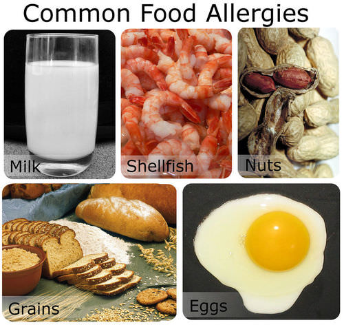

#### Diseases of the Stomach and Esophagus

A layer of mucus normally protects the lining of the stomach from damage by hydrochloric acid. An infection by bacteria of the species _Helicobacter pylori_ can weaken this mucus layer, allowing acid to get through to the delicate mucous membranes underneath. The acid may cause gastritis or stomach ulcers, both of which can be treated with medication.

* **Gastritis** is inflammation of the lining of the stomach. It causes abdominal pain.
* A **stomach ulcer** is a sore in the lining of the stomach. It causes severe abdominal pain and bleeding.

Stomach acid may also damage the lining of the esophagus. This can occur when the sphincter between the stomach and esophagus does not close properly. This lets acid from the stomach enter the esophagus. The acid may cause esophagitis, or inflammation of the esophagus. A common symptom of esophagitis is heartburn, which is a painful, burning sensation in the throat or chest. Esophagitis can be treated with medication and changes in diet. It is important to treat the condition because it sometimes leads to cancer of the esophagus if not treated.

 

!?[0](https://www.youtube.com/watch?v=WL-ygRyukqc)

#### Diseases of the Small Intestine

Diseases that affect the small intestine include ulcers, infections, and celiac disease. Ulcers of the small intestine occur mainly in the duodenum, because stomach acid enters the duodenum during digestion. If an infection by _Helicobacter pylori_ weakens the mucous layer in the duodenum, the stomach acid can damage the mucous membranes underneath. Symptoms and treatment of duodenal ulcers are similar to those of stomach ulcers.

Other bacteria may also cause infections in the small intestine, including Salmonella and _E. coli._ The bacteria can enter the body in contaminated foods or beverages. Symptoms of bacterial infections include abdominal pain, cramping, vomiting, and diarrhea. Such infections typically clear up on their own without medical treatment.

**Celiac disease** is an immune reaction to a food protein called gluten, which is found in grains. A tendency to have celiac disease can be inherited. Symptoms of the disease include abdominal pain, diarrhea, and bloating. The symptoms can be prevented by eating a gluten-free diet, but there is no cure for the disease.

#### Diseases of the Large Intestine

Diseases that affect the large intestine include irritable bowel syndrome, colitis, and appendicitis. Irritable bowel syndrome (IBS) is a disorder in which the large intestine is easily irritated. It is one of the most common gastrointestinal disorders. The cause of IBS is unknown, but it may be due to excessive bacteria in the intestine. Symptoms of the disorder include abdominal pain, cramping, constipation, and diarrhea. Symptoms can often be controlled with medication, stress management, and changes in diet. However, there is no cure for IBS.

**Colitis** is inflammation of the colon. It has many possible causes, ranging from bacterial infections to immune reactions against the body’s own tissues. Symptoms of colitis include pain and tenderness in the abdomen. Treatment of colitis may include medication, surgery, and changes in diet.

**Appendicitis** is inflammation of the appendix. It is most common in children and teens. The appendix is a small finger-like pouch that extends from the cecum. Inflammation of the appendix is usually caused by a bacterial infection. Symptoms include abdominal pain, loss of appetite, fever, and vomiting. Appendicitis is most often treated with surgery to remove the infected appendix. Without treatment, an infected appendix can be fatal.

#### Diseases of the Accessory Organs

Accessory organs of digestion can also be affected by disease, and this may interfere with normal digestion. A disease that affects the pancreas is **cystic fibrosis.** Cystic fibrosis (CF) is an inherited disease in which the body produces abnormally thick and sticky mucous. In the pancreas, the mucus blocks the duct to the duodenum, preventing pancreatic enzymes from reaching it. As a result, proteins and lipids cannot be digested properly. People with CF may take digestive enzymes by mouth to improve their digestion. However, the disease has no known cure. (For more information on CF, see the _Human Genetics_ concepts.)

**Hepatitis** is inflammation of the liver. It is usually caused by a viral infection. Several different viruses can cause hepatitis. Some of the viruses spread through contaminated foods or beverages, and others spread through sexual contact. Symptoms of hepatitis include fever, headache, vomiting, and abdominal pain. Another symptom is jaundice, which is yellowing of the skin and [eyes](https://flexbooks.ck12.org/cbook/ck-12-middle-school-life-science-2.0/section/11.48/primary/lesson/how-the-eye-works-ms-ls?referrer=crossref "eyes"). If the symptoms are mild, the disease may clear up without treatment. If the symptoms are more severe, the disease may damage the liver, so it can no longer produce bile. This interferes with the digestion of lipids. Medications are available to treat hepatitis. Some types of hepatitis can also be prevented with vaccines.

Gall bladder problems occur mainly in adults. They are often caused by gall stones (**Figure** [below](#x-ck12-QmlvMzgyLTA1YmI.)). Gall stones are crystals that form in the bile in the gall bladder. There are many possible reasons why gall stones form, including abnormal body chemistry and too much fat in the diet. Gall stones start out as small as a grain of sand but may grow to the size of a golf ball. There may be one large stone or many small ones. If gall stones block the duct that carries bile to the duodenum, they may cause inflammation of the gall bladder and severe abdominal pain. Generally, the only way to treat these problems is to surgically remove the gall stones or the entire gall bladder.

### Summary

* The two main forms of inflammatory bowel disease are Crohn’s disease and ulcerative colitis. Both have similar symptoms including abdominal pain, diarrhea, and weight loss.
* Food allergies are disorders that occur when the immune system reacts to substances in food as though they were harmful “foreign invaders.”
* Gall stones are crystals that form in the bile in the gall bladder.

### Review

1.  What are some foods most commonly associated with food allergies?
2.  What causes gastritis and stomach ulcers?
3.  What is heartburn?
4.  How is appendicitis most commonly treated?

### Explore More

!?[0](https://www.youtube.com/watch?v=TdK0jRFpWPQ)

</article>

## 6.1 The Excretory System

<article>

Toxic waste must be disposed of properly, or there can be serious consequences. Now, your waste should not be as colorful or toxic as shown here (if it is, get yourself to a doctor as soon as possible), but it still needs to be removed from you. And that is the role of the excretory system. The excretory system gets rid of waste and excess [water](https://www.ck12.org/c/biology/water?referrer=crossref "water").

### Homeostasis and Excretion

If you [exercise](https://flexbooks.ck12.org/cbook/ck-12-middle-school-life-science-2.0/section/11.11/primary/lesson/muscles-and-exercise-ms-ls?referrer=crossref "exercise") on a hot day, you are likely to lose a lot of water in sweat. Then, for the next several hours, you may notice that you do not pass urine as often as normal and that your urine is darker than usual. Do you know why this happens? Your body is low on water and trying to reduce the amount of water lost in urine. How does the body know when it is low on water? How does it control the amount of water lost in urine? The answers to both questions are the kidneys and the glands that control them.

The kidneys are the body’s main organs of homeostasis and excretion. Homeostasis is the body’s attempt to maintain a constant internal environment. One of the major ways the body achieves homeostasis is through excretion. Excretion is the process of removing wastes and excess water from the body.

#### Homeostasis

**Homeostasis** is a fundamental characteristic of all living things. Internal body conditions must be kept within certain limits for the normal functioning of cells. Homeostasis involves keeping many internal factors at more or less constant levels. The factors include body temperature and properties of the blood. For example, the blood must have certain levels of acidity, salts, and nutrients in order for cells to function normally.

A variety of homeostatic mechanisms help maintain stability of the internal environment. Each mechanism involves the interaction of at last three components: a receptor, a control center, and an effector.

* The receptor [senses](https://flexbooks.ck12.org/cbook/ck-12-biology-flexbook-2.0/section/13.17/primary/lesson/senses-bio?referrer=crossref "senses") changes in the internal environment and sends the information to the control center.
* The control center processes the information, determines the appropriate action, and sends a command to the effector.
* The effector responds to the command and changes conditions in the internal environment.

An example of a homeostatic mechanism in humans is the regulation of body temperature. This is represented by the diagram in**Figure** [below](#x-ck12-QmlvMzgtMDMtMDE.). Temperature receptors in the skin send information about skin temperature to the brain. The brain is the control center. It determines whether the temperature is too high or too low and sends appropriate commands to effectors that control body temperature. Effectors include blood vessels near the surface of the body. If the temperature is too high, the brain commands the blood vessels to dilate, which helps the body lose heat. If the temperature is too low, the brain commands the blood vessels to constrict, which helps the body retain heat. These actions help return body temperature to normal.

#### Negative Feedback and Body Temperature

The regulation of body temperature is an example of negative feedback. **Negative feedback** is a type of homeostatic mechanism in which change in one direction results in a counteractive change in the opposite direction. Negative feedback reverses the direction of change to bring conditions back to normal. Most of the mechanisms that control homeostasis in the [human body](https://flexbooks.ck12.org/cbook/ck-12-middle-school-life-science-2.0/section/11.1/primary/lesson/organization-of-the-human-body-ms-ls?referrer=crossref "human body") involve negative feedback.

**Positive feedback** mechanisms also exist, but they are not common in the human body. Positive feedback accelerates or amplifies a change and pushes levels further away from normal. One example of a positive feedback mechanism in the body is blood clotting.

If homeostasis is disturbed, a homeostatic imbalance results. This may result in cells getting too much or not enough of certain substances. Many diseases are caused by homeostatic imbalances. For example, diabetes mellitus is a disease in which the blood contains too much glucose. This can have serious consequences for cells throughout the body. It may lead to damaged blood vessels, heart disease, blindness, and kidney failure.

!?[0](https://www.youtube.com/watch?v=RgjKRJxvG-k)

#### Excretion

**Excretion** is an essential process in all forms of life. When cells metabolize—or break down nutrients—waste products are produced. For example, when cells metabolize proteins and nucleic acids, nitrogen wastes, such as ammonia, urea, and uric acid, are produced. Ammonia is a toxic substance and must be removed from the blood and excreted from the body. Urea is removed through urine, which is produced in the kidneys. Excretion is also necessary to remove excess water, salts, and many other substances from the body.

Although the kidneys are the main organs of waste excretion from the blood, several other organs are also involved in excretion, including the large intestine, liver, skin, and lungs.

* The large intestine eliminates solid wastes that remain after the digestion of food in the gastrointestinal tract (as discussed in _Concept__17.60: The Large Intestine-Advanced_ ).
* The liver breaks down excess amino acids in the blood to form ammonia and then converts the ammonia to urea, a less toxic substance. The liver also breaks down other toxic substances in the blood, including alcohol and drugs.
* The skin eliminates water and salts in sweat.
* The lungs exhale water vapor and carbon dioxide.

### Summary

* Homeostasis is the body’s attempt to maintain a constant internal environment.
* One of the major ways the body achieves homeostasis is through excretion, the process of removing wastes and excess water from the body.
* Most of the mechanisms that control homeostasis in the human body involve negative feedback.
* The kidneys are the body’s main organs of homeostasis and excretion, although the large intestine, liver, skin, and lungs are also involved.

### Review

1.  What are the three components of any homeostatic mechanism? What are their roles?
2.  What is the difference between negative feedback and positive feedback?
3.  What is the role of the liver in the excretory system?

</article>

## 6.2 Kidneys and Excretion

<article>

Shown above is a major process of maintaining homeostasis. Getting rid of waste and excess [water](https://www.ck12.org/c/biology/water?referrer=crossref "water"). Such a basic process is actually very complex. It involves an intricate exchange of materials through the kidneys.

### Kidneys and Excretion

The **kidneys** are part of the urinary system. The kidneys work together with other organs of the urinary system in the function of excretion. The urinary system is shown in**Figure** [below](#x-ck12-QmlvLTIzLTIwLVVyaW5hcnktU3lzdGVt).

#### Urinary System

In addition to the kidneys, the urinary system includes the **ureters,** **bladder,** and **urethra.** The main function of the urinary system is to filter waste products and excess water from the blood and remove them from the body. The two kidneys, which are described in detail below, filter the blood and form urine. Urine is the liquid waste product of the body that is excreted by the urinary system.

From the kidneys, urine enters the ureters, which carry it to the bladder. Each ureter is a muscular tube about 25 centimeters long. Peristaltic movements of the [muscles](https://flexbooks.ck12.org/cbook/ck-12-middle-school-life-science-2.0/section/11.9/primary/lesson/smooth-skeletal-and-cardiac-muscles-ms-ls?referrer=crossref "muscles") of the ureter send urine to the bladder in small spurts.

The bladder is a hollow organ that stores urine. It can stretch to hold up to 500 milliliters. When the bladder is about half full, the stretching of the bladder sends nerve impulses to the sphincter that controls the opening to the urethra. In response to the impulses, the sphincter relaxes and lets urine flow into the urethra.

The urethra is a muscular tube that carries urine out of the body. Urine leaves the body through another sphincter in the process of urination. This sphincter and the process of urination are normally under conscious control.

#### Kidneys

The kidneys participate in whole-body homeostasis. As mentioned above, one of the primary roles of the kidneys is to remove nitrogenous wastes. The kidneys are a pair of bean-shaped, reddish-brown organs about the size of a fist. They are located just above the waist at the back of the abdominal cavity, on either side of the spine. As shown in**Figure** [below](#x-ck12-QmlvLTIzLTIxLUtpZG5leQ..), the kidneys are protected by the ribcage. They are also protected by a covering of tough connective tissue and two layers of fat, which help cushion them.

Located on top of each kidney is an adrenal gland, also shown in**Figure** [below](#x-ck12-QmlvLTIzLTIxLUtpZG5leQ..). The two adrenal glands secrete several hormones. Hormones are chemical messengers in the body that regulate many body functions. The adrenal hormone aldosterone helps regulate kidney functions.

In**Figure** [above](#x-ck12-QmlvLTIzLTIxLUtpZG5leQ..), you can see that the kidney has three layers. The outer layer is the renal cortex, and the middle layer is the renal medulla. The inner layer, the renal pelvis, is where the renal artery enters the kidney and the renal vein exits the kidney. The renal artery carries blood to the kidney to be filtered, and the renal vein carries the filtered blood away from the kidney. Structures in the kidney called nephrons are also seen in**Figure** [above](#x-ck12-QmlvLTIzLTIxLUtpZG5leQ..). Each nephron extends from the cortex down into the medulla.

#### Nephrons

**Nephrons** are the structural and functional units of the kidneys. A single kidney may have more than a million nephrons. The diagram in**Figure** [below](#x-ck12-QmlvMzgtMDMtMDQ.) represents an individual nephron and shows its main structures and functions. The structures include the glomerulus, Bowman’s capsule, and the renal tubule.

* The glomerulus is a cluster of arteries that filters substances out of the blood.
* Bowman’s capsule is a cup-shaped structure around the glomerulus that collects the filtered substances.
* The renal tubule is a long, narrow tube surrounded by capillaries that reabsorbs many of the filtered substances and secretes other substances.

#### Filtration, Reabsorption, and Secretion

The renal arteries, which carry blood into the kidneys, branch into the capillaries of the glomerulus of each nephron. The pressure of blood moving through these capillaries forces some of the water and dissolved substances in the blood through the capillary walls and into Bowman’s capsule. Bowman’s capsule is composed of layers. The space between the layers, called Bowman’s space, fills with the filtered substances.

The process of filtering substances from blood in the glomerulus is called filtration. The fluid that collects in Bowman’s space is called filtrate. It is composed of water, salts, glucose, amino acids, and urea. Larger structures in the blood—including protein molecules, blood cells, and platelets—do not pass into Bowman’s space. Instead, they stay in the main circulation.

From Bowman’s space, the filtrate passes into the renal tubule. The main function of the renal tubule is **reabsorption.** Reabsorption is the return of needed substances in the filtrate back to the bloodstream. It is necessary because some of the substances removed from the blood by filtration—including water, salts, glucose, and amino acids—are needed by the body. About 75 percent of these substances are reabsorbed in the renal tubule.

As shown in**Figure** [below](#x-ck12-QmlvMzgtMy01), the renal tubule is divided into three parts: the proximal tubule, the Loop of Henle, and the distal tubule.

* Filtrate first enters the proximal tubule. This is where the most reabsorption takes place. Tiny projections called microvilli line the proximal tubule and increase the surface area for reabsorption. From the proximal tubule, the filtrate passes through the loop of Henle.
* The loop of Henle carries the filtrate from the cortex down into the medulla and then back up to the cortex again. Its primary purpose is to reabsorb water and salt from the fluid filtrate. The remaining fluid enters the distal tubule.
* The distal tubule carries the fluid, now called tubular fluid, from the loop of Henle to a collecting duct. As it transports the fluid, the distal tubule also reabsorbs or secretes substances such as calcium and sodium. The process of secreting substances into the tubular fluid is called secretion.

#### Urine Formation

The collecting ducts are the site of urine formation. This process is crucial for water [conservation](https://flexbooks.ck12.org/cbook/ck-12-middle-school-life-science-2.0/section/12.31/primary/lesson/reduce-reuse-and-recycle-ms-ls?referrer=crossref "conservation") in the body. The collecting ducts reabsorb water from tubular fluid and return it to the blood. The remaining fluid, called urine, has both a smaller volume and a greater concentration than tubular fluid. From the collecting ducts, urine enters a ureter and is eventually excreted from the body.

The reabsorption of water by the collecting ducts is controlled by a negative feedback mechanism. The mechanism involves a hormone secreted by the pituitary gland, called antidiuretic hormone (ADH). ADH makes the collecting ducts more permeable to water, allowing more water to be reabsorbed from tubular fluid. When there is not enough water in the blood, more ADH is secreted, more water is reabsorbed from tubular fluid, and less water is excreted in urine. The opposite happens when there is too much water in the blood.

 

!?[0](https://www.youtube.com/watch?v=WtrYotjYvtU)

### Summary

* The urinary system is composed of the kidney, ureters, bladder, and urethra.
* The main function of the urinary system is to filter waste products and excess water from the blood and remove them from the body.
* Located on top of each kidney is an adrenal gland. The adrenal hormone aldosterone helps regulate kidney functions.
* The kidney has three layers: the outer renal cortex, the renal medulla, and the inner renal pelvis where the renal artery and vein enter and exit the kidney respectively.
* Bowman’s capsule is composed of layers. The space between the layers, called Bowman’s space, fills with the filtered substances (known as filtrate).
* The process of filtering substances from blood in the glomerulus is called filtration.
* The renal tubule is divided into three parts: the proximal tubule, the Loop of Henle, and the distal tubule. Most reabsorption happens in the renal tubule.
* The collecting ducts are the site of urine formation; they reabsorb water from tubular fluid and return it to the blood.

### Review

1.  Which organs compose the urinary system?
2.  When does your bladder send nerve pulses to initiate urination?
3.  What is the function of the adrenal gland?
4.  How is the reabsorption of water controlled?
5.  Which part of the renal tubule is responsible for the most reabsorption?
6.  What is the role of the loop of Henle and the distal tubule (which are parts of the renal tubule)?

</article>

## 6.3 Kidneys and Homeostasis

<article>

**Why is a bean-shaped organ so important?**

Shown above are the isolated kidneys from many little mice. OK, they're really just kidney beans. But this is what the important kidney looks like. Why is it so important? Your kidneys filter and remove wastes from your blood.

### Kidneys and Homeostasis

The kidneys play many vital roles in homeostasis. As you have already read, the kidneys filter blood and excrete liquid waste. In fact, the kidneys filter all the blood in the body about 16 times a day, producing approximately 180 liters of filtrate and about 1.5 liters of urine. The kidneys also control the amount of [water](https://www.ck12.org/c/biology/water?referrer=crossref "water") in the blood by excreting more or less water in urine.

#### Balancing the Blood

The kidneys are responsible for maintaining balance in the blood in other ways as well. For example, they control the acid-base balance in the blood, mainly by secreting hydrogen ions into tubular fluid and reabsorbing bicarbonate ions from tubular fluid as needed. Recall that carbon dioxide is transported through the blood as bicarbonate. For more information on the presence of hydrogen ions and bicarbonate in the blood, see _The Respiratory System: A Breath of Air_ concept. The kidneys also regulate blood concentrations of many other ions—including sodium, potassium, calcium, and magnesium—by the controlling the amounts that are excreted in urine.

#### Secreting Hormones

The kidneys also secrete various hormones to help maintain homeostasis. Hormones secreted by the kidneys include erythropoietin and rennin.

* **Erythropoietin** is secreted when the blood does not have enough red blood cells to carry adequate oxygen. The hormone stimulates the production of red blood cells by the bone marrow.
* **Rennin** is secreted when blood pressure falls. The hormone stimulates the secretion of **aldosterone** by the adrenal gland. Aldosterone, in turn, stimulates the kidneys to reabsorb more sodium ions and water. This increases the volume of the blood, which causes an increase in blood pressure.

### Summary

* The kidneys control the concentrations of many ions within the blood, including hydrogen ions, bicarbonate ions, sodium, potassium, calcium, and magnesium.
* The kidneys also produce hormones that regulate red blood cell production and blood pressure.

### Review

1.  How do the kidneys regulate the acid-base balance in blood?
2.  Which hormone secreted by the kidneys is responsible for red blood cell count?
3.  How does the hormone rennin increase blood pressure?

</article>

## 6.4 Excretory System Diseases and Disorders

<article>

Kidney stones. Imagine having that travel through your excretory system. OK, that's not a kidney stone, but you get the idea. Kidney stones can be more than a few millimeters in diameter. Painful? Sometimes extremely uncomfortable. And how does a stone leave the kidney? The same way urine does.

### Kidney Disease and Dialysis

A person can live a normal, healthy life with just one kidney. However, at least one kidney must function properly to maintain life. Diseases that threaten the health and functioning of the kidneys include kidney stones, infections, and diabetes.

#### Kidney Stones

Kidney stones are crystals of dissolved minerals that form in urine inside the kidneys. They may start out as small as a grain of salt and grow to be as large as a grapefruit. There may be one large stone or many small ones. Small kidney stones often pass undetected through the urinary tract and out of the body in urine. However, kidney stones may grow large enough before passing to block a ureter. This can cause a buildup of urine above the blockage and severe pain. Large kidney stones can sometimes be broken into smaller pieces that wash out of the urinary tract in urine. The stones are shattered by high-intensity sound waves focused on them from outside the body. Another alternative is to remove kidney stones surgically.

 

!?[0](https://www.youtube.com/watch?v=PV7K_C63Orc)

#### Infections

Bacterial infections of the urinary tract are very common. In fact, urinary tract infections (UTI) are the second most common type of bacterial infection seen by health care providers. Typical organisms that cause UTIs include _Escherichia coli_ and _Staphylococcus saprophyticus._ These organisms may infect any part of the urinary tract.

The most common type of UTI are bladder infections. They can be treated with antibiotics prescribed by a doctor. However, if a bladder infection is not treated, it may spread to the kidney and cause a kidney infection, or pyelonephritis. This is the most serious type of UTI. It can damage the kidney and interfere with normal kidney functions. Kidney infections can also be treated with antibiotics, but may require other treatments as well.

#### Diabetes

Two different types of diabetes can involve the kidneys: diabetes insipidus and diabetes mellitus. **Diabetes insipidus** is a disease characterized by the inability to concentrate urine. A person with this disease typically produces many liters of very dilute urine each day. Diabetes insipidus can be caused by a deficiency of ADH (antidiuretic hormone) or by the kidneys failing to respond to ADH. If the cause of diabetes insipidus can be treated, it may cure the disease.

In **diabetes mellitus,** the kidneys try to reduce the high glucose level in the blood by excreting more glucose in urine. This causes frequent urination and increased thirst. If blood glucose levels are not controlled by medication or diet, they may damage capillaries of the glomerulus and interfere with the kidneys' ability to filter blood. Eventually, high glucose levels may lead to kidney failure, greatly reducing kidney function. Kidney failure leads to high levels of urea and other wastes in the blood and may require treatment with dialysis.

 

!?[0](https://www.youtube.com/watch?v=4EEtubB74lM)

#### Dialysis and Transplantation

**Dialysis** is a medical procedure in which blood is filtered with the help of a machine. One type of dialysis treatment is shown in**Figure** [below](#x-ck12-QmlvMzgzLTA2). Blood from the patient’s vein enters the dialysis machine through a tube. Inside the machine, excess [water](https://www.ck12.org/c/biology/water?referrer=crossref "water"), wastes, and other unneeded substances are filtered out of the blood. The filtered blood is then returned to the patient’s vein through another tube. A dialysis treatment usually lasts three to four hours and must be repeated three times a week. Dialysis is generally performed on patients who have kidney failure. Dialysis helps them stay alive, but does not cure their failing kidneys.

The only cure for most people with kidney failure is a kidney transplant. To be suitable for transplantation, the donated kidney must come from a donor who has the same blood and tissue types as the recipient. Even then, the recipient must take medication to suppress the immune system, so it does not reject the new kidney.

### Summary

* Kidney stones are crystals of dissolved minerals that form in urine inside the kidneys.
* Urinary tract infections (UTI) are the second most common type of bacterial infection seen by health care providers.
* Diabetes insipidus can be caused by a deficiency of ADH (antidiuretic hormone) or by the kidneys failing to respond to ADH.
* If blood glucose levels are not controlled by medication or diet, they may damage capillaries of the glomerulus and interfere with the kidneys' ability to filter blood.

### Review

1.  How can kidney stones be removed?
2.  What is the most common form of urinary tract infection?
3.  What happens if a bladder infection goes untreated?
4.  What could be a possible cause of diabetes insipidus?

</article>

## 7.1 The Endocrine System

<article>

This messenger pigeon is delivering a letter, making sure it gets to where it needs to go. It could be said that hormones are biological messengers, and they originate from the endocrine system. In addition to the nervous system, the endocrine system relays messages throughout the body via chemical messenger molecules released by glands into the bloodstream. These molecules, called hormones, act slowly compared to the rapid transmission of electrical messages by the nervous system. They must travel through the bloodstream to the cells they affect, and this takes time. On the other hand, because endocrine hormones are released into the bloodstream, they travel throughout the body. As a result, endocrine hormones can affect many cells and have body-wide effects.

### Function of the Endocrine System

The **endocrine system** is a system of organs that releases chemical messenger molecules, called hormones, into the blood. Unlike the nervous system, whose actions help the body react immediately to change, the endocrine system controls changes that happen to the body over long periods of time, which can be minutes, hours, or even years. The two systems work closely together to help us respond to our environment, such as during a rollercoaster ride like in **Figure** [below](#x-ck12-QmlvMzViMi0wMQ..). The endocrine system is important in controlling metabolism, growth and [development](https://www.ck12.org/c/biology/development?referrer=crossref "development"), reproduction, and salt, [water](https://www.ck12.org/c/biology/water?referrer=crossref "water"), and nutrient balance in blood and other tissues (osmoregulation).

The nervous system uses nerves to conduct electrical and chemical information around the body, while the endocrine system uses blood vessels to carry chemical information. You can think of the nervous system as being similar to the electrical system in a house. Flicking on a light switch is similar to initiating an action potential in a nerve, and it has an almost immediate result: the light bulb illuminates. The endocrine system, on the other hand, is more like starting up an oil or gas powered water-heating system. You flick on the switch to heat up water for a bath, but it takes a certain length of time for the result - hot water - to occur.

#### Organs of the Endocrine System

The endocrine system is made up of many glands that are located in different areas of the body. **Hormones** are chemical messenger molecules that are made by cells in one part of the body and cause changes in cells in another part of the body. Hormones regulate the many and varied functions that keep you alive.

Hormones are made and secreted by cells in [endocrine glands](https://flexbooks.ck12.org/cbook/ck-12-biology-flexbook-2.0/section/13.20/primary/lesson/glands-bio?referrer=crossref "endocrine glands"). **Endocrine glands** are ductless organs that secrete hormones directly into the blood or the fluid surrounding a cell rather than through a duct. The primary function of an endocrine gland is to make and secrete hormones. The endocrine glands collectively make up the endocrine system. The major glands of the endocrine system are shown in**Figure** [above](#x-ck12-QmlvLTIyLTE3LWVuZG9jcmluZS1zeXN0ZW0.). Many other organs, such as the stomach, heart, and kidneys, secrete hormones and are considered to be part of the endocrine system.

**Exocrine glands** are organs that secrete their products into ducts (they are duct glands). They are similar to endocrine glands in that they secrete substances, but they do not secrete hormones. Instead, they secrete products such as water, mucus, enzymes, and other proteins through ducts to specific locations inside and outside the body. For example, sweat glands secrete sweat onto the skin, and salivary glands secrete saliva into the mouth. Some endocrine glands, such as the pancreas, are also exocrine glands. Ducts in the pancreas secrete fat-digesting enzymes into the intestines. The secretion of the enzymes from the pancreas is controlled by hormones that are made by certain stomach cells.

!?[0](https://www.youtube.com/watch?v=iDy_p9912ao)

### Summary

* The endocrine system is an organ system made up of endocrine glands that release hormones into the bloodstream.
* The endocrine system releases signals over a period of minutes, hours, or years; it works in conjunction with the more rapid nervous system to pass messages through the body.

### Review

1.  How are the endocrine and nervous systems similar? How are they different?
2.  What are hormones?
3.  What are the organs of the endocrine system?

</article>

## 7.2 Hormones

<article>

As hormones, they are the messengers of the endocrine system. Obviously, they must change something in the cell.

### Hormones

The body produces many different hormones, but each hormone is very specific to its **target cells.** A target cell is the cell on which a hormone has an effect. Target cells are affected by hormones because they have receptor proteins that are specific to the hormone. Hormones will travel through the bloodstream until they find a target cell with the specific receptors to which they can bind. When a hormone binds to a receptor, it causes a change within the cell.

There are two main types of hormones: amino acid and cholesterol based hormones (and a group of hormone-like substances).

#### Amino Acid-Based Hormones

**Amino acid-based hormones** are made of amino acids. Some amino acid-based hormones are made of a few amino acids and are simple in structure, while others are made of hundreds of amino acids and are very large. These hormones are not fat-soluble and therefore cannot diffuse through the plasma membrane of their target cell. They usually bind to receptors that are found on the cell membrane.

#### Cholesterol-Based Hormones

**Cholesterol-based hormones** are made of lipids such as phospholipids and cholesterol. Hormones from this group are also called steroid hormones. Steroid hormones are fat soluble and are able to diffuse through the plasma membrane of a target cell. Steroid hormone receptors are found in the cell cytosol and nucleus.

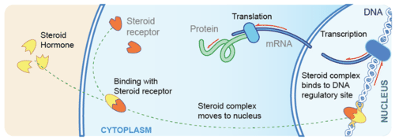

#### Hormone-like Substances

The term **hormone-like substances** refers to a group of signaling molecules that are derived from certain types of fatty acids and proteins. Two examples of these substances are **prostaglandins** and **neuropeptides.** These substances do not travel around the body in blood, as hormones do, and they tend to be broken down quickly. As a result, the effects of hormone-like substances are localized to the tissue in which it they are produced. For example, prostaglandins, which are made from essential fatty acids, are produced by most cells in the body. Prostaglandins have many different effects, such as causing constriction or dilation of blood vessels, but they are all localized within the target cells and tissues. Neuropeptides are signaling peptides found in nervous tissue, and they have varied effects on nerve cells. For example, they can affect gene expression, local blood flow, and the shape of glial cells. Some neuropeptides, such as endorphins and oxytocin, have effects on non-nerve cells and are called hormones. Both signaling molecules have an effect on behavior. Among other things, endorphins are involved in pain perception and oxytocin is involved in social bonding and maternal behavior.

The cells that make hormones are usually specialized for this job and are found within a particular endocrine gland such as the thyroid gland, the ovaries, or the testes. Hormones may exit their cell of origin by exocytosis or another type of membrane transport. Cells that respond to a particular hormone may be one of several cell types that are found in different tissues throughout the body. Such is the case for insulin, which triggers a great number of physical effects. Different tissue types may also respond differently to the same hormonal signal. Because of this, hormonal signaling is a very complex process.

#### Hormone Receptors

Cells that respond to hormones have two properties in common: they have receptors that are very specific for certain hormones, and those receptors are joined with processes that control the metabolism of the target cells. There are two main ways that receptor-bound hormones activate processes within cells, depending on whether the hormone can pass through the cell membrane (steroid hormones are fat-soluble) or cannot pass through the membrane (most amino acid-based hormones are [water](https://www.ck12.org/c/biology/water?referrer=crossref "water") soluble). These two methods are the second messenger system and direct gene activation. A water-soluble hormone molecule does not enter the cell. Instead, it binds to the membrane-bound receptor molecule, which triggers changes within the cell. These changes are activated by second messenger molecules. In contrast, fat-soluble hormones diffuse across the membrane and bind to the receptor within the cytosol or nucleus. The hormone-receptor complex then acts as a transcription factor that affects gene expression.

The two different ways that hormones can activate cells are discussed here, using the amino acid-based hormone glucagon and the steroid hormone cortisol as examples.

#### Action of Glucagon: A Second Messenger System

The majority of amino acid-based hormones, such as glucagon, bind to membrane-bound receptors. The binding of the hormone triggers a **signal transduction** pathway, a process of molecular changes that turns the hormone’s extracellular signal into an intracellular response. Activation of these receptors by hormones (the first messengers) leads to the intracellular production of second messengers as part of the signal transduction pathway. A **second messenger** is a small molecule that starts a change inside a cell in response to the binding of a specific signal to a receptor protein. Some second messenger molecules include small molecules such as cyclic AMP (cAMP), cyclic GMP (cGMP), and calcium ions (Ca_2+_).

**Glucagon** is an important hormone involved in carbohydrate metabolism. It is released when glucose levels in the blood are low, which causes the liver to change stored glycogen into glucose and release it into the bloodstream. Glucagon is released by the pancreas and circulates in the blood until it binds to a glucagon receptor, a G protein-linked receptor, found in the plasma membranes of liver cells. The binding of glucagon (first messenger) changes the shape of the receptor, which then activates a G protein. The G-protein is an enzyme that, in turn, activates the next enzyme in the cascade, the second messenger adenylate cyclase. Adenylate cyclase produces cAMP which activates another enzyme, which in turn activates another enzyme, and so on. The end result is an enzyme that breaks apart the glycogen molecule in the liver cell to release glucose molecules into the blood. The signal transduction pathway, a type of enzyme “domino-effect” inside the cell, allows a small amount of hormone to have a large effect on the cell or tissue. To learn more about second messenger systems, refer to the _[Cell Communication](https://www.ck12.org/c/biology/cell-communication?referrer=crossref "Cell Communication"): Signal Transduction_ concept.

#### Action of Cortisol: A Direct Gene Activation

Steroid hormones diffuse through the cell membrane and bind to receptors in the cytosol or the nucleus of the cell. The receptor-hormone complex acts as a transcription factor that affects gene expression.

**Cortisol** is a steroid hormone produced by the adrenal glands. It is often called the "stress hormone" as it is involved in the body’s response to stress. It increases blood pressure, blood sugar levels, and has an immunosuppressive action. Cortisol crosses the cell membrane and binds to a steroid receptor in the cytoplasm. The cortisol-receptor complex then enters the nucleus of the cell and binds to DNA, activating or deactivating gene transcription. The gene that is activated or deactivated depends on the cell type.

#### Effects of Hormones

The effects of hormones vary widely, and certain hormones, called tropic hormones (or tropins), regulate the production and release of other hormones. Many of the responses to hormones regulate the metabolic activity of an organ or tissue.

Other effects of hormones can include the following:

* Stimulation or inhibition of growth.
* Induction or suppression of programmed cell death (apoptosis).
* Activation or inhibition of the immune system.
* Regulation of metabolism.
* Preparation for a new activity (e.g. fighting, fleeing, or mating).
* Preparation for a new phase of life (e.g. puberty, caring for offspring, or menopause).
* Control of the reproductive cycle.

### Summary

* Hormones have varied effects including growth, cell death, metabolism regulation, and reproductive cycle control.
* Hormones are either amino acid-based or cholesterol-based; hormone-like substances have similar effects on a more localized scale.
* Cholesterol-based hormones travel into the cell and begin the direct gene activation process.
* Amino acid-based hormones stay outside the cell where they bind to receptor proteins to begin the signal transduction pathway process.

### Review

1.  How does a cholesterol-based hormone stimulate action in a cell?
2.  How does an amino acid-based hormone stimulate action in a cell?
3.  Why are hormone-like substances not considered hormones?

</article>

## 7.3 The Hypothalamus and Pituitary Gland

<article>

Of course, and this signal starts with the hypothalamus in the brain and is sent to the pituitary gland where many hormones are made. The pituitary gland then sends the hormones on their way to various other places.

### The Hypothalamus and Pituitary Gland

The **hypothalamus** links the nervous system to the endocrine system via the pituitary gland. The hypothalamus is located below the thalamus, just above the brain stem, and is found in all mammalian brains including those of humans. The human hypothalamus is about the size of an almond; its position in the brain is shown in **Figure** [below](#x-ck12-QmlvMzViLTAyLTAz).

The hypothalamus is a very complex area of the brain, and even small numbers of nerve cells within it are involved in many different functions. The hypothalamus coordinates many seasonal and circadian rhythms, complex homeostatic mechanisms, and the autonomic nervous system (ANS). A **circadian rhythm** is a roughly-24-hour cycle in the biological processes carried out within organisms including plants, animals, fungi, and certain bacteria. The ANS controls activities such as body temperature, hunger, and thirst. The hypothalamus must therefore respond to many different signals, some of which are from outside and some from inside the body. Thus, the hypothalamus is connected to many parts of the CNS including the brainstem, the olfactory bulbs, and the cerebral cortex.

The hypothalamus produces hormones that are stored in the pituitary gland. For example, oxytocin and antidiuretic hormone (ADH) are made by nerve cells in the hypothalamus and are stored in the pituitary prior to their release into the blood. In addition to influencing maternal behavior, oxytocin is involved in controlling aspects of circadian homeostasis such as a person's body temperature, activity level, and wakefulness at different times of the day. Antidiuretic hormone (ADH) is released when the body is low on [water](https://www.ck12.org/c/biology/water?referrer=crossref "water"); it causes the kidneys to conserve water by concentrating the urine and reducing urine volume. It also raises blood pressure by causing blood vessels to constrict.

#### Pituitary Gland

The **pituitary gland** is about the size of a pea and is attached to the hypothalamus by a thin stalk at the base of the brain, as shown in **Figure** [below](#x-ck12-QmlvMzViLTItbjI.). The pituitary gland secretes hormones that regulate homeostasis. It also secretes hormones, called **tropic hormones,** that stimulate other [endocrine glands](https://flexbooks.ck12.org/cbook/ck-12-biology-flexbook-2.0/section/13.20/primary/lesson/glands-bio?referrer=crossref "endocrine glands").

 for storage. The blue vessels on the posterior pituitary come from the neurosecretory cells in the hypothalamus.")

The **anterior pituitary,** or front lobe, makes many important hormones, which are listed in**Table** [below](#x-ck12-dGFibGU6cGl0dWl0YXJ5X2hvcm1vbmVz). The **posterior pituitary,** or rear lobe, releases two hormones, oxytocin and antidiuretic hormone (ADH), that are made by nerve cells in the hypothalamus. These hormones are transported down the nerve cells' axons to the posterior pituitary where they are stored until needed.

|     |     |     |     |
| --- | --- | --- | --- |Pituitary Hormones
| Location | Hormone | Target | Function |
| --- | --- | --- | --- |
| Anterior Pituitary | Adrenocorticotropic hormone (ACTH) Thyroid-stimulating hormone (TSH)  Growth hormone (GH)  Follicle stimulating hormone (FSH)  Leutinizing hormone (LH)  Prolactin (PRL) | Adrenal gland Thyroid gland  [Body cells](https://www.ck12.org/c/biology/body-cells?referrer=crossref "Body cells")  Ovaries and testes (gonads)  Ovaries and testes  Ovaries and mammary glands | Stimulates the adrenal cortex. Stimulates the thyroid.  Stimulates growth.  Stimulates production of ovarian follicles in females and sperm production in males.  Causes ovulation in females.  Causes milk secretion. |
| Posterior Pituitary | Antidiuretic hormone (vasopressin) Oxytocin | Kidneys or arterioles Uterus and mammary glands | Promotes water reabsorption in the kidneys and raises blood pressure. Causes the uterus to contract in childbirth and stimulates milk flow. |

Most of these hormones are released from the anterior pituitary under the influence of hormones from the hypothalamus. The hypothalamus hormones travel to the anterior lobe down a special capillary system that surrounds the pituitary.

Oxytocin is the only pituitary hormone to create a positive feedback loop. For example, during the labor and delivery process, when the cervix dilates, the uterus contracts. Uterine contractions stimulate the release of oxytocin from the posterior pituitary, which, in turn, increases uterine contractions. This positive feedback loop continues until the baby is born.

!?[0](https://www.youtube.com/watch?v=piBMd796vcM)

### Summary

* The hypothalamus links the nervous system to the endocrine system.
* The pituitary gland has two lobes; the posterior pituitary releases hormones created in the hypothalamus, while the anterior pituitary secretes a variety of hormones.

### Review

1.  Describe the interaction between the hypothalamus and the pituitary gland.
2.  What makes oxytocin different from other hormones?

</article>

## 7.4 Endocrine Glands

<article>

**Think about all the processes that need to be controlled. How is it all done?**

This concept just mentions some of the processes controlled by hormones. But, as you can see, they function in different organ systems throughout the body. This complex control takes numerous glands that are also located throughout the body.

### Other Endocrine Glands

#### Thyroid and Parathyroid Glands

The **thyroid** is one of the largest endocrine glands in the body. This butterfly-shaped gland is found in the neck, wrapped around the trachea, as shown in**Figure** [below](#x-ck12-QmlvMzViLTAyLTA1), and is controlled by the hypothalamus and pituitary. The hormones released by the thyroid control how quickly the body uses energy, makes proteins, and how sensitive the body should be to other hormones. Thyroid hormone generally controls the pace of all of the processes in the body; this pace is related to your metabolism. If there is too much thyroid hormone, every function of the body tends to speed up. The thyroid gland regulates body temperature by secreting two hormones that control how quickly the body burns calories. Hyperthyroidism (overactive thyroid) and hypothyroidism (underactive thyroid) are the most common problems of the thyroid gland.

The thyroid hormones thyroxine (T4) and triiodothyronine (T3) regulate the rate of metabolism and affect growth and many other systems in the body. As a result, problems with under-secretion or over-secretion of thyroid hormones affect many body systems.

The element iodine is very important for making both T3 and T4. If a person’s diet does not have enough iodine, their thyroid cannot work properly, and the person develops an iodine deficiency disease called **goiter.** Low amounts of T3 and T4 in the blood, due to insufficient levels of iodine, cause the pituitary to secrete large amounts of thyroid stimulating hormone (TSH), which causes abnormal growth of the thyroid gland. The addition of small amounts of iodine to mass produced foods, such as table salt, has helped reduce the occurrence of iodine-deficiency in developed countries. The thyroid also produces the hormone calcitonin, which plays a role in calcium homeostasis. The hormones secreted by the thyroid are listed in**Table** [below](#x-ck12-dGFibGU6dGh5cm9pZF9wYXJhdGh5cm9pZF9ob3Jtb25lcw..).

|     |     |     |     |
| --- | --- | --- | --- |Hormones Secreted by the Thyroid and Parathyroid Glands
| Location | Hormone | Target | Function |
| --- | --- | --- | --- |
| Thyroid | Triiodothyroine (T3) and Thyroxine (T4)  Calcitonin | __Body cells__  Bone cells | Increase metabolic rate and stimulate mental and physical growth. Increases calcium absorption by bones and lowers blood calcium levels. |
| Parathyroid | Parathyroid hormone (PTH) | Cells of the bone, kidney, and intestines | Regulates blood calcium levels. |

#### Parathyroid Glands

The parathyroid glands are usually located behind the thyroid gland, but they are visible in**Figure** [above](#x-ck12-QmlvMzViLTAyLTA1). Parathyroid hormone (PTH) maintains blood calcium levels within a narrow range so that the nervous and muscular systems can work properly. When blood calcium levels drop below a certain point, calcium-sensing receptors in the parathyroid gland release parathyroid hormone (PTH) into the blood. PTH has effects that are opposite to the effects of calcitonin. It increases blood calcium levels by stimulating certain bone cells to break down bone and release calcium. It also increases gastrointestinal calcium absorption by activating vitamin D, and it promotes calcium uptake by the kidneys. The hormones secreted by the parathyroid glands are listed in**Table** [above](#x-ck12-dGFibGU6dGh5cm9pZF9wYXJhdGh5cm9pZF9ob3Jtb25lcw..).

#### Pineal Gland

The hormone melatonin is made in the pea-sized pineal gland, which is located at the base of the brain. Production of melatonin by the pineal gland is under the control of the hypothalamus, which receives information from the retina about the daily patterns of light and darkness. Very little is currently known about the functions of melatonin, but scientists have found that it is involved in sleep cycles (circadian cycles), the onset of puberty, and immune function. Melatonin secretion also responds to seasonal changes in light, which could be a reason why getting out of bed on a dull, rainy morning can be so difficult, as the boy in**Figure** [below](#x-ck12-QmlvMzViMi0wNg..) probably knows.

#### Pancreas

The **pancreas** is both an exocrine gland and an endocrine gland; it secretes pancreatic juice containing digestive enzymes and several important hormones. It is located just below and behind the stomach, as shown in**Figure** [below](#x-ck12-QmlvMjViMi0wNw..). The endocrine cells of the pancreas are grouped together in areas called **islets of Langerhans**, which are shown in**Figure** [below](#x-ck12-QmlvMzViMi0wOA..). The islets produce the amino acid-based hormones insulin, glucagon, and somatostatin. Insulin and glucagon are both involved in controlling blood glucose levels. **Insulin** is produced by beta cells and causes excess blood glucose to be taken up by liver and muscle cells, where it is stored as glycogen, a polysaccharide. **Glucagon** is produced by alpha cells and stimulates liver cells to break down stores of glycogen into glucose, which is then released into the blood. An alpha cell is another type of endocrine cell that is found within the islets of Langerhans. The hormones secreted by the pancreas are listed in**Table** [below](#x-ck12-dGFibGU6cGFuY3JlYXNfaG9ybW9uZXM.).

|     |     |
| --- | --- |Hormones Secreted by the Pancreas
| Hormone | Effects |
| --- | --- |
| Insulin Glucagon  Amylin  Somatostatin (inhibitory hormone)  Ghrelin | Reduces blood glucose concentration. Raises blood glucose concentration.  Suppresses glucagon secretion.  Suppresses the release of insulin, glucagon, and pancreatic enzymes.  Stimulates appetite. |

#### Adrenal Glands

An adrenal gland is located above each of the kidneys, as shown in**Figure** [above](#x-ck12-QmlvMzViMi0wOQ..). Each adrenal gland is separated into two structures: the adrenal medulla, which is the center of the gland, and the adrenal cortex, which is the outer layer. The medulla and the cortex work as two separate endocrine glands.

The **adrenal medulla** is the core of the adrenal gland. Secretion of hormones from the medulla is controlled by the sympathetic nervous system. The cells of the medulla are the body's main source of the hormones **adrenaline** (epinephrine) and **noradrenaline** (norepinephrine). These hormones are part of the fight-or-flight response that is initiated by the sympathetic nervous system. The hormones boost the supply of oxygen and glucose to the brain and [muscles](https://flexbooks.ck12.org/cbook/ck-12-middle-school-life-science-2.0/section/11.9/primary/lesson/smooth-skeletal-and-cardiac-muscles-ms-ls?referrer=crossref "muscles"), while suppressing other non-emergency bodily processes such as digestion.

The **adrenal cortex** is the site of steroid hormone synthesis. Some cells make cortisol, while other cells make androgens such as testosterone. Other cells of the cortex regulate [water](https://www.ck12.org/c/biology/water?referrer=crossref "water") and electrolyte concentrations by secreting aldosterone, which helps to regulate blood pressure. In contrast to the medulla, which is controlled directly by the nervous system, the cortex is regulated by hormones secreted by the pituitary gland and the hypothalamus.

**Cortisol** is an important steroid hormone that is often called the "stress hormone" because it is involved in the body's response to stress and in restoring homeostasis after a stressful event such as when (good) stress is caused by running around a soccer field (football pitch for non-American-English speakers), as shown in**Figure** [below](#x-ck12-QmlvMzViMi0xMA..). Cortisol increases blood pressure, blood sugar levels, and has an immunosuppressive effect. Long-term stress causes prolonged cortisol secretion, hyperglycemia, and weakening of the immune system. Excess levels of cortisol in the blood result in Cushing's syndrome—symptoms of which include rapid weight gain, a round face, excess sweating, and thinning of the skin and mucous membranes.

|     |     |     |
| --- | --- | --- |Hormones of the Adrenal Glands
| Location | Hormone | Function |
| --- | --- | --- |
| Adrenal cortex | __Mineralcorticoids (such as aldosterone)__  Gonadotropins | __Regulate sodium reabsorption and potassium elimination in the kidneys.__  Stimulate the release of sex hormones that develop the sexual characteristics of both males and females. |
| Adrenal medulla | __Epinephrine (adrenaline)__  Norepinephrine (noradrenaline) | __"Fight or flight" hormone, plays a central role in short-term responses to stress, increases heart rate and the supply of blood and oxygen to the brain.__  Increases alertness and has physical effects similar to those caused by epinephrine. |

**Epinephrine,** also called adrenaline, is a “fight or flight” hormone that is released from the adrenal medulla when stimulated by the sympathetic nervous system. Epinephrine plays a central role in short-term stress reactions—the body’s response to threatening, exciting, or environmental stressors such as high noise levels or bright lights. When secreted into the bloodstream, it binds to multiple receptors and has many effects throughout the body. Epinephrine increases heart rate, dilates the pupils, and constricts blood vessels in the skin and gut while dilating arterioles in leg muscles. It increases blood sugar levels and, at the same time, begins the breakdown of lipids in fat cells. It also “turns down” non-emergency bodily processes such as digestion. Similar to other stress hormones, such as cortisol, epinephrine depresses the immune system.

Stress also releases norepinephrine in the brain. **Norepinephrine** has similar actions in the body to those of adrenaline, such as increasing blood pressure. Norepinephrine is also psychoactive because it affects alertness, which would be helpful for studying, as shown in**Figure** [below](#x-ck12-QmlvMzViMi0xMQ..). The hormones secreted by the adrenal cortex and medulla are listed in **Table** [above](#x-ck12-dGFibGU6YWRyZW5hbF9nbGFuZHNfaG9ybW9uZXM.).

. Your body’s stress response can cause you to feel “stressed out” but can also motivate you to study.")

#### Gonads

The ovaries of females and the testes of males are the gamete producing organs, or **gonads.** Ovaries in females are homologous to testes in males. In addition to producing gametes (an exocrine action), the gonads are endocrine glands that produce steroid sex hormones. **Sex hormones** are responsible for the secondary sex characteristics that develop at **puberty.** Puberty is the process of physical changes that occur when the sex organs mature and a person becomes capable of reproducing. During puberty, among other changes, males begin producing sperm and females begin menstrual cycles.

Luteinizing hormone (LH) and follicle stimulating hormone (FSH), which are both secreted by the pituitary gland, are called gonadotropins because they are tropic hormones of the gonads. Recall that tropic hormones trigger the production of hormones in other endocrine glands. The secretion of LH and FSH are, in turn, controlled by gonadotropin-releasing hormone from the hypothalamus. The production of gonadotropin-releasing hormone, in turn, is subject to the estrogen feedback from the gonads.

In males, LH triggers the production of sex hormones called **androgens** in the testes. The main androgen produced by the testes is **testosterone.** Testosterone causes an increase in skeletal muscle mass and bone density and is also responsible for the secondary sex characteristics of males such as facial hair, as shown in**Figure** [below](#x-ck12-QmlvMzViMi0xMg..). The testes also produce small amounts of estrogen in the form of estradiol, which is believed to be important for sperm formation. On average, the human adult male body produces about eight to ten times more testosterone than an adult female body.

|     |     |     |     |
| --- | --- | --- | --- |Hormones Produced by Gonads
| Organ | Hormone | Target | Function |
| --- | --- | --- | --- |
| Ovaries | Estrogen | Bone cells and cells of sex organs | Promotes growth and [development](https://www.ck12.org/c/biology/development?referrer=crossref "development") of female sex organs.  Maintains uterine lining. |
| Testes | Progesterone  Testosterone | Bone cells, muscle cells, and cells of sex organ | Stimulates growth and development of male sex organs and sex drive. |

In females, a rise in LH concentration triggers the production of estrogen and progesterone by the ovaries. Estrogen causes the release of an egg from the ovaries, and progesterone prepares the uterus for possible implantation by a fertilized egg. The placenta is an endocrine gland of pregnancy because it secretes the hormones estrogen, human chorionic gonadatropin, and progesterone, which are important for maintaining a pregnancy (shown in**Figure** [below](#x-ck12-QmlvMzViMi0xMw..)). The hormones secreted by the male and female gonads are listed in**Table** [above](#x-ck12-dGFibGU6Z29uYWRzX2hvcm1vbmVz).

 throughout pregnancy is important for carrying a pregnancy to full term.")

#### Other Hormone-Producing Tissues and Organs

Several organs that are generally non-endocrine in function, such as the stomach, the small intestine, the kidneys, and the heart, have cells that secrete hormones. For example, the kidneys secrete erythropoietin (EPO), a hormone that regulates red blood cell production, and the heart secretes atriopeptin, a hormone that reduces water and sodium levels in the blood, which decreases blood pressure. Ghrelin is a hormone that stimulates appetite and is produced by certain cells that line the stomach. Certain cancer cells secrete hormones that can interfere with homeostasis.

!?[0](https://www.youtube.com/watch?v=WVrlHH14q3o)

### Summary

* The thyroid is relatively large, is controlled by the hypothalamus and pituitary gland, and releases hormones that control the speed of the body's use of energy.
* The parathyroid glands regulate blood calcium levels.
* The pineal gland releases melatonin, the purposes of which scientists remain unclear about.
* The pancreas releases hormones that regulate blood sugar levels.
* The adrenal gland releases adrenaline and noradrenaline, which help the body respond to and recover from stress.
* The gonads are the glands that release sex hormones; in women they are ovaries, and in men they are the testes.

### Review

1.  What is the primary purpose of the thyroid?
2.  What does the pancreas do?
3.  What happens when a person is frightened?

</article>

## 7.5 Regulation of the Endocrine System

<article>

Hormones alter conditions inside the cell, usually in response to a stimulus. That means they are activated at specific times. So they must be turned on and then turned back off. What turns these hormones and their responses on or off?

### Regulation: Feedback Mechanisms

Hormones regulate many cell activities and are important to homeostatic regulation. The rate of hormone production and secretion is often controlled by homeostatic feedback control mechanisms, and the effect of hormones is also controlled by hormone antagonists. **Hormone antagonists** and **hormone receptor antagonists** are hormones or other molecules that block the action of hormones and are used by the body to control the action of hormones. They are molecules that mimic hormones and/or bind to hormone receptors, but have no effect. A **feedback control mechanism,** or a **feedback loop,** is a signaling system in which a product or effect of the system controls an earlier part of the system, either by shutting the process down or speeding it up. In these ways, the concentrations of hormones and their products are kept within a narrow range, so as to maintain homeostasis.

#### Negative Feedback

**Negative feedback** is a reaction in which the system responds in such a way as to reverse the direction of change. Since this tends to keep things constant, it allows for a process to return from a state of imbalance back to a homeostatic equilibrium.

A common non-biological example of negative feedback happens in a home heating system. When you are home, you set your thermostat to 21˚C (about 70˚F), which is the **set point.** The thermometer in the thermostat monitors the room temperature and will sense when the temperature drops below the 21˚C set point (the stimulus). The thermometer will then send a message to the thermostat (control center), which in turn sends a message to the furnace to switch on and heat up the room. When the room temperature returns to the set temperature, the thermostat shuts the furnace off. In this home-heating example, the increase in air temperature is the negative feedback that results in the furnace being shut off. In this way, a set room temperature of 21˚C (within a degree or two) is maintained.

An example of negative feedback in the body is the control of blood-glucose concentrations by insulin. A higher amount of glucose in the blood (the stimulus) signals the beta cells of the pancreas to release insulin into the blood. Hormone concentration alone cannot trigger a negative feedback mechanism; negative feedback is instead triggered by an overproduction of the effect of the hormone, such as the lowering of blood glucose concentrations (the effect), which causes a decrease in the secretion of insulin by the pancreas.

#### Negative Feedback: Regulation of Thyroid Hormones

The thyroid hormones thyroxine (T4) and triiodothyronine (T3) regulate the rate of metabolism. The production of T4 and T3 is regulated by thyroid-stimulating hormone (TSH), which is released by the anterior pituitary. The thyroid and the TSH-producing cells of the anterior pituitary form a negative feedback loop, as shown in**Figure** [below](#x-ck12-QmlvMzViLTItbjM.).

Thyroid-stimulating hormone production is decreased when the T4 levels are high, and, when TSH levels are high, T4 production is increased. The production and secretion of TSH is in turn controlled by thyrotropin-releasing hormone (TRH), which is produced by the hypothalamus. The rate of TRH secretion is increased in situations such as cold temperature because increasing the metabolic rate would generate more heat. Increased levels of T4 and T3 in the blood cause a reduction in TRH secretion. Among other things, TSH secretion is reduced by high levels of thyroid hormones as well as the antagonistic hormone somatostatin. These feedback loops keep the concentrations of thyroid hormones within a narrow range of concentrations.

 Shows the loop between the TSH-producing cells of the anterior pituitary and the thyroid. Increased levels of T4 and T3 in the blood cause a reduction in TSH secretion. (2) Shows that increased levels of T4 and T3 in the blood cause a reduction in TRH secretion.")

#### Positive Feedback

**Positive feedback** is a reaction in which the system responds in such a way as to speed up the direction of change. Positive feedback mechanisms are not as common as negative feedback mechanisms because they cause an increase in the initial signal, which would tend to knock many systems out of homeostatic balance. Take, for example, the analogy of the home heating system. If this system were to work on a positive feedback loop, the furnace would not switch off when the temperature reached the set point of 21˚C. Instead, it would keep going and heat the room indefinitely.

An example of a positive feedback mechanism is milk production by a mother for her baby, as shown in**Figure** [below](#x-ck12-QmlvMzViMi0xNQ..). As the baby suckles, nerve messages from the mammary glands cause the hormone prolactin to be secreted by the mother’s pituitary gland. The more the baby suckles, the more prolactin is released, which stimulates further milk production by the mother’s mammary glands. In this case, a negative feedback loop would be unhelpful because the more the baby nursed, the less milk would be produced. Another example of a positive feedback loop is the blood-clotting cascade that happens after a blood vessel is cut.

#### Hormone Antagonists

Many hormones work with hormone antagonists to control the concentrations of substances in the body. The hormones have opposite actions on the body and are called **antagonistic.**

Insulin and glucagon make up an antagonistic hormone pair; the action of insulin is opposite that of glucagon. For example, your blood glucose concentration rises sharply after you eat food that contains simple carbohydrates, such as the chocolate chip muffin shown in**Figure** [below](#x-ck12-QmlvMzViMi0xNg..). The increase in blood glucose levels stimulates beta cells in the pancreas to release insulin into blood. In response to signals by insulin, most [body cells](https://www.ck12.org/c/biology/body-cells?referrer=crossref "body cells") take up glucose, which removes it from the blood, and the blood glucose concentration returns to the set point. Later, you have missed eating lunch, and you are hungry and feel a little light-headed. Your blood glucose concentration has dropped below the set point, which causes the release of glucagon from the pancreas. Glucagon causes the release of glucose from liver cells, which increases your blood glucose concentration. If glucagon did not do its job correctly, your blood glucose concentration would continue to drop, and you would develop hypoglycemia (low blood sugar). This antagonistic relationship between the two hormones helps you maintain the narrow range of blood glucose concentration.

The actions of growth hormone releasing hormone (GHRH) are opposed by another hypothalamic hormone, somatostatin, also known as "growth hormone inhibiting hormone" (GHIH). Somatostatin and GHRH are secreted alternatively by the hypothalamus, which causes an increase and decrease in the secretion of growth hormone (GH) by the pituitary.

Many [endocrine glands](https://flexbooks.ck12.org/cbook/ck-12-biology-flexbook-2.0/section/13.20/primary/lesson/glands-bio?referrer=crossref "endocrine glands") also work together as a group to control body processes. The major endocrine glands coordinate the control of various regulatory systems such as metabolism, osmoregulation, and reproduction. Many individual glands are directly controlled by the nervous system, and all are in some way controlled by the pituitary and hypothalamus. Some of these glands and their hormone products are listed in **Table** [below](#x-ck12-dGFibGU6Y29vcmRpbmF0aW9uX29mX2VuZG9jcmluZV9nbGFuZHM.).

|     |     |     |     |
| --- | --- | --- | --- |Coordination of the Endocrine Glands in the Control of Body Systems
| Function | Organ or Glands | Hormones | Nervous System Control |
| --- | --- | --- | --- |
| Control of the Endocrine System | Hypothalamus Pituitary Gland | TSH, FSH, LH, GH, and prolactin (PRL)  Adrenocorticotropic hormone (ACTH) | ANS (sympathetic and parasympathetic nervous system) |
| Regulation of Metabolism | Thyroid Gland  Parathyroid Glands  Pancreas  Pineal Gland  Liver | T3 and T4  Parathyroid hormone  Insulin  Glucagon  Melatonin | ANS (sympathetic and parasympathetic nervous system) |
| Response to Stress | Adrenal Glands | Epinepherine  Norepinepherine  Cortisol | ANS (sympathetic nervous system) |
| Reproduction | Gonads (ovaries and testes) | Androgens (testosterone)  Estrogens  Progestins (progesterone) | ANS (parasympathetic nervous system) |
| Osmoregulation | Adrenal Glands  Kidneys  Liver | Aldosterone  ADH  Angiotensin | ANS (sympathetic and parasympathetic nervous system) |

### Summary

* Hormones work in positive and negative feedback loops to maintain homeostasis within the body.
* Hormone antagonists are pairs of hormones that oppose each other.

### Review

1.  Explain the interaction between glucagon and insulin.
2.  Give an example of a set point in the human body.
3.  Is breastfeeding a positive or negative feedback loop?

</article>

## 7.6 Endocrine System Diseases and Disorders

<article>

This may be an exaggeration, but the world's tallest person, Robert Pershing Wadlow, stood almost nine feet tall when he died at the age of 22. Is growing that tall due to a problem with the endocrine system?

### Homeostatic Imbalance: Endocrine System Disorders

Diseases of the endocrine system are common and include diseases such as diabetes, thyroid disease, and obesity. An endocrine disease is usually characterized by hyposecretion or hypersecretion of hormones and an inappropriate response to hormone signaling by cells.

Cancer can occur in [endocrine glands](https://flexbooks.ck12.org/cbook/ck-12-biology-flexbook-2.0/section/13.20/primary/lesson/glands-bio?referrer=crossref "endocrine glands"), such as the thyroid, and some hormones are involved in signaling distant cancer cells to multiply. For example, the estrogen receptor has been shown to be involved in certain types of breast cancers.

#### Hyposecretion

**Hyposecretion** is the production of no hormone or too little of a hormone. It can be caused by the destruction of hormone-secreting cells, such as in Type 1 diabetes, or by a deficiency in a nutrient that is important for hormone synthesis. Hyposecretion can be treated with hormone-replacement therapies. Type 1 diabetes is an autoimmune disease that results in the destruction of the insulin-producing beta cells of the pancreas. A person with Type 1 diabetes needs insulin replacement therapy, usually by injection or an insulin pump, in order to stay alive. An insulin pump is shown in**Figure** [below](#x-ck12-QmlvMzViMi0xNw..).

Diabetes insipidus is characterized by the excretion of large amounts of very dilute urine, even if liquid intake is reduced. It is caused either by an inability of the kidneys to concentrate urine due to a lack of antidiuretic hormone (ADH), also called vasopressin, or by an insensitivity of the kidneys to that hormone. Blood glucose levels are not affected in diabetes insipidus.

Growth hormone deficiency is caused by a lack of GH production by the pituitary. GH deficiency affects bone growth, and people with growth hormone deficiency tend to have, among other things, low bone density and a small stature—a condition called pituitary dwarfism. GH deficiency is treated by growth hormone replacement.

Hypothyroidism is the state in which not enough thyroid hormones are made. Thyroiditis is an autoimmune disease where the body's own antibodies attack the cells of the thyroid and destroy it. Thyroid hormones play an important role in brain [development](https://www.ck12.org/c/biology/development?referrer=crossref "development") during fetal growth, and cells of the brain are a major target for the T3 and T4 hormones. As a result, hypothyroidism in children, either due to a thyroid problem from birth or a lack of iodine in their diet, is a major cause of physical and mental growth impairment in developing countries. In fact, iodine deficiency disorders are the single most common causes of preventable mental retardation and brain damage in the world.

!?[0](https://www.youtube.com/watch?v=iNrUpBwU3q0)

#### Hypersecretion

**Hypersecretion** of a hormone happens when the body produces too much of a hormone. A hormone can be hypersecreted if the gland develops a tumor and grows out of control or if the gland is signaled to produce too much of a hormone.

Hyperthyroidism is the result of excess thyroid hormone production, which causes an overactive metabolism and increased speed of all the body's processes. Hyperthyroidism is the most common cause of goiter in the developed world, which is shown in**Figure** [above](#x-ck12-QmlvMzViMi0xOA..).

Hypersecretion of growth hormone causes acromegaly. A common cause of acromegaly is a benign tumor in the pituitary glands that releases too much GH. In some cases, acromegaly is also caused by overproduction of the hypothalamic hormone growth hormone releasing hormone (GHRH). Acromegaly most commonly affects middle-aged adults and can result in serious illness and premature death. Symptoms include enlarged hands and feet, protrusion of the brow and chin, and enlarged internal organs. However, the disease is hard to diagnose in the early stages and is frequently missed for many years due to its slow progression. If the pituitary produces too much GH during childhood, the person will be taller than normal—a condition called pituitary gigantism. Pituitary gigantism is very rare, and some of the tallest people on record had this condition.

#### Hormone Insensitivity: Type 2 Diabetes

In some cases, the body makes enough hormones, but [body cells](https://www.ck12.org/c/biology/body-cells?referrer=crossref "body cells") do not respond. This can be due to missing or defective hormone receptors, or the body cells may become resistant to normal hormone concentrations and do not respond to it.

**Type 2 diabetes** is characterized by hyperglycemia (high blood glucose concentrations), body cells that do not respond to normal amounts of insulin (insulin resistance), and the resulting inability of the pancreas to produce enough insulin. Insulin resistance in cells results in high amounts of free fatty acids and glucose in the blood. High plasma levels of insulin and glucose due to insulin resistance often lead to metabolic syndrome and Type 2 diabetes. Type 2 diabetes can be controlled by improving one's diet, increasing levels of activity, and sometimes medication.

**Gestational diabetes** is a form of diabetes that affects pregnant women. There is no known single cause, but it's believed that the hormones produced during pregnancy reduce the ability of the cells in the pregnant woman's body to respond to insulin, which results in high blood glucose concentrations.

#### Hormones as Medicines

Many hormones and molecules like them are used as medicines. The most common type of therapy is called **hormone-replacement therapy** (HRT). The most commonly prescribed hormones are estrogens and synthetic progesterone (as methods of hormonal contraception and as HRT therapy for post-menopausal women), thyroxine (as levothyroxine for hypothyroidism), and corticosteroids (for autoimmune diseases and several respiratory disorders). Progestin, a synthetic progesterone, is also used to prolong pregnancy in women who have experienced a miscarriage due to a premature drop in progesterone levels. Hydrocortisone is a synthetic form of cortisol that is used to treat allergies and inflammation as well as cortisol production deficiencies. Hydrocortisone cream is a common over-the-counter medication for the topical treatment of rashes. Insulin is used by many people with diabetes.

#### Epinephrine

Because of its anti-inflammatory effect on the immune system, epinephrine is used to treat anaphylaxis. Anaphylaxis is a sudden and severe allergic reaction that involves the entire body. After an initial exposure to a substance like a certain food (such as peanuts) or a bee sting, a person's immune system can become sensitized to that substance, which is called an **allergen.** Upon second exposure, an allergic reaction occurs.

Histamines and other substances that are released by body cells cause the blood vessels to dilate, which lowers blood pressure and causes fluid to leak from the bloodstream into the tissues, lowering the blood volume. The release of histamines causes the face and tongue to swell. Swelling of the lining of the throat can lead to [breathing](https://flexbooks.ck12.org/cbook/ck-12-middle-school-life-science-2.0/section/11.35/primary/lesson/processes-of-breathing-ms-ls?referrer=crossref "breathing") difficulties. The hormone epinephrine causes blood vessels to constrict, which reduces swelling and causes blood pressure to increase. Epinephrine is used as a medicine in auto-injectors (see**Figure** [above](#x-ck12-QmlvMzViMi0xOQ..)), which a person can use on themselves should they have an anaphylactic reaction.

#### Anabolic Androgenic Steroids

Synthetic androgens, in the form of anabolic androgenic steroids (anabolic steroids), have many medical uses. They are used to stimulate bone growth and appetite, induce puberty in boys, and treat muscle-wasting conditions in patients that have diseases such as cancer or AIDS. Androgens, including testosterone, generally promote protein synthesis and the growth of [muscles](https://flexbooks.ck12.org/cbook/ck-12-middle-school-life-science-2.0/section/11.9/primary/lesson/smooth-skeletal-and-cardiac-muscles-ms-ls?referrer=crossref "muscles") and other tissues. Androgens also block the effects of the stress hormone cortisol on muscle tissues, so the breakdown of muscles is greatly reduced.

#### Anabolic Steroid Abuse

As a result of their muscle-building action, anabolic steroids are used in sports and bodybuilding to increase muscle size and strength in order to gain a competitive edge or to assist in the recovery from an injury. Steroids used to gain a competitive advantage are forbidden by the rules of the governing bodies of many sports. Serious health risks can be produced by long-term use or excessive doses of anabolic steroids. Most of these side effects are dose dependent, the most common being an increase in low density lipoprotein (bad cholesterol) and a decrease in high density lipoprotein (good cholesterol). Anabolic steroids also increase the risk of cardiovascular disease in men with high risk of bad cholesterol. Acne is fairly common among anabolic steroid users, mostly due to increases in testosterone, which stimulates the sebaceous glands to produce more oil. High doses of anabolic steroids have been linked to liver damage.

Teenagers, particularly boys, who take anabolic steroids are more likely to be involved in sports that emphasize weight and shape (such as football or wrestling, which is shown in **Figure** [above](#x-ck12-QmlvMzViMi0yMA..)). Such teens also have higher rates of disordered eating and drug abuse and generally have poorer attitudes towards health. Severe side effects can occur if a teenager uses anabolic steroids. For example, the steroids may prematurely stop the lengthening of bones, resulting in stunted growth. Other effects include, but are not limited to, accelerated bone maturation, increased acne outbreaks, and premature sexual development.

In addition to dangerous side effects of the steroids themselves, dangerous drug-taking habits have been reported by abusers. These include unsafe injection practices such as reusing needles, sharing needles, and sharing multidose vials. A common practice among anabolic steroid abusers is self–medicating with other hormones such as growth hormone and insulin, which in itself can lead to serious health consequences. Testosterone and other anabolic steroids are classified as controlled substances in the United States (US), Canada, the United Kingdom (UK), Australia, Argentina, and Brazil.

### Summary

* Type 1 diabetes is caused by hyposecretion of insulin.
* Hypersecretion of growth hormones causes gigantism.
* Hormone-replacement therapy can be very beneficial to diabetics (insulin), those with severe allergies (epinephrine), and AIDS patients (steroids), among others.
* Abuse of hormones, such as anabolic steroids, can be incredibly dangerous.

### Review

1.  What is hypothyroidism?
2.  How does type 2 diabetes occur?
3.  How does epinephrine help those with significant allergies?

</article>

## 8.1 Nerve Cells

<article>

### Nerve Cells

#### Introduction to the Nervous System

Your body has two systems that help you maintain homeostasis: the nervous system and the endocrine system. The **nervous system** is a complex network of nervous tissue that transmits electrical and chemical signals. The nervous system consists of the central nervous system (CNS) and the peripheral nervous system (PNS). The **central nervous system** is made up of the brain and spinal cord, while the **peripheral nervous system** is made up of the nervous tissue that lies outside the CNS such as the nerves in the legs, arms, hands, feet, and organs of the body. The nervous system mediates [communication](https://flexbooks.ck12.org/cbook/ck-12-middle-school-life-science-2.0/section/8.7/primary/lesson/animal-communication-ms-ls?referrer=crossref "communication") between different parts of the body as well as the body’s interactions with the environment.

The **endocrine system** is the system of glands throughout the body that releases chemical signal molecules into the bloodstream. The electrical signals of the nervous system move very rapidly along nervous tissue, while the chemical signals of the endocrine system act slowly in comparison and over a longer period of time. Working together, the nervous and endocrine systems allow your body to respond to short or long term changes in your environment such as a pedestrian suddenly stepping out in front of your bike or your body adapting to cycling in a warm, humid summer evening, as shown in **Figure** [below](#x-ck12-QmljeWNsaXN0LU5lcnZvdXMtU3lzdGVt).

#### Neurons

Although the nervous system is very complex, there are only two main types of nerve cells in nervous tissue. All parts of the nervous system are made of nervous tissue. The **neuron** is the "conducting" cell that transmits electrical signals, and it is the structural unit of the nervous system. The other cells, **glial cells,** provide a support system for the neurons, and recent research has discovered they are involved in synapse formation. A type of glial cell in the brain, called an astrocyte, is important for the maturation of neurons and may be involved in repairing damaged nervous tissue. Neurons and glial cells make up most of the brain, the spinal cord, and the nerves that branch out to every part of the body. Neurons and glial cells are both considered nerve cells.

#### Structure of a Neuron

The special shape of a neuron allows it to pass an electrical signal to another neuron and to other cells. Electrical signals move rapidly along neurons so that they can quickly pass “messages” from one part of the body to another. These electrical signals are called **nerve impulses.**

Neurons are typically made up of a cell body (or soma), dendrites, and an axon, as shown in **Figure** [below](#x-ck12-QmlvLTIyLTAyLW5ldXJvbi1zdHJ1Y3R1cmU.). The **soma** contains the nucleus and other organelles, much like the structures in other [body cells](https://www.ck12.org/c/biology/body-cells?referrer=crossref "body cells"). The **dendrites** extend from the cell body and receive nerve impulses from other cells. The soma collects information from the dendrites and passes it along to the axon. The **axon** is a long membrane-bound extension of the cell body that passes the nerve impulse to the next cell. The end of the axon is called the axon terminal. The **axon terminal** is the point at which the neuron communicates with the next cell. The axons of many neurons are covered with an electrically insulating phospholipid layer called a **myelin sheath.** The myelin speeds up the transmission of nerve impulses along the axon. It acts as a layer of insulation, like the plastic you would see around an electrical cord.

The myelin is an outgrowth of glial cells. **Schwann cells,** which are shown wrapped around the neuron in**Figure** [above](#x-ck12-QmlvLTIyLTAyLW5ldXJvbi1zdHJ1Y3R1cmU.), are a type of glial cell. Schwann cells are flat and thin and, like other cells, contain a nucleus and other organelles. Schwann cells supply the myelin for neurons that are not part of the brain or spinal cord, while another type of glial cell, called **oligodendrocytes,** supply myelin to those of the brain and spinal cord. Myelinated neurons are white in appearance, and they are what makes up the "white matter" of the brain. Myelin is not continuous along the axon; there are regular gaps in the myelin sheath called **nodes of Ranvier.** At each node, there are ion channels; these are the only points at which ions can move across the axon membrane. In this way, the nodes act to strengthen nerve impulses by concentrating the flow of ions.

 image of a cross section of a myelinated axon. The “rings” around the axon are made up of Schwann cell membrane, which is wrapped many times around the axon.")

Neurons are specialized cells designed for the efficient passing of cell signals. Given the many functions carried out by neurons in different parts of the nervous system, there are many different shapes and sizes of neurons. For example, the cell body of a neuron can vary from four to one hundred micrometers in diameter. Some neurons have over one thousand dendrite branches and make connections with tens of thousands of cells. Other neurons have only one or two dendrites, each of which has thousands of synapses. A **synapse,** or synaptic cleft, is the small gap between the dendrite of one neuron and the axon of another. It is through this gap, shown in**Figure** [below](#x-ck12-QmlvMzViLTEtbjQ.), that neurons pass electrical signals across the nervous system.

Similarly, neurons may have one or many axons. The longest axon of a human motor neuron can be over a meter long, reaching from the base of the spine to the toes. Sensory neurons have axons that run from the toes to the spinal cord, over 1.5 meters in adults. Giraffes have single axons, which are several meters in length, running along the entire length of their necks.

 and help connect a single neuron to thousands of other neurons. Chemical messages called neurotransmitters are released at the synapses and pass the “message” onto the next neuron or other type of cell.")

### Summary

* The nervous system is composed of the central nervous system and the peripheral nervous system.
* Neurons and glial cells are the two types of cells in the nervous system.
* Electrical impulses pass information through the nervous system, from the axon of one neuron, across the synapse, and into the dendrite of the next neuron.

### Review

1.  What types of cells make up the nervous system?
2.  Draw and label a neuron.
3.  What is the difference between the central and peripheral nervous systems?

</article>

## 8.2 The Nerve Impulse

<article>

**Is it really electrical?**

Yes, it is. A nerve impulse is generated by the unequal distribution of ions. The charges on all these ions result in the generation of an electrical signal.

### Nerve Impulses

In the late 18_th_ century, the Italian doctor and physicist Luigi Galvani first recorded the action of electricity on the muscle tissue of frogs. He noted that an electrical charge applied to a nerve in the legs of a dead frog made the legs move. Galvani attributed the movement of the frog’s [muscles](https://flexbooks.ck12.org/cbook/ck-12-middle-school-life-science-2.0/section/11.9/primary/lesson/smooth-skeletal-and-cardiac-muscles-ms-ls?referrer=crossref "muscles") to an electrical current that was carried by the nerves. Galvani coined the term "animal electricity" to describe this vital force for life.

Galvani believed that animal electricity came from the muscles and was unique to living creatures. However, his fellow Italian and physicist, Alessandro Volta, disagreed with him and reasoned that animal electricity was a physical phenomenon that occurred between metals. Volta disproved Galvani’s claim by building the first battery, which showed that a current could flow outside an organism’s body. Since then, scientists have learned much more about electrical charges in living systems.

#### Ion Channels and Nerve Impulses

**Ion channels** use energy to build and maintain a concentration gradient of ions between the extracellular fluid and the cell’s cytosol, as shown in **Figure** [below](#x-ck12-QmlvLTIyLTA0LXJlc3RpbmctcG90ZW50aWFs). This concentration gradient results in a net negative charge on the inside of the membrane and a positive charge on the outside. This difference causes a voltage difference across the membrane. **Voltage** is electrical potential energy that is caused by a separation of opposite charges, in this case across the membrane. The voltage across a membrane is called the **membrane potential.** The membrane potential is the basis for the conduction of nerve impulses along the cell membranes of neurons. Ions that are important in the formation of a nerve impulse include sodium (Na_+_) and potassium (K_+_).

Ion channels and ion pumps are very specific; they allow only certain ions through the cell membrane. For example, potassium channels will allow only potassium ions through, and the **sodium-potassium pump** acts only on sodium and potassium ions. Ion transport proteins have a special role in the nervous systems because voltage-gated ion channels and ion pumps are essential for forming a nerve impulse.

#### Resting Potential

When a neuron is not conducting a nerve impulse, it is said to be at rest. The **resting potential** is the resting state of the neuron, during which time the neuron has an overall negative charge. The resting potential in neurons is approximately -70 milliVolts (mV). The negative sign indicates the negative charge inside the cell relative to the outside.

The reasons for the overall negative charge of the cell include the following:

* The sodium-potassium pump removes Na_+_ ions from the cell by active transport. A net negative charge inside the cell is due to the higher concentration of Na_+_ ions outside the cell than inside the cell.
* Most cells have potassium-selective ion channel proteins that remain open all the time. The K_+_ ions move down the concentration gradient (passively) through these potassium channels and out of the cell, which results in a build-up of excess positive charge outside of the cell.
* There are a number of large, negatively charged molecules, such as proteins, inside the cell.

#### Action Potential

An **action potential,** also called a nerve impulse, is an electrical charge that travels along the membrane of a neuron. It can be generated when a neuron’s membrane potential is changed by chemical signals from a nearby cell. In an action potential, the cell membrane potential changes quickly from negative to positive as sodium ions flow into the cell through ion channels, while potassium ions flow out of the cell, as shown in**Figure** [below](#x-ck12-QmlvLTIyLTA1LWFjdGlvbi1wb3RlbnRpYWw.).

The change in membrane potential results in the cell becoming depolarized. An action potential works on an all-or-nothing basis. That is, the membrane potential has to reach a certain level of depolarization, called the **threshold,** otherwise an action potential will not start. This threshold potential varies, but is generally about 15 millivolts (mV) more positive than the cell's resting membrane potential. If a membrane depolarization does not reach the threshold level, an action potential will not happen. You can see in**Figure** [below](#x-ck12-QmlvMzViMS1iMQ..) that two depolarizations did not reach the threshold level of -55mV.

The first channels to open are the sodium ion channels, which allow sodium ions to enter the cell. The resulting increase in positive charge inside the cell (up to about +40 mV) starts the action potential. Potassium ion channels then open, allowing potassium ions to flow out of the cell, which ends the action potential. Both of the ion channels then close, and the sodium-potassium pump restores the resting potential of -70 mV. The action potential will move down the axon toward the synapse like a wave would move along the surface of [water](https://www.ck12.org/c/biology/water?referrer=crossref "water").

In myelinated neurons, ion flows occur only at the nodes of Ranvier. As a result, the action potential signal "jumps" along the axon membrane from node to node rather than spreading smoothly along the membrane, as they do in axons that do not have a myelin sheath. This is due to a clustering of Na_+_ and K_+_ ion channels at the Nodes of Ranvier. Unmyelinated axons do not have nodes of Ranvier, and ion channels in these axons are spread over the entire membrane surface.

, so they did not start an action potential.")

#### Types of Neurons

Neurons are highly specialized for the processing and transmission of cellular signals and can be classified by their structure or function. Structural [classification](https://flexbooks.ck12.org/cbook/ck-12-middle-school-life-science-2.0/section/1.9/primary/lesson/organization-of-living-things-ms-ls?referrer=crossref "classification") is based on the number of dendrites and axons that a cell has. Functional classification groups neurons according to the direction in which the nerve impulse is moving in relation to the CNS.

There are three functional groups of nerves:

* **Sensory neurons** carry signals from tissues and organs to the central nervous system and are sometimes also called afferent neurons. Sensory neurons typically have long dendrites and short axons. Sensory neurons are found in reflex arcs and are involved in several forms of involuntary behavior including pain avoidance.
* **Motor neurons** carry signals from the central nervous system to muscles and glands and are sometimes called efferent neurons. Motor neurons have long axons and short dendrites.
* **Interneurons** connect sensory and motor neurons in neural pathways that go through the central nervous system. Interneurons are also called association or relay neurons. Interneurons are found only in the central nervous system where they connect neurons to other neurons.

### Summary

* Ion channels maintain the resting potential within a neuron.
* After an influx of sodium causes the neuron's membrane potential to exceed its threshold, an action potential (nerve impulse) sends an electrical signal down the axon.

### Review

1.  How does an ion channel function?
2.  What is the difference between an action and resting potential?
3.  In relation to the nerve impulse, what is the threshold?

### Explore More

!?[0](https://www.youtube.com/watch?v=5nXhUGV9bmo)

Use the video above to answer the following questions:

1.  How does the action potential propagate?
2.  What prevents the action potential from propagating backwards?

</article>

## 8.3 Communication Between Neurons

<article>

It literally jumps by way of a chemical transmitter. Notice the two cells are not connected, but are separated by a small gap—the synapse, which is the space between a neuron and the next cell.

### Communication Between Neurons

Neurons communicate with each other at specialized junctions called synapses. Synapses are also found at junctions between neurons and other cells such as muscle cells (see **Figure** [below](#x-ck12-QXhvbi1UZXJtaW51cw..)).

There are two types of synapses:

* **Chemical synapses** use chemical signaling molecules as messengers.
* **Electrical synapses** use ions as messengers.

We will primarily discuss chemical synapses here. At a chemical synapse, the **axon terminal** of one neuron usually does not touch the other cell; the gap is called a **synaptic cleft.** The transmitting cell is called the presynaptic neuron, and the receiving cell is called the postsynaptic cell or, if it is another neuron, the postsynaptic neuron.

Your brain has a huge number of synapses. Each of your 10_12_ (one trillion) neurons—including glial cells—has, on average, 7,000 synaptic connections to other neurons. It has been estimated that the brain of a three-year-old child has about 10_16_ (10 quadrillion) synapses, though this number declines with age and levels off by adulthood. An adult has between 10_15_ and 5 x 10_15_ (1 to 5 quadrillion) synapses.

#### Neurotransmitter Release

A **neurotransmitter** is a chemical message that is used to relay electrical signals between a neuron and another cell. Neurotransmitter molecules are made inside the presynaptic neuron and stored in vesicles at the axon terminal. Some neurons make only one type of neurotransmitter, but most neurons make two or more types of neurotransmitters. When an action potential reaches the axon terminal, it causes the neurotransmitter vesicles to fuse with the terminal membrane, and the neurotransmitters are released into the synaptic cleft. The neurotransmitters then diffuse across the synaptic cleft and bind to receptor proteins on the membrane of the postsynaptic cell, as shown in**Figure** [below](#x-ck12-QmlvLTIyLTA2LVN5bmFwc2U.).

#### Neurotransmitter Action

Many types of neurotransmitters exist, a few of which are listed in**Table** [below](#x-ck12-dGFibGU6Y29tbW9uX25ldXJvdHJhbnNtaXR0ZXJz). Neurotransmitters can have an excitatory or inhibitory effect on the postsynaptic cell. An excitatory neurotransmitter helps initiate an action potential, and an inhibitory neurotransmitter helps prevent one from starting. Glutamate is the most common excitatory transmitter in the body, while GABA and glycine are inhibitory neurotransmitters. The release of acetylcholine, an excitatory neurotransmitter, causes an inflow of positively charged sodium ions (Na_+_) into the postsynaptic neuron. This inflow of positive charge causes a depolarization of the membrane at that point. The depolarization then spreads to the rest of the postsynaptic neuron. Acetylcholine is the neurotransmitter that initiates muscle movement.

The effect of a neurotransmitter can also depend on the receptor to which it binds. The same neurotransmitter can be either excitatory or inhibitory by causing different changes in the membrane potential of the cell; the opening or closing of ion channels depends on the membrane potential.

|     |     |     |
| --- | --- | --- |Common Neurotransmitters and Their Receptors
| Name | Receptor Name and Type | Ions Involved |
| --- | --- | --- |
| Glutamate (glutamic acid) | Glutamate receptors (ligand-gated ion channels and G protein-coupled receptors) | Ca_2+_, K_+_, Na_+_ |
| Acetylcholine | Acetylcholine receptors (ligand-gated ion channel) | Na_+_ |
| Norepinephrine (noradrenaline) | Adrenoceptors (G protein-coupled receptors) | Ca2_+_ |
| Epinephrine (adrenaline) | Adrenoceptors (G protein-coupled receptors) | Ca_2+_ |
| Serotonin (5-hydroxytryptamine) | 5-HT receptors 5-HT3 is a ligand-gated ion channel  5-HT1, 5-HT2, 5-HT4, 5-HT5A, 5-HT7 are G protein-coupled receptors | K_+_, Na_+_ |
| Gamma-aminobutyric acid (GABA) | GABAA and GABAC (ligand-gated ion channels) GABAB (G protein-coupled receptors) | Cl_\-_ K_+_ |
| Histamine | Histamine receptors (H1, H2, H3, H4) (G protein-coupled receptors) |     |

Neurotransmitter receptors can be gated ion channels that open or close through neurotransmitter binding, or they can be protein-linked receptors. Protein-linked receptors are not ion channels; instead, they cause a signal transduction that involves enzymes and other molecules (called second messengers) in the postsynaptic cell. Refer to the _[Cell Communication](https://www.ck12.org/c/biology/cell-communication?referrer=crossref "Cell Communication"): Signal Transduction_ concept for more information about signal transduction mechanisms.

#### Neurotransmitter Reuptake

Many neurotransmitters are removed from the synaptic cleft by neurotransmitter transporters in a process called **reuptake.** Reuptake is the removal of neurotransmitters from the synapse by the presynaptic neuron. Reuptake happens after the neurotransmitters have transmitted a nerve impulse. Without reuptake, the neurotransmitter molecules might continue to stimulate or inhibit an action potential in the postsynaptic neuron. The process of release and reuptake of neurotransmitters is shown in **Figure** [below](#x-ck12-QmlvMzViLTEtbjc.).

 release the neurotransmitters and also reuptake them from the synaptic cleft. Reuptake is a way of controlling the effect the neurotransmitters have on the postsynaptic cell.")

Reuptake is carried out by transporter proteins that bind to the released transmitters and actively transport them across the plasma membrane and back into the presynaptic neuron. Reuptake is a form of recycling - the neuron takes back the released neurotransmitter for later use. The reuptake of neurotransmitters is the target of some types of medicine. For example, serotonin is a neurotransmitter that is produced by neurons in the brain. Serotonin is believed to play an important role in the regulation of mood, emotions, and appetite. After release into the synaptic cleft, serotonin molecules either attach to the serotonin receptors (called 5-HT receptors) of the postsynaptic neuron, or they attach to receptors on the surface of the presynaptic neuron that produced the serotonin molecules for reuptake. Medicines called selective serotonin reuptake inhibitors (SSRIs) block the reuptake of the neurotransmitter serotonin. This blocking action increases the amount of serotonin in the synaptic cleft, which prolongs the effect of the serotonin on the postsynaptic neuron. Some scientists hypothesize that decreased levels of serotonin in the brain are linked to clinical depression and other mental illnesses. So SSRI medications, such as sertraline and fluoxetine, are often prescribed for depression and anxiety disorders.

Another way that a neurotransmitter is removed from a synapse is digestion by an enzyme. At cholinergic synapses (where acetylcholine is the neurotransmitter), the enzyme acetylcholinesterase breaks down acetylcholine.

#### Neurotransmitters and Disease

Diseases that affect nerve [communication](https://flexbooks.ck12.org/cbook/ck-12-middle-school-life-science-2.0/section/8.7/primary/lesson/animal-communication-ms-ls?referrer=crossref "communication") can have serious consequences. A person with Parkinson's disease has a deficiency of the neurotransmitter dopamine. Progressive death of brain cells that produce dopamine increases this deficit, which causes tremors and a stiff, unstable posture. L-dopa is a chemical related to dopamine that, when given as a medicine, eases some of the symptoms of Parkinson’s disease. L-dopa acts as a substitute neurotransmitter, but it cannot reverse the disease.

The soil bacterium _Clostridium tetani_ produces a neurotoxin that causes the disease tetanus. The bacteria usually get into the body through an injury caused by an object that is contaminated with _C. tetani_ spores, such as a puncture wound caused by stepping on a nail. The _C. tetani_ neurotoxin blocks the release of the neurotransmitter GABA, which causes skeletal muscles to relax after contraction. When the release of GABA is blocked, the muscle tissue does not relax and remains contracted. Tetanus can be fatal when it affects the [muscles](https://flexbooks.ck12.org/cbook/ck-12-middle-school-life-science-2.0/section/11.9/primary/lesson/smooth-skeletal-and-cardiac-muscles-ms-ls?referrer=crossref "muscles") used in [breathing](https://flexbooks.ck12.org/cbook/ck-12-middle-school-life-science-2.0/section/11.35/primary/lesson/processes-of-breathing-ms-ls?referrer=crossref "breathing"). Thankfully, tetanus is treatable and can be prevented by vaccination.

Another bacterium, called _Clostridium botulinum,_ produces a toxin that is occasionally found in preserved foods that have been improperly sterilized. The toxin causes a disease called botulism. Botulinum toxin blocks the release of the excitatory neurotransmitter acetylcholine. Blockage of acetylcholine causes the progressive relaxation of muscles because they are unable to contract. The resultant paralysis of the muscles used for breathing can be fatal unless the patient is treated with a respirator.

#### Synapses and Recent Research

Recent studies have found that electrical synapses are more common in the central nervous system than were previously thought. An electrical synapse is a link between two neighboring neurons that is formed at a narrow gap between the pre and postsynaptic cells called a **gap junction.** At gap junctions, cells are about 3.5 nm from each other, a much shorter distance than the 20 to 40 nm distance that separates cells at chemical synapses.

Each gap junction has many channels that cross the plasma membranes of both cells, as is shown in**Figure** [above](#x-ck12-QmlvMzViLTAxLTEx). Gap junction channels are wide enough to allow ions and even medium sized molecules, like signaling molecules, to flow from one cell to the next. For example, when positive ions move through the channel into the next cell, the extra positive charges depolarize the postsynaptic cell.

Signaling at electrical synapses is faster than the chemical signaling that occurs across chemical synapses. Ions directly depolarize the postsynaptic cell without the need for receptors to recognize chemical messengers, which occurs at chemical synapses. Such fast communication between neurons may indicate that, in some parts of the brain, large groups of neurons can work as a single unit to process information. Electrical synapses are numerous in the retina and cerebral cortex.

In addition to neurons, glial cells are an important part of the nervous system. The word _glia_ means "glue" in Greek. Glial cells can be thought of as partners to neurons because they aid in the maintenance of homeostasis, signal transduction, formation of myelin, and provide support and nutrition. There are far more glial cells than neurons, and it has been estimated that glial cells outnumber neurons by as many as 50:1. Nonetheless, the role of glial cells has been underestimated, but their role has recently begun to be appreciated more by researchers. The importance of neurons as the sole conductive cells of the nervous system, known as the neuron doctrine, has been questioned by recent research.

!?[0](https://www.youtube.com/watch?v=LT3VKAr4roo)

### Summary

* In chemical synapses, neurotransmitters are sent across the synaptic cleft to pass signals from a neuron to the next cell. Afterwards, these neurotransmitters are returned to the presynaptic neuron in a process called reuptake.
* Dozens of neurotransmitters exist; some are excitatory and some are inhibitory.
* Electrical synapses are significantly smaller than chemical synapses, and they transmit signals significantly faster.

### Review

1.  What is the fundamental difference between chemical and electric synapses?
2.  Describe the process a neurotransmitter goes through when passing messages across a chemical synapse.
3.  What happens in situations when nerve communication is hindered?

</article>

## 8.4 The Central Nervous System

<article>

**The human brain. The "control center." What does it control?**

Practically everything. From [breathing](https://flexbooks.ck12.org/cbook/ck-12-middle-school-life-science-2.0/section/11.35/primary/lesson/processes-of-breathing-ms-ls?referrer=crossref "breathing") and heartbeat to reasoning, memory, and language. And it is the main part of the central nervous system.

### The Central Nervous System

The central nervous system (CNS), which includes the brain and the spinal cord (see**Figure** [below](#x-ck12-Zmxvd2NoYXJ0LWNlbnRyYWwtbmVydm91cy1zeXN0ZW0.)), represents the largest part of the nervous system. The brain is the central control of the nervous system, and the spinal cord acts as a superhighway, carrying nerve impulses from the brain to the body and vice versa. Together with the peripheral nervous system (PNS), which includes all nervous tissue outside of the central nervous system, the CNS controls virtually every activity in the body. The brain is protected by the skull, and the spinal cord is protected by the vertebrae.

#### The Brain

The brain is the most complex organ in the body. The brain contains about 100 billion neurons—each of which can be connected to tens of thousands of other neurons within the brain. The brain is the source of what makes us human: the conscious mind. The mind is the set of cognitive processes related to perception, interpretation, imagination, memories, and language. Beyond cognitive functions, the brain regulates processes related to homeostasis such as respiration and heartbeat. An average adult human brain weighs between 1 and 1.5 kg (3 lb). An adult brain uses about 20-25% of the total energy used by the body, while the developing brain of an infant consumes around 60% of the total energy used by the body.

The parts of the brain can be classified by the processes they control. The **cerebrum** generally controls conscious functions such as problem-solving and speech, while the midbrain and the brain stem are more involved with unconscious (autonomic) functions such as breathing, heartbeat, and temperature regulation. The cerebellum is involved in coordination and control of body movement.

#### Cerebrum

The cerebrum is what most people would think of as the "brain." The cerebrum lies on top of the brainstem. It is made up of two cerebral hemispheres, which are shown in**Figure** [below](#x-ck12-QmlvMzViLTEz). The two cerebral hemispheres are connected to each other at the **corpus callosum,** the dark-colored, X-shaped structure in the center of the image. The corpus callosum is a wide, flat bundle of axons found deep inside the brain. Mammals (including humans) have the largest and most well-developed cerebrums among all species.

 of the human brain in which the two hemispheres of the cerebrum can be seen.")

Each hemisphere of the cerebrum can be divided into four parts, or lobes. These lobes are named thusly: the frontal lobe, the parietal lobe, the temporal lobe, and the occipital lobe. Researchers have identified a number of functional areas within each lobe, some of which are listed in**Table** [below](#x-ck12-dGFibGU6Y2VyZWJyYWxfbG9iZXNfZnVuY3Rpb25z). Both hemispheres look identical, but there are functional differences between them. For example, between right- and left-handed people, there are differences between the centers of function for spatial awareness. Each cerebral hemisphere both receives sensory information from and controls muscle movements of the opposite side of the body. Therefore, the right hemisphere controls the left side of the body, and the left hemisphere controls the right side of the body.

|     |     |
| --- | --- |Functions Controlled by the Cerebral Lobes
| Lobe | Functions |
| --- | --- |
| Frontal | Speech, intellectual function (reasoning, abstract thought, etc.), and touch |
| Parietal | Speech, taste, and reading |
| Temporal | Hearing and smell |
| Occipital | Vision |

The **cerebral cortex** is the highly-folded outer layer of the cerebrum that is between 2 mm and 4 mm thick. The many folds in the cortex allow for the large surface area of the brain to fit inside the skull. The four lobes that make up the cerebral cortex, shown in**Figure** [above](#x-ck12-QmlvMzViLTEy), are named after the skull bones that cover those areas of the brain. The cerebral cortex controls higher functions such as consciousness, reasoning, emotions, and language. It also controls sensory functions such as touch, taste, smell, and responses to external stimuli. In the cerebrum, and found below the cerebral cortex, is the white matter. White matter is made up of myelinated axons that act as “cables” that link up certain parts of the right and left hemispheres.

#### Diencephalon

The **diencephalon** is the region of the brain that includes structures such as the thalamus, the hypothalamus, and a portion of the pituitary gland. The thalamus is believed to “translate” sensory signals for the cerebral cortex, and it plays an important role in regulating states of sleep and wakefulness. The hypothalamus gland controls certain metabolic processes and other autonomic activities such as body temperature, hunger, thirst, and circadian cycles. The hypothalamus also makes and releases neurotransmitters that control the action of the pituitary gland. The thalamus, hypothalamus, and hippocampus together are considered part of a set of structures called the **limbic system.** The limbic system is considered the “emotional center” of the brain.

#### Brain Stem

Sometimes called the “lower brain,” the **brain stem** is the lower part of the brain that is joined to the spinal cord. There are three parts to the brainstem: the midbrain, the pons, and the medulla oblongata, which are shown in**Figure** [below](#x-ck12-QmlvMzViLTAxLTE1). The brain stem is primarily involved in unconscious, autonomic functions as well as several types of sensory information. It also helps coordinate large body movements such as walking and running. The **midbrain** deals with sight and sound information and translates these inputs before sending them to the forebrain. The **pons** relays messages to other parts of the brain (primarily the cerebrum and cerebellum) and helps regulate breathing. Some researchers have hypothesized that the pons plays a role in dreaming. Some of the functions of the pons are shared by the **medulla oblongata,** also called the medulla. The medulla controls several subconscious homeostatic functions such as breathing, heart and blood vessel activity, swallowing, and digestion.

One of the brain stem’s most important roles is that of an “information highway.” That is, all of the information coming from the body to the brain and the information from the cerebrum to the body go through the brain stem. Sensory pathways for such things as pain, temperature, touch, and pressure sensation go upward to the cerebrum, and motor pathways for movement and other body processes go downward to the spinal cord. Most of the axons in the motor pathways cross from one side of the CNS to the other as they pass through the medulla oblongata. As a result, the right side of the brain controls much of the movement in the left side of the body, and the left side of the brain controls much of the movement in the right side of the body.

#### Cerebellum

The **cerebellum** is found just below the occipital lobe of the cerebrum. It plays an important role in coordination and the control of body movements. Many nerve pathways link the cerebellum with motor neurons. These neurons send [muscles](https://flexbooks.ck12.org/cbook/ck-12-middle-school-life-science-2.0/section/11.9/primary/lesson/smooth-skeletal-and-cardiac-muscles-ms-ls?referrer=crossref "muscles") information regarding when and where to move; they also transmit information on the position of the body in space. The cerebellum processes this information and uses the feedback on body position to fine-tune body movements. Hand-eye coordination is an example of such a function. Damage to the cerebellum does not cause paralysis, but the fine movements of the body, such as hand-eye coordination, balance, posture, and the ability to learn new motor skills, will be negatively affected. The cerebellum is the purple structure in **Figure** [above](#x-ck12-QmlvMzViLTEy). A section of the cerebellum is shown in**Figure** [above](#x-ck12-QmlvMzViLTAxLTE1).

#### Spinal Cord

The **spinal cord,** which is protected by the spinal vertebrae, is a thin, tubular bundle of nervous tissue that extends from the medulla oblongata and continues to the lower back, where it ends in a group of fibrous extensions. The main function of the spinal cord is as an information superhighway that links the sensory messages from the body to the brain. The outer cortex of the cord contains white matter (myelinated sensory and motor neurons). The central region, the gray matter, is made up of unmyelinated neurons. A cross section of the spinal cord is shown in **Figure** [below](#x-ck12-MjAxNTExMjYxNDQ4NTY0MDIwODAxNzUxX2NkMjhmNDZhYWQxYzU4M2FmNTI1OGI5NjY1YTYyOTA1LTIwMTUxMTI2MTQ0ODU2NDcxNTQ4MTYyNw..).

!?[undefined](media/186965.mp4 "video")

#### Humanoid Robot Brains

The smartest people in the world have spent millions of dollars on developing high-tech robots. But even though technology has come a long way, these humanoid robots are nowhere close to having the "brain" and motor control of a human. Why is that?

### Summary

* The Central Nervous System consists of two parts: the brain and the spinal cord.
* The spinal cord brings both sensory information from the body to the brain and instructions from the brain to the body.
* The brain stem is the lower part of the brain that directs subconscious homeostatic actions.
* The cerebrum has four lobes: frontal, parietal, occipital, and temporal. It is in these four lobes that our conscious thoughts occur.

### Review

1.  What is the Central Nervous System?
2.  Select five parts of the brain and explain what they do.

### Explore More

!?[0](https://www.youtube.com/watch?v=snO68aJTOpM)

</article>

## 8.5 The Peripheral Nervous System

<article>

If the brain controls practically everything, how does the signal get to your toes? Or your legs? Or arms? By way of the peripheral nervous system: all the nerves shown here other than the brain and spinal cord. Notice that they go everywhere.

### The Peripheral Nervous System

The peripheral nervous system (PNS) consists of the nervous tissue that lies outside the central nervous system, as shown in **Figure** [below](#x-ck12-UE5TLVNwaW5hbC1Db3Jk). The nervous tissue of the peripheral nervous system serves the limbs and organs. The central nervous system interacts with the peripheral nervous system through twelve pairs of cranial nerves that connect the brain to areas of the head and neck and 31 pairs of spinal nerves that connect the spinal cord (and CNS) to the rest of the body such as the internal organs, arms, and legs. A **nerve** is an enclosed, cable-like bundle of axons. Unlike the central nervous system, the peripheral nervous system is not protected by bone, making it more vulnerable to toxins and injuries.

Spinal nerves originate from the spinal cord. They control functions of the rest of the body. Each spinal nerve has a dorsal root and a ventral root, which are shown in**Figure** [below](#x-ck12-UE5TLVNwaW5hbC1Db3Jk). The **dorsal root** is the “nerve highway” that carries sensory information from sensory receptors in the body to the CNS. The **ventral root** contains axons of motor neurons that carry information away from the CNS to the [muscles](https://flexbooks.ck12.org/cbook/ck-12-middle-school-life-science-2.0/section/11.9/primary/lesson/smooth-skeletal-and-cardiac-muscles-ms-ls?referrer=crossref "muscles") and glands of the body.

These two nerve “highways” are actually parts of two subdivisions of the PNS. The **sensory division,** also known as the afferent division, carries sensory information from sensory receptors in the body to the CNS. The sensory division keeps the CNS constantly updated on events happening inside and outside the body. The **motor division,** or efferent division, carries nerve impulses from the CNS to the muscles, glands, and organs of the body. The nerve impulses of the motor division cause muscles to contract and cause glands to secrete chemical signals.

 The peripheral nervous system (PNS). The peripheral nervous system extends from the CNS and reaches out to all parts of the body, from the cranial nerves found in the head to the plantar nerves in the tips of the toes. (Right) A cross section of the spinal cord. The central, butterfly-shaped area (1, 2, 3) is the gray matter, and the outer cortex is the white matter. Instructions going to the body’s muscles and other areas go through the motor neurons that leave the spinal cord in the ventral roots (11). Sensory information from the body enters the spinal cord through sensory neurons in the dorsal roots (12). Dorsal and ventral roots occur on both sides of the spinal cord; only one side is shown in this diagram.")

#### Somatic and Autonomic Nervous Systems

The motor division of the peripheral nervous system is divided into the somatic nervous system and the autonomic nervous system.

The **somatic nervous system** is the part of the PNS that is associated with the conscious (voluntary) control of the body through the movement of skeletal muscles and the perception of external stimuli through [senses](https://flexbooks.ck12.org/cbook/ck-12-biology-flexbook-2.0/section/13.17/primary/lesson/senses-bio?referrer=crossref "senses") such as touch, hearing, and sight. The system includes all the neurons that are connected with muscles, skin, and sensory organs. The somatic nervous system is made up of both sensory nerves that receive sensory information from the external environment and motor nerves that are responsible for muscle contractions.

Together with interneurons, sensory and motor neurons are found in reflex arcs. A **reflex** is an automatic (involuntary) action that is caused by a defined stimulus and is carried out through a reflex arc. For example, a person stepping on a sharp object would start a reflex action through the creation of a stimulus (pain) within specialized pain receptors located in the skin tissue of the foot. The resulting stimulus would be passed along sensory neurons to the spinal cord. This stimulus is usually processed by an interneuron, which creates an immediate response to the stimulus by initiating a motor response in the muscles of the leg that pull the foot away from the object. This reflexive action occurs as the pain sensation is arriving in the brain; thus, the brain is not needed for a reflex arc to occur. A reflex arc is shown in**Figure** [below](#x-ck12-QmlvMzViLTAxLTE5).

.")

The **autonomic nervous system** (**ANS**) is the part of the peripheral nervous system that maintains homeostasis in the body. Your body carries out most of these maintenance activities without your conscious control, which is why the autonomic nervous system is also called the involuntary nervous system. The ANS has far reaching effects such as the control of heart rate, digestion, respiration rate, salivation, and perspiration. Some autonomic nervous system functions, such as [breathing](https://flexbooks.ck12.org/cbook/ck-12-middle-school-life-science-2.0/section/11.35/primary/lesson/processes-of-breathing-ms-ls?referrer=crossref "breathing"), work in line with the conscious mind.

The ANS is also made up of the sensory and motor neurons that send messages to and from the internal organs. These neurons form reflex arcs that pass through the medulla oblongata. This explains why a person's cerebrum may experience trauma, yet their cardiovascular, digestive, and respiratory functions will continue to function, even if higher level functions, such as awareness and consciousness, are lost. Such a low level of brain functioning is referred to as a vegetative state.

The ANS has two subdivisions: the sympathetic division and parasympathetic division. The **sympathetic division** generally stimulates body systems during emergency situations. It gets the body ready for "fight or flight," which would probably be required in the situation shown in **Figure** [below](#x-ck12-QmlvMzViLTIw). The **parasympathetic division** controls non-emergency functions such as digestion. The relationships between the divisions of the nervous system are illustrated in**Figure** [below](#x-ck12-QmlvMzViLTAxLTIx).

 would be firing at full speed.")

#### Levels of Organization of the Nervous System

!?[0](https://www.youtube.com/watch?v=65fNIUL4tdE)

### Summary

* The peripheral nervous system consists of the nerves that are not within the brain or spinal cord.
* The PNS can be separated into the sensory, or afferent, and motor, or efferent, divisions.
* The motor division can be separated into the somatic nervous system, which controls conscious movement, and the autonomic nervous system.
* The autonomic nervous system can be separated into the sympathetic (emergency) and parasympathetic (non-emergency) nervous system.

### Review

1.  Explain the different divisions of the peripheral nervous system.
2.  What is a reflex?
3.  What is "fight or flight?"

</article>

## 8.6 Sensory Perception

<article>

Hearing, sight, taste, touch, and smell. But how do they work? It all has to do with the nervous system.

### Sense Organs and Sensory Perception

Your senses are your body’s means of making sense of the information your nervous system receives from both inside your body and the outside world. Your senses enable you to adapt to changes in your environment and to survive. The sensory division of the peripheral nervous system is organized into highly developed **sense organs,** which are groups of tissues that work together in responding to a specific kind of physical stimulus, such as the stimulus in the **Figure** [below](#x-ck12-QmlvMzViLTIy). The sense organs correspond to a defined region (or group of regions) within the brain where the nerve signals are received and interpreted. Your sense organs include your [eyes](https://flexbooks.ck12.org/cbook/ck-12-middle-school-life-science-2.0/section/11.48/primary/lesson/how-the-eye-works-ms-ls?referrer=crossref "eyes"), ears, nose, mouth, and skin. They all have sensory receptors that are specific for certain stimuli. For example, the nose has sensory receptors for odors (smells). Sensory neurons send nerve impulses from sensory receptors to the central nervous system. The brain then interprets the nerve impulses to form a response.

A sensory receptor is a cell or a group of cells that detect stimuli. Sensory receptors can be classified based on the type of stimuli to which they respond.

* **Chemoreceptors** respond to chemical stimuli.
* **Mechanoreceptors** respond to mechanical stress or strain (movement).
* **Thermoreceptors** respond to temperature changes.
* **Photoreceptors** respond to variations in light.
* **Baroreceptors** respond to pressure.

Specific areas of the brain interpret information from each sense organ. For example, regions of the occipital lobe interpret nerve impulses that come from the sensory receptors of the eyes, and regions of the temporal lobe interpret sensory information from the ears, as shown in**Figure** [below](#x-ck12-QmlvMzViLTAxLTIz). It is generally agreed that there are at least seven different senses in humans. These are sight, sound, taste, smell, touch, balance, and body awareness (the sense of knowing where the regions of your body are located at any one time). At least two other senses, which humans do not have, are observed in other organisms. Examples include electroreception, the ability to detect electric fields, and magnetoreception, the ability to detect magnetic fields.

 can be seen entering the skull. You can also see how the cerebrum, thalamus, cerebellum, and brain stem are nested within the skull.")

#### Sight

**Sight,** or vision, describes the ability of the brain and eyes to detect certain wavelengths of electromagnetic radiation (light) and to interpret the image as "sight." Different receptors are responsible for the perception of color (the frequency of photons of light) and the perception of brightness (number of photons of light). Photoreceptors are found in the retina, as shown in**Figure** [below](#x-ck12-QmlvLTIyLTEzLWh1bWFuLWV5ZQ..).

!?[0](https://www.youtube.com/watch?v=gvozcv8pS3c)

The structure of the eye owes itself completely to the task of focusing light onto the retina—the light-sensitive, inner layer of the eye. First, light passes through a clear protective layer called the **cornea,** which is shown in**Figure** [above](#x-ck12-QmlvLTIyLTEzLWh1bWFuLWV5ZQ..). Light then passes through the **pupil,** which is the opening in the iris, and into the interior of the eye. After passing through the pupil, the light travels through the lens, a transparent, biconvex structure that, along with the cornea, helps focus light on the retina. [Muscles](https://flexbooks.ck12.org/cbook/ck-12-middle-school-life-science-2.0/section/11.9/primary/lesson/smooth-skeletal-and-cardiac-muscles-ms-ls?referrer=crossref "Muscles") attached to the lens change the shape of the lens to bend the light rays so that they focus on the retina, as shown in **Figure** [above](#x-ck12-QmlvMzViLTI1). Light hitting the retina causes chemical changes in the photosensitive cells of the retina. The products of this reaction trigger nerve impulses that travel to the brain along the optic nerve.

The retina has two forms of photosensitive cells that are important to vision—rods and cones. **Rod cells** are highly sensitive to light, which allows them to respond in dim light and dark conditions, but they cannot detect color. These are the cells that allow humans and other animals to see by moonlight or in a dimly lit room. This is why objects seem to have less color in darker conditions. **Cone cells** respond to different wavelengths of bright light to initiate a nerve impulse. They are also responsible for the sharpness of images. Cones do not respond well in poor light conditions, which is the reason why you see things in dim light as fuzzy shades of gray.

Humans have three different types of cone cells that respond to different wavelengths of light—red, green, and blue. These cone cells contain a pigment that absorbs the energy from different wavelengths of light to initiate a nerve impulse. Activation of the visual pigments by certain wavelengths of light opens ion channels on the membrane of the cone or rod cell. This leads to an action potential that is carried by the millions of axons that make up the optic nerve to the visual centers of the brain. The brain integrates the nerve impulses from the cone cells and perceives the world in all the colors of the visual spectrum. A person who is colorblind has damaged or missing cones and is unable to perceive certain colors.

#### Hearing

**Hearing** is the sense of sound perception that results from the movement of tiny hair fibers in the inner ear. These hairs detect the motion of a membrane that vibrates in response to changes in air pressure. Sound can also be detected as vibrations that are conducted through the body. Sound wave frequencies that are too low or too high to be heard by the ear can be detected this way. Audible sound is sensed by the ear.

The folds of cartilage surrounding the outer ear canal are called the **pinna.** Sound waves are gathered by the pinna and channeled down the **auditory canal,** a tube-shaped opening of the ear that ends at the tympanic membrane, or **eardrum.**

Sound waves traveling through the ear canal hit the eardrum and cause it to vibrate. These vibrations travel across the air-filled middle ear cavity and through a group of three tiny, delicate bones: the **hammer,** the **anvil,** and the **stirrup,** which are shown in **Figure** [above](#x-ck12-SHVtYW4tRWFyLUhlYXJpbmc.). This group of bones amplifies and transfers the eardrum vibrations to another membrane called the oval window. The oval window separates the middle ear from the inner ear. The inner ear contains the cochlea.

The **cochlea** is a coiled tube that is filled with a watery liquid that moves in response to the vibrations coming from the middle ear through the oval window. As the fluid moves, thousands of mechanoreceptors called **hair cells** bend, releasing neurotransmitters. The neurotransmitters cause action potentials in the neurons of the auditory nerve. The action potential travels along the auditory nerve to structures in the brainstem, then to the thalamus, and then to the auditory centers of the brain in the temporal lobe of the cerebral cortex.

A very strong movement of the fluid within the cochlea, caused by very loud noise, can kill hair cells. This is a common cause of partial hearing loss and is the reason why users of firearms or heavy machinery should wear earmuffs or earplugs. Destruction of the hair cells usually leads to permanent hearing loss; once destroyed, the hairs do not generally grow back.

##### **Balance and the Ears**

The ears are also fundamental for our sense of balance. The **semicircular canals** are three fluid-filled, interconnected tubes found inside each ear. They can be seen in**Figure** [above](#x-ck12-SHVtYW4tRWFyLUhlYXJpbmc.), directly above the cochlea. The canals are positioned at angles between 95 to 115 degrees relative to one another. The angles between the canals are not perpendicular, so movements of the head cause movement of fluid in two canals at the same time.

Each canal is filled with fluid called endolymph, and motion sensors with little hairs, called cilia, line each canal. Movement of the head and body cause the endolymph in the canals to move about. The hair cells sense the strength and direction of the fluid’s movement and send electrical signals to the cerebellum, which interprets the information and responds to help keep the body’s sense of balance. The interactions of the semicircular canals and the cerebellum allow the performer in **Figure** [below](#x-ck12-QmlvMzViLTI3) to do her act.

When the sense of balance is interrupted it causes dizziness and nausea. Balance can be upset by an inner ear infection, a bad head cold, a sinus infection, or a number of other medical conditions. It can also be temporarily disturbed by rapid and repetitive movements such as riding on a merry-go-round or spinning around in a circle.

#### Taste and Smell

**Taste** is one of the two main chemical senses—the other is smell. There are at least four types of taste receptors on the tongue. Taste stimuli from each receptor type send information to a different region of the brain. The four well-known receptors detect sweet, salt, sour, and bitter. The existence of a fifth receptor, for a sensation called umami, was confirmed in 2000. The umami receptor detects the amino acid glutamate, which causes a savory, “meaty” flavor in foods.

 that runs down the center of the tongue in this photo is a common and perfectly normal condition.")

The chemoreceptors of the mouth are the taste cells that are found in bundles called taste buds. Most of the taste buds are embedded within the tiny papillae, or “bumps,” that cover the tongue(see**Figure** [above](#x-ck12-QmlvMzViLTI4)). Each receptor has a different way of detecting certain compounds and starting an action potential that alerts the brain. The compounds bind to receptors in the taste cells and stimulate neurons in the taste buds. The action potential moves along the facial nerves to the thalamus and then to the taste center of the cerebral cortex for interpretation by the brain. The tongue can also feel sensations that are not generally called tastes. These include temperature (hot or cold), coolness (as in “minty”), spiciness or hotness (peppery), and fattiness (greasy).

**Smell** is the other "chemical" sense. The chemoreceptors of smell are called **olfactory receptors.** About 40 million olfactory receptor neurons line the nasal passages. Different odor molecules bind to and excite specific olfactory receptors. The combination of excitatory signals from different receptors makes up what we identify as “smell.” Signals from the olfactory receptors travel along nerves to the olfactory bulb in the brain where they then move to the smell center in the frontal lobe of the cerebral cortex. Olfactory receptor neurons in the nose differ from most other neurons in that they die and regenerate on a regular basis. A dog’s keen sense of smell is due to the large areas of its nasal passages that are covered by olfactory receptors and the large number of nerves that bring nerve impulses from the receptors to its brain. For example, the area in which olfactory receptors are located inside the human nose (called the olfactory epithelium), which is shown in**Figure** [below](#x-ck12-QmlvMzViLTI5), measures about 12 cm_2_. The olfactory epithelium of some dogs’ noses can measure about 150 cm_2_!

Have you ever noticed that you cannot taste anything when your nose is stuffed up? That is because your senses of smell and taste are closely linked. This is due to the fact that your nasal cavity, located behind the nostrils, connects to your mouth at the back of your throat, as shown in**Figure** [below](#x-ck12-QmlvMzViLTI5). Your olfactory receptors and taste receptors both contribute to the flavor of food. Your tongue can only tell among a few different types of taste, while your nose can distinguish between hundreds of smells, even if only in tiny amounts. The combination of your tongue's taste information and your nose's smell information is used by the brain to determine taste.

 line the top of the nasal passages. Nerve messages from the receptors are sent to the brain to be interpreted as certain smells.")

#### Touch, Pressure, and Pain

**Touch** is the sense of pressure perception, which is generally felt in the skin. There are a variety of pressure receptors that respond to variations in pressure and tension. Mechanoreceptors are most numerous on the tongue, lips, face, palms (including fingertips), and soles of the feet.

There are several types of pain receptors, called **nociceptors,** which respond to potentially damaging stimuli. They are mostly found in the external parts of the body, such as the skin, cornea, and mucous membranes, but are also found in muscles, [joints](https://flexbooks.ck12.org/cbook/ck-12-middle-school-life-science-2.0/section/11.8/primary/lesson/skeletal-system-joints-ms-ls?referrer=crossref "joints"), and some internal organs. Nociceptors are classified according to the stimuli to which they respond: thermal, mechanical, or chemical. But some receptors respond to many different damaging stimuli of a chemical, thermal, or mechanical nature. Thermal receptors are activated by potentially harmful heat or cold (temperatures above 45°C (113°F) and below 5°C (41°F)). Mechanical receptors respond to excess pressure, squeezing, or bending—these are the types of painful stimuli that a cactus, such as the one in **Figure** [below](#x-ck12-QmlvMzViLTMw), would cause. Together, these nociceptors allow the organism to feel pain in response to damaging pressure, excessive heat, excessive cold, and a range of chemicals, the majority of which are damaging to the tissue surrounding the nociceptor.

### Summary

* In addition to the five senses of sight, smell, touch, taste, and hearing, there are also the two senses of balance and body awareness.
* Different types of sensory receptors serve to change perception into nerve impulses.

### Review

1.  What is a sense organ?
2.  For each of the five senses, explain how the perception becomes nerve impulses.

### Explore More

!?[0](https://www.youtube.com/watch?v=vEqmNX8uKlA)

Use the video above to answer the following questions:

1.  What is synesthesia?
2.  What examples of synesthesia are given throughout this video?
3.  What is true in all synesthetes?
4.  Why does synesthesia occur?

</article>

## 8.7 Drugs and the Nervous System

<article>

**Is coffee a drug?**

Maybe. But that doesn't necessarily mean it is bad for you. Many people drink a cup of coffee each morning to help them wake up because the caffeine in coffee stimulates the central nervous system. Coffee is one of the milder drugs affecting the nervous system.

### Drugs and the Nervous System

A **drug** is any chemical or biological substance that affects the body’s structure or functions. Drugs in the form of medicines are used to treat many illnesses and disorders. A **medicine** (or medication) is a drug that is taken to cure or reduce the symptoms of an illness. However, drugs, whether they are medicines, legal, or illegal drugs, can be abused for the effects they have on the central nervous system (CNS). In fact, many medical uses of drugs depend on the powerful effects they have on brain function. For example, anti-depression medicines are used to treat depression and anxiety disorders, and anti-psychotic medicines are used to treat schizophrenia and bipolar disorder.

A **psychoactive drug** is a substance that affects the central nervous system by altering cognitive function. Changes in cognitive function result in changes in how a person feels, thinks, perceives, and acts. Almost everyone has used a psychoactive drug at some time in their life, and many people take such drugs daily. For example, the coffee or tea that you may have drank to waken yourself up this morning or the cola, energy drink, or chocolate that you had as a snack all contain the psychoactive drug caffeine. Caffeine is a CNS stimulant that makes you feel less drowsy and more alert. Coffee beans, the most common source of caffeine, are shown in **Figure** [below](#x-ck12-QmlvMzViLTMx).

| Product | Caffeine Content (mg) |
| --- | --- |
| Coffee (8 oz) | 130 |
| Tea (8 oz) | 55  |
| Cola (8 oz) | 25  |
| Coffee ice cream (8 oz) | 60  |
| Hot cocoa (8 oz) | 10  |
| Dark chocolate candy (1.5 oz) | 30  |

#### Drugs and the Brain: How Psychoactive Drugs Work

How we perceive and respond to stimuli is a result of neurons sending action potentials and neurotransmitters to both each other and other cells in the body. Psychoactive drugs affect how neurons communicate with each other. These drug molecules can alter neurotransmission by blocking receptor proteins, mimicking neurotransmitters, or changing the amount of neurotransmitters in a synapse, as shown in**Figure** [below](#x-ck12-QmlvMzViLTAxLTMy), by blocking reuptake. In this way, a psychoactive drug can change how we feel, think, and interact with the world. Sometimes these effects are beneficial, such as taking a prescribed painkiller (hydrocodone, for example) to ease the pain of a broken bone. Sometimes the effects are harmful, which could happen if the person continued to take the powerful painkiller long after their broken bone had healed. Some examples of psychoactive medicines are listed in**Table** [below](#x-ck12-dGFibGU6cHN5Y2hvYWN0aXZlX21lZGljaW5lc191c2Vz).

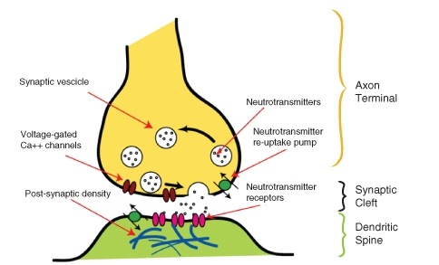

|     |     |     |     |
| --- | --- | --- | --- |Some Psychoactive Medicines and Their Uses
| Type | Uses | Example | Action |
| --- | --- | --- | --- |
| Anesthetics | Block pain and other sensations. Often induce unconsciousness, which allows patients to undergo medical procedures. | Lidocaine and nitrous oxide. | Mimic the inhibitory neurotransmitter GABA or increase the amount of GABA in the synapse, which prevents an action potential. |
| Painkillers (analgesics) | Reduce the sensation of pain. Includes narcotics and non-steroidal anti-inflammatory drugs (NSAIDS). | __Narcotics: morphine and codeine.__  NSAIDS: aspirin and acetaminophen (paracetamol). | Drug molecules mimic endogenous opioids (“natural painkillers”), such as endorphins, by binding to opioid receptors. |
| Antidepressants | Antidepressants are used to treat disorders such as clinical depression, anxiety, and eating disorders. | Selective Serotonin Reuptake Inhibitors (SSRIs) and Monoamine oxidase inhibitors (MAOIs). | SSRIs: Block the uptake of the neurotransmitter serotonin by the presynaptic neuron. MAOIs: Prevent an enzyme from breaking down serotonin in the synapse. Both actions result in an increase of serotonin in the synapse. |
| Stimulants | Used to treat disorders such as attention deficit disorder and to suppress the appetite. | Amphetamine salts. | Increases extracellular levels of dopamine, norepinephrine, and serotonin by various means. |
| Antipsychotics | Used to treat psychoses such as schizophrenia and mania. | Chlorpromazine. | Blocks dopamine receptors in postsynaptic neurons. |
| Cough medicines (antitussives). | Used to treat persistent coughing. | Dextromethorphan (DXM) and codeine. | Inhibits the action of the NMDA receptor in the postsynaptic cell. Reduces action potentials and is similar in action to anesthetics. |

#### Drug Abuse

Psychoactive drugs bring about changes in mood and feelings that a user may find desirable; therefore, many psychoactive substances are abused. **Drug abuse** is the repeated use of a drug without advice or guidance of a medical professional or use for reasons other than for what the drug was originally intended. With continued use of a drug, a person might find that they cannot function normally without the drug; this is a state called **physical dependence.** However, note that physical dependence is not in itself bad. For example, a person who has diabetes is physically dependent on insulin injections. Their body cannot work properly without it. Emotionally or mentally needing a drug to be able to function normally is called **psychological dependence.** When a person continues to take a psychoactive drug, they eventually need to take larger doses of the drug to get the desired effect. This process is known as building a **tolerance** to the drug. Drug tolerance can involve both psychological and physical factors.

A person who is abusing a drug may eventually lose control of their drug-taking behavior. This is partly due to the changes the drug has caused in their brain and partly due to learned drug-abuse behaviors (such as stealing and lying to get money or drugs). In the state of **addiction,** a drug addict’s life and activities revolve around getting more of the drug to feed their habit, even if it leads to severe consequences such as getting arrested, dropping out of school, or isolation from friends and family. In a person who is addicted to a drug, the pattern of increasing doses due to tolerance can lead to a **drug overdose** (also known as an OD). A drug overdose is generally considered harmful and may lead to death. Drug dependence and addiction are caused by changes in the way neurons in the CNS send and receive neurotransmitters. It is for this reason that dependency and addiction are treated as brain disorders by medical professionals.

Several classes of psychoactive drugs are commonly abused. **Stimulants,** such as cocaine, nicotine, and amphetamine, increase the activity of the sympathetic nervous system, the central nervous system, or both. Stimulants generally increase heart rate, blood pressure, and one's sense of alertness. Some stimulants, such as caffeine, are used medicinally to increase or maintain alertness and to counteract fatigue. High doses of stimulants can be fatal. A common source of nicotine is cigarette tobacco, which is shown in**Figure** [below](#x-ck12-QmlvMzViLTMz).

**Hypnotics,** also known as **depressants,** such as alcohol, codeine, barbiturates, and benzodiazepines, generally decrease the activity of the central nervous system. Depressants slow down brain function and give a drowsy or calm feeling. However, taking too much of a depressant drug can cause dangerously slow [breathing](https://flexbooks.ck12.org/cbook/ck-12-middle-school-life-science-2.0/section/11.35/primary/lesson/processes-of-breathing-ms-ls?referrer=crossref "breathing") and heart rates and may result in death. Many depressants acting on the CNS do so by increasing the activity of the inhibitory neurotransmitter gamma-aminobutyric acid (GABA), although there are many receptors that are affected by different depressants. GABA calms the activity of the CNS and promotes sleep. Drugs that stimulate the activity of this amino acid slow down brain function and cause a drowsy or calm feeling, so depressants are generally prescribed to relieve symptoms of anxiety or insomnia.

**Hallucinogens,** also known as psychedelic drugs, such as lysergic acid diethylamide (LSD), phencyclidine (PCP), and ketamine, are psychoactive drugs that do not increase or decrease a certain feeling or emotion, but rather induce experiences, such as sensory distortions and “out-of-body experiences,” that are very different from those of ordinary consciousness. These experiences are often called trance-like states. The use of psychedelic drugs has been linked to a potential for brain damage.

There are many ways in which psychoactive drugs can affect the CNS. Each drug has a specific action on one or more neurotransmitters or receptors. Drugs that increase activity in particular neurotransmitter systems are called **agonists.** They act by increasing the synthesis of one or more neurotransmitters or reducing its reuptake from the synapses. Drugs that reduce neurotransmitter activity are called **antagonists** and work by interfering with synthesis or blocking postsynaptic receptors so that neurotransmitters cannot bind to them. The drug ketamine, which is used as an anesthetic and a painkiller, blocks the action of the neurotransmitter glutamate. Diacetylmorphine (heroin) enhances the action of endorphins in the brain. Different drugs also affect different parts of the brain. For example, drugs that affect breathing, such as cough suppressants, affect the brainstem to stop the coughing reflex. Painkillers (analgesics) block pain messages coming through the spinal cord from the body. In**Figure** [below](#x-ck12-QmlvMzViLTM0) the brainstem region is blue, and the spinal cord is yellow.

##### **How Addiction Happens**

The **neurobiological theory of addiction** proposes that certain chemical pathways are greatly changed in the brain of an addicted person. Almost all drugs that are abused affect a certain set of brain structures in the limbic system, which is also called the "brain reward system." (see **Figure** [below](#x-ck12-QmlvMzViLTM0)). The neurotransmitter dopamine is commonly associated with the brain reward system. Dopamine is released at synapses by neurons when a person has a pleasurable experience such as eating a favorite food or eating when very hungry. This system provides feelings of pleasure (the “reward”)and motivates a person to perform certain activities over and over again. Such mechanisms have evolved to ensure the survival of organisms.

 includes structures in the human brain that have been linked to emotion, motivation, and emotional association with memory. The action of neurotransmitters in the limbic system is altered by addictive drugs.")

Some drugs, such as cocaine, nicotine, amphetamines, and alcohol, directly or indirectly increase the amount of dopamine in the limbic structures. The pleasurable feelings that these drugs produce trick the body into thinking that the drug is good, important for survival, and needs to be taken repeatedly. Drugs that directly affect the brain reward system are highly addictive. The stimulant nicotine, which is found in tobacco, is one such drug.

Cocaine is an example of a psychoactive drug that is both used as a medicine and abused as a drug. Cocaine is highly addictive. It is a dopamine transporter blocker—it blocks the reuptake of dopamine by the presynaptic neuron. This action increases the amount of dopamine left in the synaptic cleft, so dopamine has a stronger effect on the postsynaptic neuron. Continued cocaine use causes a reduction in the number of dopamine receptors on the postsynaptic neuron. Eventually, the postsynaptic neuron becomes understimulated because there are fewer dopamine receptors on it to respond to dopamine. At this point, more cocaine must be taken to stimulate the postsynaptic neuron into an action potential. If a person becomes dependent on the drug, they need cocaine for their body to act normally. If a person were to stop taking the drug at this point, their body would not be able to act normally, and they would experience a range of uncomfortable and painful symptoms called **withdrawal.** Symptoms of withdrawal include vomiting, diarrhea, and depression.

Many psychoactive substances are used or abused for their mood and perception altering effects including those with accepted uses in medicine and psychiatry. Classes of drugs that are frequently abused include some of the drugs listed in**Table** [below](#x-ck12-dGFibGU6Y29tbW9uX2RydWdzX29mX2FidXNl). Drugs that are deemed to have no medical use and a high potential for abuse are usually illegal.

Not all drugs are physically addictive, but any activity that stimulates the brain reward system can lead to psychological addiction. Drugs that are most likely to cause addiction are drugs that directly stimulate the dopaminergic system like cocaine, nicotine, and amphetamines. Drugs that only indirectly stimulate the dopaminergic system, such as psychedelics, are not as likely to be addictive.

|     |     |     |     |
| --- | --- | --- | --- |Some Commonly Abused Drugs
| Psychoactive Drugs | Effects | Examples | Some Common Forms or Names |
| --- | --- | --- | --- |
| Stimulants | Elevate the central nervous system and raise levels of alertness and wakefulness. | Caffeine, cocaine, amphetamine, and methamphetamine. | Coffee, coke, meth, and ecstasy (X). |
| Hallucinogens | Induce perceptual and cognitive distortions. | LSD, psilocybin, mescaline, and PCP. | Acid, magic mushrooms, peyote, and angel dust. |
| Hypnotics | Depress the CNS and induce sleep. | Barbiturates, opioids (e.g. codeine, morphine, and oxycodone), benzodiazepines, and ethanol. | Diazapam and alcohol. |
| Analgesics | Induce euphoria and reduce sensation of pain. | Codeine, morphine, ketamine, heroin, phencyclidine (PCP), and tetrahydrocannabinol (THC). | Horse, angel dust, cannabis, and marijuana. |

 

!?[0](https://www.youtube.com/watch?v=9mcuIc5O-DE)

### Summary

* Psychoactive drugs alter cognitive function by altering neurotransmission; stimulants, hypnotics, and hallucinogens are three common types of psychoactive drugs that are abused.
* Drugs include all substances that affect the body's structure or function, while medicine is a drug that is taken on a doctor's recommendation to cure or reduce the symptoms of an illness.
* Drugs cause physical and/or psychological dependence, and addicts often form a tolerance, which can sometimes lead to a drug overdose.

### Review

1.  How does a psychoactive drug affect the brain?
2.  What are the results of drug abuse?
3.  What are the differences between stimulants, hallucinogens, hypnotics, and analgesics?

</article>

## 8.8 Diseases and Disorders

<article>

We all get headaches. Headaches are a relatively minor problem associated with the nervous system. But what about more serious issues of the nervous system? As you can probably imagine, these can be extremely serious.

### Disorders of the Nervous System

There are several different types of problems that can affect the nervous system:

* **Vascular disorders** involve problems with blood flow. For example, a stroke occurs when a blood clot blocks blood flow to part of the brain. Brain cells die quickly if their oxygen supply is cut off. This can cause paralysis and loss of other normal functions, depending on the part of the brain that is damaged.
* Nervous tissue may become infected by microorganisms. **Meningitis,** for example, is caused by a viral or bacterial infection of the tissues covering the brain. This may cause the brain to swell and lead to brain damage and death.
* Brain or spinal cord injuries may cause paralysis and other disabilities. Injuries to peripheral nerves can cause localized pain or numbness.
* Abnormal brain functions can occur for a variety of reasons. Examples include headaches, such as migraine headaches, and epilepsy, in which seizures occur.
* Nervous tissue may degenerate or break down. **Alzheimer’s disease** is an example of this type of disorder as is **Amyotrophic lateral sclerosis,** or ALS. ALS, also known as Lou Gehrig's disease, leads to a gradual loss of higher brain functions.Alzheimer's Disease: Is the Cure in the Genes?

Alzheimer's disease is a progressive form of dementia that results in a major decline in mental abilities. This disease has been associated with the build-up of plaque in the brains of Alzheimer's patients. Amyloid Precursor Protein (APP) is a protein in the brain that is digested by enzymes and forms the plaques that are characteristic of Alzheimer's disease.

By 2050, as the U.S. population ages, 15 million Americans will suffer from Alzheimer's disease - triple today's number. But genetic studies may provide information leading to a cure.

!?[0](https://www.youtube.com/watch?v=D9QAIseYPYs)

In April 2011, an international analysis of the genes of more than 50,000 people led to the discovery of five new genes that make Alzheimer's disease more likely in the elderly. This discovery provides clues about what might start the Alzheimer's disease process and fuel its progress in a person’s brain.In July 2012, it was announced that a variant of the APP gene makes the protein less likely to be digested by enzymes, and therefore probably reduces its ability to form plaques. Though this allele is very rare, this information does suggest that blocking the enzymatic digestion of APP might be helpful in preventing or slowing Alzheimer's disease, if it can be done through other means such as a drug treatment.

### Summary

* A variety of disorders, caused by blood flow issues, genetics, or infection, can reduce brain function or affect other parts of the nervous system.

### Review

1.  What is meningitis?
2.  What is Alzheimer's?

</article>

## 9.1 The Skeleton

<article>

Try to imagine what you would look like without them. You would be a soft, wobbly pile of skin, [muscles](https://flexbooks.ck12.org/cbook/ck-12-middle-school-life-science-2.0/section/11.9/primary/lesson/smooth-skeletal-and-cardiac-muscles-ms-ls?referrer=crossref "muscles"), and internal organs, so you might look something like a very large slug. Not that you would be able to see yourself—folds of skin would droop down over your [eyes](https://flexbooks.ck12.org/cbook/ck-12-middle-school-life-science-2.0/section/11.48/primary/lesson/how-the-eye-works-ms-ls?referrer=crossref "eyes") and block your vision because of your lack of skull bones. You could push the skin out of the way, if you could only move your arms, but you need bones for that as well!

### The Skeleton

How important is your skeleton? Can you imagine what you would look like without it? You would be a wobbly pile of muscle and internal organs, maybe a little similar to the slug in**Figure** [below](#x-ck12-QmlvMzYtMDE.). Not that you would be able to see yourself anyway, due to the folds of skin that would droop over your eyes because of your lack of skull bones. You could push the skin out of the way, if you could only move your arms!

, unlike you, can live just fine without a bony skeleton. They can do so because they are relatively small, and their food source (vegetation) is plentiful and tends not to run away from them. Slugs move by causing a wave-like motion in their foot (the ventral (bottom) area of the slug that is in contact with the ground). Slugs and other gastropods also live in environments very different to human environments. Just think of how a bony skeleton would be of limited use to a slug whose lifetime is spent under a log munching on rotting leaf litter.")

Humans are vertebrates, which are animals that have a vertebral column, or backbone. Invertebrates, like the banana slug in**Figure** [above](#x-ck12-QmlvMzYtMDE.), do not have a vertebral column, and they use a different mechanism than vertebrates to move about. The sturdy internal framework of bones and cartilage that is found inside vertebrates, including humans, is called an **endoskeleton.** The adult human skeleton consists of approximately 206 bones, some of which are named in**Figure** [below](#x-ck12-QmlvMzYtMDEtMDI.). **Cartilage,** another component of the skeleton, can also be seen in**Figure** [below](#x-ck12-QmlvMzYtMDEtMDI.). Cartilage is a type of dense connective tissue that is made of tough protein fibers. The function of cartilage in the adult skeleton is to provide smooth surfaces for the movement of bones at a joint. A **ligament** is a band of tough fibrous tissue that connects bones together. Ligaments are not very elastic, and some even prevent the movement of certain bones.

The skeletons of babies and children have many more bones and more cartilage than adults have. As a child grows, these “extra” bones, such as the bones of the skull (cranium) and the sacrum (tailbone), fuse together, and cartilage gradually hardens to become bone tissue.

 protect your brain, and your ribcage protects your heart and lungs. Cartilage is the light-gray material that is found between some of the bones and also between the ribcage and sternum.")

The bones of the skeleton can be grouped into two divisions: the axial skeleton and appendicular skeleton. The **axial skeleton** includes the bones of the head, vertebral column, ribs, and sternum and is shown in the right portion of**Figure** [below](#x-ck12-QmlvMzYtMDEtMDM.). There are 80 bones in the axial skeleton. The **appendicular skeleton** includes the bones of the limbs (arms and legs) along with the scapula and the pelvis. It is shown on the left in**Figure** [below](#x-ck12-QmlvMzYtMDEtMDM.). There are approximately 126 bones in the appendicular skeleton. Limbs are connected to the rest of the skeleton by collections of bones called girdles. The pectoral girdle consists of the clavicle (collar bone) and the scapula (shoulder blade). The pelvic girdle consists of two pelvic bones (hipbones). The vertebral column attaches to the top of the pelvis; the femur of each leg attaches to the bottom. The humerus is joined to the pectoral girdle at a joint and is held in place by muscles and ligaments.

### Summary

* Children are born with significantly more bones and cartilage than adults; the cartilage hardens to become bone, and smaller bones fuse together to become the 206 adult bones.
* There are two parts of the human skeleton - the axial and appendicular skeletons.

### Review

1.  What is the axial skeleton?
2.  What is the appendicular skeleton?
3.  What purpose does cartilage serve? Ligaments?

</article>

## 9.2 Bones

<article>

It's common to think of bones as not living. But bones are very much living. In fact, you are constantly making new bone tissue. That means that you are also constantly getting rid of bone. Bone is full of blood, nerves, and all sorts of cells and proteins, making it an extremely complex living tissue.

### Function and Structure of Bones

Many people think of **bones** as dry, dead, and brittle, which is what you might think if you saw a preserved skeleton in a museum. The association of bones with death is illustrated by the sweets shown in**Figure** [below](#x-ck12-QmlvMzYxLTA0). This is a common association because the calcium-rich bone tissue of a vertebrate is the last thing to decompose after the organism dies. However, the bones in your body are very much alive. They contain many tough protein fibers, are crisscrossed by blood vessels, and certain parts of your bones are metabolically active. Preserved [laboratory](https://www.ck12.org/c/biology/laboratory?referrer=crossref "laboratory") skeletons are cleaned with chemicals that remove all organic matter from the bones, which leaves only the calcium-rich, mineralized (hardened) bone tissue behind.

, a time (the 1_st_ and 2_nd_ of November) during which the people of Mexico and some Latin American countries celebrate and honor the lives of the deceased and celebrate the continuation of life. Skulls and bones are closely associated with death in many cultures.")

#### Functions of Bones

As you read earlier in this lesson, your skeletal system is important for the proper functioning of your body. In addition to giving shape and form to the body, bones have many other important functions:

* Structural support of the body: The skeleton supports the body against the pull of gravity. The large bones of the lower limbs support the trunk when standing.
* Protection of internal organs: The skeleton provides a rigid frame work that supports and protects the soft organs of the body. The fused bones of the cranium surround the brain to make it less vulnerable to injury. Vertebrae surround and protect the spinal cord, and bones of the rib cage help protect the heart and lungs.
* Attachment of the [muscles](https://flexbooks.ck12.org/cbook/ck-12-middle-school-life-science-2.0/section/11.9/primary/lesson/smooth-skeletal-and-cardiac-muscles-ms-ls?referrer=crossref "muscles"): The skeleton provides attachment surfaces for muscles and tendons, which together enable movement of the body.
* Movement of the body: Bones work together with muscles as simple mechanical lever systems to produce body movement.
* Production of blood cells: The formation of blood cells takes place mostly in the interior (marrow) of certain types of bones.
* Storage of minerals: Bones contain more calcium than any other organ in the form of calcium salts such as calcium phosphate. Calcium is released by the bones when blood levels of calcium drop too low. Phosphorus is also stored in bones.

#### Structure of Bones

Although bones vary greatly in size and shape, they all have certain structural similarities. Bones are organs. Recall that organs are made up of two or more types of tissues. The two main types of bone tissue are compact bone and spongy bone. **Compact bone** makes up the dense outer layer of bones. **Spongy bone** is lighter and less dense than compact bone and is found toward the center of the bone. **Periosteum** (from _peri_ = around and _osteo_ = bone) is the tough, shiny, white membrane that covers all surfaces of bones except at the joint surfaces. Periosteum is composed of a layer of fibrous connective tissue and a layer of bone forming cells. These structures can be seen in**Figure** [below](#x-ck12-QmlvMzYxLTA1).

Bones consist of different types of tissue including compact bone, spongy bone, bone marrow, and periosteum.

* Compact bone makes up the dense outer layer of bones. Its functional unit is the **osteon.** Compact bone is very hard and strong.
* Spongy bone is found inside bones and is lighter and less dense than compact bone. This is because spongy bone is porous.
* **Bone marrow** is a soft connective tissue that produces blood cells. It is found inside the pores of spongy bone.
* Periosteum is a tough fibrous membrane that covers and protects the outer surfaces of bones.

##### **Compact Bone**

Just below the periosteum is the hard layer of compact bone tissue. It is so called due to its high density, and it accounts for about 80% of the total bone mass of an adult skeleton. Compact bone is extremely hard and is made up of many cylinder-shaped units called osteons, or Haversian systems. Osteons act like strong pillars within the bone to give the bone strength and allow it to bear the weight of the attached muscles and withstand the stresses of movement. As you can see in**Figure** [above](#x-ck12-QmlvMzYtMDEtMDY.), osteons are made up of rings of calcium salts and collagen fibers, called bone matrix. **Bone matrix** is a mixture of calcium salts, such as calcium phosphate and calcium hydroxide, and collagen fibers (a type of protein), which form hollow tubes that look similar to the rings on a tree. Each of these matrix tubes is a lamella, which means “thin plate” (plural: lamellae). The calcium salts form crystals that give bones great strength, but the crystals do not bend easily and tend to shatter if stressed. Collagen fibers are tough and flexible. All collagen fibers within a single lamella are lined up in the same direction, which gives each lamella great strength. Overall, the protein-calcium crystal combination in the matrix allows bones to bend and twist without breaking easily. The collagen fibers also act as a scaffold for the laying down of new calcium salts.

In the center of each osteon is a **Haversian canal.** The canal serves as a passageway for blood vessels and nerves. Within each osteon, many bone cells called osteocytes are located. Osteocytes are found in little pockets called lacunae that are sandwiched between layers of bone matrix. You can see lamellae and osteocytes in their lacunae in **Figure** [below](#x-ck12-QmlvcDM2LTAxLTA3). **Osteocytes** are responsible for monitoring the protein and mineral contents of the bone, and they direct both the release of calcium into the blood and the uptake up of calcium salts into the bone. Other bone cells, called **osteoblasts,** secrete the organic content of matrix and are responsible for the growth of new bone. Osteoblasts are found near the surface of bones. **Osteoclasts** are bone cells that remove calcium salts from bone matrix. These bone cells will be discussed in further detail later in this lesson. In the meantime,**Table** [below](#x-ck12-dGFibGU6c3RydWN0dXJlX2Z1bmN0aW9uX29mX2JvbmVz) describes some of the different structures and functions of bones.

|     | Function | Location |
| --- | --- | --- |
| **Osteons (also known as Haversian systems)** | Act like pillars to give bones strength. | Compact bone |
| **Bone matrix** | A mixture of calcium salts and collagen fibers that form hollow tubes that look similar to the rings on a tree. | Compact bone and spongy bone |
| **Lamella** | Layers of bone matrix in which collagen fibers point in the opposite direction of the fibers of the lamellae to each side, offering great strength and flexibility. | Are the “tree rings” of osteons |
| **Lacunae** | Location of osteocytes. | Between lamellae of bone matrix |
| **Osteocytes** | Monitor the protein and mineral contents of bones and direct both the release of calcium into the blood and the uptake up of calcium salts into the bone. | Within lacunae of osteons |
| **Osteoblasts** | Bone-forming cells that secrete organic parts of matrix (collagen). | Found near the surface of bones |
| **Osteoclasts** | Responsible for the breakdown of matrix and the release of calcium salts into the blood. | Bone surfaces |
| **Chondrocyte** | Cartilage-forming cell. |     |
| **Periosteum** | Contains pain receptors and is sensitive to pressure or stress. It provides both nourishment through a good supply of blood and an attachment for muscles and tendons. |     |
| **Collagen fibers** | Tough protein fibers that give bones flexibility and prevent shattering. |     |
| **Calcium salts** | Form crystals that give bones great strength. |     |

##### **Spongy Bone**

Spongy bone occurs at the ends of long bones and is less dense than compact bone. The term “spongy” refers only to the appearance of the bone, as spongy bone is quite strong. The lamellae of spongy bone form an open, porous network of bony branches, or beams, called trabiculae, that give the bone strength and make the bone lighter. This also allows room for blood vessels and bone marrow. Spongy bone does not have osteons; instead, nutrients reach the osteocytes of spongy bone by diffusion through tiny openings in the surface of the spongy bone. Spongy bone makes up the bulk of the interior of most bones including the vertebrae.

##### **Bone Marrow**

Many bones also contain a soft connective tissue called bone marrow. There are two types of bone marrow: red marrow and yellow marrow. Red marrow produces red blood cells, platelets, and most of the white blood cells for the body. Yellow marrow produces white blood cells. The color of yellow marrow is due to the high number of fat cells it contains. Both types of bone marrow contain numerous blood vessels and capillaries. In newborns, bones contain only red marrow. As the child ages, red marrow is mostly replaced by yellow marrow. In adults, red marrow is mostly found in the flat bones of the skull, the ribs, the vertebrae, and pelvic bones. It is also found between the spongy bone at the very top of the femur and the humerus.

##### **Periosteum**

The outer surfaces of bones—except where they make contact with other bones at joints—are covered by periosteum. Periosteum has a tough, external fibrous layer and an internal layer that contains osteoblasts (the bone-growing cells). The periosteum is richly supplied with blood, lymph, and nociceptors, which make it very sensitive to manipulation (recall that nociceptors are pain receptors that are also found in the skin and skeletal muscles). Periosteum provides nourishment to the bone through a rich blood supply. The periosteum is connected to the bone by strong collagen fibers called Sharpey's fibres, which extend into the outer lamellae of the compact bone.

#### Bone Shapes

The four main types of bones are long, short, flat, and irregular. The [classification](https://flexbooks.ck12.org/cbook/ck-12-middle-school-life-science-2.0/section/1.9/primary/lesson/organization-of-living-things-ms-ls?referrer=crossref "classification") of a bone as being long, short, flat, or irregular is based on the shape of the bone rather than the size of the bone. For example, both small and large bones can be classified as long bones. There are also some bones that are embedded in tendons; these bones tend to be oval-shaped and are called sesamoid bones.

* **Long Bones:** Bones that are longer than they are wide are called long bones. They consist of a long shaft with two bulky ends. Long bones are primarily made up of compact bone, but may also have a large amount of spongy bone at both ends. Long bones include bones of the thigh (femur), leg (tibia and fibula), arm (humerus), forearm (ulna and radius), and fingers (phalanges). The classification refers to the shape rather than the size.
* **Short Bones:** Short bones are roughly cube-shaped and have only a thin layer of compact bone surrounding a spongy interior. The bones of the wrist (carpals) and ankle (tarsals) are short bones, as are the sesamoid bones (see below).
* **Sesamoid Bones:** Sesamoid bones are embedded in tendons. Since they act to hold the tendon farther away from the joint, the angle of the tendon is increased and thus the force of the muscle is increased. An example of a sesamoid bone is the patella (kneecap).
* **Flat Bones:** Flat bones are thin and generally curved, with two parallel layers of compact bone sandwiching a layer of spongy bone. Most of the bones in the skull (cranium) are flat bones, as is the sternum (breastbone).
* **Irregular Bones:** Irregular bones are bones that do not fit into any of the above categories. They consist of thin layers of compact bone surrounding a spongy interior. As implied by the name, their shapes are irregular and complicated. The vertebrae and pelvis are irregular bones.

All bones have surface markings and characteristics that make a specific bone unique. There are holes, depressions, smooth facets, lines, projections, and other markings. These usually represent passageways for vessels and nerves, points of articulation with other bones, or points of attachment for tendons and ligaments.

#### Cellular Structure of Bone

When blood calcium levels decrease below normal, calcium is released from the bones so that there will be an adequate supply for metabolic needs. When blood calcium levels are increased, the excess calcium is stored in the bone matrix. The dynamic process of releasing and storing calcium goes on almost continuously and is carried out by different bone cells.

There are several types of bone cells:

* Osteoblasts are bone-forming cells that are located on the inner and outer surfaces of bones. They make a collagen-rich protein mixture (called osteoid), which mineralizes to become bone matrix. Osteoblasts are immature bone cells. Osteoblasts that become trapped in the bone matrix differentiate into osteocytes. The osteocytes stop making osteoid and instead direct both the release of calcium from the bones and the uptake of calcium from the blood.
* Osteocytes originate from osteoblasts that have migrated into, and become trapped and surrounded by, bone matrix, which they themselves produce. The spaces that they occupy are known as lacunae. Osteocytes are star-shaped, and they have many processes that reach out to meet osteoblasts probably for the purposes of [communication](https://flexbooks.ck12.org/cbook/ck-12-middle-school-life-science-2.0/section/8.7/primary/lesson/animal-communication-ms-ls?referrer=crossref "communication"). Their functions include matrix maintenance and calcium homeostasis. They are mature bone cells. Refer to**Figure** [above](#x-ck12-QmlvcDM2LTAxLTA3) for the location of osteocytes.
* Osteoclasts are the cells responsible for bone resorption, which is the remodeling of bone to reduce its volume (see below). Osteoclasts are large cells with many nuclei and are located on bone surfaces. They secrete acids that dissolve the calcium salts of the matrix, releasing them into the blood stream. This causes the calcium and phosphate concentrations of the blood to increase. Osteoclasts constantly remove minerals from the bone, and osteoblasts constantly produce matrix that binds minerals into the bone, so both of these cells are important in calcium homeostasis.

#### Bone Cells and Calcium Homeostasis

Remodeling, or bone turnover, is the process of resorption of minerals followed by replacement by bone matrix, which causes little overall change in the shape of the bone. This process occurs throughout a person's life. Osteoblasts and osteoclasts communicate with each other for this purpose. The purpose of remodeling is to regulate calcium homeostasis, repair micro-damaged bones (from everyday stress), and shape the skeleton during skeletal growth.

The process of bone resorption by the osteoclasts releases stored calcium into the systemic circulation and is an important process in regulating calcium balance. As bone formation actively fixes circulating calcium in its mineral form by removing it from the bloodstream, resorption actively unfixes it, thereby increasing circulating calcium levels. These processes occur in tandem at site-specific locations.

### Summary

* Under the direction of osteocytes, osteoblasts continuously build up bone, while osteoclasts continuously break down bone to maintain mineral homeostasis.
* Bone tissues include compact bone, spongy bone, bone marrow, and periosteum.

### Review

1.  List three functions of bone.
2.  Compare long bones to short bones.
3.  Give two examples of long bones.
4.  Compare and contrast the structures and functions of compact bone and spongy bone.
5.  Explain how bones maintain mineral homeostasis in the body.

</article>

## 9.3 Bone Formation

<article>

**How do bones grow?**

Bones are hard structures. So how do they grow? Well, bones are living tissue. They have a blood supply and grow from the cartilage at their ends. You are consistently making new bone. In fact, the human skeleton is replaced every 7-10 years.

### Development of Bones

**Ossification,** or **osteogenesis,** is the process of bone formation. This process begins early in fetal [development](https://www.ck12.org/c/biology/development?referrer=crossref "development"), usually by the end of the eighth week after conception. By this point, the skeletal pattern is formed by cartilage and connective tissue membranes, and ossification begins.

Early in fetal development, the skeleton is made of cartilage. Cartilage is a type of dense connective tissue that is composed of collagen and/or elastin fibers and cells called **chondrocytes,** which are all set in a gel-like substance called the extracellular matrix. Cartilage does not contain any blood vessels, so nutrients diffuse through the matrix to the chondrocytes. Cartilage serves several functions such as providing a framework upon which bone deposition can begin and supplying smooth surfaces for the movement of bones at a joint. Cartilage is shown in**Figure** [below](#x-ck12-QmlvMzYxLTA4).

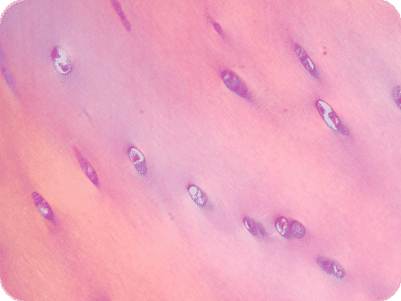

The bones of the body gradually form and harden throughout the remaining gestation period and for years after birth in a process called **endochondrial ossification.** However, not all parts of the fetal cartilage are replaced by bone; cartilage remains in many places of the body including the [joints](https://flexbooks.ck12.org/cbook/ck-12-middle-school-life-science-2.0/section/11.8/primary/lesson/skeletal-system-joints-ms-ls?referrer=crossref "joints"), the rib cage, the ears, the tip of the nose, the bronchial tubes, and the discs between vertebrae.

#### Endochondral Ossification

Endochondral ossification is the process of replacing cartilage with bony tissue, as shown in**Figure** [below](#x-ck12-QmlvLTIxLTA4LUJvbmUtZ3Jvd3Ro). Most of the bones of the skeleton are formed in this way. During the third month after conception, blood vessels form and grow into the cartilage, transporting osteoblasts, osteoclasts, and stem cells into the interior. These begin to change the cartilage into bone tissue. The osteoblasts form a bone collar of compact bone around the **diaphysis,** or central shaft, of the bone. Osteoclasts remove material from the center of the bone and form the central cavity of long bones. Ossification continues from the center of the bone toward the ends of the bones.

The cartilage at the ends of long bones are called the **epiphyses.** These continue to grow, so the developing bone increases in length. Later, usually after birth, secondary ossification centers form in the epiphyses, as shown in**Figure** [below](#x-ck12-QmlvLTIxLTA4LUJvbmUtZ3Jvd3Ro). Ossification in the epiphyses is similar to that in the center of the bone except that the spongy bone is kept instead of being broken down to form a cavity. When secondary ossification is complete, the cartilage is totally replaced by bone except in two areas. A region of cartilage remains over the surface of the epiphysis as articular cartilage, and another area of cartilage remains inside the bone at either end. This area is called the **epiphyseal plate** or growth region.

When a bone develops from a fibrous membrane, the process is called **intramembranous ossification.** Intramembranous ossification usually happens in flat bones such as the cranial bones and the clavicles. During intramembranous ossification in the developing fetus, the future bones are first formed as connective tissue membranes. Osteoblasts migrate to the membranes and secrete osteoid, which becomes mineralized and forms bone matrix. When the osteoblasts are surrounded by matrix, they are called osteocytes. Eventually, a bone collar of compact bone develops, and marrow develops inside the bone.

##### **Bone Elongation**

An infant is born with zones of cartilage called epiphyseal plates, as shown in**Figure** [below](#x-ck12-QmlvMzYtMDEtMTA.), between segments of bone to allow further growth of the bone. When the child reaches skeletal maturity (between the ages of 18 and 25 years), all of the cartilage in the plate is replaced by bone, which stops further growth.

Bones grow in length at the epiphyseal plate by a process that is similar to endochondral ossification. The chondrocytes in the region of the epiphyseal plate grow by mitosis and push older chondrocytes down toward the diaphysis. Eventually, these chondrocytes age and die. Osteoblasts move into this region and replace the chondrocytes with bone matrix. This process lengthens the bone and continues throughout childhood and the adolescent years until the cartilage growth slows down and finally stops. When cartilage growth stops (usually in the early twenties), the epiphyseal plate completely ossifies so that only a thin epiphyseal line remains, and the bones can no longer grow in length. Bone growth is under the influence of growth hormone from the anterior pituitary gland and sex hormones from the ovaries and testes.

Even though bones stop growing in length in early adulthood, they can continue to increase in thickness or diameter throughout life in response to stress from increased muscle activity or weight-bearing [exercise](https://flexbooks.ck12.org/cbook/ck-12-middle-school-life-science-2.0/section/11.11/primary/lesson/muscles-and-exercise-ms-ls?referrer=crossref "exercise").

 

!?[0](https://www.youtube.com/watch?v=yJoQj5-TIvE)

### Summary

* Bones grow through a process called ossification.
* Long bones consist of a central shaft (the diaphysis) and cartilaginous ends called epiphyses.
* It is at the epiphyses and the epiphyseal plates that chondrocytes undergo mitosis to lengthen the bones.

### Review

1.  What is ossification?
2.  What purpose does matrix serve?
3.  How do bones grow in length?

</article>

## 9.4 Joints

<article>

Running. A means of [terrestrial](https://flexbooks.ck12.org/cbook/ck-12-middle-school-life-science-2.0/section/12.13/primary/lesson/terrestrial-biomes-ms-ls?referrer=crossref "terrestrial") locomotion that allows humans and other animals to move rapidly on foot. The knees, which connect one part of the leg to the other, have to allow the legs to move. The knee is a joint, the part of the skeletal system that connects bones.

### Joints

A **joint** (also called an articulation) is a point at which two or more bones make contact. They are constructed to allow movement and provide mechanical support for the body. Joints are a type of lever, which is a rigid object that is used to increase the mechanical force that can be applied to another object. This reduces the amount of energy that needs to be spent when moving the body around. The articular surfaces of bones, which are the surfaces that meet at joints, are covered with a smooth layer of articular cartilage.

There are three types of joints: immovable, partly movable, and synovial.

 

#### Immovable Joint

At an **immovable joint** (or a fixed joint), bones are connected by dense connective tissue, which is usually collagen. Immovable joints, like those connecting the cranial bones, have edges that tightly interlock and do not allow movement. The connective tissue at immovable joints serves to absorb shocks that might otherwise break the bone.

#### Partly Movable Joints

At **partly movable joints** (or cartilaginous joints), bones are connected entirely by cartilage. Cartilaginous joints allow more movement between bones than a fibrous (fixed) joint does, but much less than the highly mobile synovial joint. Examples of partly-movable joints include the ribs, the sternum, and the vertebrae, which are shown in **Figure** [below](#x-ck12-QmlvMzYtMDEtMTE.). Partly-movable joints also form the growth regions of immature long bones.

 vertebrae is on the right.")

#### Synovial joints

**Synovial joints,** also known as movable joints, are the most mobile joints of all. They are also the most common type of joint in the body. Synovial joints contain a space between the bones of the joint (the articulating bones), which is filled with synovial fluid. **Synovial fluid** is a thick, stringy fluid that has the consistency of egg albumin. The word "synovial" comes from the Latin word for "egg." The fluid reduces friction between the articular cartilage and other tissues in joints and lubricates and cushions them during movement. There are many different types of synovial joints and many different examples. A synovial joint is shown in **Figure** [below](#x-ck12-QmlvLTIxLTA5LVN5bm92aWFsLWpvaW50).

The outer surface of the synovial joint contains ligaments that strengthen joints and hold bones in position. The inner surface (the synovial membrane) has cells that produce synovial fluid to lubricate the joint and prevent the two cartilage caps on the bones from rubbing together. Some joints also have tendons, which are bands of connective tissue that link [muscles](https://flexbooks.ck12.org/cbook/ck-12-middle-school-life-science-2.0/section/11.9/primary/lesson/smooth-skeletal-and-cardiac-muscles-ms-ls?referrer=crossref "muscles") to bones. **Bursae** are small sacs filled with synovial fluid that reduce friction in the joint. The knee joint contains 13 bursae. Synovial joints can be classified by the degree of mobility that they allow, as shown in**Figure** [below](#x-ck12-QmlvMzYtMDEtMTM.).

In a ball and socket joint, the ball-shaped surface of one bone fits into the cup-like depression of another. Examples of ball and socket joints include the hip (**Figure** [below](#x-ck12-QmlvMzYxLTE1)) and shoulder.

In an ellipsoidal joint, an ovoid articular surface fits into an elliptical cavity in such a way as to permit some back and forth movement, but not side-to-side motion. The wrist joint and knee (**Figure** [below](#x-ck12-QmlvMzYxLTE0)) are examples of this type of joint.

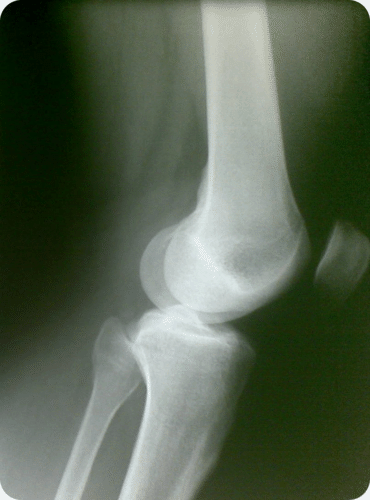

In a saddle joint, the opposing bone surfaces are fit together like a person sitting in a saddle. The movements at a saddle joint are the same as in an ellipsoidal joint. The best example of this is the joint between the carpals and metacarpals of the thumb.

In the hinge joint, the articular surfaces fit together in such a way as to permit motion only in one plane: forward and backward. The extent of motion, however, is considerable. An example of a hinge joint is the elbow.

The pivot joint is formed by a process that rotates within a ring; the ring is formed partly of bone and partly of ligament. An example of a pivot joint is the joint between the radius and ulna that allows you to turn the palm of your hand up and down.

A gliding joint, also known as a plane joint, is a joint that allows one bone to slide over another, such as between the carpels of the fingers. Gliding joints are also found in your wrists and ankles.

Not all bones are directly interconnected; there are 6 bones in the middle ears called the ossicles (three on each side) that articulate only with each other. The hyoid bone, which is located in the neck and serves as the point of attachment for the tongue, does not articulate with any other bones in the body, but is supported by muscles and ligaments.

The longest and heaviest bone in the body is the femur, and the smallest is the stapes in the middle ear. In an adult, the skeleton makes up around 20% of the total body weight.

!?[0](https://www.youtube.com/watch?v=zWo9-3GJpr8)

### Summary

* Joints are the points at which two or more bones make contact.
* There are 3 types of joints: immovable, partly movable, and synovial joints, which are movable.
* There are 6 types of synovial joints: ball and socket, ellipsoidal, saddle, hinge, pivot, and gliding.

### Review

1.  What differentiates a synovial joint from other types of joints?
2.  For each joint, give the type of joint it is and a general description of how that joint type can move.
    1.  Ulna/Radius.
    2.  Knee.
    3.  Elbow.
    4.  Thumb carpal/metacarpal.
    5.  Shoulder.
    6.  Finger carpal/metacarpal.

</article>

## 9.5 Skeletal System Diseases and Disorders

<article>

**Do you think this would hurt? Why?**

That would probably hurt a lot. Broken bones, or fractures, may be one of the more common problems of the skeletal system. And this one would need surgery to fix. But, in addition to broken bones, there are other problems and diseases of the skeletal system.

### Homeostatic Imbalances of Bone

Despite their great strength, bones can **fracture,** or break. Fractures can occur at different places on a bone and are usually due to excessive bending stress on the bone. Fractures can be complete, in which the bone is completely broken, or incomplete, in which the bone is cracked or chipped but not broken all the way (see **Figure** [below](#x-ck12-QmlvMzYxLTE2)). Immediately after a fracture, blood vessels that were torn leak blood into surrounding tissues, and a mass of clotted blood, called a hematoma, forms. The area becomes swollen and sore. Within a few days, capillaries begin to grow into the hematoma, and white blood cells clean up the dead and dying cells. Fibroblasts, osteoblasts, and chondroblasts arrive and begin to rebuild the bone. Fibroblasts produce collagen fibers that span the area of the break and connect the ends of the broken bone together. Osteoblasts begin to form spongy bone, and chondroblasts form cartilage matrix. The cartilage and spongy bone are replaced by a bony growth called a callus, which forms about 3 to 4 weeks after the fracture. This growth continues until the break is firmly sealed 2 to 3 months later. Eventually, the bony callus is replaced by spongy and compact bone, similar to the rest of the bone.

**Rickets** is a softening of the bones in children, which potentially leads to fractures and deformity; bowing of the leg bones is shown in**Figure** [below](#x-ck12-QmlvMzYxLTE3). Rickets is among the most frequent childhood diseases in many developing countries. The most common cause is a vitamin D deficiency. Vitamin D is needed by the body to absorb calcium from foods and to form bones. However, lack of calcium in one's diet may also cause rickets. Although it can occur in adults, most cases of rickets occur in children who suffer from severe malnutrition, which usually results from starvation during early childhood. Osteomalacia is the term used to describe a similar condition occurring in adults, which is also generally due to a deficiency of vitamin D. Osteomalacia can result in bone pain, difficulty in putting weight on bones, and sometimes fractures.

Some studies show that most people get enough Vitamin D through their food and exposure to ultraviolet (UV) radiation in sunlight. Vitamin D is produced by certain skin cells from a compound found inside the cells. The skin cells need UV light for this reaction to happen. However, eating foods fortified with Vitamin D or taking a dietary supplement pill is usually preferred to UV exposure due to the increased risk of sun burn and skin cancer. Many countries have fortified certain foods, such as milk, bread, and breakfast cereals, with Vitamin D to help prevent deficiency.

#### Osteoporosis

**Osteoporosis** is a disease in which the breakdown of bone matrix by osteoclasts is greater than the building of bone matrix by osteoblasts. This results in greatly decreased bone mass, causing bones to become lighter and more porous. Bones are then more prone to breakage, especially the vertebrae and femurs. Compression fractures of the vertebrae and hip breaks, in which the top (or head) of the femur breaks, are common and can lead to further immobility, making the disease worse. Osteoporosis mostly occurs in older women and is linked to the decrease in production of sex hormones. However, poor nutrition, especially diets that are low in calcium and vitamin D, increases the risk of osteoporosis in later life. One of the easiest ways to prevent osteoporosis is to eat a healthy diet that has adequate calcium and vitamin D.

#### Osteoarthritis

**Osteoarthritis** is a condition in which wearing and breakdown of the cartilage that covers the ends of the bones leads to pain and stiffness in the joint. Decreased movement of the joint because of the pain may cause [muscles](https://flexbooks.ck12.org/cbook/ck-12-middle-school-life-science-2.0/section/11.9/primary/lesson/smooth-skeletal-and-cardiac-muscles-ms-ls?referrer=crossref "muscles") that are attached to the joint to become weaker, and ligaments may become looser. Osteoarthritis is the most common form of arthritis. Some of the most common causes include old age, sports injuries to the joint, bone fractures, and being overweight or obese. A total hip replacement is a common treatment for osteoarthritis. An X-ray image of a replacement hip joint is shown in**Figure** [above](#x-ck12-QmlvMzYxLTE4).

#### Skeletal Dysplasias

The skeletal dysplasias are a group of hundreds (more than 380 conditions ) of genetic conditions that affect bone and cartilage growth. A child born with skeletal dysplasia will have abnormal differences in the size and shape of their legs, arms, trunk, or skull. He or she may be very short in stature. Additionally, he or she may have arms and legs that are not in proportion with the rest of the body.

**Achondroplasia,** the most common form of dwarfism, is a skeletal dysplasia. Achondroplasia is discussed in the _Human Genetics: Genetic Disorders (Advanced)_ concept.

### Summary

* Fractures are the most common form of injury to bones.
* Vitamin D or calcium deficiency can lead to rickets and/or osteoporosis.
* Osteoporosis and osteoarthritis are both more common in the elderly.

### Review

1.  What can cause osteoarthritis other than old age?
2.  Why is Vitamin D so important for healthy bones?
3.  What is osteomalacia?

</article>

## 10.1 Muscular System Tissues

<article>

**What exactly are muscles?**

Does the word "muscle" make you think of the biceps of a weightlifter like the man pictured above? Muscles that move the body are easy to feel and see, but they aren’t the only muscles in the [human body](https://flexbooks.ck12.org/cbook/ck-12-middle-school-life-science-2.0/section/11.1/primary/lesson/organization-of-the-human-body-ms-ls?referrer=crossref "human body"). Many muscles are deep within the body. They form the walls of internal organs such as the heart and stomach. You can flex your biceps like a body builder, but you cannot control the muscles inside you. It’s a good thing that they work on their own without any conscious effort on your part because movements of these muscles are essential for survival.

### Muscle Tissues

The muscular system is the biological system that allows humans to move. The muscular system, in vertebrates, is controlled through the nervous system. Much of your muscle movement occurs without your conscious control and is necessary for your survival. The contractions of your heart and the intestinal movements, called peristalis, that push food through your digestive system are examples of involuntary muscle movements. Involuntary muscle movement is controlled by the autonomic nervous system. Voluntary muscle contractions are used to move the body and can be finely controlled, such as the pincer-type movements of the fingers that are needed to pick up chess pieces or the gross movements of legs, arms, and the torso that are needed in skating, as shown in**Figure** [below](#x-ck12-QmlvMzYtMDItMDE.). Voluntary muscle movement is controlled by the somatic nervous system.

Each muscle in the body is composed of specialized structures called muscle fibers. **Muscle fibers** are long, thin cells that have a special talent that other cells do not have—they are able to contract. Muscles, where attached to bones or internal organs and blood vessels, are responsible for movement. Nearly all movement in the body is the result of muscle contractions. Exceptions to this are the actions of cilia, the flagellum on sperm cells, and the amoeboid movements of some white blood cells.

There are three types of muscle tissue in the body: skeletal, smooth, and cardiac.

* **Skeletal muscle** is usually attached to the skeleton. Skeletal muscles are used to move the body. They generally contract voluntarily (controlled by the somatic nervous system), although they can also contract involuntarily through reflexes.
* **Smooth muscle** is found within the walls of organs and structures such as the esophagus, stomach, intestines, bronchi, uterus, urethra, bladder, and blood vessels. Unlike skeletal muscle, smooth muscle is involuntary muscle, which means it is not under your conscious control.
* **Cardiac muscle** is also an involuntary muscle, but it is a specialized kind of muscle found only within the heart.

Cardiac and skeletal muscles are striated (they have **striations**), meaning they contain highly-regular arrangements of bundles of protein fibers that give them a “striped” appearance. Smooth muscle does not have such bundles of fibers and is non-striated. While skeletal muscles are arranged in regular, parallel bundles, cardiac muscle fibers connect at branching, irregular angles. Skeletal muscle contracts and relaxes in short, intense bursts, whereas cardiac muscle contracts constantly for 70 to 80 years (an average life span) or even longer.

.")

#### Skeletal Muscle

Skeletal muscle, which is attached to bone, is responsible for body movements and body posture. There are approximately 639 skeletal muscles in the human body, all under voluntary control. Some are shown in **Figure** [above](#x-ck12-QmlvMzYtMDItMDI.). The basic units of skeletal muscles are muscle cells that have many nuclei. Each cell acts independently of its neighboring muscle cells. These cells also contain light and dark stripes called striations, which are shown in**Figure** [below](#x-ck12-QmlvMzYyLW8z). The striations are a result of the orientation of the contractile proteins inside the cells. On average, adult males are made up of 40 to 50 percent skeletal muscle tissue, and an adult female is made up of 30 to 40 percent skeletal muscle tissue.

#### Smooth Muscle

Smooth muscle is found in the walls of the hollow internal organs such as blood vessels, the intestinal tract, the urinary bladder, and the uterus. It is under the control of the autonomic nervous system. Unlike skeletal muscle, smooth muscle cells do not have striations (smooth muscle is called non-striated muscle). Smooth muscle cells are spindle-shaped, have one central nucleus, and are generally arranged in sheets or bundles rather than the regular grouping that skeletal muscle cells form. Smooth muscle cells are connected by **gap junctions,** which are little pores or gaps in the cell membrane that link adjoining cells, allowing for quick passage of chemical messages between cells. Smooth muscle is very different from skeletal muscle and cardiac muscle in terms of structure and function, as shown in**Figure** [below](#x-ck12-QmlvMzYtMDItMDQ.). Smooth muscle contracts slowly and rhythmically.

. The spindly shape of smooth muscle cells can be seen in (b).")

#### Cardiac Muscle

Cardiac muscle, which is found in the walls of the heart, is also under the control of the autonomic nervous system. A cardiac muscle cell has characteristics of both a smooth muscle and a skeletal muscle cell. It has one central nucleus, similar to smooth muscle, but is striated like skeletal muscle. The cardiac muscle cell is rectangular in shape, as can been seen in**Figure** [below](#x-ck12-QmlvMzYyLTA1YQ..). The contraction of cardiac muscle is involuntary, strong, and rhythmical. Cardiac muscle has many adaptations that makes it highly resistant to fatigue. For example, it has the largest number of mitochondria per cell of any muscle type. The mitochondria supply the cardiac cells with energy for constant movement. Cardiac cells also contain myoglobins (oxygen-storing pigments) and are provided with a large amount of nutrients and oxygen by a rich blood supply.

Cardiac muscle is similar to skeletal muscle in chemical composition and action. However, the structure of cardiac muscle is different in that the muscle fibers are typically branched, like a tree branch, and connect to other cardiac muscle fibers through intercalated discs, which are a type of gap junction. A close-up of an intercalated disc is shown in**Figure** [below](#x-ck12-QmlvMzYyLTA1YQ..).

!?[0](https://www.youtube.com/watch?v=raGl8bLkaAw)

### Summary

* 639 muscles are skeletal muscles; these are voluntarily controlled, striated, and attached to bones.
* The muscles lining internal organs are composed of non-striated cells and are controlled by the autonomic nervous system.
* Cardiac muscles are specialized striated muscles that are involuntarily controlled and found only in the heart.

### Review

1.  What are the similarities and differences between the three muscle types?
2.  What are intercalated discs?

</article>

## 10.2 Muscular System Structure

<article>

**How do your bones move?**

By the contractions and extensions of your skeletal muscles. Notice how the [muscles](https://flexbooks.ck12.org/cbook/ck-12-middle-school-life-science-2.0/section/11.9/primary/lesson/smooth-skeletal-and-cardiac-muscles-ms-ls?referrer=crossref "muscles") are attached to the bones. The muscles pull on the bones, causing movement.

### Structure of Muscle Tissue

A whole skeletal muscle is an organ of the muscular system. Each skeletal muscle consists of skeletal muscle tissue, connective tissue, nerve tissue, and vascular tissue. Skeletal muscles vary considerably in size, shape, and arrangement of fibers. They range from extremely tiny strands, such as the tiny muscles of the middle ear, to large masses such as the quadricep muscles of the thigh.

Each skeletal muscle fiber is a single large, cylindrical muscle cell. Skeletal muscle fibers differ from “regular” [body cells](https://www.ck12.org/c/biology/body-cells?referrer=crossref "body cells"). They are multinucleated, which means they have many nuclei in a single cell. During [development](https://www.ck12.org/c/biology/development?referrer=crossref "development"), many stem cells, called myoblasts, fuse together to form muscle fibers. Each nucleus in a fiber originated from a single myoblast. Smooth and cardiac muscle fibers do not develop in this way.

An individual skeletal muscle may be made up of hundreds, or even thousands, of muscle fibers that are bundled together and wrapped in a connective tissue covering called **epimysium.** Portions of the epimysium fold inward to divide the muscle into compartments called fascicles. Each fascicle compartment contains a bundle of muscle fibers, as shown in **Figure** [below](#x-ck12-QmlvMzYtMDItMDY.). **Fascia,** connective tissue outside the epimysium, surrounds and separates the skeletal muscles.

Skeletal muscle fibers, like body cells, are soft and fragile. The connective tissue covering gives support and protection for the delicate cells and allows them to withstand the force of contraction. The coverings also provide pathways for the passage of blood vessels and nerves. Active skeletal muscle needs efficient delivery of nutrients and oxygen and removal of waste products, both of which are carried out by a rich supply of blood vessels.

#### Muscles and Bones

Muscles move the body by contracting against the skeleton. Muscles can only actively contract; they extend (or relax) passively. The ability of muscles to move parts of the body in opposite directions requires that they be attached to bones in pairs that work against each other (called antagonistic pairs). Generally, muscles are attached to one end of a bone, span a joint, and are attached to a point on the other bone of the joint. Commonly, the connective tissue that covers the muscle extends beyond the muscle to form a thick rope-like structure called a tendon, as shown in**Figure** [above](#x-ck12-QmlvMzYtMDItMDY.). One attachment of the muscle, the origin, is on a bone that does not move when the muscle contracts. The other attachment point, the insertion, is on the bone that moves. Tendons and muscles work together and exert only a pulling force on [joints](https://flexbooks.ck12.org/cbook/ck-12-middle-school-life-science-2.0/section/11.8/primary/lesson/skeletal-system-joints-ms-ls?referrer=crossref "joints").

For example, when you contract your biceps brachii muscle, shown in**Figure** [above](#x-ck12-QmlvMzYtMDItMTU.), the force from the muscle pulls on the radius bone (its point of insertion), causing the arm to move up. This action decreases the angle at the elbow joint (flexion). Flexion of the elbow joint is shown in**Figure** [below](#x-ck12-QmlvMzYtMDItMTY.). A muscle that causes the angle of a joint to become smaller is called a **flexor.** To extend or straighten the arm, the biceps brachii relaxes, and the triceps on the opposite side of the elbow joint contracts. This action is called extension, and a muscle that causes a joint to straighten out is called an **extensor.** In this way, the joints of your body act like levers that reduce the amount of effort you have to expend to cause large movements of the body.

 The position of the biceps brachii. (b) The biceps brachii and triceps brachii act as an antagonistic pair of muscles that move the arm at the elbow joint. The biceps muscle is the flexor, and the triceps, at the back of the arm, is the extensor (c).")

### Summary

* Individual skeletal muscles are composed of bunches of muscle fibers wrapped together.
* Muscles can only contract or pull; antagonistic muscles oppose each other, allowing joints to move in both directions.

### Review

1.  What is the difference between a fascicle and the fascia?
2.  How does a tendon work with a muscle?
3.  What is the difference between a flexor and an extensor?

</article>

## 10.3 Muscular System Contraction

<article>

It starts with a signal from the nervous system or a signal from the brain. The signal goes through your nervous system to your muscle. Your muscle contracts, and your bones move. And all this happens incredibly fast.

### Muscle Contraction

A **muscle contraction** occurs when a muscle fiber generates tension through the movement of actin and myosin. Although you might think the term contraction means only "shortening," the overall length of a contracted muscle may stay the same or increase depending on the force working against the muscle.

. In a relaxed muscle, the actin (thin filament) and myosin (thick filament) overlap. In a muscle contraction, the filaments slide past each other, shortening the sacromere. This model of contraction is called the sliding filament mechanism.")

Each muscle fiber contains cellular proteins and hundreds or thousands of myofibrils. Each **myofibril** is a long, cylindrical organelle that is made up of two types of protein filaments: actin and myosin. The **actin** filament is thin and threadlike, while the **myosin** filament is thicker. Myosin has a “head” region that uses energy from ATP to “walk” along the thin actin filament (**Figure** [below](#x-ck12-QmlvMzYtMDItMTA.)). The overlapping arrangement of actin and myosin filaments gives skeletal muscle its striated appearance. The actin and myosin filaments are organized into repeating units called **sarcomeres,** which can be seen in**Figure** [above](#x-ck12-QmlvMzYtMi03). The thin actin filaments are anchored to structures called Z lines. The region from one Z line to the next makes up one sarcomere. When each end of the myosin thick filament moves along the actin filament, the two actin filaments at opposite sides of the sarcomere are drawn closer together, and the sarcomere shortens, as shown in**Figure** [below](#x-ck12-QmlvMzYtMDItMDg.). When a muscle fiber contracts, all sarcomeres contract at the same time, which pulls on the fiber ends.

#### The Neuromuscular Junction

For skeletal (voluntary) [muscles](https://flexbooks.ck12.org/cbook/ck-12-middle-school-life-science-2.0/section/11.9/primary/lesson/smooth-skeletal-and-cardiac-muscles-ms-ls?referrer=crossref "muscles"), contraction occurs as a result of conscious effort that comes from the brain. The brain sends nerve signals in the form of action potentials to the motor neuron (see**Figure** [below](#x-ck12-QmlvMzYtMDItMDk.)) that innervates the muscle fiber. In the case of some reflexes, the signal to contract can originate in the spinal cord, through a reflex arc. Involuntary muscles, such as the heart or smooth muscles in the gut and vascular system, contract as a result of non-conscious brain activity or stimuli endogenous to the muscle itself. Other actions, such as body motion, [breathing](https://flexbooks.ck12.org/cbook/ck-12-middle-school-life-science-2.0/section/11.35/primary/lesson/processes-of-breathing-ms-ls?referrer=crossref "breathing"), and chewing, have a reflex aspect to them; the contractions can be initiated consciously or unconsciously but are continued through unconscious reflexes. You can learn more about action potentials and reflex arcs in the "The Nervous System: Nerve Impulse _lesson._

 A simplified diagram of the relationship between a skeletal muscle fiber and a motor neuron at a neuromuscular junction. 1. Axon, 2. synaptic junction, 3. muscle fiber, 4. myofibril. (Right) A close-up view of a neuromuscular junction. The neurotransmitter acetylcholine is released into the synapse and binds to receptors on the muscle cell membrane. The acetylcholine is then broken down by enzymes in the synapse. 1. Presynaptic terminal, 2. sarcolemma, 3. synaptic vesicles, 4. acetylcholine receptors, 5. mitochondrion.")

#### The Sliding Filament Theory

The widely accepted theory of how muscles contract is called the sliding filament model (also known as the sliding filament theory), which is shown in**Figure** [below](#x-ck12-QmlvMzYtMDItMTA.). The presence of calcium ions (Ca_2+_) allows for the interaction between actin and myosin. In the resting state, these proteins are prevented from coming into contact. Two other proteins, troponin and tropomyosin, act as a barrier between the actin and myosin, preventing contact between them. When Ca_2+_ binds to the actin filament, the shape of the troponin-tropomyosin complex changes, allowing actin and myosin to come into contact with each other. Below is an outline of the sliding filament theory.

1.  An action potential (see the _Nervous and Endocrine Systems_ chapter) arrives at the axon terminal of a motor neuron.
2.  The arrival of the action potential activates voltage-gated calcium channels at the axon terminal, and calcium rushes into the neuron.
3.  Calcium causes vesicles containing the neurotransmitter acetylcholine to fuse with the plasma membrane, which releases acetylcholine into the synaptic cleft between the axon terminal and the motor end plate of the skeletal muscle fiber.
4.  Activation of the acetylcholine receptors on the muscle fiber membrane opens sodium/potassium channels, which triggers an action potential in the muscle fiber.
5.  The action potential spreads through the muscle fiber's network, depolarizing (or reducing the negative charge of) the inner portion of the muscle fiber.
6.  The depolarization activates specialized storage sites throughout the muscle, called the sarcoplasmic reticulum, to release calcium ions (Ca_2+_). The sarcoplasmic reticulum is a special type of smooth endoplasmic reticulum found in smooth and skeletal muscle that contains large amounts of Ca_2+_, which it stores and then releases when the cell is depolarized.
7.  The calcium ions bind to actin filaments of the myofibrils and activate the actin for attachment by the myosin heads.
8.  Activated myosin binds strongly to the actin filament. Upon strong binding, myosin rotates at the myosin-actin interface, which bends a region in the “neck” of the myosin “head,” as shown in**Figure** [below](#x-ck12-QmlvMzYtMDItMTA.).
9.  Shortening of the muscle fiber occurs when the bending neck of the myosin region pulls the actin and myosin filaments across each other. Meanwhile, the myosin heads remain attached to the actin filament, as shown in**Figure** [below](#x-ck12-QmlvMzYtMDItMTA.).
10. The binding of adenosine triphosphate (ATP) allows the myosin heads to detach from actin. While detached, ATP breaks down to adenosine diphosphate and an inorganic phosphate (ADP + Pi). The breaking of the chemical bond in ATP gives energy to the myosin head, allowing it to bind to actin again.
11. Steps 9 and 10 repeat as long as ATP is available and Ca_2+_ is present on the actin filament. The collective bending of numerous myosin heads (all in the same direction) moves the actin filament relative to the myosin filament, which causes a shortening of the sacromere. Overall, this process results in a muscle contraction. The sarcoplasmic reticulum actively pumps Ca_2+_ back into itself. Muscle contractions stop when Ca_2+_ is removed from the immediate environment of the myofilaments.

#### Motor Units

It is important to remember that the sliding filament theory applies to groups of individual muscle fibers that, along with their motor neuron, are called a **motor unit.** A single momentary contraction is called a muscle twitch. A twitch is the response to a single stimulus that can involve a number of motor units. As a stimulus increases, more motor units are stimulated to contract until a maximum level is reached, at which point the muscle cannot exert any more force.

Each muscle fiber contracts on an "all or nothing" principle; a muscle fiber either contracts fully or not at all, and all the fibers in a single motor unit contract at the same time. When a muscle is required to contract during [exercise](https://flexbooks.ck12.org/cbook/ck-12-middle-school-life-science-2.0/section/11.11/primary/lesson/muscles-and-exercise-ms-ls?referrer=crossref "exercise"), not all motor units are contracted at the same time. Most movements require only a small amount of the total force possible by the contraction of an entire muscle. As a result, our nervous system grades the intensity of muscle contractions by using different numbers of motor units at a time.

#### Cardiac Muscle Contractions

Cardiac muscle is adapted to be highly resistant to fatigue; it has a large number of mitochondria that allow continuous aerobic respiration, numerous myoglobins (oxygen storing pigment), and a good blood supply, which provides nutrients and oxygen. The heart is so tuned to aerobic metabolism that it is unable to pump well when there is a lack of blood to the heart muscle tissue, which can lead to a heart attack.

Unlike skeletal muscle, which contracts in response to nerve stimulation, and like certain types of smooth muscle, cardiac muscle is able to initiate contraction by itself. As a result, the heart can still beat properly even if its connections to the central nervous system are completely severed. A single cardiac muscle cell left without input will contract rhythmically at a steady rate; if two cardiac muscle cells are in contact, whichever one contracts first will stimulate the other to contract and so on. This inherent ability to contract is controlled by the autonomic nervous system.

If the rhythm of cardiac muscle contractions is disrupted for any reason (for example, in a heart attack or a cardiac arrest), erratic contractions called fibrillation can result. Fibrillation, which is life threatening, can be stopped by use of a device called a defibrillator. Defibrillation consists of delivering a therapeutic dose of electrical energy to the heart, which depolarizes part of the heart muscle. The depolarization stops the fibrillation and allows a normal heartbeat to start up again. Most types of defibrillators are operated by medical personnel only. However, you may be familiar with an automated external defibrillator (AED), which is shown in**Figure** [below](#x-ck12-QmlvMzYyLTEx).

. Defibrillators are used to “shock” fibrillating cardiac muscle back into the correct rhythm. AEDs are designed to be able to diagnose fibrillation in a person who has collapsed, meaning that a bystander can use them successfully with little or no training. They are usually found in areas where large groups of people may gather such as train stations, airports, or at sports events.")

#### Smooth Muscle Contraction

Smooth muscle-containing tissue, such as the stomach or urinary bladder, often must be stretched, so elasticity is an important characteristic of smooth muscle. Smooth muscle (like cardiac muscle) does not depend on motor neurons to be stimulated. However, motor neurons of the autonomic nervous system do reach smooth muscle, causing it to contract or relax depending on the type of neurotransmitter that is released. Smooth muscle is also affected by hormones. For example, the hormone oxytocin causes contraction of the uterus during childbirth.

Similar to the other muscle types, smooth muscle contraction is caused by the sliding of myosin and actin filaments over each other. However, calcium initiates contractions in a different way in smooth muscle than in skeletal muscle. Smooth muscle may contract phasically with rapid contraction and relaxation, or tonically with slow and sustained contraction. The reproductive, digestive, respiratory, and urinary tracts, skin, eye, and vasculature all contain smooth muscle. For example, the ability of vascular smooth muscle (veins and arteries) to contract and dilate is critical to the regulation of blood pressure. Smooth muscle contracts slowly and may maintain the contraction (tonically) for prolonged periods in blood vessels, bronchioles, and some sphincters. In the digestive tract, smooth muscle contracts in a rhythmic peristaltic fashion. It rhythmically massages products through the digestive tract, shown in**Figure** [above](#x-ck12-QmlvMzYyLTEy), as the result of phasic contractions.

!?[0](https://www.youtube.com/watch?v=7V-zFVnFkWg)

### Summary

* The sliding filament theory is the widely accepted theory of how motor neurons cause muscle contractions.
* Motor neurons in skeletal muscle activate calcium channels, causing myosin heads to attach to actin. This shortening of the sarcomere causes the muscle to contract.
* All the muscle fibers in a motor unit contract fully or not at all. Our nervous system grades the intensity of muscle contractions by using different numbers of motor units at a time.
* Unlike skeletal muscle, cardiac muscle is able to initiate contraction by itself.
* Motor neurons of the autonomic nervous system activate smooth muscle, causing it to contract or relax depending on the type of neurotransmitter that is released. Smooth muscle is also affected by hormones.

### Review

1.  What is the most widely accepted theory of how motor neurons initiate muscle contractions? What ions play a key role in this theory?
2.  How does cardiac muscle contraction differ from skeletal muscle contraction?
3.  What is fibrillation? How does a defibrillator work?
4.  Can a muscle fiber vary how much it contracts?

</article>

## 10.4 Muscle Contraction Energy Supply

<article>

**It takes a lot of energy to work your [muscles](https://flexbooks.ck12.org/cbook/ck-12-middle-school-life-science-2.0/section/11.9/primary/lesson/smooth-skeletal-and-cardiac-muscles-ms-ls?referrer=crossref "muscles"). Where does this energy come from?**

Well, not from a coal plant. But the energy does come from another energy plant. The mitochondria. Recall from the _Cellular Respiration_ concepts that the mitochondria are considered the powerhouses or power plants of the cell.

### Energy Supply for Muscle Contraction

Energy for the release and movement of the myosin head along the actin filament comes from adenosine triphosphate (ATP). Recall from the sliding filament theory that the actin and myosin chains slide past one another. The binding of ATP allows the myosin heads to detach from actin. While detached, ATP breaks down to adenosine diphosphate and an inorganic phosphate (ADP + Pi). The breaking of the chemical bond in ATP gives energy to the myosin head, allowing it to bind to actin again.

The role of ATP in [muscle contraction](https://flexbooks.ck12.org/cbook/ck-12-biology-flexbook-2.0/section/13.10/primary/lesson/muscle-contraction-bio?referrer=crossref "muscle contraction") can be observed in the action of muscles after death, at which point ATP production stops. Without ATP, myosin heads are unable to release from the actin filaments and remain tightly bound to them (a protein complex called actomyosin). As a result, all the muscles in the body become rigid and are unable to move, a state known as rigor mortis. Eventually, enzymes stored in cells are released and break down the actomyosin complex, and the muscles become "soft" again.

Cellular respiration is the process by which cells make ATP by breaking down organic compounds from food. Muscle cells are able to produce ATP with oxygen, which is called aerobic respiration, or without oxygen, an anaerobic process called anaerobic glycolysis or fermentation. The process in which ATP is made is dependent on the availability of oxygen (see the _Cellular Respiration_ concepts).

#### Aerobic ATP Production

During everyday activities and light [exercise](https://flexbooks.ck12.org/cbook/ck-12-middle-school-life-science-2.0/section/11.11/primary/lesson/muscles-and-exercise-ms-ls?referrer=crossref "exercise"), the mitochondria of muscle fibers produce ATP in a process called aerobic respiration. **Aerobic respiration** requires the presence of oxygen to break down food energy (usually glucose and fat) to generate ATP for muscle contractions. Aerobic respiration produces large amounts of ATP and is an efficient means of making ATP. Up to 38 ATP molecules can be made for every glucose molecule that is broken down. It is the preferred method of ATP production by [body cells](https://www.ck12.org/c/biology/body-cells?referrer=crossref "body cells"). Aerobic respiration requires large amounts of oxygen and can be carried out over long periods of time. As activity levels increase, [breathing](https://flexbooks.ck12.org/cbook/ck-12-middle-school-life-science-2.0/section/11.35/primary/lesson/processes-of-breathing-ms-ls?referrer=crossref "breathing") rate increases to supply more oxygen for increased ATP production.

#### Anaerobic ATP Production

When muscles are contracting very quickly, which happens during vigorous exercise, oxygen cannot travel to the muscle cells fast enough to keep up with the muscles’ need for ATP. At this point, muscle fibers can switch to a breakdown process that does not require oxygen. The process, called **anaerobic gylcolysis** (sometimes called anaerobic respiration) breaks down energy stores in the absence of oxygen to produce ATP.

Anaerobic glycolysis produces only two molecules of ATP for every molecule of glucose, so it is a less efficient process than aerobic metabolism. However, anaerobic glycolysis produces ATP about 2.5 times faster than aerobic respiration does. When large amounts of ATP are needed for short periods of vigorous activity, glycolysis can provide most of the ATP that is needed. Anaerobic glycolysis also uses up a large amount of glucose to make relatively small amounts of ATP. In addition to ATP, large amounts of lactic acid are also produced by glycolysis. When lactic acid builds up faster than it can be removed from the muscle, it can lead to muscle fatigue. Anaerobic glycolysis can be carried out for only about 30 to 60 seconds. Some recent studies have found evidence that mitochondria inside the muscle fibers are able to break down lactic acid (or lactate) to produce ATP and that endurance training results in more lactate being taken up by mitochondria to produce ATP.

### Summary

* Energy for the release and movement of the myosin head along the actin filament comes from ATP.
* ATP is produced through aerobic or anaerobic respiration depending on the availability of oxygen.

### Review

1.  What is the role of ATP in muscle contraction?

</article>

## 10.5 Muscle Contraction Functions

<article>

[Muscles](https://flexbooks.ck12.org/cbook/ck-12-middle-school-life-science-2.0/section/11.9/primary/lesson/smooth-skeletal-and-cardiac-muscles-ms-ls?referrer=crossref "Muscles"). Muscle contractions allow movement, probably the most obvious function of muscles. What allows people to run long distances? Conditioned muscles help.

### Functions of Skeletal Muscle Contraction

In addition to movement, skeletal muscle contractions also fulfill three other important functions in the body: posture, joint stability, and heat production.

* Joint stability refers to the support offered by various muscles and related tissues that surround a joint.
* Heat production by muscle tissue makes them an important part of the thermoregulatory mechanism of the body. Only about 40 percent of the energy input from ATP is converted into muscular work; the rest of the energy is converted to thermal energy (heat). For example, you shiver when you are cold because the moving (shivering) skeletal muscles generate heat that warms you up.
* Posture, which is the arrangement of your body while sitting or standing, is maintained as a result of muscle contractions.

#### Types of Muscle Contractions

Skeletal muscle contractions can be categorized as isometric or isotonic.

An **isometric** contraction occurs when the muscle remains the same length despite building tension. Isometric exercises typically involve maximum contractions of a muscle by using one of the following:

* The body's own muscles (e.g. pressing the palms together in front of the body).
* Structural items (e.g. pushing against a door frame).
* Contracting a muscle against an opposing force such as a resistance band or gravity, as shown in**Figure** [below](#x-ck12-QmlvMzYtMDItMTM.).

An **isotonic** contraction occurs when tension in the muscle remains constant despite a change in muscle length. Lifting an object off a desk, walking, and running involve isotonic contractions. There are two types of isotonic contractions: concentric and eccentric. In a concentric contraction, the muscle shortens while generating force, such as in the shortening of the biceps brachii in your arm when you lift a glass to your mouth to take a drink or lift a set of dumbbells, as shown in **Figure** [below](#x-ck12-QmlvMzYyLTE0).

During an eccentric contraction, the force opposing the contraction of the muscle is greater than the force that is produced by the muscle. Rather than working to pull a joint in the direction of the [muscle contraction](https://flexbooks.ck12.org/cbook/ck-12-biology-flexbook-2.0/section/13.10/primary/lesson/muscle-contraction-bio?referrer=crossref "muscle contraction"), the muscle acts to slow the movement at the joint. Eccentric contractions normally occur as a braking force, in opposition to a concentric contraction, to protect [joints](https://flexbooks.ck12.org/cbook/ck-12-middle-school-life-science-2.0/section/11.8/primary/lesson/skeletal-system-joints-ms-ls?referrer=crossref "joints") from damage. The muscle lengthens while generating force. Part of training for rapid movements, such as pitching during baseball, involves reducing eccentric braking, which allows greater power to be developed throughout the movement.

#### Muscles and Exercise

As we learned earlier, your muscles are important for carrying out everyday activities, whether you are picking up a glass of orange juice, walking your dog, or snow wrestling (**Figure** [above](#x-ck12-QmlvMzYyLTE3)). The ability of your body to carry out your daily activities without getting out of breath, sore, or overly tired is referred to as physical fitness. For example, a person who becomes breathless and tired after climbing a flight of stairs is not physically fit.

We cannot discuss the effects of [exercise](https://flexbooks.ck12.org/cbook/ck-12-middle-school-life-science-2.0/section/11.11/primary/lesson/muscles-and-exercise-ms-ls?referrer=crossref "exercise") on your muscles without first clarifying the confusion between some common terms. It is easy to get confused with the relationship between “physical fitness,” “physical activity,” and “physical exercise.” Some people may think they cannot fit physical activity into their lives because they are unable to afford joining a gym, they do not have the time be involved in an organized sport, or they do not want to lift weights. However, physical activity encompasses so much more than just “working out.” Physical activity is any movement of the body that causes your muscles to contract and your heart rate to increase. Everyday activities such as carrying groceries, vacuuming, walking to class, or climbing a flight of stairs are physical activities.

Being physically active for 60 minutes a day for at least five days a week helps a person maintain a good level of physical fitness and also helps him or her decrease their chance of developing diseases such as cardiovascular disease, Type 2 diabetes, and certain forms of cancer. Varying levels of physical activity exist: from a sedentary lifestyle in which there is very little or no physical activity, to high-level athletic training. Most people will find themselves somewhere in the middle of this wide spectrum.

Physical exercise is any activity that maintains or improves physical fitness and overall health. Exercise is often practiced to improve athletic ability or skill. Frequent and regular physical exercise is an important component in the prevention of some lifestyle diseases such as heart disease, cardiovascular disease, Type 2 diabetes, and obesity. Regular exercise is also helpful with reduction in or avoidance of symptoms of depression. Regular exercise improves both muscular strength and endurance. Muscular strength is the ability of the muscle to exert force during a contraction. Muscular endurance is the ability of the muscle to continue to contract over a period of time without getting fatigued. Regular stretching improves flexibility of the joints and helps avoid activity-related injuries.

##### **Effect of Exercise on Muscles**

Exercises are generally grouped into three types depending on the overall effect they have on the [human body](https://flexbooks.ck12.org/cbook/ck-12-middle-school-life-science-2.0/section/11.1/primary/lesson/organization-of-the-human-body-ms-ls?referrer=crossref "human body"):

* Aerobic, or endurance, exercises, such as cycling, walking, and running (see**Figure** [below](#x-ck12-QmlvMzYyLTE4)), increase muscular endurance.
* Anaerobic exercises, such as weight training (see **Figure** [below](#x-ck12-QmlvMzYyLTE5)) or sprinting, increase muscle strength.
* Flexibility exercises, such as stretching, improve the range of motion of muscles and joints.

Aerobic exercise causes several changes in skeletal muscle: mitochondria increase in number, the fibers make more myoglobin, and more capillaries surround the fibers. These changes result in greater resistance to fatigue and more efficient metabolism. Aerobic exercise also benefits cardiac muscle. It results in the heart being able to pump a larger volume of blood with each beat due to an increase in the size of the heart’s ventricles.

Anaerobic, or resistance, exercises cause an increase in muscle mass. Muscles that are trained under anaerobic conditions develop differently, giving them greater performance in short-duration, high-intensity activities. As a result of repeated muscle contractions, muscle fibers develop a larger number of mitochondria and larger energy reserves.

During anaerobic exercise, muscles break down stored creatine phosphate to generate ATP. Creatine phosphate is an important energy store in skeletal muscle. It is broken down to form creatine for the 2 to 7 seconds following intense contractions. After several seconds, further ATP energy is made available to muscles by breaking down the storage molecule glycogen into pyruvate through glycolysis, as it normally does through the aerobic cycle. What differs is that pyruvate is fermented to lactic acid rather than broken down through the slower but more energy efficient aerobic process. Muscle glycogen is restored from blood sugar, which comes from the liver, from digested carbohydrates or amino acids that have been turned into glucose.

Two types of muscle fibers make up skeletal muscle:

* Slow twitch muscle fibers, or "red" muscle, is dense with capillaries and is rich in mitochondria and myoglobin, giving the muscle tissue its characteristic red color. It can carry more oxygen and sustain aerobic activity. The endurance of slow twitch muscles is increased by aerobic training.
* Fast twitch muscle fibers are the fastest type of muscle fibers in humans. These fibers tend to have fewer mitochondria than slow twitch fibers do, but they have larger energy stores. They can contract more quickly and with a greater amount of force than slow twitch fibers can. Fast twitch fibers can sustain only short, anaerobic bursts of activity before muscle contraction becomes painful. Fast twitch muscle fibers become faster and stronger in response to short, intense activities such as weight training.

Both aerobic and anaerobic exercise also work to increase the mechanical efficiency of the heart by increasing cardiac volume (aerobic exercise) or myocardial thickness (strength training). Anaerobic training results in the thickening of the heart wall to push blood through arteries that are squeezed by increased muscular contractions.

##### **Muscular Hypertrophy**

**Hypertrophy** is the growth in size of muscle fibers and muscles, as shown in**Figure** [above](#x-ck12-QmlvMzYyLTE5). Aerobic exercise does not tend to cause hypertrophy, even though the activity may go on for several hours. That is why long-distance runners tend to be slim, especially in the upper body. Hypertrophy is instead caused by high-intensity anaerobic exercises such as weight lifting or other exercises that cause the muscles to contract strongly against a resisting force. As a result of repeated muscle contractions, muscle fibers develop a larger number of mitochondria and larger energy reserves. The muscle fibers also develop more myofibrils, and each myofibril contains more actin and myosin filaments. The effect of this activity is hypertrophy of the stimulated muscle.

Factors such as age and sex can also affect muscle hypertrophy. During puberty in males, hypertrophy occurs at an increased rate. In general, males are able to develop larger muscles because the male body produces far more testosterone than the female body does. On average, an adult human male body produces about eight to ten times more testosterone than an adult female body. Testosterone is an anabolic steroid, which means it increases protein synthesis within muscle fibers, resulting in the buildup of more myosin and actin filaments and myofibrils. More myofibrils means an increase in strength.

Athletic heart syndrome is hypertrophy of cardiac muscle in response to exercise. A larger heart is able to pump more blood with a single beat, resulting in a lower resting pulse rate than average. The average resting heart rate for a healthy adult is between 60 and 100 beats per minute, but an athlete can have a resting pulse rate of 40 beats per minute or less! These changes would indicate heart-disease if observed in a person who is not active, but, in an athlete, a large heart with a slow resting pulse is the result of normal and healthy muscle growth and indicates a high level of fitness.

Proper rest and recovery are also as important to health as exercise, otherwise the body is in a permanently injured state and will not improve or adapt well to the exercise. Therefore, it is important to remember to allow adequate recovery time for muscles between exercise sessions. This type of rest is called active rest.

##### **Muscle Atrophy**

To remain healthy, muscles must be used. The condition in which muscle mass is lost is called **atrophy.** Atrophy can occur if muscles do not get enough exercise or if an injury, such as a bone fracture, causes immobility. Atrophy is the reverse of hypertrophy; muscle fibers become smaller, which causes the muscle to become smaller. Atrophy can also result from a spinal injury (CNS damage) leading to muscle paralysis, which the athlete in**Figure** [below](#x-ck12-QmlvMzYyLTIw) experiences. Diseases such as muscular dystrophy, amyotrophic lateral sclerosis (ALS or Lou Gehrig’s disease), and polio also cause muscle atrophy.

!?[0](https://www.youtube.com/watch?v=i2VG3HGBrBw)

### Summary

* There are two main types of muscle contraction: isometric contractions that do not involve a change in length, and isotonic contractions in which the muscle changes length.
* Concentric contraction is the more familiar type of contraction, where the muscle shortens in length. Eccentric contraction refers to when the muscle contracts while lengthening (usually used as a braking mechanism).
* Aerobic exercise increases muscular endurance by increasing the blood supply to the muscle and the number of mitochondria.
* Anaerobic exercise increases muscular mass by increasing energy reserves and developing more myofibrils.

### Review

1.  What is the difference between physical activity and physical exercise?
2.  What is the difference between slow and fast twitch muscles?
3.  What kind of exercise causes muscle hypertrophy?
4.  What is athletic heart syndrome?
5.  Provide possible scenarios where muscle atrophy might occur.

</article>

## 10.6 Muscle Diseases and Disorders

<article>

Obviously, it becomes difficult or impossible to use your [muscles](https://flexbooks.ck12.org/cbook/ck-12-middle-school-life-science-2.0/section/11.9/primary/lesson/smooth-skeletal-and-cardiac-muscles-ms-ls?referrer=crossref "muscles"). Some of these disorders can be devastating, greatly affecting quality of life. Others can be deadly.

### Homeostatic Imbalances of the Muscular System

Hypertrophy of internal organs can sometimes be harmful. For example, hypertrophic cardiomyopathy, or HCM, is a disease of the heart muscle in which a portion of the cardiac muscle (usually the left ventricle) is enlarged without any obvious cause. HCM has been related to the sudden death of young athletes, but it is also of significance as a cause of sudden unexpected cardiac death in any age group and as a cause of disabling cardiac symptoms. Most patients’ symptoms may be managed medically without needing surgery. HCM is not to be confused with athletic heart syndrome, which is hypertrophy of the heart muscle in response to [exercise](https://flexbooks.ck12.org/cbook/ck-12-middle-school-life-science-2.0/section/11.11/primary/lesson/muscles-and-exercise-ms-ls?referrer=crossref "exercise").

**Delayed Onset Muscle Soreness** (DOMS) is the pain or discomfort often felt 24 to 72 hours after exercising and generally goes away within 2 to 3 days. Once thought to be caused by lactic acid buildup, a more recent hypothesis is that it is caused by tiny tears in the muscle fibers caused by eccentric contraction or an increased level of training. Since lactic acid is quickly taken away by the blood, it cannot explain the pain experienced days after exercise. Delayed onset muscle soreness can occur after any kind of exercise, particularly if the body is unconditioned for that exercise.

**Tendinitis** is a painful disorder of a tendon. Generally, tendinitis is referred to by the body part involved, such as Achilles tendinitis, which affects the Achilles tendon (shown in**Figure** [below](#x-ck12-QmlvMzYtMDItMjE.)), or patellar tendinitis (jumper's knee, which affects the patellar tendon). It was believed that tendinitis was due to inflammation of a tendon, although this is now being questioned. Chronic overuse of tendons leads to microscopic tears within the collagen matrix, which gradually weakens the tissue. Eccentric muscle contractions are being researched for their ability to speed rehab of weak or injured tendons. Achilles tendinitis has been shown to benefit from high load eccentric contractions.

#### Neuromuscular Diseases

Neuromuscular diseases affect the muscles and/or their nervous control. In general, problems with nervous control can cause spasticity or paralysis depending on the location and nature of the problem. A large number of neurological disorders leads to problems with movement, ranging from strokes and Parkinson's disease to the very rare and incurable degenerative disorder, Creutzfeldt-Jakob disease.

Diseases of the motor end plate include myasthenia gravis, a form of muscle weakness due to antibodies to acetylcholine receptors. Tetanus and botulism are bacterial intoxications in which bacterial toxins cause muscular spasms by blocking the action of inhibitory neurotransmitters (tetanus) or decreased muscle tone (botulism). Smooth muscle plays a role in a large number of diseases affecting blood vessels, the respiratory tract (asthma), the digestive system (irritable bowel syndrome), and the urinary tract (urinary incontinence). However, these diseases are not usually confined just to the muscular tissue and affect other tissues too.

##### **Muscular Dystrophy**

Myopathies are diseases affecting the muscle itself, rather than its nervous control. It is characterized by muscle weakness due to dysfunction of muscle fibers. Muscular dystrophy, one type of inherited myopathy, is a large group of more than 30 diseases that leads to progressive loss of muscle strength and decreased life span. While some forms of muscular dystrophy appear at an early age, others may not appear until middle age or later. There is currently no cure for muscular dystrophy, although physical therapy and other treatments may help with symptoms.

!?[0](https://www.youtube.com/watch?v=IGx12Wm_IEs)

### Summary

* DOMS and tendinitis are disorders that result from an increased level of training or overuse.
* Neuromuscular diseases affect muscles and/or their nervous control, whereas myopathies affect the muscle itself.

### Review

1.  What is the most recent hypothesis as to what causes DOMS?
2.  Can muscular hypertrophy be bad thing?
3.  How are myopathies different from neuromuscular diseases?
4.  What kind of muscle contractions might quicken rehab of injured tendons?

http://www.ninds.nih.gov/disorders/myopathy/myopathy.htm

</article>

## 11.1 Barriers to Pathogens

<article>

**How does your body keep most enemies out?**

Many would consider the moat around this castle, together with the thick stone castle walls, as the first line of defense. Their role is to keep the enemy out and protect what's inside.

### The First Line of Defense

 and causes serious harm. It enters the body through a hair follicle of the skin, when it’s in a much smaller stage of its life cycle. Like this worm, many other organisms can make us sick if they manage to enter our bodies. Fortunately for us, our immune systems are able to keep out most such invaders.")

The immune system protects the body from "germs" and other harmful substances. The immune system is like a medieval castle. The outside of a medieval castle was protected by a moat and high stone walls. Inside the castle, soldiers were ready to defend the castle against any invaders that got through the outer defenses. Like a medieval castle, the immune system has a series of defenses. Only pathogens that are able to get through all the defenses can cause harm to the body.

The immune system has three lines of defense. The first line of defense includes a variety of barriers that keep most pathogens out of the body. **Pathogens** are disease-causing agents such as bacteria and viruses. Defenses in the first line are the same regardless of the type of pathogen. This is why they are called nonspecific defenses. Several types of pathogens that are common causes of human disease can be seen in**Figure** [below](#x-ck12-QmlvMzktMDEtMDE.).

#### Mechanical Barriers

**Mechanical barriers** physically block pathogens from entering the body. The skin is the most important mechanical barrier. In fact, it is the single most important defense that the body has against pathogens. It forms a physical barrier between the body and the outside world. The outer layer of the skin is a tough, nearly water-proof coating that is very difficult for pathogens to penetrate.

At body openings, such as the mouth and nose, the body has a different mechanical barrier. Instead of skin, mucous membranes line these and other organs that are exposed to the outside environment. They include the organs of the respiratory, gastrointestinal, and urinary tracts. **Mucous membranes** secrete mucus, a slimy substance that coats the membranes and traps pathogens. Mucous membranes also have cilia, which are tiny projections that have wavelike motions. The movements of cilia sweep mucus and trapped pathogens toward body openings to be removed from the body.

Pathogens are removed from the respiratory tract when you sneeze or cough. In addition, tears wash pathogens from the [eyes](https://flexbooks.ck12.org/cbook/ck-12-middle-school-life-science-2.0/section/11.48/primary/lesson/how-the-eye-works-ms-ls?referrer=crossref "eyes"), and urine flushes pathogens out of the urinary tract.

 

!?[0](https://www.youtube.com/watch?v=WW4skW6gucU)

#### Chemical Barriers

**Chemical barriers** are proteins that destroy pathogens at the body’s surface. The skin and mucous membranes secrete proteins that kill many of the pathogens that they come into contact with. For example, enzymes called lysozymes—which are found in sweat, mucus, tears, and saliva—kill pathogens by breaking open their cell walls. Urine and vaginal secretions are too acidic for many pathogens, and semen contains zinc, which most pathogens cannot tolerate. Hydrochloric acid secreted by mucous membranes lining the stomach kills pathogens that enter the stomach in food or [water](https://www.ck12.org/c/biology/water?referrer=crossref "water").

#### Biological Barriers

**Biological barriers** involve living organisms that compete with pathogens. Human skin is covered by millions of bacteria. Millions more colonize the gastrointestinal, urinary, and genital tracts. Most of these bacteria are helpful or at least not harmful. They are important in defense because they help prevent harmful bacteria from becoming established in or on the body. They do this by competing with harmful bacteria for food and space. Helpful bacteria may also change pH or other factors that make conditions less suitable for harmful bacteria.

### Summary

* Your body's defenses in the first line are the same regardless of the type of pathogen. They are called nonspecific defenses.
* The outer layer of the skin is a tough, nearly water-proof coating that is very difficult for pathogens to penetrate.
* Mucous membranes have cilia, which are tiny projections that have wavelike motions. The movements of cilia sweep mucus and trapped pathogens toward body openings to be removed from the body.
* Helpful bacteria compete with harmful bacteria for food and space. Helpful bacteria may also change pH or other factors that make conditions less suitable for harmful bacteria.

### Review

1.  What are nonspecific defenses?
2.  What organs are covered by mucous membranes? What is the function of mucous membranes?
3.  Give an example of a chemical barrier found in sweat.
4.  How do helpful bacteria act as a biological barrier against pathogens?

</article>

## 11.2 The Inflammatory Response

<article>

For this running back to make it past the first line of defense, there usually has to be a hole or break in the line. He then runs into the secondary, or the second line of defense. Whenever the skin is broken, it is possible for pathogens to easily enter your body. They get past the first line of defense and run into the second line of defense.

### Second Line of Defense

If you have a cut on your hand, the break in the skin provides a way for pathogens to enter your body. Assume bacteria enter through the cut and infect the wound. These bacteria would then encounter the second line of defense.

#### Inflammatory Response

The cut on your hand is likely to become red, warm, swollen, and painful. These are all signs that an inflammatory response has occurred. An **inflammatory response** is a complex biological reaction to tissue damage. It is one of the first responses of the immune system to infection or injury. Inflammation is triggered by chemicals called cytokines and histamines, which are released when tissues are damaged.

* **Cytokines** are chemical signals used to communicate between cells.
* **Histamines** are chemicals that cause inflammation and allergies.

The cytokines and histamines released when tissue is damaged cause many changes in the damaged tissue. The changes help remove the cause of the damage and start the healing process. For example, the chemicals cause local blood vessels to dilate, which increases blood flow to the area. They also cause other changes in blood vessels that allow blood components to leak into the damaged tissue.

#### White Blood Cells

 are attacking pathogens (star-shaped).")

Another role of cytokines is to attract white blood cells, or leukocytes, to the site of inflammation. **Leukocytes** are immune system cells that are specialized to fight infections. They are the primary cells of the immune system and are found throughout the body. The general function of leukocytes is to identify and eliminate pathogens, debris, and abnormal [body cells](https://www.ck12.org/c/biology/body-cells?referrer=crossref "body cells"). **Figure** [below](#x-ck12-QmlvMzktMDEtMDI.) shows several different types of leukocytes. Each type plays a different role in the removal of pathogens and other unwanted substances from the body.

Some leukocytes are nonspecific and respond in the same way to most pathogens. Nonspecific leukocytes include monocytes, macrophages, neutrophils, eosinophils, and basophils. These leukocytes are part of the second line of defense. A magnified image of an actual macrophage is shown in **Figure** [below](#x-ck12-QmlvMzkxLWEz).

.")

Monocytes, macrophages, and neutrophils destroy pathogens in the blood and tissues by phagocytosis. **Phagocytosis** is the process of engulfing and breaking down pathogens and other unwanted substances. Phagocytosis of a pathogen by a macrophage is illustrated in**Figure** [below](#x-ck12-QmlvMzktMDEtMDQ.). Once a pathogen has been engulfed, it is broken down within the macrophage. Macrophages are found in tissues, and monocytes and neutrophils are found in the blood.

Both monocytes and neutrophils migrate through the bloodstream to sites of inflammation. **Neutrophils** are the most common leukocytes and are usually the first leukocytes to arrive at the scene of infection. Neutrophils and dead pathogens are the main components of pus.

In addition to phagocytosis, both monocytes and phagocytes produce chemicals, such as cytokines, that cause inflammation and fever. A **fever** is a higher-than-normal body temperature that may help fight infection. Monocytes or macrophages may also trigger the third line of defense.

Eosinophils and basophils are responsible for allergies.Eosinophils also help fight infections by combating parasites such as protozoa. Basophils release cytokines, histamines, and other chemicals that contribute to inflammation as well as allergies.

Lymphocytes are different from these nonspecific leukocytes. Lymphocytes launch an attack that is tailored to a particular pathogen. For example, some lymphocytes attack only herpes viruses, and others attack only flu viruses. This is called a specific defense.

 

!?[0](https://www.youtube.com/watch?v=GIJK3dwCWCw)

### Summary

* Inflammation acts as a second line of defense when tissue is damaged.
* Inflammation is triggered by chemicals called cytokines and histamines, which are released when tissues are damaged.
* These chemicals cause local blood vessels to dilate, which increases blood flow to the area. They also cause other changes in blood vessels that allow blood components to leak into the damaged tissue.
* The general function of leukocytes is to identify and eliminate pathogens, debris, and abnormal body cells.
* Nonspecific leukocytes include monocytes, macrophages, neutrophils, eosinophils, and basophils.
* Monocytes, macrophages, and neutrophils destroy pathogens in the blood and tissues by phagocytosis.
* Eosinophils and basophils are responsible for allergies. Eosinophils also help fight infections by combating parasites such as protozoa.

### Review

1.  What are some common signs of inflammation?
2.  What roles do cytokines and histamines play in the inflammatory response?
3.  Which leukocytes are specific, and which are non-specific?
4.  Which leukocytes are responsible for allergies?
5.  How do monocytes, macrophages, and neutrophils destroy pathogens?

</article>

## 11.3 Antigen Recognition

<article>

Since a cell can only recognize markers on the outside of another cell, it must be that way. Here we have cytotoxic T-lymphocytes attacking migrating cancer cells. The cytotoxic T cells recognize the cancer cells as foreign due to antigens on the outside of the cancer cell.

### Antigen Recognition

B and T cells do not actually recognize and respond to pathogens, but rather they respond to the antigens carried by the pathogens. **Antigens** are protein molecules that the immune system recognizes as non-self. Any protein that can trigger an immune response because it is foreign to the body is called an antigen. Antigens include proteins on pathogens, cancer cells, and the cells of transplanted organs.

#### Antigen Receptors

Both B and T cells can “recognize” specific antigens because they have receptor molecules on their surfaces that bind to particular antigen molecules or pieces of antigen molecules. As shown in**Figure** [below](#x-ck12-QmlvMzktMDItMDM.), the fit between a receptor molecule and a specific antigen is like a lock and key. Receptors on each B or [T](undefined) [cell](undefined) recognize and bind to just one type of antigen. The [human body](https://flexbooks.ck12.org/cbook/ck-12-middle-school-life-science-2.0/section/11.1/primary/lesson/organization-of-the-human-body-ms-ls?referrer=crossref "human body") makes lymphocytes with receptor sites for a huge number of possible antigens that may be encountered throughout a person’s life.

#### Activation of Lymphocytes

Before lymphocytes can function, they must be activated. Activation occurs the first time the cells encounter their specific antigens after leaving the red bone marrow or thymus. Until these circulating B and T cells have been activated, they are called “naïve” cells.

### Summary

* B and T cells do not actually recognize and respond to pathogens, but rather they respond to the antigens carried by the pathogens.
* Both B and T cells can “recognize” specific antigens because they have receptor molecules on their surfaces that bind to particular antigen molecules or pieces of antigen molecules.
* Before lymphocytes can function, they must be activated. Until circulating B and T cells have been activated, they are called “naïve” cells.

### Review

1.  How do B cells and T cells recognize and respond to pathogens?
2.  How many pathogens can each B or T cell recognize?

</article>

## 11.4 The Humoral Immune Response

<article>

They are antibodies, which are large proteins. And they signal specific antigens for destruction. It does help that the antigens are usually attached to pathogens.

### Humoral Immune Response

**B cells** are responsible for the humoral immune response. The **humoral immune response** takes place in blood and lymph and involves the production of antibodies. **Antibodies** are large Y-shaped proteins called immunoglobulins (Ig) that recognize and bind to antigens. In humans (and other mammals) there are five types of immunoglobulins: IgA, IgD, IgE, IgG, and IgM. Antibodies are produced by activated B cells.

#### B Cell Activation

Naïve B cells are activated by an antigen in the sequence of events shown in**Figure** [below](#x-ck12-QmlvMzkyLTA0). A [B](undefined) [cell](undefined) encounters its matching antigen and engulfs it. The B cell then displays fragments of the antigen on its surface. This attracts a helper T cell (which you will read about below). The helper T cell binds to the B cell at the antigen site and releases cytokines. Cytokines are chemical signals used to communicate between cells. Cytokines from the helper T cell stimulate the B cell to develop into plasma cells or memory cells.

#### Plasma Cells and Antibody Production

**Plasma cells** are activated B cells that secrete antibodies. They are specialized to act like antibody factories. Antibodies produced by plasma cells circulate in the blood and lymph. Each antibody recognizes and binds to a specific antigen, depending on the plasma cell that produced it and other factors. An antibody usually binds to an antigen at an antigenic determinant. The binding of an antibody to its matching antigen forms an antigen-antibody complex, as shown in**Figure** [below](#x-ck12-QmlvMzktMi00). An antigen-antibody complex flags a pathogen or foreign cell for destruction by phagocytosis. The liver removes antigen-antibody complexes from the blood, and the spleen removes them from the lymph.

#### Memory Cells

Whereas most plasma cells live just a few days, memory cells live much longer. They may even survive for the lifetime of the individual. **Memory cells** are activated B (or T) cells that retain a “memory” of a specific pathogen long after an infection is over. They help launch a rapid response against the pathogen if it invades the body in the future. Memory B cells remain in the lymph, ready to produce specific antibodies against the same pathogen if it shows up in body fluids again. Vaccination relies on the longevity of memory cells that remain in the lymph nodes.

#### Clonal Selection Theory

When a B cell recognizes antigens on the surface of a pathogen, it becomes activated and goes through clonal selection. **Clonal selection** is a process in which lymphocytes proliferate, producing clones of themselves that all target a specific antigen. The first group of newly cloned cells in the clonal selection of B cells are plasma cells. Each plasma cell can secrete up to 2,000 antibodies per second. The second group of cells produced are memory cells. Memory cells remain in the lymph nodes, awaiting second exposure to the same pathogen. If a second exposure occurs, memory cells initiate the secondary immune response, which is much quicker and stronger than the first. A second round of clonal selection ensues, and a larger number of antibodies are produced, often proving more effective against the pathogen.

### Summary

* B cell activation occurs after a B cell encounters a matching antigen.
* Helper T cells arrive and stimulate the B cell to develop into plasma cells or memory cells.
* An antigen-antibody complex flags a pathogen or foreign cell for destruction by phagocytosis. The liver removes antigen-antibody complexes from the blood, and the spleen removes them from the lymph.
* Memory cells live much longer in the body and are ready to launch a rapid response if the same pathogen appears again.

### Review

1.  What role do helper T cells play in the humoral immune response?
2.  What happens after the antibody attaches to the antigen?
3.  If your body encounters a pathogen for a second time, which cells quickly respond?

</article>

## 11.5 Cell-Mediated Immune Response

<article>

**Do cells really attack other cells?**

They sure do. Depicted here is a group of T cells attacking a cancer cell. When they can, the T cells search out and destroy "bad" cells.

### Cell-Mediated Immune Response

There are several different types of **T cells** including helper, cytotoxic, memory, and regulatory T cells. T cells are responsible for cell-mediated immunity. **Cell-mediated immunity** involves the destruction of [body cells](https://www.ck12.org/c/biology/body-cells?referrer=crossref "body cells") that are infected with pathogens or have become damaged or cancerous.

#### T Cell Activation

The different types of naïve T cells are activated in the same general way. The mechanism is shown in **Figure** [below](#x-ck12-QmlvLTM5LTAyLTA1). It involves B cells or leukocytes such as macrophages. These other cells engulf pathogens in phagocytosis and display parts of the pathogens’ antigens on their surfaces. The cells are then called **antigen-presenting cells.** When a naïve [T](undefined) [cell](undefined) encounters one of these cells with an antigen matching its own, it begins the activation process. After T cells are activated, the various types of T cells play different roles in the immune response.

#### Helper T Cells

Activated **helper T cells** do not kill pathogens or destroy infected cells, but they are still necessary for the immune response. In fact, they are considered to be the “managers” of the immune response. After activation, helper T cells divide rapidly and secrete cytokines. These chemical signals control the activity of other lymphocytes. Cytokines from helper T cells activate B cells. They also activate other T cells.

Most activated helper T cells die out once a pathogen has been cleared from the body. However, some helper T cells remain in the lymph as memory cells. These **memory cells** are ready to produce large numbers of antigen-specific helper T cells if they are exposed to the same antigen again in the future.

#### Cytotoxic T Cells

Helper T cells are needed to activate **cytotoxic T cells.** Activated cytotoxic T cells destroy tumor cells, damaged cells, and cells infected with viruses. They are also involved in the rejection of transplanted organs. Once activated, a [cytotoxic](undefined) [T](undefined) [cell](undefined) divides rapidly and produces an “army” of cells identical to itself. These cells travel throughout the body “searching” for more cells carrying their specific antigen. Whenever they encounter such cells, they destroy them. Illustrated in **Figure** [below](#x-ck12-QmlvMzktMDItMDY.) is how a cytotoxic T cell destroys a body cell infected with viruses. The cytotoxic T cell releases toxins, such as the protein perforin, that form pores, or holes, in the infected cell’s membrane. T cell enzymes are then able to enter the infected cell and promote **apoptosis,** or programmed cell death. The infected cell bursts, destroying both the cell and the viruses inside it.

After cytotoxic T cells bring a viral infection under control, most of the cytotoxic T cells die off. However, some of them remain as memory cells. If the same pathogen tries to infect the body again, the memory cells mount an effective immune response by producing a new army of antigen-specific cytotoxic T cells.

#### Regulatory T Cells

**Regulatory T cells** shut down cell-mediated immunity toward the end of an immune response. They also try to suppress any T cells that react against self antigens as though they were foreign. This occurs in autoimmune diseases.There is ongoing research regarding the role of regulatory T cells in treating cancer, allergies, and facilitating organ transplants.

!?[0](https://www.youtube.com/watch?v=yLLkCiov_dw)

### Summary

* T cells are responsible for cell-mediated immunity, which involves the destruction of body cells that are infected with pathogens or have become damaged or cancerous.
* T cells are activated when they encounter an antigen-presenting cell matching their own receptor.
* Activated helper T cells "manage" the activity of other lymphocytes by secreting cytokines.
* Cytotoxic T cells promote apoptosis, or programmed cell death, for infected/cancerous cells.
* Regulatory T cells shut down the cell-mediated response and suppress any T cells that react against self antigens as though they were foreign.

### Review

1.  What cells are necessary to activate T cells?
2.  Which T cells are involved in both the humoral immune response and the cell-mediated immune response?
3.  How do cytotoxic T cells destroy infected/cancerous cells?
4.  Autoimmune diseases might be caused by what kind of malfunctioning T cells?

### Explore More

!?[0](https://www.youtube.com/watch?v=oqGuJhOeMek)

</article>

## 11.6 Immunity

<article>

Many, if not most, children hated going to the doctor, as it often meant getting a shot. Why? The shot actually contained a weakened or dead pathogen. And putting some of that dead pathogen into you was a good thing.

### Immunity

Memory B and T cells help protect you from re-infection by pathogens that have infected you in the past. Being able to resist a pathogen in this way is called immunity. Immunity can be active or passive.

#### Active Immunity

**Active immunity** is immunity that results from a pathogen stimulating an immune response and leaving you with memory cells for that specific pathogen. This happens when a pathogen infects your body and makes you sick. As long as the memory cells survive, the pathogen will be unlikely to re-infect you and make you sick again. In the case of some pathogens, memory cells and active immunity last for the life of the individual.

Active immunity can also occur through **immunization.** Immunization is deliberate exposure of a person to a pathogen in order to provoke an immune response. This process is sometimes referred to as a **vaccination.** The purpose of immunization is to prevent actual infections by the pathogen. The pathogen is typically injected. However, only part of a pathogen, a weakened form of the pathogen, or a dead pathogen is used. This provokes an immune response without making you sick. Diseases you have likely been immunized against include measles, mumps, rubella, whooping cough, and chicken pox.

#### Passive Immunity

**Passive immunity** is humoral immunity that results when antibodies to a specific pathogen are transferred to an individual who has never been exposed to the pathogen before. Passive immunity lasts only as long as the antibodies survive in body fluids, generally between a few days and several months.

Passive immunity is acquired by a fetus when it receives antibodies from the mother’s blood. It is also acquired by an infant when it receives antibodies from the mother’s milk. Older children and adults can acquire passive immunity through injection of antibodies into the blood. An injection of antibodies is sometimes used as treatment for a disease, such as measles, when people have not been immunized against the disease.

### Summary

* Memory B and T cells help protect you from re-infection by pathogens that have infected you in the past.
* As long as the memory cells survive, the pathogen will be unlikely to re-infect you and make you sick again.
* During vaccination, only a part of a pathogen, a weakened form of the pathogen, or a dead pathogen is injected into your body in order to provoke an immune response.
* Fetuses and infants attain passive immunity through their mothers.
* An injection of antibodies is sometimes used as treatment for a disease such as measles.

### Review

1.  Which cells are responsible for immunity?
2.  Does passive immunity or active immunity last longer?
3.  If you have measles, what is one possible form of treatment that you can get?
4.  Does a newborn infant have any immunity against pathogens?

</article>

## 11.7 Allergies

<article>

A beautiful sea of flowers. A nice sight, unless you have an allergic reaction. It is not uncommon to have reactions to pollen.

### Allergies

The immune system usually protects you from pathogens and keeps you well. However, like any other body system, the immune system can malfunction or become diseased. Sometimes the immune system responds to harmless foreign substances as though they were pathogens. Sometimes it mistakes self for non-self and launches an attack against the body’s own cells. Certain diseases can also attack and damage the immune system, so it loses the ability to defend the body.

An **allergy** is a disease in which the immune system makes an inflammatory response to a harmless antigen. Any antigen that causes an allergic reaction is called an **allergen.** You can be exposed to allergens by inhaling or ingesting them or by having direct skin contact with them.

Allergies can vary greatly from person to person. Some people are allergic to many allergens, others to few or none. A tendency to develop allergies can be inherited, so if your mother or father has allergies, you are more likely to have them as well. Allergy symptoms may be mild or severe. They may develop immediately after exposure to an allergen or not until several days after exposure.

!?[0](https://www.youtube.com/watch?v=vFZlxQU0Pyk)

#### Severity of Allergies

Allergy symptoms are caused by the release of histamines, the chemicals that also stimulate inflammation. The symptoms range from scarcely noticeable to potentially fatal. Typical symptoms of mild allergies include itchy [eyes](https://flexbooks.ck12.org/cbook/ck-12-middle-school-life-science-2.0/section/11.48/primary/lesson/how-the-eye-works-ms-ls?referrer=crossref "eyes"), sneezing, and skin rashes. These symptoms may be uncomfortable, but they are not life threatening. Mild allergy symptoms are often treated with antihistamines. **Antihistamines** are drugs that reduce or eliminate the effects of histamines.

Immunotherapy, commonly called “allergy shots,” is sometimes recommended for more severe allergies. A person with an allergy is injected with larger and larger amounts of the offending allergen over a period of months or years. This gradually desensitizes the person’s immune system to the allergen. Rather than just treating the symptoms of the allergy, immunotherapy reduces the severity of the allergy or eliminates the allergy altogether.

The most severe allergic reaction is **anaphylaxis.** Anaphylaxis is an allergic response in which there is a sudden, massive release of histamines throughout the body. This causes collapse of the circulatory system and severe constriction of the [breathing](https://flexbooks.ck12.org/cbook/ck-12-middle-school-life-science-2.0/section/11.35/primary/lesson/processes-of-breathing-ms-ls?referrer=crossref "breathing") passages. Without emergency treatment, anaphylaxis is likely to be fatal. Treatment is usually an injection of epinephrine. **Epinephrine** is the “fight-or-flight” hormone that your adrenal glands normally produce when you are in danger. The hormone suppresses non-emergency body processes including the immune response.

#### Immediate Hypersensitivity Reaction

When exposure to an antigen causes immediate allergy symptoms, the response is called an **immediate hypersensitivity reaction.** This is a humoral immune response. Examples of allergens that cause this type of reaction include pollens, bee stings, and peanuts. Anaphylaxis may occur if the allergy is severe.

**Allergic rhinitis** is a common immediate hypersensitivity reaction. It affects mainly mucous membranes lining the nose. Typical symptoms include having a runny nose and nasal congestion. Pollens are the most common cause of allergic rhinitis. Tiny pollens of wind-pollinated plants, like ragweed (**Figure** [below](#x-ck12-QmlvLTI0LTExLXBsYW50LWFsbGVyZ2llcw..)), are the usual culprits. Other causes of allergic rhinitis include [mold](https://flexbooks.ck12.org/cbook/ck-12-middle-school-life-science-2.0/section/6.5/primary/lesson/fungus-like-protists-ms-ls?referrer=crossref "mold"), animal dander, and dust. Allergic rhinitis may occur seasonally or year-round depending on its cause.

Allergic rhinitis is often called hay fever, although pollen—not hay—is the most likely cause. It is called hay fever because it is most common during the time of year when hay is cut. This is also the time of year when plant pollens are most concentrated in outdoor air.

#### Delayed Hypersensitivity Reaction

When an antigen causes allergy symptoms hours or days after exposure, the response is called a **delayed hypersensitivity reaction.** This is a cell-mediated immune response. Examples of allergens that cause delayed hypersensitivity reactions include poison ivy, poison oak, and poison sumac. If you have skin contact with these plants and are allergic to them, a rash, like the one in **Figure** [below](#x-ck12-QmlvMzkzLTAy), may develop.

### Summary

* Sometimes the immune system responds to harmless foreign substances as though they were pathogens or mistakes self for non-self and launches an attack against the body’s own cells.
* Allergy symptoms are caused by the release of histamines, the chemicals that also stimulate inflammation.
* Immunotherapy, commonly called “allergy shots,” is a treatment where a person with an allergy is injected with larger and larger amounts of the offending allergen over a period of months or years.
* Pollens are the most common cause of allergic rhinitis, a common immediate hypersensitivity reaction.

### Review

1.  How is the immune system related to allergies? Can allergies be inherited?
2.  The release of what chemicals causes allergy symptoms?
3.  If you have an immediate hypersensitivity reaction to peanuts, what type of immune response is responsible for the reaction?
4.  Let's say you have a rash after coming into contact with poison ivy. What kind of disease causes this?

</article>

## 11.8 Autoimmune Diseases

<article>

Is it due to normal wear and tear on the [joints](https://flexbooks.ck12.org/cbook/ck-12-middle-school-life-science-2.0/section/11.8/primary/lesson/skeletal-system-joints-ms-ls?referrer=crossref "joints")? Possibly. But rheumatoid arthritis is an autoimmune disease, which means the body's immune system mistakenly attacks healthy tissue.

### Autoimmune Diseases

**Autoimmune diseases** occur when the immune system fails to recognize the body’s own molecules as self and attacks the body’s cells as though they were foreign invaders. Relatively common autoimmune diseases include rheumatoid arthritis, type 1 diabetes mellitus, multiple sclerosis, and systemic lupus erythematosus (**Table** [below](#x-ck12-dGFibGU6Y29tbW9uX2F1dG9pbW11bmVfZGlzZWFzZXM.)). These four diseases are described in the table below. They are currently incurable, but treatment can help relieve the symptoms and prevent some of the long-term damage. Medicine currently available for treating autoimmune diseases sometimes suppress immunity in general.

|     |     |     |     |
| --- | --- | --- | --- |Common Autoimmune Diseases
| Autoimmune Disease | Object of Immune Attack | Results of Immune Attack | Treatment(s) |
| --- | --- | --- | --- |
| Rheumatoid arthritis | Tissues inside joints. | Inflammation of joints, causing joint pain, damage, and a possible loss of mobility. | Anti-inflammatory drugs and drugs that suppress the immune system. |
| Type 1 diabetes | Insulin-producing cells of the pancreas. | Loss of the ability to produce insulin, which causes too much sugar to be in the blood and tissue and organ damage. | Insulin injections. |
| Multiple sclerosis | Myelin in the brain and spinal cord. | Loss of nerve function, causing muscle weakness, fatigue, visual problems, pain, and other symptoms. | Corticosteroid drugs and hormones that control the immune system. |
| Systemic lupus erythematosus | Joints, heart, lungs, or other organs. | Inflammation of joints or organs, causing serious joint or organ damage and pain. | Corticosteroid drugs and drugs that suppress the immune system. |

The causes of autoimmune diseases are not known for certain. One way autoimmunity may develop is through **molecular mimicry.** This occurs when a person is infected with pathogens bearing antigens similar to the person’s own molecules. When the immune system mounts an attack against the pathogens, it also attacks [body cells](https://www.ck12.org/c/biology/body-cells?referrer=crossref "body cells") with the similar molecules. Some people inherit genes that increase their risk for an autoimmune disease. Female sex hormones may also increase the risk. This may explain why autoimmune diseases are more common in females than in males and why they usually begin after puberty.

!?[0](https://www.youtube.com/watch?v=0mz33fLJGwQ)

### Summary

* Relatively common autoimmune diseases include rheumatoid arthritis, type 1 diabetes mellitus, multiple sclerosis, and systemic lupus erythematosus.
* Treatment currently available either suppresses the immune system or relieves symptoms; there is no cure.
* One possible cause of autoimmune disease is molecular mimicry; the body attacks its own cells that have similar molecules to those of pathogens.

### Review

1.  Are there currently any cures for autoimmune diseases?
2.  Explain how autoimmunity might develop from molecular mimicry.
3.  What are some factors that might increase risk for autoimmune disease?

</article>

## 11.9 Immunodeficiency Diseases

<article>

You or little tiny pathogens? Usually you are. Normally your body can put up a strong defense against enemy pathogens. But what if it can't? What happens if your immune system is "sick?"

### Immunodeficiency Diseases

**Immunodeficiency** occurs when one or more components of the immune system are not working normally. As a result, the ability of the immune system to respond to pathogens and other threats is decreased. A person with immunodeficiency may suffer from frequent life-threatening infections. In other words, an individual with a compromised immune system (for example, a person with **AIDS**) may be unable to fight off and survive infections by microorganisms that are usually benign. Immunodeficiency can be present at birth or acquired after birth.

#### Congenital Immunodeficiency

Congenital immunodeficiency is present at birth and is usually caused by a genetic disorder. Such disorders are relatively rare. For example, thymic aplasia—a genetic disorder characterized by an absent or abnormal thymus—occurs in about 1 out of 4,000 births. People with thymic aplasia are unable to produce normal T cells. They have frequent infections and an increased risk of **autoimmune diseases.**

#### Acquired Immunodeficiency

**Acquired immunodeficiency** occurs when immune function declines in a person who was born with a normal immune system. There are many possible causes for declining immune function. Age is one cause. The immune system naturally becomes less effective as we get older, starting in middle adulthood. This helps explain why older people are more susceptible to disease. Other possible causes of declining immune function include obesity, alcoholism, and illegal drug abuse. In developing countries, malnutrition is a common cause.

Many medications can interfere with normal immune function and cause immunodeficiency. Immune suppressive drugs are deliberately given to people with autoimmune diseases and transplanted organs. Many other drugs have immune suppression as a side effect. Chemotherapy drugs for cancer are especially likely to suppress the immune system.

Several kinds of cancer attack cells of the immune system and cause immunodeficiency. For example, in chronic lymphatic leukemia, abnormal B cells that can’t fight infection grow out of control and crowd out healthy B cells. Certain pathogens can also attack cells of the immune system. In fact, the virus known as **[HIV](https://flexbooks.ck12.org/cbook/ck-12-biology-flexbook-2.0/section/7.15/primary/lesson/hiv-bio?referrer=crossref "HIV")** is the most common cause of immunodeficiency in the world today.

### Summary

* An individual with a compromised immune system may be unable to fight off and survive infections by microorganisms that are usually benign.
* Congenital immunodeficiency is present at birth and is usually caused by a genetic disorder. Such disorders are relatively rare.
* Age, obesity, alcoholism, illegal drug abuse, certain medications, cancer, and certain pathogens can all cause acquired immunodeficiency.

### Review

1.  What are the effects of a weakened immune system?
2.  Which form of immunodeficiency is rarer: congenital or acquired?
3.  Give a few examples of factors that may lead to acquired immunodeficiency.

</article>

## 11.10 HIV and AIDS

<article>

**How long can a person live with [HIV](https://flexbooks.ck12.org/cbook/ck-12-biology-flexbook-2.0/section/7.15/primary/lesson/hiv-bio?referrer=crossref "HIV")?**

Years ago, a diagnosis of an HIV infection was a death sentence. Not today. With the proper medical treatment, an individual can live well over 10 or 20 or more productive years with an AIDS diagnosis. One of the most famous individuals with HIV is Earvin "Magic" Johnson, a retired professional basketball player. He was diagnosed in 1991. Over 20 years later, he is still doing well.

### HIV and AIDS

**HIV,** or human immunodeficiency virus, is the virus that causes AIDS. **AIDS** stands for acquired immune deficiency syndrome. It is a late stage in the progression of an HIV infection.

#### HIV Transmission

HIV is transmitted, or spread, through direct contact of either mucous membranes or body fluids containing HIV. Body fluids that can contain HIV include blood, semen, vaginal fluid, preseminal fluid, and breast milk. Transmission of the virus can occur through sexual contact or use of contaminated hypodermic needles. HIV can also be transmitted through a mother’s blood to her baby during late pregnancy or birth or through breast milk after birth. In the past, HIV was transmitted through blood transfusions. Because donated blood is now screened for HIV, the virus is no longer transmitted this way.

#### HIV and the Immune System

HIV destroys helper T cells. Recall that **helper T cells** are needed for normal humoral and cell-mediated immunity. When HIV enters a person’s bloodstream, proteins on the coat of the virus allow it to fuse with the host’s helper T cells. The virus injects its own RNA into the host’s helper T cells and uses the T cells’ “machinery” to make copies of itself. The copies of the virus bud off from the host’s cells, destroying the cells in the process. Copies of the virus go on to infect other helper T cells throughout the body.

During the first several weeks after HIV infection, the immune system tries to fight off the virus. As shown in**Figure** [below](#x-ck12-QmlvMzktMDMtMDQ.), the initial immune response temporarily reduces the number of virus copies in the blood. However, the immune system is unable to completely destroy the virus, and it continues to multiply in the lymphatic system. How is HIV able to evade the immune system? There are at least two ways:

* The virus undergoes frequent **mutations** that keep changing the **antigens** on its coat. This prevents antigen-specific lymphocytes from developing that could destroy the virus.
* The virus uses the host’s cell membranes to form is own coat. This covers up viral antigens, so they cannot be detected by the host’s immune system.

Over the next several years, helper T cells continuously decline in the blood, while copies of the virus keep increasing. As the number of helper T cells declines, so does the ability of the immune system to make an immune response. The HIV-infected person starts showing symptoms of a failing immune system, such as frequent infections.

Treatment with antiviral medications can slow down the increase in virus copies, although they do not eliminate the virus altogether. The medications usually lengthen the time between infection with HIV and the [development](https://www.ck12.org/c/biology/development?referrer=crossref "development") of symptoms. However, there is currently no cure for HIV infection or AIDS and no vaccine to prevent infection, although this is a field of intense study by biomedical scientists.

#### AIDS

AIDS is not a single disease, but rather it is a collection of symptoms and diseases. It is the result of years of damage to the immune system by HIV. AIDS is diagnosed when helper T cells fall to a very low level and the infected person develops one or more opportunistic diseases.

**Opportunistic diseases** are infections and tumors that are rare in people with a healthy immune system, but common in immunodeficient people. Opportunistic diseases include pneumocystis pneumonia and Kaposi’s sarcoma, a type of cancer. The diseases are called opportunistic because they take advantage of the “opportunity” to infect a person with a damaged immune system that can’t fight back. Opportunistic diseases are often the direct cause of death of people with AIDS.

AIDS was first identified in 1981. Since then, it has killed more than 25 million people worldwide, many of them children. The hardest hit region is sub-Saharan Africa, where antiviral medications are least available. The worldwide economic toll of AIDS is also enormous.

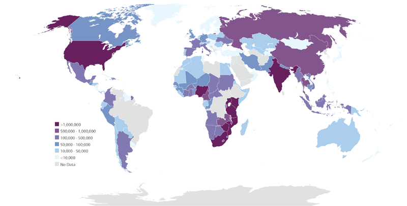

!?[0](https://www.youtube.com/watch?v=FDVNdn0CvKI)

#### HIV Research: Beyond the Vaccine

Over the past 15 years, the number of people who die of AIDS each year in the United States has dropped by 70 percent. But AIDS remains a serious public health crisis among low-income African-Americans, particularly women. And in sub-Saharan Africa, the virus killed more than 1.6 million people in 2007 alone. Innovative research approaches could lead to new treatments and possibly a cure for AIDS. HIV/AIDS has been described as a disease of poverty. Individuals with poor access to health care are less likely to see a doctor early on in their HIV infection, and thus they may be more likely to transmit the infection. HIV is now the leading cause of death for African American women between 24 and 35 years old.

For patients who have access to drugs, infection with the virus has ceased to be a death sentence. In 1995, combinations of drugs called **highly active anti-retroviral therapy (HAART)** were developed. For some patients, drugs can reduce the amount of virus to undetectable levels. But some amount of virus always hides in the body's immune cells and attacks again if the patient stops taking his or her medication. Researchers are working on developing a drug to wipe out this hidden virus, which could mean the end of AIDS.

### Summary

* HIV is transmitted, or spread, through direct contact of either mucous membranes or body fluids containing HIV.
* When HIV enters a person’s bloodstream, proteins on the coat of the virus allow it to fuse with the host’s helper T cells and make copies of itself before destroying the cell.
* HIV evades the immune system by frequent mutations and by using the host's cell membranes to form its own coat.
* AIDS is not a single disease, but rather it is a collection of symptoms and diseases that result from years of damage to the immune system by HIV.

### Review

1.  How is HIV commonly transmitted?
2.  How does HIV replicate?
3.  What allows HIV to evade the immune system?
4.  Why is HIV described as a disease of poverty?

</article>

## 12.1 Male Reproductive System Development

<article>

A lot changes during this time. A boy has to start shaving, his voice deepens, he gets taller, and a few other changes take place too.

### Sexual Development in Males

The male reproductive system is a collection of organs and other structures in the pelvic region. Most of the structures are located outside the body. The male reproductive system has two major functions: producing sperm and secreting male sex hormones. **Sperm** are male gametes, or sex cells, which are necessary for reproduction. During puberty, a boy develops into a sexually mature male capable of producing sperm and reproducing.

#### Development Before Birth

In the first few weeks of life, male and female embryos are essentially the same except for their chromosomes. Females have two X chromosomes, and males have an X and a Y chromosome. In male embryos, genes on the Y chromosome lead to the synthesis of testosterone. This begins around the sixth week of life.

**Testosterone** is a masculinizing hormone and the chief sex hormone in males. Testosterone stimulates the embryo’s reproductive organs to develop into male organs. For example, because of testosterone, the embryo develops testes instead of ovaries, which are female organs that you will read about in _The [Female Reproductive System](https://flexbooks.ck12.org/cbook/ck-12-middle-school-life-science-2.0/section/11.67/primary/lesson/female-reproductive-system-ms-ls?referrer=crossref "Female Reproductive System")_ concept.

All the reproductive organs are present by birth. However, they are immature and unable to function. The reproductive organs grow very little during childhood and do not mature until puberty.

#### Puberty and Its Changes

**Puberty** is the period during which humans become sexually mature. In the United States, boys generally begin puberty at about age 12. Puberty starts when the hypothalamus, a gland in the brain, stimulates the nearby pituitary gland to secrete hormones that target the testes. The main pituitary hormone responsible for puberty in males is **luteinizing hormone (LH).** It stimulates the testes to produce testosterone. Testosterone promotes protein synthesis and growth. It brings about most of the physical changes of puberty, including the changes outlined in **Table** [below](#x-ck12-dGFibGU6bWFsZV9wdWJlcnR5X2NoYW5nZXM.).

|     |     |
| --- | --- |Changes in Males During Puberty
| **Changes in Reproductive Organs** |     |
| --- | --- |
| Testes grow larger | Penis grows longer |
| Other reproductive structures grow | Sperm production begins |
| **Other Physical Changes** |     |
| Pubic hair grows | Facial and body hair grow |
| Bone density increases | Long bones grow |
| Muscle mass and strength increase | Bones in the face grow |
| Adam’s apple grows | Apocrine sweat glands develop |
| Shoulders widen | Voice deepens |

Cells that are targeted by testosterone are those that have testosterone receptors. Receptors are molecules in or on cells that bind to specific hormones. Testosterone receptors are on the nuclei of cells. After binding to testosterone, they enter the nucleus where they bind to specific DNA sequences and regulate gene transcription.

Some of the changes in**Table** [above](#x-ck12-dGFibGU6bWFsZV9wdWJlcnR5X2NoYW5nZXM.) involve maturation of the reproductive organs including the penis. Traits such as adult penis size are called **primary sex characteristics.** Other changes, such as growth of pubic hair, are not directly related to reproduction. Characteristics of mature males such as pubic hair are called **secondary sex characteristics.**

#### Adolescent Growth Spurt

Another obvious change that occurs during puberty is a rapid growth in height. This is called the adolescent growth spurt. In males, the rate of growth usually starts to increase relatively early in puberty. At its peak rate, growth in height is typically about 10 centimeters per year. Growth generally remains rapid for several years. Growth and [development](https://www.ck12.org/c/biology/development?referrer=crossref "development") of [muscles](https://flexbooks.ck12.org/cbook/ck-12-middle-school-life-science-2.0/section/11.9/primary/lesson/smooth-skeletal-and-cardiac-muscles-ms-ls?referrer=crossref "muscles") occur toward the end of the growth spurt. Muscles may continue to develop and gain strength after growth in height is finished.

#### Timing of Puberty

The ages at which particular changes of puberty occur differ from one person to another. However, the changes generally occur in the same sequence for most males. The sequence in which some of the more obvious changes occur is represented by the following stages:

__**Stage 1**—The scrotum and testes grow larger.__

**Stage 3**—Facial and underarm hair appear and the voice deepens.

In the U.S., the average boy begins Stage 1 of puberty at age 11.5. He begins the growth spurt in height by the second year of puberty, develops the ability to produce sperm a few years later, and continues to grow in height until age 17.5. Overall, he spends about six years going through puberty.

Depending on the genes he inherits, his diet, and many other factors, a boy may go through puberty a couple of years earlier or later than the average. This is usually normal, and early and late maturers generally have nothing to worry about. Nonetheless, a boy who is concerned that he is not developing normally should talk with his doctor.

### Summary

* The male reproductive system has two major functions: producing sperm and secreting male sex hormones.
* Testosterone stimulates the embryo’s reproductive organs to develop into male organs.
* Puberty in males starts when the hypothalamus, a gland in the brain, stimulates the nearby pituitary gland to secrete hormones that target the testes.
* Changes during puberty include growth of the testes and penis, growth of facial hair, deepening of the voice, growth in height, and muscle development.
* In the United States, boys generally begin puberty at about 12 years old.

### Review

1.  How are male and female embryos different right after conception? When do they develop differently?
2.  How does puberty start in males?
3.  How does testosterone affect cells?
4.  What is the usual sequence of changes during male puberty?

</article>

## 12.2 Male Reproductive System Organs

<article>

The male reproductive system has two goals: to produce and deliver sperm and to secrete testosterone. Might seem simple. But there are a number of complicated processes and structures - including over 100 feet of tubules - that go into these simple goals.

### Male Reproductive Organs

#### Penis, Testes, and Epididymis

The penis is an external genital organ with a long shaft and an enlarged tip. It contains tissues that can fill with blood and cause an erection, which is stiffening and enlarging of the penis. A duct called the urethra passes through the penis. Sperm pass out of the body through the urethra. (During urination, the urethra carries urine from the bladder.)

The **testes** (singular, testicle) are located in the scrotum, which is a sac of skin between the upper thighs. By hanging away from the body, the testes keep sperm at a temperature lower than normal body temperature. The lower temperature is needed for sperm production.

Each testicle contains more than 90 meters of tiny, tightly-packed tubes called **seminiferous tubules.** They are the functional units of the testes, where sperm are produced and testosterone is secreted. A cross-section of a seminiferous tubule is shown in**Figure** [below](#x-ck12-QmlvNDAxLTAy). The tubule is lined with spermatogonia and **Sertoli cells.** Spermatogonia are sperm-producing cells that you will read more about in _The Male Reproductive System: Sperm_ concept. Sertoli cells help protect and nourish developing sperm.

In between the seminiferous tubules in the testes are interstitial cells called **Cells of Leydig.** These cells secrete testosterone. A high concentration of testosterone is necessary for sperm production. Testosterone is also needed throughout a man’s life to maintain his secondary sex characteristics.

The seminiferous tubules join together to form the epididymis. The **epididymis** is a coiled tube about 6 meters long lying atop the testes inside the scrotum (**Figure** [above](#x-ck12-QmlvLTI1LTAxLU1hbGUtcmVwcm9kdWN0aXZlLXBhcnRz)). Its functions are to help sperm mature and to store mature sperm until they leave the body.

#### Ducts and Glands

In addition to these organs, the male reproductive system consists of a series of ducts and glands. These are also shown in **Figure** [above](#x-ck12-QmlvLTI1LTAxLU1hbGUtcmVwcm9kdWN0aXZlLXBhcnRz).

* Ducts include the vas deferens and ejaculatory ducts. They transport sperm from the epididymis to the urethra in the penis.
* Glands include the seminal vesicles, prostate gland, and bulbourethral glands. They secrete substances that become part of semen.

Semen is the fluid that is ejaculated from the urethra. Semen contains secretions from the glands as well as sperm. The secretions control pH and provide the sperm with nutrients for energy.

!?[0](https://www.youtube.com/watch?v=oFlUqgYqt1A)

### Summary

* The seminiferous tubules are the functional units of the testes, where sperm are produced and testosterone is secreted.
* A high concentration of testosterone is necessary for sperm production. Testosterone is also needed throughout a man’s life to maintain his secondary sex characteristics.
* Semen is the fluid that is ejaculated from the urethra. Semen contains secretions from the glands as well as sperm.

### Review

1.  Where is sperm produced?
2.  What is the role of the epididymis?
3.  What ducts transport sperm from the epididymis to the urethra?

</article>

## 12.3 Sperm

<article>

**How many sperm does to take to fertilize an egg?**

85 million sperm are produced per day...per testicle. That's 170,000,000 every day. This means that a single male may produce more than a quadrillion (1,000,000,000,000) sperm cells in his lifetime! But it only takes one to fertilize an egg.

### Production and Delivery of Sperm

A sexually mature male typically produces several hundred million sperm per day. **Sperm** production usually continues uninterrupted until death, although the number and quality of sperm decline during later adulthood.

#### Spermatogenesis

**Spermatogenesis** is the process of producing mature sperm. Sperm are haploid cells, meaning they have half the number of chromosomes that other cells of the body, which are diploid cells, have. Sperm must be haploid in order for normal sexual reproduction to occur. During reproduction, a sperm unites with another cell, called an egg. This is called **fertilization.** Unless both sperm and egg are haploid, the resulting offspring will not have the diploid number of chromosomes.

Sperm are produced in the seminiferous tubules of the testes and finish maturing in the epididymis. The entire process takes about 9 to 10 weeks. As shown in**Table** [below](#x-ck12-dGFibGU6c3Blcm1hdG9nZW5lc2lz), the production of sperm occurs in several steps, each involving a different type of cell and process.

Spermatogenesis begins when a spermatogonium (with the diploid number of chromosomes) undergoes mitosis to form primary spermatocytes (also with the diploid number of chromosomes). Spermatogenesis proceeds as a primary spermatocyte undergoes the first cell division of meiosis to form secondary spermatocytes with the haploid number of chromosomes. A secondary spermatocyte undergoes the second meiotic cell division to form haploid spermatids. Spermatids mature into sperm, which are also haploid.

|     |     |     |
| --- | --- | --- |Spermatogenesis and Cell Division
| Type of Cell | Number of Chromosomes | Process |
| --- | --- | --- |
| Spermatogonium | Diploid | Mitosis |
| Primary Spermatocyte | Diploid | Meiosis 1 |
| Secondary Spermatocyte | Haploid | Meiosis 2 |
| Spermatid | Haploid | Maturation |
| Spermatozoon (sperm) | Haploid | Fertilization |

**Spermatogonia,** which line the seminiferous tubules in the testes, are diploid cells. They begin the process of spermatogenesis when they divide by mitosis to produce cells called primary spermatocytes, which are also diploid cells. Some spermatogonia divide just to produce copies of themselves. This ensures a constant supply of spermatogonia for future sperm production.

Primary spermatocytes go through the first cell division of meiosis to produce secondary spermatocytes. These are haploid cells. Secondary spermatocytes then quickly complete the meiotic division to become spermatids, which are also haploid cells.

Spermatids slowly mature into sperm, like the one shown in **Figure** [below](#x-ck12-QmlvLTI1LTA0LXNwZXJt). Among other changes, they lose excess cytoplasm from the head and grow a tail. The tail is a flagellum that lets them move by rotating like a propeller. The **acrosome** that covers part of the head produces digestive enzymes that help the head penetrate an egg. The mitochondria in the connecting piece produce energy that the sperm needs to “swim” through the female reproductive tract to reach an egg. However, sperm do not develop the ability to move until they complete their maturation in the epididymis. It takes sperm four to six weeks to travel through the epididymis and become fully mature. After they mature, they remain in the epididymis until they leave the body.

#### Ejaculation

In order for reproduction to take place, sperm must leave the reproductive system. Sperm are released from the body during **ejaculation.** About 200 to 500 million sperm are released with each ejaculation. Ejaculation occurs when rhythmic muscular movements of the vas deferens propel sperm from the epididymis. The sperm are forced through the vas deferens and ejaculatory ducts and out of the body through the urethra. As sperm travel through the ducts, they mix with fluids from the seminal vesicles, prostate gland, and bulbourethral glands to form **semen.**

### Summary

* Sperm are haploid cells, meaning they have half the number of chromosomes that other cells of the body, which are diploid cells, have.
* Sperm are produced in the seminiferous tubules of the testes and finish maturing in the epididymis. The entire process takes about 9 to 10 weeks.
* A mature sperm cell has several structures that help it reach and penetrate an egg. These structures include the tail, mitochondria, and acrosome. The nucleus, which makes up most of the head, carries copies of the father’s chromosomes.
* Ejaculation occurs when rhythmic muscular movements of the vas deferens propel sperm from the epididymis. The sperm are forced through the vas deferens and ejaculatory ducts and out of the body through the urethra.

### Review

1.  At the beginning of spermatogenesis, are spermatogonia diploid or haploid?
2.  What happens to spermatids as they mature into sperm?
3.  How is sperm expelled from the body?

### Explore More

!?[0](https://www.youtube.com/watch?v=U9g4gRWkFTs)

</article>

## 12.4 Female Reproductive System Development

<article>

A lot changes during this time, including changes to reproductive organs and other physical changes.

### Sexual Development in Females

The female reproductive system is a collection of organs and other structures located primarily in the pelvic region. Most of the structures are inside the body. The female reproductive system has several functions:

* Producing eggs, which are female gametes.
* Secreting female sex hormones.
* Receiving sperm during sexual intercourse.
* Supporting the [development](https://www.ck12.org/c/biology/development?referrer=crossref "development") of a fetus.
* Delivering a baby during birth.
* Breastfeeding a baby after birth.

During puberty, a girl develops into a sexually mature woman capable of producing eggs and reproducing.

As was discussed previously, the main differences between boys and girls at birth are their reproductive organs. Unlike males, females are not influenced by the male sex [hormone](https://flexbooks.ck12.org/cbook/ck-12-biology-flexbook-2.0/section/13.21/primary/lesson/hormones-bio?referrer=crossref "hormone") testosterone during embryonic and fetal development. This is because they lack a Y-chromosome. As a result, females do not develop [male reproductive organs](https://flexbooks.ck12.org/cbook/ck-12-middle-school-life-science-2.0/section/11.65/primary/lesson/male-reproductive-structures-ms-ls?referrer=crossref "male reproductive organs").

#### Development Before Birth

Unless an embryo is stimulated by testosterone, the reproductive organs develop into female organs such as the ovaries and uterus. By the third month of fetal development, most of the internal female organs have formed. Immature **ova,** or eggs, also form in the ovaries before birth. Whereas a male produces sperm throughout his lifetime (after puberty), a female produces all the eggs she will ever make before birth.

Like baby boys, baby girls are born with all their reproductive organs present, but immature and unable to function. [Female reproductive organs](https://flexbooks.ck12.org/cbook/ck-12-middle-school-life-science-2.0/section/11.68/primary/lesson/female-reproductive-structures-ms-ls?referrer=crossref "Female reproductive organs") grow very little during childhood. They begin to grow rapidly and mature during puberty.

#### Changes of Puberty

Recall that puberty is the period during which humans become sexually mature. Puberty in girls differs from puberty in boys in several ways including when it begins, how long it lasts, and the hormones involved. Girls begin puberty a year or two earlier than boys, and they complete puberty in about four years instead of six. In females, the major sex hormone is **estrogen** (estradiol) rather than testosterone.

Puberty in girls starts when the hypothalamus in the brain stimulates the pituitary gland to secrete hormones that target the ovaries. The pituitary hormones are **luteinizing hormone (LH)** and **follicle-stimulating hormone (FSH).** These hormones stimulate the ovaries to produce estrogen.

Estrogen has many functions that you will read more about below. During puberty, estrogen promotes growth and other physical changes in females. For example, estrogen stimulates growth of the breasts and uterus. It also stimulates the development of bones and contributes to the adolescent growth spurt in height. These and several other changes that occur in females during puberty are listed in**Table** [below](#x-ck12-dGFibGU6ZmVtYWxlX3B1YmVydHlfY2hhbmdlcw..):

|     |     |
| --- | --- |Physical Changes in Females During Puberty
| **Changes in Reproductive Organs** |     |
| --- | --- |
| Ovaries and follicles grow | Uterus grows and endometrium thickens |
| Other reproductive structures grow | Menstrual cycle begins |
| **Other Physical Changes** |     |
| Breasts develop | Long bones grow and mature |
| Pubic hair grows | Underarm hair grows |
| Body fat increases | Apocrine sweat glands develop |
| Pelvis widens |     |

Some of the changes involve the maturation of organs, such as ovaries, that are necessary for reproduction. Mature reproductive organs are primary sex characteristics. Other changes, such as growth of pubic hair, lead to traits that are secondary sex characteristics. One of the most significant changes in females during puberty is menarche. **Menarche** is the beginning of menstruation, or monthly periods, which will be discussed later.

#### Adolescent Growth Spurt

Females go through an adolescent growth spurt in height as boys do. However, the growth spurt in girls starts a year or two earlier and ends about three years sooner. Girls also do not grow as rapidly during their peak growth rate. Although females start their growth spurt only 2 centimeters shorter than males, on average, by the time they stop growing, females are an average of 10 centimeters shorter.

#### Timing of Puberty

The changes of puberty usually happen in the same order for most females. The first observable change is typically the beginning of breast development. This happens by age 10 in the majority of girls in the U.S. The appearance of pubic hair usually occurs next, at age 10.5 on average. The growth spurt in height also usually begins during the first year of puberty. During the first two years of puberty, the ovaries and uterus gradually increase in size. Menarche occurs relatively late in puberty, typically between the ages of 12 and 13 in U.S. girls. After menarche, a female generally keeps growing for another year or two and attains her adult height by an average age of 14.5 years.

As in males, there is a wide range of ages during which particular changes of female puberty normally occur. For example, menarche may occur as early as age 8 or as late as age 16. Differences in age at menarche and other changes of puberty are due to both genetic factors and environmental factors such as diet. A female who goes through puberty earlier or later than her peers may worry that she is not developing normally. Although such variation is usually normal, she should talk with her health care provider if she has concerns.

### Summary

* Unlike males, females are not influenced by the male sex hormone testosterone during embryonic and fetal development. This is because they lack a Y-chromosome.
* Functions of the female reproductive system include producing eggs, secreting female hormones, supporting the development of a fetus, delivering a baby, and breastfeeding.
* Whereas a male produces sperm throughout his lifetime (after puberty), a female produces all the eggs she will ever make before birth.
* Girls begin puberty a year or two earlier than boys, and they complete puberty in about four years instead of six. In females, the major sex hormone is estrogen rather than testosterone.

### Review

1.  What chemicals stimulate the fetus to develop female reproductive organs?
2.  When does a female finish producing all of her eggs?
3.  How does puberty start in females?
4.  Is the growth of armpit hair a primary or secondary sex characteristic?

</article>

## 12.5 Female Reproductive System Organs

<article>

If producing millions of sperm each day, as in the male reproductive system, is complicated, that is nothing compared to what must occur in the [female reproductive system](https://flexbooks.ck12.org/cbook/ck-12-middle-school-life-science-2.0/section/11.67/primary/lesson/female-reproductive-system-ms-ls?referrer=crossref "female reproductive system"). This system is controlled by an intricate dance of hormones, cycles, and events.

### Female Reproductive Organs

The female reproductive system is shown in **Figure** [below](#x-ck12-QmlvLTI1LTA1LUZlbWFsZS1SZXByb2R1Y3RpdmUtc3RydWN0dXJl). Only a few of the structures are external to the body. All the main reproductive organs are internal.

#### External Organs

The external female reproductive structures are collectively referred to as the **vulva.** They include the labia and mons pubis. The labia are the “lips” of the vulva. They protect the vagina and urethra, both of which have openings in the vulva. The mons pubis consists of fatty tissue covering the pubic bone. It protects the pubic bone and vulva from injury.

#### Internal Organs

The internal female reproductive organs include the vagina, uterus, fallopian tubes, and ovaries. These organs are shown from the front, without any other structures blocking them, in**Figure** [below](#x-ck12-QmlvNDAyLTAy). This makes it easier to see the shapes and sizes of the organs and where they are located relative to one another.

The vagina is a tube-like structure about 8 to 10 centimeters long. It begins at the vulva and extends to the uterus. It has muscular walls lined with mucous membranes. The vagina has two major reproductive functions. It receives sperm during sexual intercourse, and it provides a passageway for a baby to leave the mother’s body during birth.

The **uterus** is a muscular organ about 7.5 centimeters long and 5 centimeters wide. It has a thick lining of tissues known as the endometrium. The lower, narrower end of the uterus is called the **cervix.** The uterus is where a fetus grows and develops until birth. During pregnancy, the uterus can expand dramatically to accommodate the growing baby. Muscular contractions of the uterus push the baby through the cervix during childbirth.

Extending from the upper corners of the uterus are the two **Fallopian tubes.** The tubes are about 7 to 14 centimeters long. Each tube reaches (but is not attached to) one of the ovaries. The ovary end of the tube has a fringe-like structure that moves with a wavelike motion. When ovulation occurs, the egg cell crosses the space between the ovary and the Fallopian tube and is swept by cilia toward the uterus.

The two **ovaries** are small oval-shaped organs that lie on either side of the uterus. They are the egg-producing organs of the female reproductive system, and they contain hundreds of thousands of immature eggs. Each egg is located within a structure called a **follicle.** A follicle consists of the egg surrounded by special cells that protect the egg until puberty and then help the egg mature.

#### The Breasts

The breasts are considered secondary sex characteristics because they are not organs of reproduction. They are described here because of their role in nurturing an infant after birth. As shown in**Figure** [below](#x-ck12-QmlvNDAtMi0z), each breast contains mammary glands. The cells of mammary glands secrete milk, which drains into ducts leading to the nipple. A suckling baby squeezes the milk out of the ducts and through the nipple.

!?[0](https://www.youtube.com/watch?v=toKp0SGyv5w)

### Summary

* The external female reproductive structures are collectively referred to as the vulva and include the labia and mons pubis.
* The internal female reproductive organs include the vagina, uterus, fallopian tubes, and ovaries.
* The breasts are considered secondary sex characteristics because they are not organs of reproduction.

### Review

1.  What two major reproductive functions does the vagina serve?
2.  During childbirth, which female organ undergoes muscular contractions to push the baby out?
3.  What organ is attached to the ovary?
4.  What role does the follicle play?

</article>

## 12.6 Egg Cells

<article>

Many things. A human egg cell. Just add sperm and you have the necessary ingredients for a new baby. What's amazing about these cells is that they are all produced before the girl is even born. Before the girl is born, plans for the next generation have begun. And that is the start of an amazing process.

### Egg Production

At birth, a female’s ovaries contain all the eggs she will ever produce. However, the eggs do not start to mature until she enters puberty. After menarche, one egg typically matures each month throughout a female’s adult years until she reaches middle adulthood.

#### Oogenesis

**Oogenesis** is the process of producing eggs in the ovaries. Eggs are haploid cells, having half the number of chromosomes of other cells in the body, which are diploid cells. Like sperm, eggs must be haploid in order for sexual reproduction to result in a diploid offspring. Like spermatogenesis, oogenesis occurs in several steps that involve different types of cells. The steps of oogenesis are listed in**Table** [below](#x-ck12-dGFibGU6b29nZW5lc2lz).

Oogenesis begins when an oogonium (with the diploid number of chromosomes) undergoes mitosis to form primary oocytes (also with the diploid number of chromosomes). Oogenesis proceeds as a primary oocyte undergoes the first cell division of meiosis to form secondary oocytes with the haploid number of chromosomes. More information on meiosis can be found in the _Meiosis_ chapter. A secondary oocyte undergoes the second meiotic cell division to form a haploid ovum if it is fertilized by a sperm.

|     |     |     |
| --- | --- | --- |Oogenesis and Cell Division
| Type of Cell | Number of Chromosomes | Process |
| --- | --- | --- |
| Oogonium | Diploid | Mitosis |
| Primary oocyte | Diploid | Meiosis 1 |
| Secondary oocyte | Haploid | Meiosis 2 |
| Ovum (mature egg) | Haploid | Fertilization |

Oogenesis begins with **oogonia** (singular, oogonium), which are the immature eggs that form in the ovaries before birth. Oogonia are diploid cells and are equivalent to spermatogonia in males. By about the fifth month of fetal [development](https://www.ck12.org/c/biology/development?referrer=crossref "development"), the ovaries contain about seven million oogonia.

Over the next few months, oogonia undergo mitosis, forming cells called primary oocytes. Primary oocytes are also diploid cells. Before birth, primary oocytes begin the first division of meiosis, but they do not complete it until long after birth. At birth, the average female has about two million primary oocytes in her ovaries. Throughout childhood, the number of oocytes falls as they deteriorate and disappear. By puberty, there are only about 300,000 to 400,000 primary oocytes left in the average girl’s ovaries. Primary oocytes are halted in prophase of meiosis I until they are stimulated by FSH (follicle-stimulating hormone) after puberty.

#### Maturation of a Follicle

Beginning in puberty, one of the follicles starts to mature every month (**Figure** [below](#x-ck12-QmlvNDAtMDItMDQ.)). The primary oocyte in the follicle resumes meiosis and divides to form a secondary oocyte and a smaller cell called a polar body. Both the secondary oocyte and the polar body are haploid cells. The secondary oocyte has most of the cytoplasm from the original cell and is much larger than the polar body. The polar body disintegrates and disappears from the ovary. The secondary oocyte is arrested at metaphase of meiosis II.

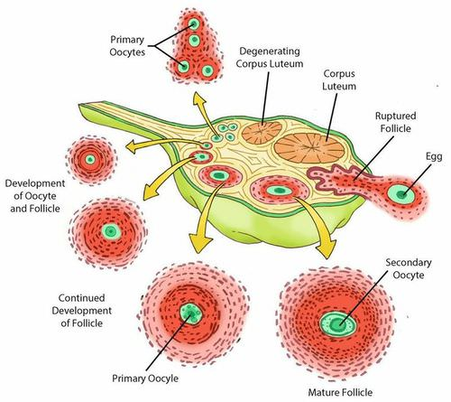

#### Ovulation

**Ovulation** is the release of a secondary oocyte by an ovary. Ovulation occurs every 28 days, on average, in a sexually mature female, but may range normally from 24 to 36 days. As shown in**Figure** [above](#x-ck12-QmlvNDAtMDItMDQ.), during ovulation, a secondary oocyte bursts out of its follicle and through the ovary wall to enter the abdominal cavity.

Each month, only one of the ovaries matures a follicle and releases an egg. Which ovary matures a follicle in a given month? Scientists say that it appears to be random.

After the secondary oocyte leaves the ovary, it is swept into the Fallopian tube by the waving, fringe-like end. Tiny hairlike projections, called cilia, line the tube and help move the oocyte through to the uterus. If the secondary oocyte is fertilized by a sperm as it is passing through the Fallopian tube, it divides to form a mature egg and a polar body, finishing meiosis. (As before, the polar body contains very little cytoplasm and disintegrates.) If the secondary oocyte is not fertilized, it passes into the uterus as an immature egg.

!?[0](https://www.youtube.com/watch?v=q5aO62pTAiA)

### Summary

* Eggs are haploid cells, having half the number of chromosomes of other cells in the body, which are diploid cells.
* During oogenesis, oogonia become primary oocytes, which then become secondary oocytes, and finally become mature egg cells if fertilized by sperm.
* Beginning in puberty, one of the follicles starts to mature and eventually undergoes ovulation every month.

### Review

1.  When do primary oocytes begin meiosis?
2.  When are polar bodies produced during oogenesis?
3.  How does the oocyte get to the uterus?

</article>

## 12.7 The Menstrual Cycle

<article>

A menstrual cycle calendar. A lot of things to keep track of. And for a few very important reasons, it is important to know when a woman is ovulating. But what's the most important part of the female menstrual cycle? That depends on whom you ask.

### Menstrual Cycle and Menstruation

Ovulation is part of the **menstrual cycle,** which occurs each month in a sexually mature female. Another part of the cycle is menstruation. **Menstruation** is the process in which blood and other tissues are shed from the uterus and leave the body through the vagina. It is also called a menstrual period or menses. The menstrual cycle is sometimes divided into two cycles, called the ovarian cycle and the uterine cycle. The ovarian cycle includes the events that occur in the ovary. The uterine cycle refer to the events that occur in the uterus. The two cycles are closely related, so here they are described together and referred to jointly as the menstrual cycle.

#### Phases of the Menstrual Cycle

The phases of the menstrual cycle are summarized in **Table** [below](#x-ck12-bWVuc3RydWFs). The cycle begins with the menstrual phase, which typically lasts from one to four days. This is when menstruation occurs. During the menstrual phase, arteries that supply the endometrium of the uterus constrict and break. Gradually, blood and endometrial tissues detach from the inside of the uterus and pass from the uterus to the vagina and then out of the body. If there is an immature egg in the uterus, it passes out of the body with the menstrual flow.

The menstrual cycle (as shown in **Table** [below](#x-ck12-bWVuc3RydWFs)) includes an ovarian and a uterine cycle. Events in the ovarian cycle include maturation of a **follicle,** release of an egg, and formation of the **corpus luteum.** Events in the uterine cycle include menstruation, [development](https://www.ck12.org/c/biology/development?referrer=crossref "development") of the endometrium, and thickening of the endometrium in preparation for an egg.

|     |     |     |
| --- | --- | --- |The Phases of the Menstrual Cycle
| Name of Phase | Days | Events |
| --- | --- | --- |
| Menstrual Phase | 1–4 | Menstruation occurs |
| Follicular Phase | 5–13 | Follicle matures and endometrium develops |
| Ovulation | 14  | Ovary releases an egg |
| Luteal Phase | 15–28 | Follicle becomes the corpus luteum and endometrium prepares for an egg |

The next phase of the cycle is called the **follicular phase.** After menstruation, the endometrium in the uterus begins to build up again. At the same time, several follicles start maturing in the ovaries. Only one of these maturing follicles will complete maturation. The rest will eventually deteriorate and disappear. By the middle of the menstrual cycle, around day 14, the remaining mature follicle releases its oocyte from the ovary in the process of ovulation.

Following ovulation, the **luteal phase** begins. During the luteal phase, the endometrium of the uterus continues to prepare for a fertilized egg. For example, it becomes thicker and develops more blood vessels. At the same time, the mature follicle that just released its egg develops into a structure called a corpus luteum.

If the egg is fertilized and implants, or embeds itself, in the endometrium of the uterus, the endometrium will be maintained and help nourish the embryo. If the egg is not fertilized, the endometrium will break down, leading to menstruation. This begins a new cycle.

The events of the menstrual cycle always occur in the same sequence, but their timing may vary considerably. There is a great deal of normal variation in the length of the overall cycle and of the individual phases. Variation may occur from one female to another and also from one cycle to the next for a given female.

Some females have symptoms—such as bloating, abdominal cramps, and mood swings—for several days before or during menstruation each month. If the symptoms are severe enough to interfere with daily life, the condition is called premenstrual syndrome, or PMS. Symptoms of PMS often can be helped with medications or lifestyle changes.

#### Role of Hormones

The same hormones that control female puberty and oogenesis also control the menstrual cycle: estrogen, LH, and FSH. Estrogen controls the secretion of the two pituitary hormones by acting on the hypothalamus, which controls the pituitary gland. This is shown in**Figure** [below](#x-ck12-QmlvNDAyLTA2LUFMVA..). When the estrogen level rises in the blood, it stimulates the pituitary (via the hypothalamus) to secrete more or less LH and FSH.

In negative feedback, rising levels of hormones feedback to the [hypothalamus and pituitary gland](https://www.ck12.org/c/biology/hypothalamus-and-pituitary-gland?referrer=crossref "hypothalamus and pituitary gland") to decrease the production of the hormones. In positive feedback, rising levels of hormones feedback to increase hormone production. During most of the menstrual cycle, estrogen and progesterone provide negative feedback to the hypothalamus and pituitary gland. This keeps their levels more or less constant. During days 12–14, however, estrogen provides positive feedback to the hypothalamus and pituitary gland. This causes a rapid rise in the production of estrogen by the ovaries and leads to ovulation.

Another hormone involved in the menstrual cycle is progesterone. The word "progesterone" literally means “pro-gestational hormone.” **Progesterone** is a hormone that promotes gestation, or the carrying of a fetus. The function of progesterone in the menstrual cycle is to maintain the endometrium of the uterus.

Changes in the levels of these four hormones (estrogen, LH, FSH, and progesterone) occur during the menstrual cycle (**Figure** [below](#x-ck12-QmlvLTI1LTEwLU1lbnN0cnVhbC1DeWNsZQ..)). After menstruation occurs, estrogen secreted by the ovaries increases. This causes the endometrium of the uterus to thicken. FSH from the pituitary stimulates follicles in the ovaries to mature. The maturing follicles produce estrogen, and the level of estrogen in the blood rises. When estrogen reaches a high level in the blood, it stimulates the pituitary gland to release a surge of LH. The spike in LH stimulates the one remaining mature follicle to burst open and release its oocyte.

During the first half of the cycle, negative feedback keeps levels of FSH, LH, estrogen, and progesterone relatively stable. During ovulation, positive feedback causes a burst of FSH, LH, and estrogen. During the second half of the cycle, progesterone rises as the corpus luteum in the ovary matures and produces this hormone. Negative feedback helps keep levels of the other three hormones fairly constant.

After the oocyte is released, LH stimulates the mature follicle to develop into a corpus luteum. The corpus luteum then starts secreting progesterone, which maintains the endometrium of the uterus. What happens next depends on whether the egg has been fertilized or not.

* If the egg has been fertilized, it will soon start producing a hormone that helps maintain the corpus luteum. As a result, the corpus luteum will continue producing progesterone and maintain the endometrium.
* If the egg has not been fertilized, the corpus luteum will disintegrate and stop producing progesterone. Without progesterone, the endometrium will break down, detach from the uterus, and pass out of the body during menstruation.

!?[0](https://www.youtube.com/watch?v=ayzN5f3qN8g)

#### Menopause

For most women in the U.S., the menstrual cycle continues into their forties. Then it gradually becomes more and more irregular until it finally stops altogether, generally by their early fifties. **Menopause** occurs when a woman has gone through 12 consecutive months without a menstrual period. She can no longer reproduce because her ovaries no longer produce eggs.

The cause of menopause is a natural decline in estrogen secretion by the ovaries as a woman ages. It may take from several months to a few years for her body to adjust to the drop in estrogen. During this time, she may experience hot flashes, mood swings, and other symptoms.

### Summary

* The menstrual cycle includes a menstrual phase, a follicular phase, ovulation, and a luteal phase.
* Changes in the levels of four hormones (estrogen, LH, FSH, and progesterone) occur during the menstrual cycle.
* Menopause occurs when menstruation stops occurring; for women this is usually in their early fifties.

### Review

1.  What happens during the luteal phase of the menstrual cycle?
2.  How many days into the menstrual cycle does ovulation occur?
3.  What is premenstrual syndrome?
4.  How is estrogen regulated during the menstrual cycle?
5.  What role does progesterone play in the menstrual cycle?
6.  What causes the symptoms of menopause?

</article>

## 12.8 Fertilization, Cleavage, and Implantation

<article>

Sperm swimming to an egg. If fertilization occurs, the egg will have all the "instructions" to grow into a new organism. That one cell will become two, then four, then eight, then sixteen, and on and on and on. And after about 9 months, that one cell will have become a new baby. But it all starts with the sperm swimming to the egg. A sperm cell is about two thousandths of an inch long. And although they are small, they can swim roughly 8 inches in an hour. To reach an egg, they will ultimately have to swim around 192,000 times their own length.

### Fertilization, Cleavage, and Implantation

Sexual reproduction begins when an egg is fertilized by a sperm and implants in the uterus. Following these events, the remainder of growth and [development](https://www.ck12.org/c/biology/development?referrer=crossref "development") before birth is divided into two main stages. The first stage is the embryonic stage, which lasts about two months. This is followed by the fetal stage, which lasts for another seven months until birth.

### Fertilization, Cleavage, and Implantation

A day or two after an ovary releases an egg, the egg may unite with a sperm. However, before it becomes an embryo, it must go through other processes. These processes include cleavage and implantation.

#### Fertilization

**Fertilization** is the union of a sperm and an egg. Recall that a sperm is a male gamete, and an egg is a female gamete. Each gamete is a haploid cell. When the two cells unite during fertilization, they form a diploid cell called a **zygote.**

Fertilization generally occurs in a Fallopian tube. After sperm are deposited in the vagina during sexual intercourse, they “swim” through the cervix and uterus and into a Fallopian tube. Although millions of sperm are deposited, only a few hundred are likely to reach the egg. A sperm about to penetrate an egg is shown in**Figure** [below](#x-ck12-QmlvNDAzLTAx). When a sperm finally breaks through the egg’s cell membrane, it sets off a reaction that prevents other sperm from entering. The entry of the sperm also triggers the egg to complete the second meiotic division that began before ovulation.

After the sperm penetrates the egg, its tail falls off and its nucleus fuses with the nucleus of the egg. The resulting zygote contains all the chromosomes needed for a new individual. Half the chromosomes are from the egg, and half are from the sperm.

#### Cleavage

The zygote spends the next few days traveling down the Fallopian tube. As it travels, it divides by mitosis several times to form a ball of cells called a **morula.** The cell divisions, which are called **cleavage,** increase the number of cells but not their overall size. More cell divisions occur, and soon a fluid-filled cavity forms inside the ball of cells. At this stage, the ball of cells is called a **blastocyst.** The process of blastocyst formation is shown in**Figure** [below](#x-ck12-QmlvNDAzLTAy). Cleavage serves two important functions in early development. The process creates a multicellular embryo. It is also an organizing process that partitions the embryo into developmental regions. The cytoplasm of the zygote contains many chemicals that regulate gene expression. These chemicals are partitioned during cleavage, and they later activate the genes necessary to form specific parts of the body.

 continues to undergo cell divisions. As it does, cells start to migrate into separate layers and a cavity starts to develop inside the ball of cells. When cells have migrated into distinct layers, the organism is called a blastocyst (2).")

The cells of the blastocyst form an inner and an outer cell layer. This is apparent in**Figure** [below](#x-ck12-QmlvNDAtMDMtMDM.). The inner layer of cells is called the embryoblast. This layer of cells will soon develop into an embryo. The outer layer of cells is called the trophoblast. This layer will develop into other structures including the placenta.

#### Implantation

The blastocyst continues the trip down the Fallopian tube and reaches the uterus about four or five days after fertilization. When the outer cells of the blastocyst contact cells lining the uterus, the blastocyst embeds in the lining. The process of embedding is called **implantation.** It generally occurs about a week after fertilization. Once implantation occurs, the blastocyst is called an embryo.

!?[0](https://www.youtube.com/watch?v=UgT5rUQ9EmQ)

### Summary

* Before an ovum becomes an embryo, it must undergo fertilization, cleavage, and implantation.
* Fertilization is the union of a sperm and an egg to form a zygote, which is a diploid cell.
* Cleavage serves two main purposes: it forms a multicellular embryo and organizes the embryo into developmental regions.
* When the outer cells of the blastocyst contact cells lining the uterus, the blastocyst embeds in the lining, a process called implanation.

### Review

1.  Where does fertilization occur?
2.  How does the egg prevent itself from receiving more than one set of genes?
3.  What two functions does the process of cleavage serve?
4.  What does the trophoblast become?
5.  When does implantation usually occur?

</article>

## 12.9 The Human Embryo

<article>

We all start as a single cell and soon grow into an embryo. Notice the remarkable details beginning to form. The [eyes](https://flexbooks.ck12.org/cbook/ck-12-middle-school-life-science-2.0/section/11.48/primary/lesson/how-the-eye-works-ms-ls?referrer=crossref "eyes"), backbone, and limb buds are obvious. Think about the amazing complexity that must be going on inside the embryo and the tremendous amount of growth and [development](https://www.ck12.org/c/biology/development?referrer=crossref "development") still to come. So, yes, at one time we all looked similar.

### Growth and Development of the Embryo

An **embryo** is a developing human being between the time of implantation and the first eight weeks after fertilization. During this time, the embryo grows in size and undergoes three processes: gastrulation, differentiation, and organogenesis.

#### Gastrulation

**Gastrulation** is the development of different layers of cells in the embryo. It generally occurs during the second week after fertilization. During gastrulation, cells of the embryo migrate to form three distinct cell layers: the ectoderm, mesoderm, and endoderm. These layers are shown in **Figure** [below](#x-ck12-QmlvNDAtMy00X0FMVA..). Each layer will eventually develop into certain types of tissues and cells in the body.

* **Ectoderm**—Forms tissues that cover the outer body; it develops into cells such as nerves, skin, hair, and nails.
* **Mesoderm**—Forms tissues that provide movement and support; it develops into cells such as [muscles](https://flexbooks.ck12.org/cbook/ck-12-middle-school-life-science-2.0/section/11.9/primary/lesson/smooth-skeletal-and-cardiac-muscles-ms-ls?referrer=crossref "muscles"), bones, teeth, and blood.
* **Endoderm**—Forms tissues involved in digestion and [breathing](https://flexbooks.ck12.org/cbook/ck-12-middle-school-life-science-2.0/section/11.35/primary/lesson/processes-of-breathing-ms-ls?referrer=crossref "breathing"); it develops into cells such as lungs, liver, pancreas, and gall bladder.

#### Differentiation and Organogenesis

During the third week after fertilization, the embryo begins to undergo cellular differentiation. **Differentiation** is the process by which unspecialized cells become specialized into one of the many different types of cells that make up the body. During differentiation, certain genes are turned on, or activated, while other genes are switched off, or inactivated. As a result of this process, cells develop specific structures and abilities that suit them for their specialized roles in the body. Several examples of specialized cells are shown in**Figure** [above](#x-ck12-QmlvNDAtMy00X0FMVA..), along with the cell layers from which they develop.

Differentiation of cells leads to the development of specific organs within the three cell layers. This is called **organogenesis.** All the major organs begin to form during the remaining weeks of embryonic development. A few of the developments that occur in weeks 4 through 8 are listed in **Figure**[below](#x-ck12-QmlvLTI1LTE0LUVtYnJ5by1kdXJpbmctZmlyc3QtNC13ZWVrcw..).

#### Embryonic Development During Weeks 4-8

.** Most organs develop in the embryo during weeks 4 through 8. If the embryo is exposed to toxins during this period, the effects are likely to be very damaging. Can you explain why? (Note: the drawings of the embryos are not to scale.)")

As the embryo develops, it also grows in size. By the eighth week of development, the embryo is about 30 millimeters long. It may also have begun to move.

!?[0](https://www.youtube.com/watch?v=IZ_s1f9KWl8)

### Summary

* An embryo is a developing human being between the time of implantation and the first eight weeks after fertilization.
* During gastrulation, cells of the embryo migrate to form three distinct cell layers: the ectoderm, mesoderm, and endoderm. Each layer will eventually develop into certain types of tissues and cells in the body.
* During differentiation, certain genes are turned on, or activated, while other genes are switched off, or inactivated. As a result of this process, cells develop specific structures and abilities that suit them for their specialized roles in the body.

### Review

1.  How many layers are formed during gastrulation?
2.  What tissues and cells does the mesoderm develop into?
3.  When do the major organs of the body form?
4.  When do the lungs start to develop?

</article>

## 12.10 Sexually Transmitted Diseases

<article>

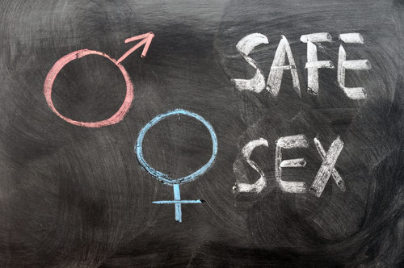

**What does "safe sex" truly mean?**

"Safe Sex." The thought of a sexually transmitted infection should be enough to make you think about and believe in this saying.

### Sexually Transmitted Diseases

A **sexually transmitted disease (STD)** is an illness caused by a pathogen that is transmitted from one person to another mainly through sexual contact. Worldwide, as many as one million people a day become infected with STDs. The majority of these infections occur in people under the age of 25.

 

Common STDs include chlamydia, gonorrhea, syphilis, human immunodeficiency virus (HIV), genital herpes, hepatitis B, and genital warts. To be considered a STD, a disease must have only a small chance of spreading naturally in ways other than sexual contact. Many diseases that can spread through sexual contact are spread more commonly by other means. These diseases are not considered STDs.

#### Pathogens that Cause STDs

STDs may be caused by several different types of pathogens including protozoa, [insects](https://flexbooks.ck12.org/cbook/ck-12-middle-school-life-science-2.0/section/9.15/primary/lesson/insects-ms-ls?referrer=crossref "insects"), bacteria, and viruses.

* The protozoa _Trichomonas vaginalis_ causes an STD called trichomoniasis. This is an infection of the vagina in females and the urethra in males.
* Pubic lice, like the one in**Figure** [below](#x-ck12-QmlvNDA0LTAx), are insect parasites that can be transmitted sexually. They suck the blood of their host and irritate the skin in the pubic area.

.")

Although these STDs are common, the majority of STDs are caused by bacteria or viruses. Several bacterial and viral STDs are described in the next two concepts.It is important to note that most bacterial STDs can be cured with antibiotics, whereas viral STDs do not have cures, although some can be prevented with vaccines.

#### How STDs Spread

Most of the pathogens that cause STDs enter the body through mucous membranes of the reproductive organs. All sexual behaviors that involve contact between mucous membranes put a person at risk for infection. This includes vaginal, anal, and oral sexual behaviors.

Many STDs can also be transmitted through body fluids such as blood, semen, and breast milk. For example, in the past, [HIV](https://flexbooks.ck12.org/cbook/ck-12-biology-flexbook-2.0/section/7.15/primary/lesson/hiv-bio?referrer=crossref "HIV") and hepatitis B were transmitted through blood transfusions. This no longer occurs because donated blood is now screened for both pathogens. Use of shared injection or tattoo needles is another way in which blood and pathogens can be transferred from one person to another. A number of STDs can also be transmitted from a mother to her baby through her blood during childbirth or through her breast milk after birth.

STDs are much more common in young adults and teens than they are in older people. One reason is that young people are more likely to take risks and to think “It can’t happen to me.” They also may not know how STDs are spread. In addition, younger people may be more sexually active than older people.

#### Preventing STDs

The only completely effective way to prevent infection with STDs is to avoid sexual activity and other known risk behaviors such as using contaminated needles. Using condoms can decrease the risk of contracting STDs during some types of sexual activity. However, using condoms is not a foolproof method. Pathogens may be present on areas of the body not covered by condoms. Condoms can also break or be used incorrectly.

### Summary

* Common STDs include chlamydia, gonorrhea, syphilis, human immunodeficiency virus (HIV), genital herpes, hepatitis B, and genital warts.
* To be considered an STD, a disease must have only a small chance of spreading naturally in ways other than sexual contact.
* Most of the pathogens that cause STDs enter the body through mucous membranes of the reproductive organs.
* Many STDs can also be transmitted through body fluids such as blood, semen, and breast milk.
* The only completely effective way to prevent infection with STDs is to avoid sexual activity and other known risk behaviors such as using contaminated needles.

### Review

1.  What diseases are considered STDs?
2.  What kinds of pathogens cause the majority of STDs?
3.  How are most STDs spread?

</article>

## 12.11 Bacterial Sexually Transmitted Diseases

<article>

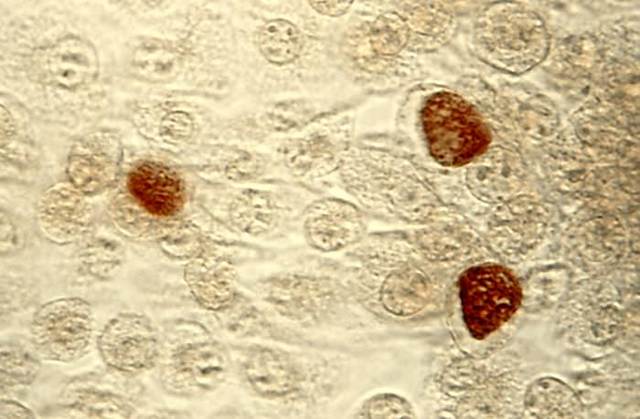

These represent chlamydia. Innocent-looking single-celled organisms. But these bacteria can lead to painful and devastating consequences.

### Bacterial STDs

Many STDs are caused by bacteria. Some of the most common bacterial STDs are chlamydia, gonorrhea, and syphilis.

#### Chlamydia

**Chlamydia** is an STD caused by the bacterium _Chlamydia trachomatis._ It is the most common STD in the U.S. each year; about four million new chlamydia infections occur in Americans. As shown in **Figure** [below](#x-ck12-QmlvXzIzLjQuMg..), females are much more likely to develop chlamydia than males. This figure also shows how common this STD is in teens and young adults compared to in older people. This is typical of most STDs.

Symptoms of chlamydia may include a burning sensation during urination and a discharge from the vagina or penis. Chlamydia can be cured with antibiotics. However, in the majority of cases, there are no symptoms. As a result, many people are not aware that they are infected and do not seek treatment.

It is important to detect and treat chlamydia infections even when they do not cause symptoms. Untreated chlamydia can lead to more serious problems, especially in females. Almost half of all women with untreated chlamydia develop **pelvic inflammatory disease (PID),** which is an infection of the uterus, Fallopian tubes, and/or ovaries. PID can lead to scarring of the reproductive organs, which may cause pain and difficulty becoming pregnant. Chlamydia causes an estimated half million cases of PID in the U.S. each year.

In addition to sexual transmission, chlamydia can be passed from a woman to her baby before or during birth. Before birth, a chlamydia infection of the fetus may cause the fetus to be born too soon. During birth, a baby’s [eyes](https://flexbooks.ck12.org/cbook/ck-12-middle-school-life-science-2.0/section/11.48/primary/lesson/how-the-eye-works-ms-ls?referrer=crossref "eyes") can become infected with the bacteria. If the eye infection is not treated, it can lead to blindness. Because chlamydia is common and often symptomless, newborns are routinely treated with eye drops to prevent chlamydia eye infections from developing.

 

!?[0](https://www.youtube.com/watch?v=qaazmU8YU7E)

#### Gonorrhea

**Gonorrhea** is an STD caused by the bacterium _Neisseria gonorrheae._ Gonorrhea is also a common STD. In the U.S., an estimated 700,000 people are infected with gonorrhea each year.

Symptoms of gonorrhea may include painful urination and discharge from the vagina or penis. Gonorrhea usually can be cured with antibiotics, although the bacteria have developed resistance to the most commonly used antibiotics. Gonorrhea infections may not cause symptoms, especially in females, so they often go untreated. Untreated gonorrhea can lead to PID in females. In males, it can lead to inflammation of the epididymis, prostate, and urethra.

Gonorrhea can be passed from an infected woman to her baby during childbirth. This may cause an eye infection. The infection must be treated promptly to prevent blindness.

#### Syphilis

**Syphilis** is a STD caused by the bacterium _Treponema pallidum._ In the U.S., about 70,000 new cases of syphilis occur each year. Syphilis is less common than either chlamydia or gonorrhea, but it is more serious if it is not treated. Untreated syphilis can even cause death.

Early symptoms of infection with syphilis include the [development](https://www.ck12.org/c/biology/development?referrer=crossref "development") of a small sore on or near the genitals. The sore is painless and heals on its own, so it may go unnoticed. Many people do not realize they have become infected until much later, so they do not seek treatment. If diagnosed and treated early, most cases of syphilis can be cured with antibiotics. However, if syphilis goes untreated, the disease may progress through the stages shown in**Table** [below](#x-ck12-dGFibGU6c3lwaGlsaXNfc3RhZ2Vz). Untreated syphilis can eventually cause serious damage to the heart, brain, and other organs.

|     |     |     |
| --- | --- | --- |Stages of Syphilis Infection
| Stage | Time After Initial Infection | Signs and Symptoms |
| --- | --- | --- |
| Primary | 2 days | Small sore on genitals |
| Secondary | 1–6 months | Rash, fever, sore throat, and headache |
| Latent | 6–12 months | None |
| Tertiary | 1–10 years | Chronic inflammation, damage to the aorta and heart, narrowing of arteries, stroke, meningitis, and muscle weakness |

### Summary

* The most common STDs caused by bacteria include chlamydia, gonorrhea, and syphilis.
* Chlamydia is the most common STD and may not exhibit symptoms.
* Symptoms of gonorrhea may include painful urination and discharge, but it may also not exhibit symptoms.
* Untreated syphilis can eventually cause serious damage to the heart, brain, and other organs.
* Bacterial STDs can usually be treated with antibiotics, especially when diagnosed early.

### Review

1.  Why is it important to treat chlamydia even though there may be no symptoms?
2.  What are some bacterial STDs that can be transferred from mother to child? What complications can these infections cause?
3.  Why is it so important to treat syphilis when it is diagnosed early?

</article>

## 12.12 Viral Sexually Transmitted Diseases

<article>

**How long does a viral STD last?**

This is the Human Papilloma Virus, which causes a viral STD. Viral STDs can be especially dangerous, as they cannot be cured. Once you get one, it's yours for life. And also, it's the person's you give it to.

### Viral STDs

STDs caused by viruses include genital herpes, hepatitis B, genital warts, and cancer of the cervix. Another common viral STD is [HIV](https://flexbooks.ck12.org/cbook/ck-12-biology-flexbook-2.0/section/7.15/primary/lesson/hiv-bio?referrer=crossref "HIV"), which causes acquired immunodeficiency syndrome, or AIDS.

#### Genital Herpes

**Genital herpes** is a STD caused by herpes simplex virus type 2 (HSV-2). In the U.S., as many as 20% of males and 25% of females may be infected with HSV-2. The virus is closely related to herpes simplex virus type 1 (HSV-1), which causes cold sores on the lips. Both viruses are transmitted by direct contact. Both also cause similar symptoms, except HSV-2 infects the genitals instead of the mouth.

Symptoms of genital herpes include painful, fluid-filled blisters on the penis, vulva, or nearby membranes. The initial infection soon clears up on its own. However, herpes virus particles travel to local nerves, where they evade the immune system and remain for the life of the infected person. Periodically, some of the virus particles travel back to the skin and cause new outbreaks of blisters. Outbreaks may be triggered by stress or other factors. A person with genital herpes is most likely to transmit the virus during an outbreak.

There is no known cure for genital herpes. Once a person becomes infected, there is no way to eradicate the virus from the body. However, antiviral drugs can prevent outbreaks or reduce their length and severity. The drugs also reduce the risk of transmitting the virus. A vaccine to prevent infections with HSV-2 may soon be available.

Genital herpes may cause emotional problems because it affects intimate relationships throughout a person’s life. However, it is not considered to be a serious disease from the standpoint of physical health. On the other hand, herpes is very serious for newborns if they are infected with the virus during childbirth. It can lead to blindness, mental retardation, and even death.

#### Hepatitis B

**Hepatitis B** is inflammation of the liver caused by infection with the hepatitis B virus. In the U.S., there are about 200,000 new cases of hepatitis B diagnosed each year. In addition, as many as 5,000 Americans die each year from hepatitis B infections.

Early symptoms of hepatitis B include vomiting and jaundice, which is yellowing of the skin and [eyes](https://flexbooks.ck12.org/cbook/ck-12-middle-school-life-science-2.0/section/11.48/primary/lesson/how-the-eye-works-ms-ls?referrer=crossref "eyes"). Hepatitis B often gets better on its own after a few weeks or months and causes no long-lasting effects. However, in a small percentage of people, it develops into a chronic, or long-term, disease. In some people, chronic hepatitis B causes few, if any, symptoms, although people infected with the virus can still spread it to others. In other people, chronic hepatitis B causes continuous inflammation of the liver. This eventually damages the liver. It also increases the risk of liver cancer, which is usually fatal.

Hepatitis B cannot be cured. Antiviral drugs can help prevent liver damage in people with chronic hepatitis B, but they cannot eradicate the virus from the body. However, vaccines have been developed to prevent hepatitis B infection.

In addition to sexual transmission, hepatitis B is commonly transmitted through contaminated needles and from mother to child during childbirth. Newborns are much more likely than older people to develop chronic hepatitis B. This is because their immune systems are immature and unable to fight off the virus.

#### Genital Warts and Cervical Cancer

Both genital warts and cancer of the cervix are caused by the human papillomavirus (HPV). There are more than 100 types of HPV. Some types of HPV cause common warts, which are small, rough growths on the hands, knees, or feet. These HPV viruses are transmitted by casual skin-to-skin contact. Other types of HPV cause genital warts or cervical cancer. These HPV viruses are transmitted through sexual contact. Genital HPV infections are very common. In the U.S., more than six million people become infected each year. There are 14 types of HPV that are considered "high risk." Most of the FDA approved HPV screening tests include those 14 high risk HPV.

Many types of HPV that are transmitted sexually do not cause any noticeable symptoms. However, several types cause genital warts or cervical cancer. HPV has been identified in more than 95% of patients with cervical cancer. The current hypothesis for how HPV causes cervical cancer involves specific oncoproteins that are transcribed after the virus infects a host cell. These oncoproteins inactivate certain tumor suppressor proteins, causing cervical cancer. Cervical cancer is easily detected with a Pap test, which involves examining a sample of cervical cells for cancerous changes. If detected early, cervical cancer can be cured with surgery. Since 2006, a vaccine has been available to prevent transmission of the most common types of HPV that cause genital warts and cervical cancer. The vaccine is recommended for females aged between 11 to 26 years old.

### Summary

* Genital herpes causes outbreaks of fluid-filled blisters and remains in the body for the life of the infected person.
* Hepatitis B is inflammation of the liver caused by infection with the hepatitis B virus, and it may increase the risk for liver cancer.
* Several types of HPV cause genital warts or cervical cancer.
* Vaccines are currently available for hepatitis B and certain common HPV.

### Review

1.  Is genital herpes an especially dangerous disease? When is it especially serious?
2.  What are some symptoms of chronic hepatitis B?
3.  How many types of HPV are there? What can HPV cause?

</article>

